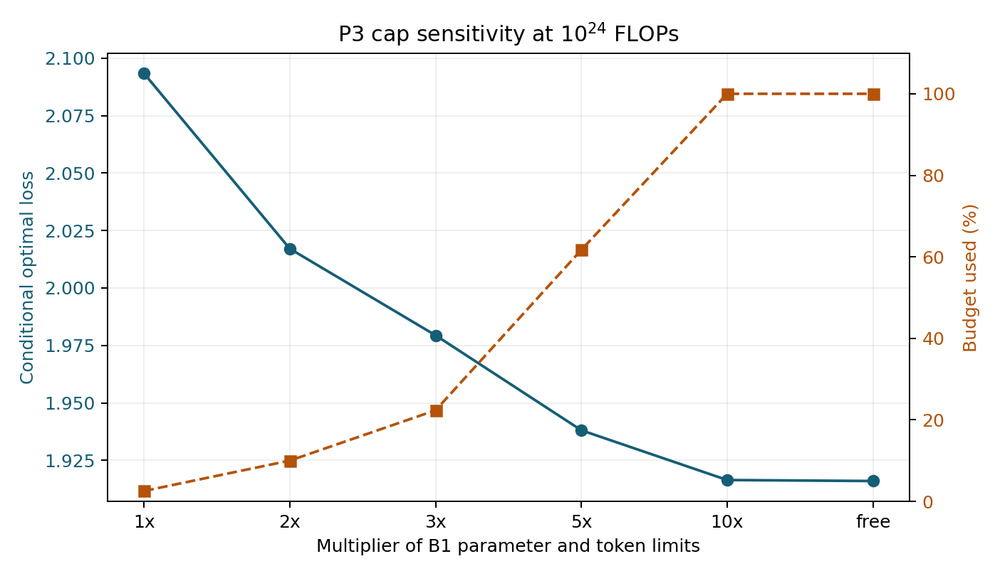
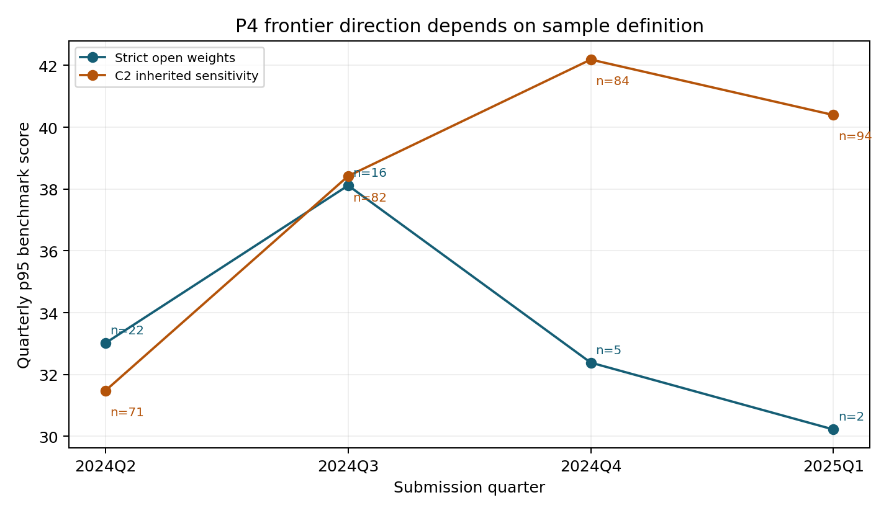

# 四问逐步优化实验与决策

日期：2026-09-24。两份既有建议文档只用于提出待检验假设；下列决策依据当前代码、原始附件和本轮独立实验。已通过的诊断现在也写入四问主流程；原有拟合模型与未通过的候选没有被替换。回顾性分析不称为全新盲测。

## 1. 先评估当前项目

| 问题 | 当前可保留的主版本 | 实际证据 | 最主要的限制 |
| --- | --- | --- | --- |
| 一 | 四组等权质量代理 $Q_A$；二阶 ALR Ridge 配比 V2 | 1M 既定测试 13 域 RMSE 0.3415→0.2702；V2 嵌套 OOF 也优于 V1 | 人工质量盲评仍为空；60M/1B 绝对 Loss 有尺度偏差 |
| 二 | 经典 $N$–$D$ + B6 的 $Q_B\times N$，配比作独立情景项 | B1 同族留组 RMSE 约 0.000151；B6/B7 支持 Q×N | B2 跨源 raw RMSE 约 1.243；B8 的 Q 机制冲突；$Q_A\to Q_B$ 和 $\lambda_p$ 无共同锚点 |
| 三 | V2 成本约束求解；E0、E1、E2 三种支持范围 | 优化器与预算/KKT 核验通过 | E1 的 3 倍上限是情景假设；高预算结果依赖该上限 |
| 四 | 严格开放权重前沿；有界 logistic Loss–Benchmark 桥接；数据与机制两条预测 | C8 解析、族外桥接检验和历史回测均有产物 | 严格前沿仅四季度、末季 2 个模型；桥接组外 RMSE 11.864；无 12/24 月直接回测 |

优化前运行既有四个验证器得到：问题一 12/12、问题二 13/13、问题三 16/16，问题四 27/30。第一轮主流程集成后复算为问题一 12/12、问题二原验证 13/13 且 V2 13/13、问题三 18/18、问题四 29/32。第二轮加入问题一 V3 条件候选、问题二有标签来源适配与问题四短期朴素基线后，新增核验分别通过；问题四为 31/34。问题四的三项未通过仍是 12/24 月直接回测不存在和历史分解与观测方向不一致；这些是证据限制，不是可通过调参消除的程序报错。第二轮新候选及最终取舍见[第二轮新模型实验与四问取舍](round2/第二轮新模型实验与四问取舍.md)。

## 2. 按顺序实施的实验与取舍

### 步骤 0：先锁定四问接口

[`chain_and_q3.py`](chain_and_q3.py) 对当前产物记录 SHA-256，比较 P1 V2 与 P2 内嵌配比模型在训练配方上的预测、P2 与 P3/P4 的八个模型参数，以及 P4 机制表中 18 行参考配方 Loss 和预算可行性。结果见 [`interface_audit.json`](interface_audit.json)：配比预测最大差 0，参数最大差 0，P4 Loss 最大差 $4.44\times10^{-16}$，预算违规 0。**保留**现有接口；在 [`problem4/mechanism.py`](../problem4/mechanism.py) 加入运行时参数与 $\lambda_p$ 一致性检查，使未来版本漂移直接报错。该核查只证明数值衔接，不能证明 $Q_A$ 与 $Q_B$ 是同一量尺。

### 步骤 1：问题一最终 V2 的跨规模检验

方法：用最终 V2 artifact 和 V1 基线在既有 1M、60M、1B 配方上复算原始 13 域误差、配方均值排序与中心化幅度。再固定每个目标规模 25% 配方作有标签校准、75% 作条件留出，比较 `a+x` 和 `a+bx`；以 20 个固定随机切分检查方向。详细表、种子与限制见 [`q12/experiment_decision.md`](q12/experiment_decision.md)。

| 规模 | V1→V2 原始 13 域 RMSE | V2 配方均值中心化斜率，行 bootstrap 95% 区间 | V1→V2 配方均值 Spearman | 留出 `a+bx` RMSE：V1 / V2 |
| --- | ---: | ---: | ---: | ---: |
| 1M | 0.3415→**0.2702** | 0.822 [0.730, 0.926] | 0.492→**0.715** | 0.2411 / **0.1959** |
| 60M | 1.6093→**1.5959** | 0.609 [0.525, 0.707] | 0.463→**0.682** | 0.1975 / **0.1583** |
| 1B | 2.9820→**2.7021** | 0.182 [0.125, 0.241] | **0.662**→0.567 | **0.0382** / 0.0502 |

20 次预定切分中，V2 校准后在 1M、60M 分别 20/20 胜过 V1，在 1B 仅 4/20。1M 与 60M 的测试配方文件哈希相同，说明它们使用同一批配方而非独立配方分布。**保留** V2 作为 1M 主配比模型；**修正** P2 配比幅度的证据陈述：现有 `p_scale_transfer_from_problem1.csv` 使用 V1，最终 V2 的描述性斜率应以上表为准，并并列 1B 反例；**拒绝**从这些已经用于研究判断的目标规模测试标签拟合确定的 $\lambda_p(N)$ 跨规模定律。60M/1B 的 V2 原始 bias 仍为 +1.506/+2.619，不能称绝对 Loss 无标签迁移成功。

质量代理 $Q_A$ 没有人工双评审真值，故本轮**不改**四组权重和冲突惩罚。可执行的下一步是让两位评审者独立完成既有盲评表，再冻结 Spearman、评审一致性及冲突样本判别指标；无标注时不能用内部一致性替代构念效度。

### 步骤 2：问题二的 B6/B8 机制冲突

[`q12/run_p1_scale_and_b8.py`](q12/run_p1_scale_and_b8.py) 将两套原始实验按完全相同 $(N,D,Q_B)$ 联结，得到 160 个一对一重合点。B8 减 B6 的 Loss 均差为 -1.15361；在 $Q_B=0.1$ 为 -2.158315，在 $Q_B=1$ 为 -0.01252。固定 $(N,D)$ 回归 Loss 对 Q：B6 的 45 组全部为负斜率，B8 的 150 组全部非负。因此单一来源截距不足以解释差异。**保留** B6/B7 范围内的条件 Q×N 模型及经典 $N$–$D$ 基线；**拒绝**把 B8 强并入同一单调 Q 律或删掉 B8 异常点。B2 的跨源误差继续作为适用边界报告。

### 步骤 3：问题三的上限剖面

固定当前 Model C、指数型质量成本、$Q_0=0.6$、4096 上下文，用 B1 上限的 1/2/3/5/10 倍与自由优化分别求解；代码和逐行结果见 [`chain_and_q3.py`](chain_and_q3.py)、[`p3_cap_profile.csv`](p3_cap_profile.csv)。

| $10^{24}$ FLOPs 下的上限 | 最优 $N$（B） | 最优 $D$（B） | Loss | 预算利用率 |
| --- | ---: | ---: | ---: | ---: |
| 1×，E0 | 11.966 | 299.893 | 2.0934 | 2.56% |
| 2× | 23.932 | 599.786 | 2.0171 | 10.01% |
| 3×，现有 E1 | 35.897 | 899.679 | 1.9794 | 22.35% |
| 5× | 59.829 | 1499.465 | 1.9381 | 61.73% |
| 10× | 48.361 | 2998.930 | 1.9164 | 100% |
| 自由，E2 | 39.562 | 3656.997 | 1.9160 | 100% |

$10^{22}$ FLOPs 时各上限与自由解的 Loss 均约 2.1547，表明这里的上限未起作用；在 $10^{24}$ 时，3×→5× 仍使 Loss 下降 0.0413。**保留**求解器和 E0/E1/E2 分层；**加入**上限剖面作为正式敏感性结果；**拒绝**把 3× E1 写成数据识别的唯一推荐规模。10× 解与自由解接近，属于当前条件模型的数值结果，不提供现实外推准确性的证明。



### 步骤 4：问题四的前沿定义与最低样本量

[`q4/run_experiments.py`](q4/run_experiments.py) 独立复算原单季严格 W1 p95，然后比较最低季度样本量 $n_{\min}\in\{1,3,5,10\}$、1/2/3 季窗口、p90/p95/Top3，并作只用过去季度值预测下一季度新增模型的短期回测。逐项产物见 [`q4/frontier_changes.csv`](q4/frontier_changes.csv) 与 [`q4/frontier_prequential_summary.csv`](q4/frontier_prequential_summary.csv)。

严格 W1 单季 p95：2024Q2→2025Q1 为 -2.796 分，但终点只有 2 个模型；最低 $n=5$ 时只能比较至 2024Q4，变化 -0.634 分；最低 $n=10$ 时只能比较至 2024Q3，变化 +5.098 分。两季度滚动的 2024Q3→2025Q1 为 -3.544 分，三季度滚动的 2024Q4→2025Q1 为 +2.206 分，两个跨度不同且窗口样本重叠。相同截止日期的 C2 继承开放口径单季 p95 为 +8.916 分，方向仍与严格 W1 相反。最低样本量提高后可用于回测的目标季只剩 1–2 个，不能根据一个更小的 MAE 值挑选前沿定义。

**保留**严格 W1 作为可追溯主口径；**增加**季度样本量与窗口敏感性展示；**撤下**“31.5% 规模、68.5% 技术贡献”作为历史实证份额。当前历史结构模型组织组外 RMSE 7.103，compute-only 7.052，时间项没有改善；该份额只可称模型内部情景分解。12/24 月预测仍无直接同期限回测，应写成情景演算及未校准区间。



### 步骤 5：问题四桥接模型的同折竞争

在 C6 的 75 行、23 个家族上锁定原有五折家族分组和高可比权重（高可比仅 7 行、1 个家族），比较 logistic、isotonic、截断线性、probit 和 log-loss logistic。复现原 logistic 每折 RMSE 后，计算全体组外预测与家族配对 bootstrap；见 [`q4/bridge_scorecard.csv`](q4/bridge_scorecard.csv)、[`q4/bridge_paired_family_bootstrap.csv`](q4/bridge_paired_family_bootstrap.csv)。

| 桥接 | 组外 RMSE | 相对 logistic 的 RMSE 改善，家族 bootstrap 95% 区间 | 决策 |
| --- | ---: | ---: | --- |
| 原有有界 logistic | 11.864 | 基线 | 保留 |
| isotonic | 11.451 | +0.413 [-0.915, +1.044] | 拒绝升级；区间跨 0，区间外预测平坦 |
| 截断线性 | 11.704 | +0.161 [-0.235, +1.112] | 拒绝升级；区间跨 0 |
| probit | 11.825 | +0.039 [-0.010, +0.155] | 拒绝升级；收益很小且区间跨 0 |
| log-loss logistic | 11.973 | -0.109 [-0.307, +0.006] | 拒绝升级 |

模型替换门槛是同折、家族组外误差稳定下降且高可比层和外推行为无明显退化；本轮没有候选达到。因此继续用现有 logistic，并保留约 11.86 分的误差尺度。机制路径的 E0/E1/E2 与数据路径应并列展示，不能把约 20.94 分写成已校准的未来精确预测。

## 3. 已接入四问主流程的改动

| 问题 | 主流程改动 | 重跑后的可复核产物 |
| --- | --- | --- |
| 一 | `problem1_v2.py` 对既定 1M/60M/1B 测试生成最终 V2 配方均值、中心化斜率、排序和偏差；写作脚本明确报告 1B 反例 | `problem1/outputs/tables/v2_scale_transfer_summary.csv`、`v2_scale_mixture_predictions.csv`、`problem1_v1_v2_comparison.md` |
| 二 | 保留 Model C 参数；主报告改用 P1 V2 幅度证据，V1 旧表另存，明确 $\lambda_p(N)$ 未识别 | `problem2_v2/outputs/tables/p_scale_transfer_from_problem1_v2.csv` 与原 V1 表、`problem2_v2_report.md` |
| 三 | 保留求解器；正式输出 1/2/3/5/10 倍及自由上限剖面，核验 3 倍结果与 E1 一致，取消唯一规模推荐的语气 | `problem3_v2/outputs/tables/cap_sensitivity_profile.csv`、`outputs/figures/cap_sensitivity_profile.png`、`problem3_v2_report.md` |
| 四 | 保留 W1 和 logistic；输出同截止日期窗口/最低样本敏感性，在未来情景逐行记录能力锚样本量及 n<5 状态，运行时检查 P2→P4 参数一致 | `problem4/outputs/tables/frontier_definition_sensitivity.csv`、`frontier_forecast_12m_24m.csv`、`problem4_report.md` |

## 4. 对四问论文表达的直接修改

正文可按“可解释数据代理与配比 → 条件性能规律 → 预算下的条件最优 → 与现实能力前沿作情景对照”排列。每个箭头注明输入来源和验证范围：$Q_A\to Q_B$ 是未标定的虚线，$\lambda_p$ 是情景系数；B1/B6/B7 的条件规律不能替代 B2/B8 跨源检验；优化器数值精度不能替代高预算实证支持；Loss→Benchmark 要携带桥接误差。问题四的前沿方向与样本口径相关，主图应显示每季 $n$、W1 与 C2 敏感性，并把规模/时间份额放在限制或模型内分析中。

这些方法选择有原始研究背景：[Aitchison 的成分数据分析](https://academic.oup.com/jrsssb/article/44/2/139/7027742)支持按比例数据的几何结构建模；[Hoffmann 等的算力最优训练研究](https://proceedings.nips.cc/paper_files/paper/2022/hash/c1e2faff6f588870935f114ebe04a3e5-Abstract-Conference.html)支持将参数量和数据量联合建模；[Tashman 的样本外预测评估](https://www.sciencedirect.com/science/article/pii/S0169207000000650)支持逐原点评估；[Gadre 等的 Loss 与下游能力研究](https://proceedings.iclr.cc/paper_files/paper/2025/hash/a91869936a63d814971b6423990ecf6e-Abstract-Conference.html)提供桥接问题的研究动机。文献不证明本项目某个候选会胜出；上文的保留与拒绝仅依据本项目同口径实验。

## 5. 复现顺序与仍需新证据的问题

当前附件与各问 V1 先决产物已在工作区。重跑受影响的主流程及核验：

```powershell
python problem1/problem1_v2.py
python problem1/build_v2_report.py
python problem1/verify_problem1_v2.py
python problem2_v2/run_v2.py
python problem2/verify_problem2.py
python problem3_v2/run_v2.py
python problem3_v2/verify_v2.py
python problem4/run_problem4.py
python problem4/verify_problem4.py
```

独立的候选比较与图表可再运行：

```powershell
python optimization_20260924/chain_and_q3.py
python optimization_20260924/q12/run_p1_scale_and_b8.py
python optimization_20260924/q4/run_experiments.py
python optimization_20260924/make_figures.py
```

这四个脚本只把独立实验结果写进 `optimization_20260924/`。需要新数据才能继续的事项：完成 $Q_A$ 人工双盲评；取得同配方、异质量且跨规模的共同训练锚点以识别 $Q_A\to Q_B$ 与 $\lambda_p$；延长严格开放权重真实历史后再校准 12/24 月预测。数据未到前，保留现有条件模型及失败结果，不再通过扩大模型复杂度追逐训练误差。
