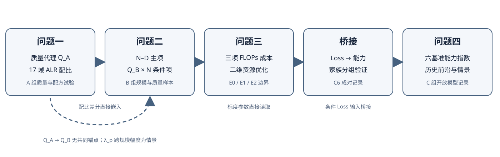
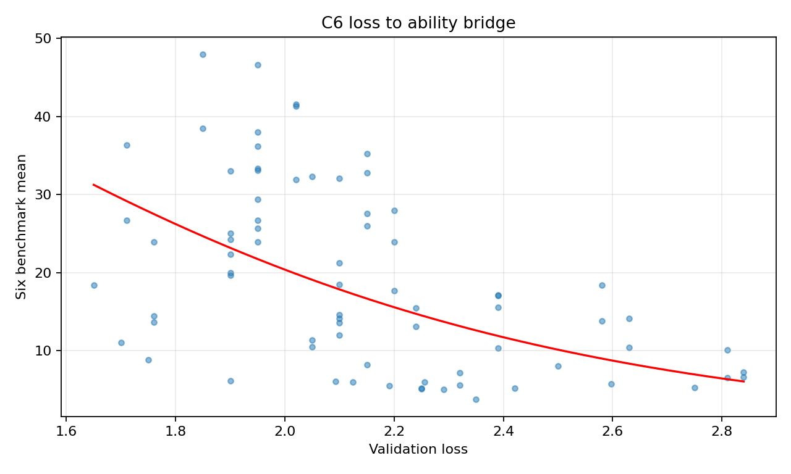

# 算力约束下大语言模型训练资源的分层配置与能力前沿分析

## 摘要

有限算力下的大语言模型训练需要联合决定模型规模、训练数据量、语料质量与领域配比，但题给数据分别来自文本信号、配方试验、标度样本和开放模型记录，不能把不同量尺直接视为一次受控实验。本文建立“质量代理与组成配比—质量条件标度律—成本约束优化—Loss 到能力的桥接”分层框架。问题一对 A1—A3 的 272,505 条文本信号构造四组等权质量代理，以 512 个 1M 配方训练 17 域 ALR 二阶多任务 ElasticNet；在既定 1M 配方集上 pooled RMSE 为 0.2543，较 Ridge 的 0.2702 降低 5.86%，但 1B 的 13 个验证域中有 5 个退步。问题二用 B1 估计 N–D 主项、B6 估计 Q_B×N 条件项，B6 留参数组 RMSE 由加性质量模型的 0.08144 降至 0.05235；该结论限于 B6/B7 半合成机制。问题三将训练、质量处理和上下文成本纳入约束，解析消去 D 后求解二维规划；在 10^24 FLOPs、三倍观测上界的条件情景中，N=35.897B、D=899.68B、Q_B=1、Loss=1.9794，预算使用率为 22.35%。问题四以 45 个严格匹配的开放权重模型构造六基准能力指数，Loss—能力单调桥接的家族分组 RMSE 为 11.864 分；12/24 月结果只作为冻结于 2025-01-31 原点的条件情景。分层建模给出了可复核的选择与外推边界，同时表明 Q_A 与 Q_B 的量尺映射、配比跨规模幅度及长期能力数值仍需新数据校准。

**关键词：** 大语言模型；数据质量；组成数据；标度律；算力配置；能力前沿

## 1 问题重述

有限算力下的预训练配置需要同时决定模型参数量 $N$、训练 Token 数 $D$、数据质量 $Q$ 及领域配比 $\mathbf p$。经典标度律描述 $N$ 与 $D$ 对验证损失的影响[4]；数据筛选与配比研究进一步提示训练语料结构的重要性[2,3,6]。然而，本题的质量信号、配方试验、标度样本和开放模型历史记录分别来自 A、B、C 三组附件。它们的损失口径、质量量尺及规模支持范围不同，因此需要将可估计的模块与条件连接明确区分。

本文以验证 Loss 为前三问的目标量，以六项 Benchmark 均值为第四问的能力量。先在 A 组定义文本质量代理并学习配比响应，再在 B 组估计条件损失函数，以题设成本求解资源配置，最后用 C 组检验 Loss–能力桥接及历史前沿。对于未共同观测的 $Q_A\leftrightarrow Q_B$ 与配比跨规模幅度 $\lambda_p$，仅设置显式情景，不将其作为已估计参数。

本文贡献概括为三点：

1. **建立可追溯的质量与配比评价。** 对 A1–A3 共 272,505 条信号记录使用固定的四组等权质量规则；在 A6/A7 的 1M 配方集上，二阶 ALR 多任务 ElasticNet 相比二阶 ALR Ridge 的 pooled RMSE 降低 5.86%，同时保留可用于下游的组成数据差分接口。
2. **构建条件质量标度律与预算配置模型。** 在 B6 留参数组上，$Q_B\times N$ 项相比加性质量项将 RMSE 降低约 35.7%；在 $10^{19}$、$10^{22}$、$10^{24}$ FLOPs 下给出观测域、三倍边界及自由外推的配置剖面，并核对预算与最优性条件。
3. **建立能力口径与跨问证据链。** 对 45 个严格匹配的开放权重模型计算六基准能力指数；C6 的 Loss–能力桥接在家族分组验证中 RMSE 为 11.864 分，并对历史前沿与 12/24 个月情景分别标明样本条件和预测原点。

### 1.1 竞赛任务的共同目标

题目要求从数据价值、训练损失、算力预算和能力演化四个层面回答同一资源决策问题。本文将前三问的目标统一为给定条件下验证 Loss 的最小化；第四问将 Loss 与六项 Benchmark 能力分数区分，再用可检验的桥接模型连接。对配比、质量与规模未共同观测的部分，仅给出明示条件的情景结果。

### 1.2 相关工作与本文定位

参数量与训练数据量之间的配置关系是预训练资源分配的基础。Hoffmann 等[4]通过规模实验讨论给定计算预算下的参数和数据选择，Pythia 工作[5]为同一模型族的训练轨迹分析提供了公开样本。此类研究支持用低维幂律刻画规模效应，但具体系数依赖语料、模型族和验证损失口径。本文因而只用 B1 估计统一的 $N$–$D$ 主项，并将 B2/B4/B5 作为未经校准的跨来源比较；组内误差和组外误差分别报告，避免把同一训练轨迹上的精细拟合直接解释为跨族精度。

数据维度同时包含样本质量与领域组成。DataComp-LM[2]强调数据集设计对语言模型训练的重要性；RegMix[3]与 Data Mixing Laws[6]提示小规模配比实验可为候选训练配方提供预测信息。本文的 A 组质量信号与配比 Loss 并不构成“质量筛选—模型再训练”的成对实验，因此四组等权 $Q_A$ 是可审计的筛选代理，而非已校准的性能收益。另一方面，17 域占比之和为一，改变一个领域必然改变其他领域；对数比坐标[1]用于表达这种相对结构。与直接把 17 个比例独立输入回归相比，该参数化更符合配方数据的几何约束，并允许在固定参考配方下输出可比较的 Loss 差分。

从预训练损失到下游能力还需定义统一的测量对象。已有研究讨论训练量与任务表现的关系[7]，算法进展研究[8]则为规模之外的时间项提供了分析动机。本题 C 组记录包含不同能力任务、发布时间及开放权重口径，不能用单一分数替代全部任务表现。因此本文先固定六项基准的等权能力定义，再以 C8 逐任务记录检查一致性，并对 C6 桥接使用模型家族隔离评价。未来能力只作为冻结原点下的条件情景表达，确保历史回顾与当下预测在时间含义上清楚区分。

## 2 问题分析

### 2.1 问题一：质量代理与配比响应

文本信号给出可审计的筛选维度，却没有人工质量真值；领域占比满足总和为一，任一域变化都伴随其他域变化。因此先把 22 项信号变为四组效用，再用对数比坐标学习配比与 13 个验证域 Loss 的相对关系。输出为质量代理 Q_A、配比预测函数及相对参考配方的 Loss 差分。

### 2.2 问题二：条件损失函数

参数规模和 Token 数的主效应由 B1 同族轨迹估计，质量响应由 B6 的半合成样本估计。需要分别检查同机制留组、新输入点和异机制来源。问题一的配比模型可提供差分形状，但跨规模增益幅度未识别，故用显式 λ_p 情景连接。

### 2.3 问题三：成本约束规划

决策量 N、D、Q_B 和候选配比共同决定预测 Loss，三项成本之和受 FLOPs 预算限制。Loss 对 D 的单调性允许先解析确定给定 N、Q_B 时的最大可用 D，再以二维搜索处理质量投入和规模。高预算结果需与 B1 观测域及扩展上界并列报告。

### 2.4 问题四：能力测量与前沿

验证 Loss 不是 Benchmark 能力，必须先固定统一能力定义，再用 C6 样本检验单调桥接。历史前沿、家族分组误差与未来情景是三类不同证据；未来值固定 2025-01-31 原点，仅描述算力增长和剩余时间项设定下的可能轨迹。

### 2.5 总体建模框架

图 1 的实线表示同一数据层内的估计或已明确的参数传递，虚线表示缺少共同观测的条件连接。问题一给出配比响应，问题二建立质量条件 Loss，问题三据此求解预算配置，问题四将条件 Loss 与能力指标连接。$Q_A$ 与 $Q_B$ 的量尺转换及 $\lambda_p(N)$ 均无实证锚点，不进入确定性结论。

## 3 模型假设

### 3.1 数据与测量

同一附件及同一评价口径内的样本可用于该层模型估计。A、B、C 不视为同批联合受控训练；A 组 Q_A 只表示固定规则下的相对质量代理，B 组 Q_B 只表示 B6/B7 质量机制。13 个配比响应域、六项能力任务在各自评价中按既定权重汇总，不暗示所有任务价值相同。

### 3.2 成本与规划

题设训练成本与注意力成本随 N、D 单调增长，质量处理成本由所选 g(Q_B) 决定。固定 N、Q_B 和配比时，增加 D 可降低选定损失函数；可行域的 N、D 上下界及 Q_B∈[Q_0,1] 由情景指定。预算未用尽可由硬上界激活造成，不强制人为耗尽。

### 3.3 外推与能力情景

E0、E1、E2 分别表示 B1 观测上界、三倍上界和自由外推，是证据等级而非统计置信区间。未来能力情景的算力增长率与时间项只作条件输入；不把样本外目标日期后的信息回填到冻结原点。

## 4 符号说明

**表 1 主要符号、单位与解释**

| 符号 | 含义 | 单位或范围 |
|---|---|---|
| N | 非嵌入参数规模 | 十亿参数 B |
| D | 训练 Token 数 | 十亿 Token B |
| Q_A | A 组规则质量代理 | 0—1，无人工真值校准 |
| $Q_B$ | B 组半合成质量列 | 0—1，不与 Q_A 直接等同 |
| p、p_0 | 17 域配比及参考配比 | 单纯形，和为 1 |
| $\Delta_p$ | 问题一模型相对参考配比的 Loss 差 | 验证 Loss 单位 |
| λ_p | 配比跨规模幅度 | 条件情景参数 |
| L | 验证集预训练损失 | 越低越好 |
| C、C_tot | 可用及使用算力 | FLOPs |
| g(Q_B)、Q_0 | 质量成本函数及基线质量 | 情景给定 |
| L_ctx | 上下文长度 | Token |
| S | 六项 Benchmark 能力指数 | 0—100 分，越高越好 |
| R_s | 情景 s 下相对 oracle 的后悔值 | Loss 单位 |

## 5 数据预处理与基础分析

### 5.1 数据层次与单位

A1–A3 含文本质量信号；A4/A5 提供 512 个 1M 配方及 13 个验证域 Loss，既定 1M、60M、1B 配方集用于回顾性评价。B1 含 1,176 条参数–数据规模轨迹；B6/B7 提供半合成质量响应；C1、C4、C6、C8 分别用于能力记录、算力元数据、Loss–Benchmark 桥接和逐任务核对。A、B、C 并非同一批联合控制训练，本文据此采用分层估计。

标度模型中的 $N,D$ 均以十亿计，计算成本使用 FLOPs；$Q_A$ 是 A 组信号代理，$Q_B$ 是 B 组质量列，二者均在 $[0,1]$ 内，但量尺不直接互换。$\mathbf p=(p_1,\ldots,p_{17})$ 满足 $p_i\geq0$、$\sum_i p_i=1$。验证 Loss 越低越好，能力指数越高越好。

| 证据层 | 主要数据 | 本文用途 |
|---|---|---|
| 文本信号 | A1–A3 | 固定规则的质量代理及冲突标记 |
| 配方响应 | A4–A15 | 1M 训练、既定规模比较；10B/70B 为估算标签 |
| 规模与质量 | B1–B8 | 规模律、半合成质量项及来源机制诊断 |
| 能力记录 | C1–C8 | 开放模型能力指数、桥接与时间情景 |

**表 2 四问数据层次及作用**

| 层次 | 样本与内容 | 建模作用 | 独立性与限制 |
|---|---|---|---|
| A1—A3 | 272,505 条质量信号记录 | Q_A 的规则代理 | 无人工质量真值 |
| A4/A5 | 512 条 1M 配方运行，17 输入域、13 验证域 | 配比模型训练 | 既定测试集为回顾性比较 |
| B1 | 1,176 条同族 N–D 轨迹 | 经典标度律 | 跨族原始 Loss 不同口径 |
| B6/B7/B8 | 质量响应及异机制诊断 | Q_B 条件项 | 半合成，B8 不参加选型 |
| C1/C4/C6/C8 | 榜单、元数据、桥接与逐任务记录 | 能力指数、桥接、前沿 | 严格匹配只有 45 模型 |

### 5.2 验证协议与证据等级

配比模型在 A4/A5 内进行五折嵌套交叉验证，超参数、零替换和标准化均由训练折决定；既定跨规模集只用于回顾性评价。B1 按完整参数规模组留出，B6 按参数组留出，B7 用去重后的新输入点；B2/B4/B5 报告未经目标来源标签校准的原始误差。预算模型检查约束可行性、边界和数值最优性。能力桥接按模型家族分组验证，时间情景固定预测原点。

四问采用同一套冻结的模型参数与数据划分。A6/A7 与 60M 共享配方，因此不是两个独立配比分布；B7 只用相对 B6 去重后的新输入点作评价，B8 仅用于机制冲突检验；C8 的逐任务相关属于同源测量核对。各阶段的估计样本、评价样本和适用范围分别说明，避免将开发过程的候选结果误作最终模型证据。

### 5.3 样本、标签与评价对象的对应

质量信号在 A1、A2、A3 分别有 51,230、17,523、203,752 条记录，总计 272,505 条。扩展样本的比较先剔除与 A1 重合的 ID，再观察相同来源域的规则分数是否发生较大漂移；这检验的是代理分数的定义稳定性，而不是人工评价的一致性。22 项信号中有标量、列表及长尾计数，必须先按字段规则取值和定向，再用 A1 固定分位尺度归一，不能让扩展集重估分位点后又声称分数可直接比较。规则与缺失处理在附录 A 逐项列出。

配比响应的训练单位是一次 1M 配方运行，而不是单条文本。A4/A5 合计 512 个配方，每个对应 17 维闭合比例和 13 个验证域 Loss。既定 A6/A7 1M 测试有 256 个配方，60M 的 256 个配方与其共享配方设计，1B 集有 64 个配方；将 13 个响应展开为多行并不能把有效配方样本量乘以 13。自举以配方行为单位，保持同一次运行的 13 个验证响应一起抽取，避免虚增精度。10B/70B 的 Loss 是估算标签，不进入最终模型胜负判断。

B1 的 1,176 行是同一模型族的训练轨迹，同一参数规模下不同训练 Token 点彼此相关；因此按完整 N 组留出比随机行划分更能检验规模泛化。B6 的 360 行用于拟合质量条件项，B7 去重后有 90 个新输入点评价，B8 与 B6 存在 160 组相同 N、D、Q_B 输入却有不同机制标签。B8 的用途是指出不可合并性，不能为了增加样本量而并入常规质量回归。B2/B4/B5 的原始误差只与零样本口径对应；来源校准表的前段标签必须计入信息使用。

C1 榜单有 4,576 条记录，严格开放权重、实体匹配、六项任务完整这三道条件后，主前沿只剩 45 个独立模型。C6 的 75 条 Loss—Benchmark 记录来自 23 个家族，其中高可比 7 条同属一个家族；随机行验证可能让相近模型同时进入训练与测试，故采用家族隔离。C8 逐任务聚合检验能力指数的同源一致性，不替代独立任务外部验证。四类样本单位从文本、训练运行、规模轨迹到模型实体逐层变化，论文所有样本数与误差均按各自层次解释。

### 5.4 可追溯性与版本冻结

最终计算链依次采用问题一的 ALR 多任务配比模型、问题二的经典 $N$–$D$ 与 $Q_B\times N$ 条件项、问题三的资源配置解，以及问题四的 Loss—能力桥接。问题一的配比预测只以相对参考配方的差分进入后续问题；问题三的条件 Loss 再进入能力情景。这种可复算的接口保证各问使用同一模型定义，但不能证明不同数据来源具有相同的统计口径。

## 6 问题一：数据质量评价与领域配比模型

本节保存质量代理构造的逐项规则、领域统计和冲突阈值核查。相关表格来自问题一已有数据审计；它们用于复核代理定义，不充当人工质量标签。

### 6.1 数据质量指标处理

A1、A2、A3 分别有 **51,230、17,523、203,752** 条。A1 涵盖七个质量域，A2/A3 扩展 arxiv/github。A1 与 A2 的重合 ID 有 **1,419** 个，与 A3 的重合 ID 有 **10,000** 个；分源评分时保留全量，跨组汇总时去重。A4–A15 的 12 组配比数据均无关键字段缺失或重复配方编号；行和与 1 的最大偏差约 0.004，属于舍入误差，入模前逐行归一。

质量记录按样本逐条处理。`ad_en`、`fluency_en` 的二分类 logits 用正向类 softmax 概率压缩；ModernBERT 的 0–5 级 logits 用 softmax 期望除以 5；`fineweb_edu` 取单元素；`qurater` 的四维按官方顺序等权平均。这些列表含义来自[数据集官方说明](https://huggingface.co/datasets/opendatalab/SlimPajama-Meta-rater/blob/main/README.md)。各字段采用 A1 固定参考分位点缩放，A2/A3 沿用同一标尺。长尾计数字段先作带符号的 `log1p`，极值按 A1 1%/99% 截尾；长度等“适中最好”字段用 1%/20%/80%/99% 梯形效用。缺失值以 A1 参考中位数补齐并记录。最终 $z_k$ 均在 $[0,1]$，**越高代表该字段定义下越好**。

### 6.2 四组等权质量代理与候选权重

令 $z_{jk}$ 表示第 $j$ 个样本经固定标尺处理后的指标。先把高度相关的 `dsir_books`、`dsir_wiki`、`dsir_math` 合成一个子项；该三者的 Spearman 相关可达约 **0.999**，相关矩阵条件数约 **936.4** 的单指标 VIF 量级。教育、可读性、洁净度、文本结构四组的组内子项等权，组间等权：

$$Q_j=\frac14\sum_{g=1}^4 S_{jg},\quad S_{j,educational}=\frac15\left(z_{fineweb}+z_{reasoning}+z_{professionalism}+z_{qurater}+\frac{z_{dsir\_books}+z_{dsir\_wiki}+z_{dsir\_math}}{3}\right).$$

其余组的 $S_{jg}$ 为组内指标均值。与此比较的增强候选为 [CRITIC 原始方法](https://doi.org/10.1016/0305-0548(94)00059-H) 的离散度/相关性权重，以及四组得分去掉最高、最低后的鲁棒聚合。PCA 仅作结构分析，不把主成分自动解释为“质量”。A1 中第一、二主成分解释方差分别为 **31.5%**、**18.7%**；需要多于一个轴才可描述主要差异。相关矩阵、层次聚类和 VIF 进一步证明直接逐字段等权会重复计数。

| 方法 | A1 域排名与基线 Spearman | 样本分数平均绝对差 |
|---|---|---|
| 四组等权代理 | 1.000 | 0.0000 |
| CRITIC 权重 | 0.929 | 0.0279 |
| 去极值鲁棒聚合 | 0.964 | 0.0323 |
| 连续冲突惩罚 | 1.000 | 0.0368 |
| 广告阈值惩罚 | 0.964 | 0.0097 |

CRITIC 与鲁棒方案提供敏感性对照，但没有独立人工真值证明复杂权重更接近真实质量。主分析保留透明的**四组等权 $Q$**。在 500 次 Dirichlet 权重扰动中，arxiv 位于前三的频率为 **1.000**，github 为 **0.000**。这说明指定权重邻域内的排名较稳定，不构成外部质量真值验证。

### 6.3 领域级质量结果与稳健性

领域级主统计量取样本 $Q$ 的均值，并同时输出中位数、10% 截尾均值和 Winsorized 均值。95% 区间由每个域**按实际样本量重抽样 200 次**的非参数 bootstrap 给出，属于给定评分规则后的抽样区间，不涵盖指标定义误差。A1 的均值与中位数域排名 Spearman 为 **1.000**。

| A1 域 | 样本数 | 平均 Q | 95% bootstrap CI | 排名 |
|---|---|---|---|---|
| arxiv | 1419 | 0.7647 | [0.7627, 0.7669] | 1 |
| commoncrawl | 9640 | 0.7092 | [0.7078, 0.7106] | 2 |
| stackexchange | 10000 | 0.6959 | [0.6945, 0.6974] | 3 |
| c4 | 10000 | 0.6894 | [0.6877, 0.6911] | 4 |
| wikipedia | 10000 | 0.6477 | [0.6462, 0.6495] | 5 |
| book | 171 | 0.6201 | [0.6082, 0.6310] | 6 |
| github | 10000 | 0.5750 | [0.5736, 0.5766] | 7 |

A2/A3 使用同一标尺；为避免把 A1 子样本重复当成独立证据，下表的扩展均值只用 **不在 A1 中的 ID**：

| 域 | A1 n | 扩展中非重合 n | A1 Q | 非重合 Q | 差值 |
|---|---|---|---|---|---|
| arxiv | 1419 | 16104 | 0.7647 | 0.7616 | -0.0031 |
| github | 10000 | 193752 | 0.5750 | 0.5741 | -0.0009 |

**解释边界：** 例如 arxiv 的 $Q$ 较高，github 较低，是当前文本质量定义和统一阈值下的结果；代码语料和学术文本所需质量维度不同，不能把该排名等同于“训练价值”的绝对排序。

### 6.4 冲突定义与证据边界

离散冲突定义为：一维正向特征高于 A1 的 75% 分位，同时另一正向特征低于 25% 分位。事先指定三类：高 FineWeb 教育性与低无广告概率，高流畅度与低 ModernBERT 洁净度，高教育组得分与低可读性组得分。连续强度定义为 $I_j=\max_g S_{jg}-\min_g S_{jg}$；两者在不同层面反映冲突。

| A1 域 | n | 任一冲突率 % | 平均连续强度 |
|---|---|---|---|
| arxiv | 1419 | 5.07 | 0.2574 |
| book | 171 | 8.19 | 0.5384 |
| c4 | 10000 | 7.79 | 0.4669 |
| commoncrawl | 9640 | 11.65 | 0.3724 |
| github | 10000 | 11.87 | 0.3676 |
| stackexchange | 10000 | 5.40 | 0.2653 |
| wikipedia | 10000 | 2.94 | 0.3831 |

A1 全体任一冲突率为 **7.83%**。阈值改为 20%/80%、25%/75%、30%/70% 时分别为 **3.93%、7.83%、13.62%**，故冲突率必须与阈值同时报告。A2 的 arxiv 冲突率为 **5.72%**，A3 的 github 为 **11.15%**；与 A1 同域模式相近。

比较两种消解：$Q_j^{pen}=[Q_j-0.1I_j]_{[0,1]}$；若无广告概率低于 A1 第 10 分位，则 $Q_j^{hard}=0.85Q_j$，否则为 $Q_j$。强度惩罚使 A1 平均 $Q$ 降低 **0.0368**，域排名与原模型的 Spearman 为 **1.000**。缺少独立人工标注，不能证明惩罚后的分数更优，故主 $Q$ 保持未惩罚版本，将冲突标记单列供筛选。已抽取高低分与冲突样本供盲评，但尚未取得正式人工评价。

17 个训练域占比相加为一，原始比例连同截距直接进入回归会有确定线性依赖，且系数会随被省略域变化。以 `pile_cc` 为参照的 ALR 坐标将相对份额显式化；该域在本次训练中被选作稳定参照，并非具有特殊因果地位。二阶项允许局部替代与互补的预测曲率，但仅在观测配比支持附近解释。

### 6.5 组成约束、ALR 与多任务回归

本节以二阶 ALR 多任务 ElasticNet 为最终配比模型，另列相同数据划分下的基线与候选。外部规模评价为既定测试集的回顾性比较。

### 6.6 模型与统一验证协议

对 17 域配比 (p_1,\ldots,p_{17})，令 (r\) 为 `pile_cc`，零替换 (\epsilon=0.000249500998003992)。ALR 坐标为

\[
x_i=\log\frac{p_i+\epsilon}{p_r+\epsilon},\quad i\ne r.
\]

二阶特征 \(\phi(x)\) 包含 16 个一次项、16 个平方项及 120 个两两交互项。选中候选将每个特征按训练折标准化，再拟合 13 响应的 MultiTask ElasticNet：

\[
\min_{B,b}\;\frac{1}{2n}\lVert Y-\mathbf 1b^\top-\Phi B\rVert_F^2
+\alpha\rho\lVert B\rVert_{2,1}
+\frac{\alpha(1-\rho)}{2}\lVert B\rVert_F^2,
\quad \alpha=0.01,\;\rho=0.7.
\]

此处 \(\lVert B\rVert_{2,1}\) 使一项二阶特征在 13 个输出上联合收缩，不意味着交互具有因果意义。全训练共有 136/152 个特征激活。

所有候选采用相同的外层五折交叉验证，随机种子为 20260924；每折训练集内部再以三折选择超参数。基线与最终模型的 ALR 参考域、零替换和标准化都只由训练折确定，避免验证信息进入特征构造。最终模型在全部 A4/A5 上按重复五折交叉验证选参后重拟合。A6/A7、60M、1B 标签未用于超参数选择或拟合。

### 6.7 候选比较与模型选择

主指标为 A6/A7 1M 的 13 响应 pooled RMSE；训练内嵌套 OOF、60M/1B RMSE、MAE、排序相关、局部效应和配方行重抽样为补充判据。表 3 统一给出主要候选的比较。

**表 3 问题一候选模型比较**

| 模型 | 嵌套 OOF | A6/A7 1M | 60M | 1B | 判定 |
|---|---:|---:|---:|---:|---|
| 二阶 ALR Ridge 基线 | 0.334010 | 0.270179 | 1.595903 | 2.702111 | 初始可解释基线 |
| 二阶 ALR MultiTask ElasticNet | **0.318377** | **0.254346** | 1.592424 | **2.688705** | 通过已登记的总体门槛 |
| 二阶 ILR Ridge | 0.351029 | 0.282204 | 1.594570 | 2.656762 | 1M 主指标 RMSE 升高 |
| 二阶 ALR PLS | 0.542107 | 0.480686 | 1.628226 | 3.156230 | RMSE 较高 |
| CLR 加性样条 Ridge | **0.252219** | **0.208173** | **1.561406** | 2.735706 | 1M 专用候选；1B 总体 RMSE 升高 |

相对二阶 ALR Ridge 基线，MultiTask ElasticNet 的配方行配对 bootstrap RMSE 改善为：嵌套 OOF **+0.015632 [0.012255, 0.019270]**，1M **+0.015834 [0.010465, 0.021037]**，60M **+0.003479 [−0.001769, 0.008716]**，1B **+0.013406 [0.007823, 0.018795]**。五个外折的 OOF RMSE 全部改善。1M 的 12/13 域 RMSE 改善，13 域平均 Spearman 从 0.945224 到 0.949352；1B 的配方平均 Loss 排序 Spearman 从 0.566667 到 0.657738。

**1B 的逐域权衡不可忽略。** 13 个验证输出中，有 8 个 RMSE 改善，5 个 RMSE 升高；其中以下 4 个 RMSE 升高的回顾性配对区间不跨零：

| 验证域 | Ridge 基线 RMSE | ElasticNet RMSE | 相对恶化 |
|---|---:|---:|---:|
| `arxiv` | 2.164819 | 2.188393 | +1.09% |
| `freelaw` | 2.647592 | 2.666397 | +0.71% |
| `pubmed_central` | 2.361867 | 2.382771 | +0.89% |
| `github` | 3.278836 | 3.319268 | +1.23% |

模型选择预先同时考虑 1M 主指标、训练内误差、60M/1B 总体非劣、排序和 1 个百分点的局部替代方向。ElasticNet 满足这些总体判据，因此作为后续问题的配比模型。若应用要求**每个验证域均非劣**，则不能说该模型全面胜出；表中四个域以及另一个退步域均应保留为取舍信息。

CLR 样条在 1M 的单项误差更低，但 1B 的 pooled RMSE 相对 Ridge 退步；PLS 在主测试明显退步。最终采用 ElasticNet 是训练内、1M 主指标、60M/1B 总体、排序和局部效应的联合选择，不意味着所有输出域都改善。

### 6.8 逐域结果与局部敏感性

在训练配比均值处，从 `pile_cc` 向另一域转移 1 个百分点，共形成 16 个局部方向。最终模型与 Ridge 基线在 15/16 个方向一致；唯一不一致的 `pubmed_abstracts` 效应幅度很小，Ridge 约 −0.000029，最终模型约 +0.000164。40 次训练行 bootstrap 中，仅 9/16 个方向达到至少 90% 同号率。这些是局部预测关联，不是真实再训练收益。

四组等权质量代理尚无人工评分真值：已准备的 140 条盲评样本仍未得到正式评分。以 A1 的 51,230 条样本、7 个来源域做无监督敏感性，PCA 一因子域排名与主 $Q$ 的 Spearman 为 0.25，熵权为 0.9286，组等权秩聚合为 0.8929；单因子 FA 未收敛。这些相关只衡量定义变化，不是质量有效性检验。因此保留可解释的四组等权代理。

ElasticNet 在 60M 和 1B 的绝对 Loss 平均偏差仍为 **+1.502982** 与 **+2.612864**，说明它没有直接学到规模响应。后续标度律与资源规划只采用其相对配比差分，并把跨规模幅度 $\lambda_p$ 作为情景。10B/70B 的标签是估算值，不能用于确认跨规模胜出；仍需独立配方与多规模训练实验。

1B 的 13 个验证域中，8 个 RMSE 降低、5 个退步；其中 `arxiv`、`freelaw`、`pubmed_central`、`github` 的回顾性配对区间不跨零。60M 和 1B 的绝对 Loss 有明显共同偏移，因此问题二仅使用相对参考配方的 $\Delta_p$，并以 $\lambda_p$ 标注跨规模幅度。$Q_A$ 尚无正式人工盲评，选择等权代理是解释性与定义敏感性之间的取舍，不能写成“质量已被验证”。

### 6.9 为什么不直接回归 17 个比例

对闭合配比，$\sum_{i=1}^{17}p_i=1$。若同时设置截距和全部比例作为线性特征，设计矩阵必然秩亏；任意一个域系数改变都必须通过其他域的改变实现，单个“保持其余 16 域不变”的导数不在可行域内。即使删去一列使线性回归可计算，回归系数也会随删去的参考域改变，无法把系数当作某域的独立价值。ALR 使用 $\log[(p_i+\epsilon)/(p_r+\epsilon)]$，使比例只通过相对份额进入模型；零替换量由训练折确定，防止测试数据影响坐标变换。

二阶 ALR 特征共有 16 个一次项、16 个平方项和 120 个交互项，共 152 维。512 个训练配方拟合 13 个响应，若为每个响应分别选择特征，将使相关的验证域估计更不稳定。MultiTask ElasticNet 的 $\ell_{2,1}$ 惩罚在 13 个响应上共享特征选择，同时用二次惩罚收缩相关特征；选定解激活 136/152 个特征。因此“稀疏”是相对无惩罚二阶模型的联合收缩，不宜描述为只依赖少数领域。二阶交互提供局部曲率，却不表示观察到真实训练中的领域协同因果效应。

### 6.10 质量代理选择的解释性代价

把 22 项信号直接等权会让语义接近、相关较高的字段重复计数。四组等权先在教育价值、可读性、洁净度和结构内聚合，再在概念组间等权，故主分数的定义可逐项复查。CRITIC 用离散度及相关性调整权重，鲁棒聚合抑制极端组分，PCA 和熵权则检验定义变化是否引起排序漂移；这些方法均不能在没有人工标签的情况下自行建立“真实质量”标尺。

**质量代理的无监督敏感性**（A1 七来源域，与四组等权基线比较）

| 代理方式 | 域排序 Spearman | 样本平均绝对分差 | 解释 |
|---|---:|---:|---|
| 四组等权 | 1.0000 | 0.0000 | 主报告口径 |
| CRITIC | 0.9286 | 0.0279 | 离散度/相关性加权 |
| 鲁棒聚合 | 0.9643 | 0.0323 | 压低极端组分 |
| 冲突惩罚 | 1.0000 | 0.0368 | 排序未变，绝对值变化 |

PCA 一因子域排名与主代理的 Spearman 为 0.25，表明单轴压缩会改变指标定义，而不是验证了等权方案的外部有效性。因此 $Q_A$ 仅用于相对筛选与冲突定位；人工盲评和同配比异质量训练仍是检验其训练价值所需的后续证据。

### 6.11 选定模型的总体收益与逐域损失

选择配比模型时，主指标是 A6/A7 的 1M pooled RMSE，训练内嵌套 OOF、60M/1B、排序及逐域稳定性是共同约束。ElasticNet 对 Ridge 的 1M 配对 RMSE 改善为 0.015834，条件 95% 区间为 [0.010465,0.021037]；1B 改善为 0.013406，区间为 [0.007823,0.018795]。这些区间对既定配方行重抽样，不能重新定义为模型开发之前封存的外部置信区间。60M 的改善区间跨零，故只报告数值接近。CLR 样条在 1M 的 RMSE 为 0.208173，优于选定模型，但 1B 的 2.735706 高于 Ridge 的 2.702111；其单尺度收益不足以替代跨问所需的配比接口。

对 1B 的逐域结果，8 域下降与 5 域上升同时成立，不能用 pooled 指标掩盖个别验证域的退步。模型若用于某一指定领域，应先查看该域在附录 B 的独立指标和区间；本文后续只把 13 域汇总的相对配比差作为条件输入。

### 6.12 领域替代效应的定义与稳定性

配比约束使“增加某领域 1 个百分点”必须同时说明从哪一领域转出。对参考配方 $p_0$，本文固定从 `pile_cc` 转出 0.01 到目标域，在其他域不变且仍保持非负时，计算选定模型的预测差。该差分是局部方向量，不是一个领域的全局回归系数，更不是大规模重新训练后的真实收益。若参考配方接近边界，某些 1 个百分点的转移不可行；超出 A4/A5 配比支持的候选也只可作外推情景。

最终 ElasticNet 与冻结 Ridge 在 16 个局部方向中的 15 个符号一致，唯一不一致的 `pubmed_abstracts` 效应本身极小；固定规格在 40 次训练行 bootstrap 中，只有 9/16 方向达到至少 90% 同号率。因此适合报告模型对候选配方的相对排序和总体 Loss 差，而不应把每一个方向的符号写成稳健定论。交互项同样如此：二阶特征允许在支持域内弯曲，但数据尚未给出同时通过 bootstrap、模型规格与多重比较检查的稳定互补对。正文使用“预测关联”和“条件差分”，附录保留逐方向结果供复核。

### 6.13 1B 的逐域配对结果

正值表示选定 ElasticNet 相对 Ridge 的 RMSE 改善；负值是退步。该表将 pooled 指标的权衡展开到 13 个验证域，区间来自既定配方行的回顾性重抽样。

| 验证域 | Ridge−选定 RMSE | 95% 下界 | 95% 上界 |
|---|---|---|---|
| arxiv | -0.0235736 | -0.0389024 | -0.00836261 |
| freelaw | -0.0188046 | -0.0286011 | -0.00909795 |
| pubmed_central | -0.0209048 | -0.0317043 | -0.0102115 |
| wikipedia_en | 0.00815754 | -7.42074e-05 | 0.0155968 |
| dm_mathematics | 0.0649035 | 0.0395418 | 0.0914425 |
| github | -0.0404319 | -0.0567867 | -0.0249766 |
| stackexchange | -0.00901633 | -0.0233442 | 0.00522449 |
| gutenberg_pg_19 | 0.0305054 | 0.0231756 | 0.037592 |
| pile_cc | 0.0163742 | 0.0121644 | 0.0199262 |
| ubuntu_irc | 0.101454 | 0.0767367 | 0.124401 |
| hackernews | 0.0273364 | 0.0197519 | 0.034896 |
| pubmed_abstracts | 0.00896982 | -0.000479014 | 0.0181491 |
| uspto_backgrounds | 0.0061729 | -0.00213305 | 0.0141584 |

## 7 问题二：质量条件标度律

本节先比较经典 $N$–$D$ 主项和质量项候选，再给出最终采用的 $Q_B\times N$ 条件模型。各数据组的来源与验证用途按表 2 解释。

### 7.1 B 组数据与来源口径

题目附件 B 包括真实训练轨迹、跨模型族汇总、半合成质量实验及辅助元数据。表 2 列出各组的样本单位和用途；B3 是从同族轨迹插值得到的点，B10 是估算 Loss，均不当作独立真实训练验证。

| 数据组 | 性质与规模 | 主要范围或特点 | 本文用途 |
|---|---:|---|---|
| B1 | Pythia 真实轨迹，1,176 行 | 8 个参数规模，$N=0.070542$–$11.965825$、$D=0.134$–$299.893$，Loss 为 $2.0933$–$4.7388$ | $N$–$D$ 主项估计与留规模组验证 |
| B2 | Cerebras 半合成轨迹，1,029 行 | $N=0.111$–13、$D=14$–2,050 | 跨来源原始误差与有标签校准 |
| B3 | 同族轨迹插值，4,000 点 | 8 条轨迹各 500 点 | 曲线形状核查，不作独立验证 |
| B4/B5 | 跨模型族汇总，57/44 行 | 来源与 Loss 口径未完全统一 | 原始跨来源比较 |
| B6 | 半合成质量实验，360 行 | $Q_B=0.1$–1 | 质量条件项拟合 |
| B7 | 半合成扩展，450 行 | 含 B6 全部 360 个相同输入 | 去重后的 90 个新点用于开发性评价 |
| B8 | 异机制大网格，1,704 行 | $N=0.07$–700、$D=5$–2,000；Loss 下界 0.5 | 去重后 1,480 点仅作机制冲突诊断 |
| B9/B10 | 大模型元数据 132 行、估算 Loss 128 行 | $N=100$–10,000 | 诊断性外推，不作真实 Loss 验证 |
| B11/B12 | 来源元数据 18 行、检查点索引 1,386 行 | 无新增 Loss 标签 | 样本核对 |

### 7.2 经典 N–D 基线与估计

经典式 $L_{ND}=E+AN^{-\alpha}+BD^{-\beta}$ 允许分别识别参数量与训练 Token 的边际衰减。使用 B1 的 1,176 个轨迹点，以有界非线性最小二乘估计正参数：$E\in[0,4]$，$A,B\in[10^{-5},100]$，$\alpha,\beta\in[0.005,2]$。四组初值择残差平方和最小者；多初值参数最大差约 $10^{-11}$，表明在给定 B1 与此公式下数值解稳定。该结论不涉及跨来源泛化。

### 7.3 主项参数与数学意义

经典 $N$–$D$ 主项的参数估计如下：

$$E=1.689797563,\quad A=0.353980321,\quad\alpha=0.339976582,\quad B=1.240305584,\quad\beta=0.279878129.$$

$$\boxed{L_{ND}=1.689797563+0.353980321N^{-0.339976582}+1.240305584D^{-0.279878129}.}$$

$N$ 增加一倍时，参数损失项乘 $2^{-0.339977}\approx0.790$；$D$ 增加一倍时，数据损失项乘 $2^{-0.279878}\approx0.824$。这说的是**对应损失分量**而非总 Loss 同比例下降；总 Loss 中还有 $E$ 和其余项。系数的物理尺度依赖 B 单位和同一评测 Loss 口径。

### 7.4 留参数组验证

B1 的多行记录来自同一模型规模的连续检查点。随机按行切分会让训练集看到测试点相邻的轨迹，因此按 8 个完整参数规模逐组留出，每次用其余 7 组拟合；另用较小 $N$ 预测较大 $N$、早期 $D$ 预测后期 $D$。经典式留规模组 RMSE 为 **0.00015118**，小到大 $N$ 外推 RMSE 为 **0.00014298**。这些是 Pythia 同族规律检验，不能视为全新模型族的泛化精度。

### 7.5 跨来源原始误差

表中偏差统一定义为预测减观测。B2/B4/B5 已参与候选模型的开发性比较，因此下述跨来源误差不是全新封存测试。

| 数据 | n | RMSE | MAE | Bias | Spearman | 解释 |
|---|---:|---:|---:|---:|---:|---|
| B2 raw | 1,029 | 1.243085 | 1.178442 | −1.178442 | 0.788102 | 半合成族外轨迹，绝对水平显著偏低估 |
| B3 插值 | 4,000 | 0.003821 | 0.002893 | −0.001968 | 0.999990 | 同族插值，形状核查，不独立 |
| B4 raw | 57 | 0.292667 | 0.227263 | −0.221009 | 0.982982 | 跨族排序较好，绝对口径仍偏 |
| B5 raw | 44 | 0.197595 | 0.170722 | −0.020570 | 0.958808 | 文献尺度排序较好，评测口径未统一 |

B2 的残差随训练数据量变化：观测减预测与 $\log D$ 的相关系数约 **−0.977**，不能只用一个固定截距解释。B4/B5 的 Spearman 较高说明排序趋势尚存，但绝对 RMSE 和偏差仍需同时报告。对 B4/B5 全量数据事后拟合截距只能描述来源差异，不能充当独立验证。

在固定 N、D 时，质量项的效果可能随模型容量改变：更大模型可利用不同的信息，也可能对噪声更敏感。该机制只是提出 Q_B×N 候选的理论动机，现有 B6/B7 半合成数据只支持条件预测比较，不能证明上述因果过程。候选按加性质量、Q_B×N、Q_B×N×D 与有效 Token 形式比较。

### 7.6 质量项候选比较

质量项候选均固定 B1 所估计的五个 $N$–$D$ 参数，只在 B6 上以有界非线性最小二乘拟合新增参数；B7 去重后用于开发性评价，B8 仅检验异机制。下表中 $L_{ND}$ 均为第 7.2 节的经典主项。

| 候选形式 | 数学表达式 | 新增参数 |
|---|---|---:|
| 加性质量项 | $L_{ND}+G(1-Q)^{\kappa}$ | 2 |
| 幂式有效 Token | $E+AN^{-\alpha}+B(DQ^{\gamma})^{-\beta}$ | 1 |
| 指数式有效 Token | $E+AN^{-\alpha}+B[De^{\gamma(Q-1)}]^{-\beta}$ | 1 |
| 饱和质量项 | $L_{ND}+G\{e^{-tQ}-e^{-t}\}/(1-e^{-t})$，$t\to0$ 时取 $G(1-Q)$ | 2 |
| Q×D 条件项 | $L_{ND}+G(1-Q)^{\kappa}(D/100)^{-\eta_D}$ | 3 |
| Q×N 条件项 | $L_{ND}+G(1-Q)^{\kappa}N^{-\eta_N}$ | 3 |

有效 Token 候选通过调整有效 $D$ 表示质量作用；Q×D 与 Q×N 则允许质量惩罚幅度随数据量或模型规模改变。表 4 分别列出 B6 拟合、B6 留规模组、B7 新输入点和 B8 异机制诊断误差。BIC 只针对 B6 的质量项拟合，不能与 B1 主项的 BIC 相加。

**表 4 问题二候选标度律比较**

| 模型 | 参数数 | B6 RMSE | B6 留规模组 RMSE | B7 去重新点 RMSE | B8 异机制 RMSE | BIC |
|---|---:|---:|---:|---:|---:|---:|
| 加性质量项 | 2 | 0.076068 | 0.081440 | 0.059515 | 1.392571 | −1843.04 |
| 幂式有效 Token | 1 | 0.116973 | 0.119565 | 0.105570 | 1.402068 | −1539.10 |
| 指数式有效 Token | 1 | 0.102931 | 0.106377 | 0.079602 | 1.384888 | −1631.17 |
| 饱和质量项 | 2 | 0.076070 | 0.081405 | 0.059521 | 1.392598 | −1843.02 |
| Q×D 条件项 | 3 | 0.075085 | 0.080596 | 0.058900 | 1.393510 | −1846.52 |
| **Q×N 条件项** | **3** | **0.051804** | **0.052346** | **0.042127** | **1.341755** | **−2113.75** |

饱和候选的 $t\approx3.5\times10^{-10}$，Jacobian 条件数为无穷，实质退化为加性直线，不能据此声称发现饱和机制。Q×D 的 $\eta_D=0.041233$，改善幅度较小。

### 7.7 简约模型的选择

选择质量项前设定三项判据：相对加性基线，B7 新点 RMSE 至少改善 5%，B8 异机制误差不升高，B6 BIC 至少降低 6。B8 只作冲突排查，不能凭其误差选型。Q×N 满足这些判据，其估计参数为：

$$G_C=0.3568073634,\quad\kappa_C=0.9915434612,\quad\eta_N=0.1620729235.$$

相对加性基线，Q×N 使 B6 留 $N$ RMSE 从 **0.081440 降至 0.052346**，B7 新点从 **0.059515 降至 0.042127**，BIC 从 **−1843.04 降至 −2113.75**。B8 新点误差虽由 **1.392571** 降至 **1.341755**，仍然很大。按 B6 的参数规模组重采样 200 次，$\eta_N$ 的 95% 分位区间为 **[0.148572,0.200805]**。这支持 B6 半合成机制下的条件关联，不证明真实训练中质量收益的因果规律。

### 7.8 异机制冲突检验

B6 与 B8 有 **160 个完全相同的 $(N,D,Q_B)$ 输入**，但 Loss 不同：B8 减 B6 的均值为 **−1.15361**，在 $Q_B=1$ 时约 −0.0125、$Q_B=0.1$ 时约 −2.1583。相同 $N,D$ 组内，质量升高伴随 Loss 降低的比例在 B6/B7 为 100%，在 B8 新点为 **0%**；B8 还有 0.5 的 Loss 下界。B8 的残差与 $Q_B$ 相关约 0.9744，与 $\log N$ 相关约 −0.0126，说明它不是单纯的固定来源截距偏差。**两个数据组的生成机制或质量语义不一致**，不能合并拟合后再称 B8 验证通过。

### 7.9 N–D 复杂候选复核

为检查复杂主项是否必要，在 B1 上比较经典加性幂律、$HN^{-\alpha}D^{-\beta}$ 交互项、算力比值式、平滑 broken-N 式，以及 Huber、soft-L1、相对误差与对数误差目标。各候选只用 B1 估计参数，并使用同一留规模组与跨来源评价协议。

| 候选 | 参数数 | B1 留组 RMSE | 小到大 $N$ RMSE | BIC | B2/B4/B5 raw RMSE |
|---|---:|---:|---:|---:|---|
| 经典加性幂律 | 5 | 0.00015118 | 0.00014298 | −20729.31 | 1.24308 / 0.29267 / 0.19760 |
| N–D 交互项 | 6 | 0.00015232 | 0.00014560 | −20722.62 | 1.24308 / 0.29267 / 0.19760 |
| 算力比值式 | 4 | 0.097604 | 0.124717 | −5993.22 | 1.31283 / 0.31712 / 0.18174 |
| 平滑折点幂律 | 7 | 0.00015174 | 0.00012952 | −20720.85 | 1.24308 / 0.29267 / 0.19757 |
| 经典式 Huber 损失 | 5 | 0.00015118 | 0.00014298 | −20729.31 | 1.24308 / 0.29267 / 0.19760 |
| 经典式 soft-L1 损失 | 5 | 0.00015118 | 0.00014298 | −20729.31 | 1.24308 / 0.29267 / 0.19760 |
| 经典式相对误差 | 5 | 0.00014935 | 0.00012837 | −20721.05 | 1.24307 / 0.29266 / 0.19760 |
| 经典式对数误差 | 5 | 0.00015012 | 0.00013370 | −20728.02 | 1.24308 / 0.29266 / 0.19760 |

Broken-N 在 B1 小到大规模外推时有微小改善，但 BIC 较差，跨来源误差几乎不变；其 $\delta=-0.000711$ 接近零，Jacobian 条件数约 $3.12\times10^{10}$，阈值 $N_c$ 弱识别。固定不同阈值重复估计时，$\delta$ 仍接近零，故保留经典主项。相对误差和对数误差目标也未稳定解决来源偏移。

### 7.10 来源校准与零样本区分

B1 到 B2 的原始全量 bias 为 **−1.178442**，更复杂的 $N$–$D$ 结构未明显消除。为区分零样本预测与有标签校准，从 B2 每条轨迹的早期 $D$、B4/B5 每个家族的前段记录取约 20% 作为目标来源校准集，余下约 80% 作留出集；比较截距、仿射与 $\log D$ 残差修正。截距调整损失起点，仿射形式为

$$L_s^{cal}(N,D)=a_s+c_sL_{ND}(N,D),$$

其中 $a_s$ 调整损失起点、$c_s$ 调整该来源的 Loss 尺度。来源仿射校准方案预先固定这一形式，不对质量项或配比项作同样缩放，因为 B2/B4/B5 没有可识别这些幅度的联合测量。

| 来源 | 校准/holdout 行数 | 同一 holdout raw RMSE | 截距 RMSE | 仿射 RMSE | $\log D$ RMSE |
|---|---:|---:|---:|---:|---:|
| B2 | 203 / 826 | 1.033103 | 0.788919 | 0.695515 | 0.367362 |
| B4 | 12 / 45 | 0.248204 | 0.221161 | 0.091646 | 0.161231 |
| B5 | 9 / 35 | 0.188934 | 0.218046 | 0.161882 | 0.189887 |

B2 的 $\log D$ 修正在该来源局部最好，却未在 B4/B5 同时占优；系数也必须使用该来源标签。自适应选择形式在 B5 误选截距，使留出 RMSE **0.218045**，劣于未经校准的结果。固定仿射校准方案的参数为 B2 $a=-0.240309,c=1.861322$，B4 $a=-0.815261,c=1.484678$，B5 $a=-0.716658,c=1.343569$。B2 全量原始 RMSE 1.243085 与后 80% 原始 RMSE 1.033103 基于不同样本，不能直接相减。校准改善消耗了目标来源约 20% 的标签，不是零样本泛化。

### 7.11 选定模型与配比接口

在相同划分与评价口径下再次比较 $N$–$D$ 与 $Q_B$ 候选，并明确来源校准与配比接口的使用边界。

### 7.12 N–D 主项的最终选择

比较经典加性幂律、增加 $HN^{-\alpha}D^{-\beta}$ 的交互式和平滑折点式。仅 B1 的 1,176 行用于最小二乘参数估计；按完整参数规模组逐一留出，并以较小规模或早期数据量单独测试外推。B2/B4/B5 不参与重新拟合，表中的跨来源误差是原始零样本预测。

| 主项模型 | B1 拟合 RMSE | B1 留规模组 RMSE | B2 原始 RMSE | B4 原始 RMSE | B5 原始 RMSE | BIC | Jacobian 条件数 |
| --- | --- | --- | --- | --- | --- | --- | --- |
| 经典加性幂律 | 0.00014650 | 0.00015118 | 1.24308 | 0.29267 | 0.19760 | -20729.31 | 1.14e+03 |
| N–D 交互项 | 0.00014647 | 0.00015232 | 1.24308 | 0.29267 | 0.19760 | -20722.62 | 1.56e+03 |
| 平滑折点幂律 | 0.00014614 | 0.00015512 | 1.24308 | 0.29267 | 0.19757 | -20720.85 | 3.12e+10 |

交互式与平滑折点式的训练误差略低，但 B1 留规模组 RMSE 从 0.00015118 增至 0.00015232、0.00015512。折点式的 Jacobian 条件数达 $3.12\times10^{10}$，在小规模训练、高规模评价时不稳定。因此保留经典加性幂律。B2/B4/B5 的原始 RMSE 为 1.2431/0.2927/0.1976，来源偏移不能被 B1 近乎零的训练误差掩盖。

### 7.13 质量条件项的最终选择

固定重拟合的经典 $N$–$D$ 参数，在 B6 的 360 行上分别拟合加性质量项、有效 Token 项、Q×N、Q×D 与低秩 Q×N×D。B6 按参数规模留组；B7 相对 B6 去重后的 90 个输入点评价。B8 标签不参与这些候选的拟合或选择。

| 质量项模型 | B6 拟合 RMSE | B6 留规模组 RMSE | B7 去重新点 RMSE | BIC | Jacobian 条件数 |
| --- | --- | --- | --- | --- | --- |
| 加性质量项 | 0.07607 | 0.08144 | 0.05952 | -1843.04 | 8.82e+01 |
| 有效 Token 项 | 0.11697 | 0.11957 | 0.10557 | -1539.10 | 1.00e+00 |
| Q×N 条件项 | 0.05180 | 0.05235 | 0.04213 | -2113.75 | 9.99e+01 |
| Q×D 条件项 | 0.07508 | 0.08060 | 0.05890 | -1846.52 | 8.84e+01 |
| Q×N×D 条件项 | 0.05036 | 0.05106 | 0.04117 | -2128.20 | 9.99e+01 |

Q×N×D 在 B6 留 N 和 B7 新点分别比 Q×N 改善 2.46% 和 2.28%，但均低于预注册 5% 门槛。按 B7 的 N 组配对自举，RMSE 改善 95% 区间 [-0.00111,0.00262] 覆盖 0。新增 D 指数在 B6 组自举区间 [0.0259,0.0546]，表明可作机制敏感性；组外收益不够稳健，主模型继续采用 Q×N。

### 7.14 选定函数与单位

在 B1/B6 的同一估计口径下，最终采用的条件函数为：

$$
L=1.6897975629+0.3539803207N^{-0.3399765819}+1.2403055836D^{-0.2798781285}+0.3568073584(1-Q_B)^{0.9915433891}N^{-0.1620729110}+\lambda_p\Delta_p
$$

$N,D$ 均按十亿计。$Q_B=1$ 时质量惩罚项为零，返回经典 $N$–$D$ 主项。质量参数仅在 B6/B7 的半合成机制下得到评价；$\Delta_p$ 是问题一最终配比模型相对参考配方的中心化 Loss 差。对超出训练范围的 $N,D,Q_B$ 输入，结果须标记为外推。

### 7.15 来源应用边界

来源条件校准使用 B2 各轨迹或 B4/B5 各模型家族前段约 20% 的已知 Loss 估计截距、仿射或 $\log D$ 修正，再评价后段约 80%。这一协议消耗目标来源标签，不能与零样本结果混合。开发性比较中，B2 的 $\log D$ 修正 RMSE 为 0.3674，B4/B5 的仿射修正为 0.0916/0.1619；这些是同组多种形式比较后的描述性留出结果。

| 来源 | 校准形式 | 校准样本 | 留出样本 | 留出 RMSE |
| --- | --- | --- | --- | --- |
| B2 | 未校准 | 203 | 826 | 1.03310 |
| B2 | 前段 20% 截距校准 | 203 | 826 | 0.78892 |
| B2 | 前段 20% 仿射校准 | 203 | 826 | 0.69552 |
| B2 | 前段 20% 对数数据量校准 | 203 | 826 | 0.36736 |
| B4 | 未校准 | 12 | 45 | 0.24820 |
| B4 | 前段 20% 截距校准 | 12 | 45 | 0.22116 |
| B4 | 前段 20% 仿射校准 | 12 | 45 | 0.09165 |
| B4 | 前段 20% 对数数据量校准 | 12 | 45 | 0.16123 |
| B5 | 未校准 | 9 | 35 | 0.18893 |
| B5 | 前段 20% 截距校准 | 9 | 35 | 0.21805 |
| B5 | 前段 20% 仿射校准 | 9 | 35 | 0.16188 |
| B5 | 前段 20% 对数数据量校准 | 9 | 35 | 0.18989 |

完全不使用 B5 标签估计时，将 B2 与 B4 的平均来源偏移迁移到 B5，RMSE 为 1.0696，反而高于未校准经典式的 0.1976。来源修正不能视为通用无标签规律。

### 7.16 B8 的不同生成机制

B6 与 B8 有 160 个相同 `(N,D,Q_B)` 输入，B8−B6 Loss 平均 -1.15361。在各 `(N,D)` 网格中，Q 增加而 Loss 降低的比例：B6=100%，B7=100%，B8 新点=0%。同点不同标签及相反斜率证明不能把 B8 作为同一确定性质量律的验证通过。B8 包含 `calibrated` 与 `extrapolated` 类型；这些不是独立现实大模型实验。

### 7.17 与问题一、三的接口

最终跨问接口写为 $L(N,D,Q_B,\mathbf p)=L_{NDQ}+\lambda_p\Delta_p(\mathbf p)$。$\lambda_p=1$ 是参考情景，而非 B 组数据估计出的跨规模参数。幂次衰减、带底值和上下界仅作敏感性设定。B 组缺少联合 $(N,D,Q_B,\mathbf p)$ 多规模 Loss 标签，因此无法由单尺度配方响应识别 $\lambda_p(N)$；现有数据混合文献[6]也不能代替本题的共同锚点。

问题一质量指数 $Q_A$ 与 B6/B7 的 $Q_B$ 不同，缺乏同一训练样本的成对测量和共同 Loss 锚点，因而无法识别 $Q_A\to Q_B$ 的数值映射。问题三使用 $Q_B$ 时必须注明情景或取得新的标注。若配比模型更新，则需重算 $\Delta_p$，并依次更新资源配置与能力情景。

### 7.18 条件项的边际解释与误差来源

选定函数的质量惩罚为 $G(1-Q_B)^\kappa N^{-\eta_N}$。在给定 N、D 时，质量改善的局部边际收益是 $G\kappa(1-Q_B)^{\kappa-1}N^{-\eta_N}$；它随 N 变化，故同一质量分差不能在所有参数规模上换算为相同 Loss 差。在 $Q_B=1$ 的边界，条件项归零；这只表示拟合函数的规范化，并不意味着真实语料达到无噪声极限。B1 的 0.000151 留组误差与 B2 的 1.2431 原始误差相差数个数量级，来源测量口径不能用组内精度代替。

若对目标来源用早期 Loss 标签估计截距或仿射修正，所得留后段误差已经消耗该来源标签，评价性质是“来源条件校准”，不是零样本外部验证。该校准也不能无证据地施加到 Q_B 或配比差分上。

### 7.19 配比跨尺度传递的证据边界

问题一最终配比模型在既定 1M、60M、1B 评价集上的中心化响应斜率依次为 0.822、0.609、0.182。这是使用已查看标签得到的回顾性比较，提示配比效应的幅度可能随规模变化；不同规模的配方支持范围也不完全相同，因此三个斜率不足以识别连续的 $\lambda_p(N)$。本文以 $\lambda_p=1$ 作为参考情景，并在 $0$、$0.25$、$0.5$、$0.75$、$1$、$1.25$、$1.5$ 下检查结果。由于模型对配比项可分，$\lambda_p>0$ 时候选配比的排序保持不变，而预测收益按系数伸缩；$\lambda_p=0$ 时各配比在该项上并列。

跨问计算先由配比模型得到相对参考配方的 $\Delta_p$，再代入质量条件标度律与预算规划，最后通过经家族分组检验的 Loss—能力桥接得到条件分数。$Q_A$ 与 $Q_B$ 缺少共同锚点，配比跨规模幅度也未由独立实验估计，故这条链只能用于比较明确假设下的候选方案，不能解释为四问已完成联合验证。预算上界、成本结构及能力桥接误差分别在第 8—10 节报告。

### 7.20 质量和规模相互作用的可解释范围

选定质量项可写成 $h(Q_B,N)=G(1-Q_B)^\kappa N^{-\eta_N}$。这给出两个不同问题：一是固定规模时把 Q_B 从一个值提高到另一个值，条件 Loss 变化为两点 $h$ 之差；二是固定 Q_B 时增加 N，质量惩罚随 $N^{-\eta_N}$ 缩小。数据支持的是 B6 留 N 和 B7 新点的预测精度，不能从指数符号反推模型“识别了质量的全部机制”。如果高质量数据同时改变 Token 多样性、训练长度或评估集分布，现有单变量 Q_B 函数无法分离这些途径。

候选比较必须保留复杂模型的局部优势。Q×N×D 在 B6 留 N 的 RMSE 约 0.05106，略小于 Q×N 的 0.05235；B7 新点约 0.04117，也略小于 0.04213。然而 B7 按 N 组配对 bootstrap 的进一步改善区间覆盖零，新增自由度在组外没有稳定收益。采用 Q×N 是预测收益、参数数量与来源相容性之间的保守选择，不是宣称 Q×N×D 在每一列分数上均劣。

跨来源原始误差的解释也需要区分“目标函数不适用”和“参数完全无效”。B1 的同族轨迹和 B2/B4/B5 可能有不同的验证 Token、损失底数、归一化方法和训练协议。未经目标来源标签校准的 raw RMSE 暴露口径偏移，不能凭这些误差单独判定 N、D 的局部单调关系无效。反过来，用目标来源前 20% 标签校准后留下的后 80% 误差，也不能再称零样本泛化。两类评价同时呈现，让评委区分结构可迁移性与量尺可迁移性。

### 7.21 配比项和质量项为何不能直接合并估计

A 组记录有完整 17 域配比，却没有与 B1/B6 同口径、同时变化的 $N,D,Q_B,L$ 网格；B6 的 $Q_B$ 不是 A 组规则代理 $Q_A$ 的重标。直接联合拟合 $L(N,D,Q,\mathbf p)$ 会混入来源差异。本文先固定 B1 的 $N$–$D$ 主项和 B6 的质量条件项，再以 $\Delta_p(\mathbf p)=f_A(\mathbf p)-f_A(\mathbf p_0)$ 接入相对配比响应。中心化避免将问题一的 1M 绝对 Loss 截距搬到 B1 的量尺。

这一构造仍留下 λ_p。设 λ_p=0 是“不使用配比收益”的保守情景，λ_p=1 是同幅度参考情景，其他常数或随 N 衰减/增长的形式只用于敏感性。没有多规模同配比再训练时，任何 λ_p(N) 的形状都不能被现有表格识别。问题三因此要把它列为情景输入，不能把选定配比自动当作大规模训练的已证收益。

### 7.22 质量提升与参数增加的条件等价

题目要求回答“质量提升 0.1 等价于多少参数”。固定 $D$、配比和起点 $(N,Q_B)$，先求提高质量后的目标 $L(N,D,Q_B+0.1,\mathbf p)$，再找 $N_{eq}$ 使原质量下的 $L(N_{eq},D,Q_B,\mathbf p)$ 等于该目标。不可约项、数据项和固定配比差分在等式两侧抵消，故只需解 $AN_{eq}^{-\alpha}+G(1-Q_B)^\kappa N_{eq}^{-\eta_N}=AN^{-\alpha}+G(1-Q_B-0.1)^\kappa N^{-\eta_N}$。最终质量条件模型可通过一维求根给出条件倍数 $N_{eq}/N$，无需用局部导数近似有限变化。

在 $D=300B$、$Q_B:0.6\to0.7$ 的固定情景中，1B 起点的条件等效规模为 $N_{eq}=1.2951B$，7B 起点为 $9.9002B$，后者约为 1.4143 倍。70B 起点对应的条件解为 112.9627B，远超 B1 最大实测规模，只能作结构敏感性。若改用加性质量基线、改变 $Q_A\to Q_B$ 映射或校准 Loss 口径，倍数会变化；它不是质量与参数价值的无条件换算。

### 7.23 弹性与有限变化的区别

对 $N,D,Q_B$ 的局部 Loss 弹性定义为 $\epsilon_x^{(L)}=(x/L)\partial L/\partial x$；若关心可约损失，则分母换为 $L-E$。两者回答不同问题，尤其在 Loss 接近不可约项 $E$ 时差别较大。最终模型对 $N$ 的导数同时含参数主项和质量交互项，对 $D$ 的导数来自数据主项；$Q_B$ 导数只在 B 组质量量尺内有意义。弹性描述局部小变化，不能代替“质量增加 0.1”或“参数翻倍”的有限差分；加性基线的旧数值也不能当作最终模型的弹性结果。

若考虑每单位 FLOPs 的边际收益，不能只比较 $|\partial L/\partial N|$ 与 $|\partial L/\partial Q_B|$，因为两项的成本导数不同。规划内点满足带成本梯度的 KKT 比值条件；达到 Q_B=1、N/D 上界或预算不绑定时，则由对应活动约束决定。由此把问题二的局部替代关系与问题三的实际预算选择接起来，也说明单看质量与参数的等价倍数不足以决定投资方向。

## 8 问题三：算力约束下资源配置优化

本节列出成本假设、外推边界、共同可行策略与数值检查；主文的条件方案与此处表格使用相同参数和单位。

### 8.1 目标、变量、约束与可行域

给定预算 C、基线质量 Q_0 和候选配比 p，优化变量为 N、D、Q_B；若配比也优化，则需限制在 A4/A5 支持域。目标为最小化问题二选定的 L(N,D,Q_B,p)，约束为训练、质量处理、上下文三项成本之和不超过 C，及各情景的 N、D、Q_B 上下界。若 N、Q_B、p 固定，L 对 D 严格递减，最优 D 是预算允许值与硬上界的较小者。由此把三维规划化为 N、Q_B 的二维有界搜索；D 的预算解析值由数值求根独立核对。

$$\min_{N,D,Q_B,p}\ L(N,D,Q_B,p)\quad\text{s.t.}\quad C_{\mathrm{tot}}(N,D,Q_B)\le C,\;N\in[\underline N,\overline N],\;D\in[\underline D,\overline D],\;Q_B\in[Q_0,1],\;p\in\mathcal P.$$

这一形式把目标、可行域、活动边界与配比支持条件分开；E0/E1/E2 只改变上界而不改变损失参数。

### 8.2 三项成本与最优性条件

下表对 3× minimax 政策核算。前三项和中心使用率对应指数成本、$Q_0=0.6$、4096 上下文；最坏使用率对应 12 种结构情景中的最大成本。因此共同可行并不意味着每个情景都花满预算。

| 预算 FLOPs | 中心训练 | 中心质量 | 中心注意力 | 中心总使用 | 最坏结构总使用 |
| --- | --- | --- | --- | --- | --- |
| 10^19 | 30.34% | 16.21% | 4.14% | 50.69% | 100.00% |
| 10^22 | 43.58% | 6.48% | 5.95% | 56.01% | 100.00% |
| 10^24 | 19.38% | 0.33% | 2.65% | 22.35% | 40.99% |

10^24 的 3× 政策在中心情景只用约 22.35% 预算，在最坏结构情景也只用约 40.99%。闲置由 N/D 外推上限驱动，不能通过在上限外继续增大 N/D 来伪装为已验证收益。free 单情景名义解的 KKT 残差如下；Q=1 时采用单侧互补条件：

| 预算 FLOPs | free 名义 KKT 相对误差 | Q 互补 |
| --- | --- | --- |
| 10^19 | 7.34e-08 | 通过 |
| 10^22 | 1.72e-08 | 通过 |
| 10^24 | 3.46e-08 | 通过 |

minimax/CVaR 目标和硬上限交界可不光滑；其八个局部可行方向最大改善量为 1.596e-13，这是数值局部检查，不是完整 KKT 证书。全部 75 个政策对 12 种结构情景的可行率为 100%；成本独立重算误差最大 4e-12。

### 8.3 质量投资的活动集转折

对 $Q^*>Q_0+10^{-4}$ 与 $Q^*\ge1-10^{-4}$ 的首次预算，先扫描括区间，再在 log10 预算上二分到容差 $2\times10^{-6}$ dex。端点 cusp 用全局候选和边界搜索保护。若在扫描区间外才触发，明确报告 below_scan/above_scan，不伪造数值。精度是给定 ε 与模型的数值精度，不是统计置信区间。

| 成本模型 | 事件 | FLOPs | 状态 |
|---|---|---:|---|
| exponential | start | 3.7024e+18 | crossing |
| exponential | saturation | 1.377e+20 | crossing |
| power | start | 1.2912e+19 | crossing |
| power | saturation | 7.215e+19 | crossing |
| logarithmic | start | 2.0036e+18 | crossing |
| logarithmic | saturation | 2.0036e+18 | crossing |

| 成本模型 | C7 上下文 | 事件 | FLOPs |
|---|---:|---|---:|
| exponential | 2048 | start | 3.9021e+18 |
| exponential | 2048 | saturation | 1.4428e+20 |
| exponential | 4096 | start | 3.7024e+18 |
| exponential | 4096 | saturation | 1.377e+20 |
| exponential | 32768 | start | 2.205e+18 |
| exponential | 32768 | saturation | 8.6692e+19 |
| power | 2048 | start | 1.3606e+19 |
| power | 2048 | saturation | 7.5467e+19 |
| power | 4096 | start | 1.2912e+19 |
| power | 4096 | saturation | 7.215e+19 |
| power | 32768 | start | 7.7042e+18 |
| power | 32768 | saturation | 4.6206e+19 |
| logarithmic | 2048 | start | 2.1026e+18 |
| logarithmic | 2048 | saturation | 2.1026e+18 |
| logarithmic | 4096 | start | 2.0036e+18 |
| logarithmic | 4096 | saturation | 2.0036e+18 |
| logarithmic | 32768 | start | 1.2433e+18 |
| logarithmic | 32768 | saturation | 1.2433e+18 |

另对 $\log N$、$\log D$、$Q_B$ 和质量预算份额做 0/1/2 折点的连续分段线性拟合，BIC 中计入折点位置参数。所得折点只描述计算轨迹斜率，不能与质量变量进入活动约束的转折混同为物理临界点。

### 8.4 解析消元与数值误差

自由解的预算使用率误差最大为 $2.22\times10^{-16}$。在 100 个随机点上，解析消元所得 $D$ 与数值求根的最大相对差为 $3.26\times10^{-16}$。内点及边界 KKT 检查的中位相对误差为 $6.16\times10^{-8}$、最大为 $4.24\times10^{-6}$；$Q_B$ 端点使用单侧互补条件。极端重抽样样本若不满足这些条件，应判为求解失败而不纳入稳健结论。

当 $Q_B=1$ 且质量成本份额趋小时，令 $K=C/[(6+\eta L_{\mathrm{ctx}})10^{18}]$，有 $D=K/N$。一阶条件给 $N^*=[(\alpha A)/(\beta B)K^\beta]^{1/(\alpha+\beta)}$，故 $e_N=\beta/(\alpha+\beta)=0.451522$、$e_D=\alpha/(\alpha+\beta)=0.548478$。$D/N$ 的理论预算指数为 0.096956，大于零；在 $10^{24}$ FLOPs 数值解附近，局部弹性分别为 $N:0.444625$、$D:0.561340$。质量成本仍非零，因而只渐近接近理论值。

### 8.5 三档预算与证据边界

下表是**指数质量成本、$Q_0=0.6$、4096 上下文**的单情景最优；E0 限在 B1 实测 N/D 范围，E1 上界扩大 3 倍，E2 自由外推。E1 是敏感性边界，不是实测可信区间。

| 预算 FLOPs | 等级 | N (B) | D (B) | Q | Loss | 预算使用 |
| --- | --- | --- | --- | --- | --- | --- |
| 10^19 | E0：实测域 | 0.31138 | 3.9555 | 0.72412 | 3.1804 | 100.00% |
| 10^19 | E1：3× 边界 | 0.31138 | 3.9555 | 0.72412 | 3.1804 | 100.00% |
| 10^19 | E2：自由外推 | 0.31138 | 3.9555 | 0.72412 | 3.1804 | 100.00% |
| 10^22 | E0：实测域 | 5.4332 | 245.59 | 1 | 2.1547 | 100.00% |
| 10^22 | E1：3× 边界 | 5.4332 | 245.59 | 1 | 2.1547 | 100.00% |
| 10^22 | E2：自由外推 | 5.4332 | 245.59 | 1 | 2.1547 | 100.00% |
| 10^24 | E0：实测域 | 11.966 | 299.89 | 1 | 2.0934 | 2.56% |
| 10^24 | E1：3× 边界 | 35.897 | 899.68 | 1 | 1.9794 | 22.35% |
| 10^24 | E2：自由外推 | 39.562 | 3657 | 1 | 1.916 | 100.00% |

10^19 与 10^22 的三层基本重合；10^24 时 E0/E1 都碰到 N、D 硬上限且闲置大量预算，E2 使用全部预算但 D 达约 3657B，超出 B1 观测上限约 12.2 倍。故“Loss 更低”不能直接视为更可信的生产方案。

**表 5 典型预算下的单情景最优配置**（指数质量成本，Q_0=0.6，L_ctx=4096；N、D 单位为 B）

| 预算 FLOPs | 等级 | N | D | $Q_B$ | Loss | 预算使用率 |
|---:|---|---:|---:|---:|---:|---:|
| 10^19 | E0/E1/E2 | 0.311 | 3.956 | 0.724 | 3.1804 | 100% |
| 10^22 | E0/E1/E2 | 5.433 | 245.59 | 1 | 2.1547 | 100% |
| 10^24 | E0 观测域 | 11.966 | 299.89 | 1 | 2.0934 | 2.56% |
| 10^24 | E1 三倍上界 | 35.897 | 899.68 | 1 | 1.9794 | 22.35% |
| 10^24 | E2 自由外推 | 39.562 | 3657.0 | 1 | 1.9160 | 100% |

10^24 档的 E1 剩余算力来自 N、D 上界同时激活，不能解读为“最优训练应闲置算力”。E2 的更低 Loss 对应 D 超出 B1 观测上界约 12.2 倍。

### 8.6 上界剖面与稳健决策

E0 将 $N,D$ 限于 B1 观测范围，E1 放宽至其上界的 3 倍，E2 不设经验上界。对固定 $N,Q_B$，$D$ 取预算允许值与上界的较小者，直接满足硬约束。早期软惩罚近似不能严格保证封顶，因此只作为边界敏感性对照；主结果使用硬约束。

| FLOPs | 层级 | $N$（十亿） | $D$（十亿） | $Q_B$ | Loss | 已用预算 |
|---:|---|---:|---:|---:|---:|---:|
| 1e+19 | E0 观测域 | 0.31138 | 3.9555 | 0.72412 | 3.1804 | 100.0% |
| 1e+19 | E1 三倍上界 | 0.31138 | 3.9555 | 0.72412 | 3.1804 | 100.0% |
| 1e+19 | E2 无经验上界 | 0.31138 | 3.9555 | 0.72412 | 3.1804 | 100.0% |
| 1e+22 | E0 观测域 | 5.4332 | 245.59 | 1 | 2.1547 | 100.0% |
| 1e+22 | E1 三倍上界 | 5.4332 | 245.59 | 1 | 2.1547 | 100.0% |
| 1e+22 | E2 无经验上界 | 5.4332 | 245.59 | 1 | 2.1547 | 100.0% |
| 1e+24 | E0 观测域 | 11.966 | 299.89 | 1 | 2.0934 | 2.6% |
| 1e+24 | E1 三倍上界 | 35.897 | 899.68 | 1 | 1.9794 | 22.4% |
| 1e+24 | E2 无经验上界 | 39.562 | 3657 | 1 | 1.916 | 100.0% |

三倍上界只是明确的外推情景，并非实测可信域。进一步将 $N,D$ 上限分别放宽为 B1 观测最大值的 1、2、3、5、10 倍，并与无经验上界解比较。$10^{24}$ FLOPs 下的结果如下：

| 上限倍数 | $N$（十亿） | $D$（十亿） | Loss | 已用预算 |
|---:|---:|---:|---:|---:|
| 1 | 11.966 | 299.89 | 2.0934 | 2.6% |
| 2 | 23.932 | 599.79 | 2.0171 | 10.0% |
| 3 | 35.897 | 899.68 | 1.9794 | 22.4% |
| 5 | 59.829 | 1499.5 | 1.9381 | 61.7% |
| 10 | 48.361 | 2998.9 | 1.9164 | 100.0% |
| free | 39.562 | 3657 | 1.916 | 100.0% |

从 3 倍放宽到 5 倍时，最优条件 Loss 仍有明显变化；因此 E1 不能被称为唯一可信的高预算配置。在 $10^{22}$ FLOPs 下，上述上限均未起作用。

稳健决策以 E1 三倍上界为条件。代表场景由 3 个联合参数重抽样向量、三种质量成本、两个初始质量和两个上下文长度组合，共 36 种。固定配置须对全部场景可行，因此共同质量下界为 0.8；$D$ 取各场景允许值的最小值。后悔值为方案 Loss 与同场景最优 Loss 之差，目标是最小化最大后悔值。给定配比时，$\lambda_p$ 与 $N$–$D$–$Q_B$ 决策可分，其不确定性另作配比敏感性，不混入资源项风险。

| FLOPs | 配置 | $N$（十亿） | $D$（十亿） | $Q_B$ | 中心情景 Loss | 最大场景后悔 |
|---:|---|---:|---:|---:|---:|---:|
| 1e+19 | 最小最大后悔值 | 0.30994 | 1.6315 | 0.81871 | 3.3778 | 0.33408 |
| 1e+19 | 共同域名义解 | 0.31138 | 1.6377 | 0.8 | 3.3839 | 0.34026 |
| 1e+19 | 观测域解经可行修正 | 0.31138 | 1.6377 | 0.8 | 3.3839 | 0.34026 |
| 1e+19 | 单情景名义解 | 0.31138 | 3.9555 | 0.72412 | 3.1804 | 其他情景不可行 |
| 1e+22 | 最小最大后悔值 | 4.1129 | 176.6 | 1 | 2.2002 | 0.056129 |
| 1e+22 | 共同域名义解 | 5.4332 | 136.62 | 1 | 2.2021 | 0.058086 |
| 1e+22 | 观测域解经可行修正 | 5.4332 | 136.62 | 1 | 2.2021 | 0.058086 |
| 1e+22 | 单情景名义解 | 5.4332 | 245.59 | 1 | 2.1547 | 其他情景不可行 |
| 1e+24 | 最小最大后悔值 | 35.897 | 899.68 | 1 | 1.9794 | 0 |
| 1e+24 | 共同域名义解 | 35.897 | 899.68 | 1 | 1.9794 | 0 |
| 1e+24 | 观测域解经可行修正 | 11.966 | 299.89 | 1 | 2.0934 | 0.11398 |
| 1e+24 | 单情景名义解 | 35.897 | 899.68 | 1 | 1.9794 | 其他情景不可行 |

这是一套给定三倍上界的风险决策规则，不等于数据证明该上界合理。单情景解在其他成本或上下文情景下不可行时，不计算其跨场景后悔值。

### 8.7 决策规则与保留理由

在三倍 B1 观测上界形成的共同可行域内，以**最小最大后悔值**作为风险对照方案。对同一主模型与成本函数，比较 1、2、3、5 倍上界和无经验上界，以及名义最优、最小最大后悔值、平均后悔值、CVaR90 后悔值和最差情景 Loss。开发阶段使用 3 个完整联合重抽样参数向量 ×12 个结构情景，留出阶段使用不同的 12 个参数向量 × 同一组结构情景。留出参数仍来自 B1/B6 的重抽样，不是独立外部数据；情景平均也不代表现实概率期望。

情景 $s$ 的后悔值定义为 $R_s(x)=L_s(x)-\min_{y\in\mathcal F_s}L_s(y)$。同一上界内部以该上界最优解为参照，跨上界比较则统一以无经验上界解为参照。替代方案须在共同可行域内使留出平均后悔值至少降低 0.005 Loss 且相对降低 5%，配对重抽样正改善比例超过 90%，同时不增加 $N,D$ 外推。已有候选没有同时满足全部条件。

### 8.8 高预算上界敏感性

下表固定 $10^{24}$ FLOPs，并以相同的留出情景和**无经验上界的最优值**作为跨上界后悔值参照。“共同名义 Loss”是共同可行的风险方案在中心情景下的 Loss；“单情景 Loss”只针对指数成本、4,096 Token 上下文和 $Q_0=0.6$ 单独最优，后者在更宽上界下并非对所有结构情景可行。

| 上限 | 共同 N (B) | 共同 D (B) | 共同名义 Loss | 单情景 Loss | 自由均值 regret | 自由最大 regret | 最坏成本率 |
| --- | --- | --- | --- | --- | --- | --- | --- |
| 1x | 11.966 | 299.89 | 2.0934 | 2.0934 | 0.16749 | 0.17998 | 4.7% |
| 2x | 23.932 | 599.79 | 2.0171 | 2.0171 | 0.091208 | 0.10367 | 18.3% |
| 3x | 35.897 | 899.68 | 1.9794 | 1.9794 | 0.053511 | 0.06597 | 41.0% |
| 5x | 52.727 | 1499.5 | 1.9419 | 1.9381 | 0.016051 | 0.02851 | 100.0% |
| free | 30.02 | 2618.8 | 1.9382 | 1.916 | 0.012312 | 0.024769 | 100.0% |

在 3× 内，36 个训练情景的解共享同一个角点，使域内 regret 为 0；留出情景也如此。但相同 3× 政策对 free oracle 的留出均值 regret 是 0.05351102。5× 与 free 降低此条件后悔值，却分别把 D 推到 B1 上限的 5 倍与约 8.732 倍。没有独立数据支持这样的外推上限，故报告 Pareto 剖面，不给唯一高预算规模。3× minimax 仅保留为清楚标注条件的展示政策。

### 8.9 后悔值与共同可行解

初步比较曾将单情景名义解直接截入共同可行域，却没有重新优化 $N,Q_B$，使其作为对照偏弱；在 $10^{19}$ FLOPs 下，该修复方案的留出平均后悔值约为 0.172389。最终比较改为在共同可行域中重新优化名义目标，再与风险方案比较：

| 预算 FLOPs | 规则 | 留出平均域内 regret | CVaR90 regret | 最大 regret |
| --- | --- | --- | --- | --- |
| 10^19 | 最小最大后悔值 | 0.166278679 | 0.3223818835 | 0.3358900219 |
| 10^19 | 共同可行域名义解 | 0.1662788303 | 0.3223819626 | 0.3358901743 |
| 10^19 | 平衡平均后悔值 | 0.1662802523 | 0.3223829703 | 0.3358916025 |
| 10^19 | CVaR90 后悔值 | 0.1662802975 | 0.3223830056 | 0.3358916478 |
| 10^19 | 最坏情景 Loss | 0.166278679 | 0.3223818835 | 0.3358900219 |
| 10^22 | 最小最大后悔值 | 0.02704512885 | 0.0552343727 | 0.05613047497 |
| 10^22 | 共同可行域名义解 | 0.02704512505 | 0.05523436855 | 0.0561304727 |
| 10^22 | 平衡平均后悔值 | 0.02704512609 | 0.05523436976 | 0.05613047303 |
| 10^22 | CVaR90 后悔值 | 0.02704512581 | 0.05523436944 | 0.05613047288 |
| 10^22 | 最坏情景 Loss | 0.02704512521 | 0.05523436876 | 0.05613047266 |

$10^{19}$ FLOPs 下，共同可行域名义解与最小最大后悔值方案的留出平均后悔值仅差约 $1.5\times10^{-7}$；$10^{22}$ FLOPs 下差约 $3.8\times10^{-9}$。平均、CVaR90 和最差 Loss 准则也只有极小数值差异。现有证据既不支持更复杂准则带来实质增益，也不支持最小最大后悔值明显优于公平名义解；两者均可作为有条件的可解释方案。

### 8.10 配比收益与支持域

在固定 $Q_0=0.6$、4096 上下文时，质量投资起点定义为 $Q^*>Q_0+10^{-4}$，饱和点为 $Q^*\ge1-10^{-4}$。扫描后在 $\log_{10} C$ 上二分。阈值是给定模型的数值结果，不是统计置信区间：

| 质量成本 | 起投 FLOPs | 饱和 FLOPs |
| --- | --- | --- |
| exponential | 3.70242e+18 | 1.377e+20 |
| power | 1.29122e+19 | 7.21496e+19 |
| logarithmic | 2.00357e+18 | 2.00357e+18 |

对数成本的起投与饱和同点，表示当前模型下的离散跳跃，不应绘成连续过渡。不同质量成本情景的阈值差异也说明，不宜给不附条件的统一起投预算。

给定 $\lambda_p>0$ 且配比项可加可分时，配比选择不改变 $N$–$D$–$Q_B$ 最优值。在观测训练配比中选出的候选预测 $\Delta_p=-0.497303$，位于训练支持域；放宽至整个单纯形的候选预测 $\Delta_p=-0.893035$，但属于外推。跨规模幅度 $\lambda_p(N)$ 未由独立实验识别，因此不能把 1M 配比收益直接迁移到高预算，也不能用该收益抵消资源决策的不确定性。若配比模型或条件 Loss 模型更新，应依次重算资源配置与能力情景。

### 8.11 KKT 边界与预算剩余的解释

对固定配比，把成本约束写为 $h(N,D,Q_B)=C_{\mathrm{tot}}-C\le 0$，并为 N、D、Q_B 的上下界分别引入非负乘子。内点处一阶条件是 $\nabla L+\mu\nabla h=0$，同时满足 $\mu h=0$。在 Q_B=Q_0 或 1 时应检查单侧导数与互补条件；硬上界的乘子非零时，预算乘子可以为零，因此 E0/E1 的高预算解允许预算未用尽。现有核查表分别报告自由解的预算残差、解析 D 与数值求根差及内点/边界 KKT 残差。

配置的不确定性分成两类。第一类是给定成本与上界时参数重抽样引起的条件波动；第二类是改变质量成本形式、基线 Q_0、上下文长度或 E0/E1/E2 上界造成的结构差异。后者不是前者的置信区间。高预算下 E1 的三倍上界同时约束 N 和 D，结构差异主导结论，故应同时报告预算使用率和相对自由解的后悔值。

### 8.12 成本场景与算法补充审计

以下补充成本结构、数值算法与外推诊断。各方案仍遵守正文中 E0/E1/E2 的证据边界。

#### 算力成本与单位

N_raw=10^9 N_B，D_raw=10^9 D_B。$$C_{train}=6\times10^{18}N_BD_B,\quad C_Q=10^9D_B[g(Q_B)-g(Q_0)]_+,\quad C_{attn}=2\times10^{14}N_BD_BL_{ctx}.$$

指数、幂、对数三种 g 分别为 $10^7e^{6Q}$、$5\times10^9Q^4$、$2\times10^9\ln(1+10Q)$。三者均完整求解；指数函数仅作为叙述主情景，因为其递增边际成本给出内点 Q，便于展示起投和饱和两类机制，并无实证证据证明它比另外两者更真实。主情景 Q0=0.6、C7 中位上下文 4096；Q0=0.2/0.8 及另两成本为敏感性情景。B6 没有唯一可识别的 Q0。

$$C_{attn}/C_{train}=\eta L_{ctx}/6,\quad L_{ctx}^{crit}=6/(2\times10^{-4})=30000.$$

C7 共 45 行，缺失 0；中位 4096，最小 2048、最大 131072。实际值 2048,4096,8192,32768,131072；低于 30000 的 33 行，高于的 12 行；临界点两侧最近值 8192 与 32768。131072 是单个长尾值，不作为主情景。短/中/长选 2048/4096/32768。

#### 优化与数值方法

在 $C_{total}\le C$、$Q_0\le Q_B\le1$、p 为 simplex 下最小化 最终质量条件模型。第一阶段固定 p=p_ref；将 D 用绑定预算解析消元，优化 log N_B 与有界 Q_B。三档主预算均运行 differential evolution、SLSQP 多初值及 Q 边界一维搜索。密集轨迹为 10^18 至 10^25 的 71 个对数点。p 单独求解，因为成本与 N-D-Q 主损失对 p 可分。

#### 三档预算主结果

| FLOPs | $N$（十亿） | $D$（十亿） | $Q_B$ | Loss | 训练 | 质量 | attention |
|---:|---:|---:|---:|---:|---:|---:|---:|
| 1e+19 | 0.3114 | 3.956 | 0.7241 | 3.18 | 73.9% | 16.0% | 10.1% |
| 1e+22 | 5.433 | 245.6 | 1 | 2.155 | 80.1% | 9.0% | 10.9% |
| 1e+24 | 39.56 | 3657 | 1 | 1.916 | 86.8% | 1.3% | 11.9% |

表中的成本占比是各项成本除以总预算，不能解释为训练 Token 的数量占比。

#### 三种质量成本

| g | FLOPs | $N$（十亿） | $D$（十亿） | $Q_B$ | Loss |
|---|---:|---:|---:|---:|---:|
| exponential | 1e+19 | 0.3114 | 3.956 | 0.7241 | 3.18 |
| exponential | 1e+22 | 5.433 | 245.6 | 1 | 2.155 |
| exponential | 1e+24 | 39.56 | 3657 | 1 | 1.916 |
| power | 1e+19 | 0.271 | 5.412 | 0.6 | 3.193 |
| power | 1e+22 | 5.528 | 237.8 | 1 | 2.156 |
| power | 1e+24 | 39.67 | 3638 | 1 | 1.916 |
| logarithmic | 1e+19 | 0.3214 | 3.23 | 1 | 3.104 |
| logarithmic | 1e+22 | 5.018 | 284.7 | 1 | 2.149 |
| logarithmic | 1e+24 | 39.1 | 3738 | 1 | 1.916 |

三函数是题定的成本情景，不是数据拟合。其差异只能解释为成本假设敏感性。

#### 上下文敏感性与结构性转移

短、中、长上下文均在每个预算重新优化。上下文长度超过 30,000 Token 后，设定的 attention 成本大于基础训练成本。质量下界退出、上界到达，或相邻对数预算步的成本份额 $L_1$ 变化超过 0.05/0.10，被定义为离散网格上的结构转折；它不是物理相变。

| 判据 | 首次触发 FLOPs |
|---|---:|
| Q_start | 3.981e+18 |
| Q_saturation | 1.585e+20 |
| share_jump_tau_0.05 | 5.012e+18 |
| share_jump_tau_0.10 | not observed |

预算弹性与 $D/N$ 的变化结合第 8.13 节的渐近推导解释。若某成本情景没有观察到质量起投点或饱和点，就按“未观察到”报告。主模型的质量惩罚随 $N$ 增大而减弱，因此最优 $Q_B$ 不必随预算单调上升。

#### 配比优化与 KKT

配比策略分三类：均匀参考配比；在问题一 512 条已训练配比中选择预测最优者；以及在连续单纯形中优化的探索候选。第三类可能离开训练配比支持域，仅用于数学外推诊断。

| 策略 | 相对 Loss 改变 | 最大单域占比 |
|---|---:|---:|
| 均匀参考配比 | 0 | 0.05882 |
| 已观测配比候选 | −0.5022 | 0.363 |
| 连续单纯形候选 | −1.195 | 0.4442 |

配比 $\mathbf p$ 在设定的成本式中不增加 FLOPs，因此同一 $\lambda_p>0$ 下，$N$–$D$–$Q_B$ 的最优值不随它改变，而配比带来的条件 Loss 差按 $\lambda_p$ 伸缩。计算中取 $0.5,0.75,1,1.25,1.5$ 作敏感性。内点 KKT 要求各决策量的单位成本边际 Loss 降低相等；$Q_B$ 位于边界时改用互补不等式。

#### 不确定性、外推与推荐

90 个结构情景组合了初始质量 $Q_0$、上下文长度与三种质量成本，并从问题二的边际重抽样区间近似抽取质量项参数。这种独立抽样不保留参数相关性，故不是严格联合置信区间。另将 $N,D$ 限在 B1 观测范围作证据较强的对照；此时高预算可能不被用完，表示在当前数据支持域内不应强制耗尽预算。无限制的数学最优解只代表标度律外推情景。

#### 成本和外推补充图

图 E1 展示上下文长度对质量投入预算的影响；图 E2 显示共同参数重抽样的配置分布；图 E3 刻画配比候选与训练支持域的关系。这些图均对应给定成本和抽样规则。

### 8.13 高预算极限下的规模与数据分配

当 Q_B=1 且质量处理成本在总预算中的占比趋小时，设 $K=C/[(6+2\times10^{-4}L_{\mathrm{ctx}})10^{18}]$，则成本边界近似为 $ND=K$，可写 $D=K/N$。将它代入 N–D 主项后，一阶条件平衡了规模侧与数据侧的边际 Loss 减少：$\alpha A N^{-\alpha-1}=\beta B K^{-\beta}N^{\beta-1}$。因此 $N^*=[(\alpha A)/(\beta B)K^\beta]^{1/(\alpha+\beta)}$，数据量由 $D^*=K/N^*$ 给出。相应预算弹性为 $d\log N^*/d\log C=\beta/(\alpha+\beta)$，$d\log D^*/d\log C=\alpha/(\alpha+\beta)$。

这个渐近关系解释为什么高预算自由解倾向同时增大 N 与 D，也解释在本模型参数下 D/N 可随预算上升。它是忽略质量成本份额、未激活 N/D 硬上界时的模型内极限；E0/E1 的 10^24 解碰到双上界，不能套用自由解弹性。正文把解析关系放在数值结果之后，是为了让“更大模型或更多数据”的趋势与具体上界敏感性有清楚区分。

### 8.14 决策可用性的两层检验

第一层是求解正确性：预算公式单位一致、D 消元与数值求根吻合、自由解预算约束绑定、KKT 残差处于既定容差内。第二层是证据适用性：候选 N/D 是否在 B1 支持域内，所选 Q_B 的成本函数与基线是否有依据，配比是否仍靠近 A4/A5 训练支持域，以及 Loss 是否需要跨来源校准。第一层通过只能说明“给定模型下的最优点求对了”，不能自动使第二层通过。

在 10^24 档位，E0 的 Loss 2.0934、E1 的 1.9794、E2 的 1.9160 是上界放松后的条件 Pareto 剖面。E1 相对 E0 改善，但仍有 77.65% 的算力未用；E2 用满预算，却把 D 推至约 3657B。报告三者及其预算率比仅报告 E2 的最小 Loss 更能回答实际资源配置：是否值得进入更高外推等级取决于团队对额外训练证据的要求，而不是优化器的数值误差。

### 8.15 稳健目标与共同可行域

单情景最优点只须满足自身成本、上下文和 Q_0 约束；稳健政策必须在全部备选结构情景中可行。若把单情景指数成本下的 raw nominal 解直接拿来比较所有成本，部分情景会超预算，此时“后悔值”没有可行政策含义。本文先将候选修复到共同可行域，再按每个情景的 oracle 定义 regret，并在跨上界比较时使用同一 free oracle。10^24、三倍上界的共同可行 minimax 政策相对 free oracle 的留出平均 regret 为 0.053511，而不是零；同上界内的零后悔仅表示这些情景共享一个边界角点。

对共同可行域中的名义最优、最小最大后悔值、平均后悔值、CVaR90 后悔值和最差 Loss 准则采用相同留出比较。低、中预算的规则差异很小，不能声称复杂准则带来明确增益。保留最小最大后悔值方案是为呈现最坏情景下相对损失的选择，并同时报告公平名义对照；当前三种质量成本函数没有经验概率权重。

### 8.16 联合参数传播与条件区间

对 B1 的 8 个参数规模簇重抽样并重新拟合五个经典主项参数；对 B6 的 9 个规模簇重放相应抽样，再在各次 B1 参数下拟合 $G,\kappa,\eta_N$。这样保留 B6 三参数内部依赖，并将 B1 主项参数变化传递至条件项。B1/B6 属于不同来源，跨源协方差未识别，因此所得配置分位数只描述给定模型和成本结构下的参数重抽样波动。

| FLOPs | 变量 | 5% | 25% | 中位 | 75% | 95% |
|---:|---|---:|---:|---:|---:|---:|
| 1e+19 | $N$（十亿） | 0.30792 | 0.30975 | 0.31157 | 0.31484 | 0.32912 |
| 1e+19 | $D$（十亿） | 3.6573 | 3.8925 | 3.9511 | 3.9806 | 4.0154 |
| 1e+19 | $Q_B$ | 0.72033 | 0.72264 | 0.7247 | 0.72797 | 0.74132 |
| 1e+19 | Loss | 3.1754 | 3.1787 | 3.181 | 3.1834 | 3.1893 |
| 1e+20 | $N$（十亿） | 0.93294 | 0.94509 | 0.95556 | 0.96642 | 1.0025 |
| 1e+20 | $D$（十亿） | 9.5195 | 10.417 | 10.695 | 10.951 | 11.264 |
| 1e+20 | $Q_B$ | 0.94354 | 0.95332 | 0.96161 | 0.97043 | 1 |
| 1e+20 | Loss | 2.7008 | 2.7019 | 2.7026 | 2.7032 | 2.7036 |
| 1e+22 | $N$（十亿） | 5.4306 | 5.432 | 5.4332 | 5.4341 | 5.4352 |
| 1e+22 | $D$（十亿） | 245.51 | 245.55 | 245.59 | 245.64 | 245.69 |
| 1e+22 | $Q_B$ | 1 | 1 | 1 | 1 | 1 |
| 1e+22 | Loss | 2.1547 | 2.1547 | 2.1547 | 2.1547 | 2.1547 |
| 1e+24 | $N$（十亿） | 39.516 | 39.544 | 39.563 | 39.575 | 39.591 |
| 1e+24 | $D$（十亿） | 3654.3 | 3655.8 | 3656.9 | 3658.6 | 3661.2 |
| 1e+24 | $Q_B$ | 1 | 1 | 1 | 1 | 1 |
| 1e+24 | Loss | 1.916 | 1.916 | 1.916 | 1.916 | 1.9161 |

| FLOPs | P(Q=1) | P(Q=Q0) | P(N>B1max) | P(D>B1max) | P(两维>3×B1max) |
|---:|---:|---:|---:|---:|---:|
| 1e+19 | 0.0% | 0.0% | 0.0% | 0.0% | 0.0% |
| 1e+20 | 10.5% | 0.0% | 0.0% | 0.0% | 0.0% |
| 1e+22 | 100.0% | 0.0% | 0.0% | 0.0% | 0.0% |
| 1e+24 | 100.0% | 0.0% | 100.0% | 100.0% | 100.0% |

跨成本、Q0、上下文、联合参数的平衡情景集合是敏感性集合，不赋予自然发生概率：

| FLOPs | N 中位 [5%,95%] | D 中位 [5%,95%] | Q 中位 [5%,95%] | Q=1 情景比率 |
|---:|---:|---:|---:|---:|
| 1e+19 | 0.27958 [0.18348,0.44276] | 3.3101 [1.7801,6.2466] | 0.8 [0.6,1] | 33.0% |
| 1e+22 | 5.2944 [3.7776,5.7062] | 244.44 [180.55,294.02] | 1 [1,1] | 100.0% |
| 1e+24 | 39.564 [29.641,40.838] | 3680.4 [2627.7,3866.9] | 1 [1,1] | 100.0% |

## 9 问题四：能力前沿分析

本节说明模型实体匹配、逐任务汇总、Loss—能力桥接和季度前沿的定义。情景计算固定在 2025-01-31 的数据截点。

### 9.1 样本筛选与时间口径

严格开放权重口径要求来源标记为开放、发布实体匹配且六项基准完整，得到 45 个独立模型，其中 pretrained 32 个、chat/finetuned 10 个、其他 3 个。许可证标签进一步明确的敏感性口径有 27 个模型，但具体使用许可仍需逐条核验。时间统一取提交日期；数据截点与情景原点为 **2025-01-31**，12/24 个月目标日为 **2026-01-31 / 2027-01-31**。可匹配记录的提交日期比发布日期中位数晚 49 天；截点之后的模型不进入历史拟合。

### 9.2 Benchmark 能力指数

逐任务数据共扫描 1,958 份记录和 1,863 个模型目录，成功解析 1,860 个模型；3 个目录不可用，4 份记录损坏。40 个叶任务累计 74,344 个模型—任务分数。固定各任务可比指标，转为任务内百分位后取均值与第 25 百分位；要求至少覆盖半数任务和三个任务族。与 C1 六基准均值的 Pearson/Spearman 为 0.952/0.953，弱项指标 Pearson 为 0.918。各任务族前沿变化来自不断变化的提交模型集合，不是同一模型的纵向改进。

### 9.3 六基准汇总

主指标 `S=(IFEval+BBH+MATH Lvl 5+GPQA+MUSR+MMLU-PRO)/6`，0–100 分。六项均完整，无均值填补。稳健 z 分与 PCA 第一成分是敏感性，主分与 PCA 得分相关 0.983。预测使用 logit(S/100) 保证边界。

### 9.4 Loss—能力桥接

C6 高可比 7 行、中可比 68 行。比较线性、logistic、isotonic；按模型族 GroupKFold，主桥接用高权重1、中权重0.35的有界单调 logistic，组外 RMSE=11.86 分。权重是敏感性设定，非经验真值。在 Loss=2.0 处，weighted/high-only/all-unweighted 的 logistic 映射分别为 20.38/5.92/21.72 分。C5、各可比性层和六个单项模型均见桥接表；high-only 仅一个主要系列，无法可靠外推。桥接误差较大，机理预测不能解释为精确分数。

### 9.5 严格季度前沿

严格开放权重样本的季度能力 $p_{95}$ 为：2024Q2 33.02（$n=22$）、2024Q3 38.12（$n=16$）、2024Q4 32.38（$n=5$）、2025Q1 30.22（$n=2$）。最后一季样本极少，不能据此判断能力前沿下降。更宽松的实体匹配口径包含 420 个模型，其首末季度 $p_{95}$ 从 31.48 到 41.49；方向相反进一步说明结果依赖样本定义。

将单季最低样本数设为 5 或 10，并比较一至三季滚动窗口。严格口径下，$n\ge5$ 只可比至 2024Q4，相对首季为 −0.63 分；$n\ge10$ 只可比至 2024Q3，为 +5.10 分；三季窗口 2024Q4 至 2025Q1 为 +2.21 分。宽口径单季首末为 +8.92 分。各比较的起止窗口不同，只能判断方向对定义是否敏感；2025Q1 的严格样本 $n=2$，不作当季涨跌结论。

### 9.6 规模与剩余时间项

主模型在 32 个独立基础发布上拟合 `logit(S/100)=beta0+betaC(log10 C-23)+betaT t`，betaC=0.696、betaT=0.270。C4 参数 N、训练数据 D、reported compute 均已读取；N+D+time 替代模型仅使用 D 完整子样本，见比较表。三个主候选的跨组织/家族验证误差：time_only 11.10, compute_only 7.05, structural 7.10, nd_time 6.35。结构模型没有优于 compute-only，时间项的识别弱。

### 9.7 模型类型敏感性

开放权重主样本 pretrained 32、chat/finetuned 10；同一模型在 C1 存在类型冲突时，按同日较高能力提交去重，分类本身存在不确定性。有 reported compute 的 chat 模型过少，不能可靠分开估计 chat 的规模/技术贡献。两类能力前沿已分别列出和绘图。

### 9.8 算力前沿

C4 对所有公开权重 Language 模型筛选 Confident/Likely、reported FLOP、发布日期在原点以前，2025Q1 为不完整季度而排除。2021–2024 的单斜率年对数增长 1.301（约 3.67 倍/年）；2023–2024 近期斜率 1.982（约 7.26 倍/年）。piecewise BIC=-4.22，单斜率 BIC=-7.12，未形成可靠的已放缓证据；近期 p90 波动较大。

### 9.9 任务差异

六维榜单没有模型达到任一项90分，当前样本无直接 ceiling；任务族 IFEval 高于其他部分任务，未来有界 logit 仍必要。C8 的 math 子任务族前沿增长最明显，但季度模型构成变化可能造成选择偏差。

### 9.10 冻结原点的能力情景

下表是给定 T1 时间项下的探索性有界情景。区间仅由参数重抽样和样本残差生成，不包含未来数据来源或制度变化。锚点是严格口径末季，只有 2 个模型；12/24 个月均无直接滚动回测，因此不能将情景中位数当成可信点预测。

| 月数 | 算力情景 | 点估计 | 条件80%区间 | 条件95%区间 |
|---:|---|---:|---|---|
| 12 | 延续趋势 | 50.81 | [34.30, 76.50] | [25.87, 91.61] |
| 12 | 中度放缓 | 43.37 | [27.75, 70.10] | [20.89, 88.73] |
| 12 | 强放缓 | 39.73 | [24.12, 68.73] | [17.84, 87.26] |
| 24 | 延续趋势 | 71.13 | [46.64, 95.27] | [33.53, 99.65] |
| 24 | 中度放缓 | 57.51 | [32.05, 92.13] | [22.14, 99.15] |
| 24 | 强放缓 | 50.09 | [25.00, 90.65] | [16.67, 99.09] |

### 9.11 由资源配置到能力的机制链

问题一在观测支持域内选配比作敏感性，问题二的最终条件标度律给出 Loss，问题三在 E0/E1/E2 证据边界下把未来算力转为 $N,D,Q_B$，问题四再用 C6 的 logistic 桥接换算能力分数。主对照使用参考配比和 E1 三倍上界；这些情景达到 $N,D$ 上限，能力结果因边界约束而近乎平坦，不能解读为未来能力必然停滞。

### 9.12 两种情景路径对照

中度放缓 12/24 月：数据驱动 43.37/57.51，机制 20.94/20.94，差 22.43/36.58 分。机理表另给桥接 CV RMSE 推出的误差带，此带没有覆盖率保证。主要不一致来自小样本时间趋势外推、C6 Loss 定义/后训练差异及 E1 N/D 上限；不人为校准相等。

### 9.13 不确定性、回测与限制

组外桥接 RMSE 11.86 分。可用季度数据只有 4 季，直接时间模型 3 个月滚动回测 2 折，RMSE=7.96 分。另以每个预测原点当季观测 p95 不变为**朴素短期持平基线**，在相同原点与目标季度比较：

| 原点→目标 | 提前月数 | 目标季 n | 直接时间趋势绝对误差 | 持平基线绝对误差 |
|---|---:|---:|---:|---:|
| 2024Q3→2024Q4 | 3 | 5 | 11.11 | 5.73 |
| 2024Q4→2025Q1 | 3 | 2 | 1.85 | 2.16 |
| 2024Q3→2025Q1 | 6 | 2 | 18.80 | 7.89 |

在三个月期限的两个目标上，直接趋势 MAE 为 6.48 分，持平基线为 3.95 分；但按目标季至少 5 个模型的要求筛选后，仅剩一个有效回测对。12/24 个月均无有效直接回测，长期区间也未经覆盖率校准。持平基线仅供短期风险参照，不能由此替换长期情景。组织重抽样、算力与技术情景、桥接误差和资源外推应分别标示，不能合称一个 95% 置信区间。

**表 6 问题四能力模型的关键验证**

| 对象 | 协议 | 结果 | 证据边界 |
|---|---|---:|---|
| 六基准能力指数 | 严格开放权重匹配 | 45 个独立模型 | 末季仅 2 个 |
| C6 logistic 桥接 | 模型家族 GroupKFold | RMSE 11.864 分 | 高可比 7 行且同属一族 |
| 仅算力历史模型 | 组织/家族分组 | RMSE 7.052 分 | 32 个基础发布 |
| 算力加时间模型 | 同上 | RMSE 7.103 分 | 不优于仅算力模型 |
| 12/24 月情景 | 2025-01-31 冻结原点 | 33.47—50.81 / 36.88—71.13 分 | 情景包络，非覆盖率区间 |

### 9.14 测量、桥接和时间情景的数学关系

设六项任务分数为 $s_1,\dots,s_6$，能力指数 $S=\frac16\sum_{k=1}^{6}s_k$。这固定了汇总口径，避免按现有模型的表现反向调整权重。C6 桥接采用单调有界 logistic $\widehat S(L)=100/[1+\exp(a+bL)]$，系数方向约束使 Loss 较低对应能力不下降。训练权重 1 与 0.35 仅反映高、中可比样本的敏感性设定；高可比样本仅 7 条且同属一个家族，因此独立验证必须按家族分组。

历史季度 $p_{95}$ 描述严格样本的上沿，不是整个开源生态的无偏估计。算力加时间的结构分解属于给定模型形式下的对称反事实，且模型的隐含首末变化与观测方向相反，所以不报告“技术贡献的实证份额”。冻结原点的情景把未来算力增长与剩余时间项逐一组合；包络仅是情景集合的取值范围，不是具有已校准覆盖率的预测区间。

### 9.15 逐任务能力

同一叶任务只使用预先固定的评价指标：BBH、GPQA、MUSR 为 `acc_norm,none`，MATH 为 `exact_match,none`，IFEval 为 `inst_level_strict_acc,none`，MMLU-Pro 为 `acc,none`。先在相同 task/metric 内计算百分位 r_ij，再令 `DetailedAbility_i=mean_j r_ij`、`WeakAbility_i=Q25_j r_ij`。父任务与子任务不重复计数；至少50%任务覆盖与三个任务族。百分位是样本相对指标，不能与榜单0–100原始分直接减法比较。用同模型的相关性和名次差检查它是否支持六维主指标。

### 9.16 桥接模型

模型族分组折中，同一系列绝不同时出现在训练与测试。线性桥接为 `S=a+bL, b<=0`；有界桥接为 `S=100 sigmoid(a+bL), b<0`；isotonic 为单调非增的经验阶梯函数，在训练Loss范围外为常数。主报告选择有界桥接以保证预测量纲与0–100边界，并以分组CV报告其泛化误差。High-only样本集中于少数系列，不能把其拟合优度看成跨模型族性能。C5只作对照，不增补C6主表。

### 9.17 规模与剩余时间趋势

主回归在验证过的独立发布上为 `Y_i=beta0+betaC(log10(C_i)-23)+betaT*t_i+error_i`，`Y_i=logit(S_i/100)`，t 以2024-01-01起算年数。训练算力来自C4 reported FLOP；C4的N、D用于参数冲突检查、proxy和 `Y~log10(N)+log10(D)+t` 替代模型。独立发布去重避免一次模型多次提交扩大样本量。用组织分组CV检查拟合。由于时间与算力同时变化，betaT还包含未观测数据质量、后训练、评测适配与样本选择；它不是特定算法的因果效应。

### 9.18 对称反事实分解

以历史首季度观测p95能力为 `S00`，把算力从首季p90切到末季p90、把时间从首季切到末季，构造 `S10`、`S01`、`S11`。算力贡献为 `[(S10-S00)+(S11-S01)]/2`；剩余时间贡献为 `[(S01-S00)+(S11-S10)]/2`。两者精确加到 `S11-S00`。组织聚类bootstrap重拟合回归，再逐次分解。模型隐含变化与实际 p95 变化方向相反的诊断被保留；这比只报告模型内百分比更重要。等效算力倍数为 `10^(betaT*Δt/betaC)`，仅在 betaC>0 时解释。

### 9.19 未来情景

C4开放语言模型季度p90算力序列作为外生资源路径；排除不完整季度。其2023–24对数年斜率记为g。未来第h年资源为 `C_h=C_0*exp(g*h*scale_factor)`，scale_factor 为1、0.5、0.25。技术残差 `betaT*h*tech_factor`，tech_factor 为1、0.5、0。能力预测在最后观测p95的 logit 上累加两项再反变换。组织bootstrap的系数分布加历史残差形成条件区间；不同情景形成包络，与条件区间概念不同。因为历史开源能力前沿只有四季，12/24个月滚动原点没有可用折，表中的长期数值不可视作已校准预测。

### 9.20 问题一至三的机制链

将问题二最终模型与问题三求解器连接，在给定算力预算下得到 E0、E1、E2 的 $N,D,Q_B$ 和条件 Loss。问题一只提供观测支持域配比的 $\Delta_p$；主对照使用参考配比，替代配比仅在指定 $\lambda_p$ 下作敏感性。再将 Loss 输入 C6 桥接。E1 的三倍上界在未来算力情景中均被触及，因此机制路径趋于平坦；它揭示的是资源约束假设，而非能力前沿必定停滞。

### 9.21 历史前沿的样本选择与解释门槛

主口径要求 C1 榜单实体与 C4 元数据的模型名和发布方直接匹配，且六项能力分数完整、权重开放状态明确。严格筛选保留 45 个模型，季度样本数为 22、16、5、2。前沿用季度 p95 而非单个最高分，以减少偶然极值的影响；但末季两个模型仍不足以稳定解释该分位数。预设 n≥5 才解释季度方向，故 2025Q1 仅列描述值。宽松实体继承的 C2 口径可产生相反走势，说明样本定义与真实变化尚不能分离。

算力与发布时间不是随机赋值变量。更大的模型往往同时拥有不同训练数据、架构、后训练、评测适配和开放策略。仅算力历史模型在 32 个基础发布上的分组 RMSE 为 7.052 分，加入时间项后为 7.103 分；加入变量没有改善组外预测。即使结构分解可以计算算力与时间项的模型内反事实，也不宜写作“历史能力增长中技术贡献占比”。该结论的必要证据应是同口径、更长时间序列及可识别的机制对照。

### 9.22 桥接误差怎样进入能力情景

令问题三输出的条件 Loss 为 $L^*$，问题四桥接为 $\widehat S(L^*)$。在局部范围内，Loss 输入误差 $\delta L$ 造成的分数变化近似 $\widehat S'(L^*)\delta L$。C6 的家族组外 RMSE 11.864 分还包含来源口径、模型族及 Benchmark 测量差异，不能由 Loss 导数消去。若高预算 E1 配置被 $N,D$ 上界钳住，算力增加也可能不改变 $L^*$，能力情景因而趋于平坦；这是资源边界假设的结果，不是未来能力停滞的实证预测。

12/24 月的九条情景来自三种算力增长与三种时间项。12 月中位结果范围 [33.47,50.81] 分，24 月范围 [36.88,71.13] 分；最末季度锚点 n=2，且不存在同期限直接回测。因此范围不能作为可承诺的分数区间，也不能从 2026 年 9 月的视角将 2026-01-31 目标日称作未来预测。本文保留 2025-01-31 冻结原点，以便审查当时已有数据所能支持的条件推演。

### 9.23 规模与剩余时间项的条件分解

为回应题目对规模扩张和非规模因素的比较，结构模型在固定样本上把 $\log_{10}C$ 与发布时间 $t$ 同时放入能力 logit 回归，并以两种先后次序的平均构造对称反事实分解。已有计算对首末季度给出模型隐含总变化 6.84 分，其中规模路径 2.15 分、时间路径 4.69 分，对应模型内份额 31.5% 与 68.5%。但严格样本实际 p95 首末变化是 −2.80 分，模型隐含变化与观测方向相反；最近季度又只有 2 个模型，未过解释门槛。因此这些百分比只保留在附录作为“给定结构模型形式会产生何种分解”的诊断，不作为历史贡献的实证比例，更不把剩余时间项命名为已识别的技术因果效应。

不报告实证份额本身是模型检验结果：它表明现有严格开放权重样本、算力元数据与短时间跨度不足以稳定分离规模和非规模进步。为了保留对竞赛问题的回答，正文报告组外预测的比较（仅算力 RMSE 7.052 分、算力加时间 7.103 分），并给出分解失败的具体证据。未来若有同口径更长序列、成对基础/后训练记录或可解释的技术干预，再重新估计贡献比；不能通过对当前末季的两个模型增权来获得可信份额。

### 9.24 六基准汇总与逐任务交叉检查

六项 Benchmark 的等权均值提供固定、可复核的总体口径，却可能掩盖单项饱和、任务难度差异和模型类型差异。C8 逐任务汇总与六基准指数的 Spearman 相关为 0.9527，说明在同源任务覆盖足够的模型上，两个汇总排序大体一致；这不是新的独立能力真值。对单个模型或任务族的实际应用，仍应查看任务层分数和覆盖率，不可把总体均值等同于所有能力维度同时提高。

严格主样本同时包含预训练基础模型与 chat/finetuned 模型，但两类模型的任务分数和发布时间构成不同。分层前沿图显示不同类型样本量有限，不能稳定分别估计其算力/时间贡献。C4 中的开源权重状态、训练算力和数据量也有缺失或实体匹配歧义，故只在明确通过筛选的 45 个模型上定义 W1 主前沿；宽松继承匹配作为口径敏感性，不把其较多样本误认为更高质量证据。

## 10 模型综合检验

### 10.1 预测误差与负面结果

**表 7 全文模型检验汇总**

| 环节 | 验证方式 | 已观察结果 | 尚不能支持的结论 |
|---|---|---|---|
| 问题一：配比 | 五折嵌套验证、既定规模回顾性评价、配对重抽样 | 1M RMSE 0.2543；1B 有 8/13 域改善 | 全域优越、跨规模绝对 Loss 精准 |
| 问题一：质量 | 权重与冲突阈值敏感性 | 四组等权代理定义可核查 | 与人工质量真值一致 |
| 问题二：标度 | 留规模组、B7 新点、B8 异机制、跨来源原始误差 | Q×N 在 B6/B7 优于加性项 | 跨来源通用质量因果律 |
| 问题三：规划 | 预算消元、KKT、联合重抽样、上界与成本情景 | 条件最优数值可复核 | E1 为现实唯一最优 |
| 问题四：能力 | 家族分组验证、口径敏感性、季度样本门槛 | 桥接 RMSE 11.864 分 | 精确长期能力预测 |

### 10.2 稳健性与灵敏度

问题一通过质量权重、ALR 参照域与零替换检验定义稳定性；问题二以 Q×N×D 候选检验增加复杂度是否有收益，以 B8 检验机制相容性；问题三改变质量成本、初始质量、上下文和 E0/E1/E2 上界；问题四比较严格与宽松实体匹配、任务口径及桥接权重。这些检验针对不同不确定性，不能汇成单一“稳健率”。

### 10.3 跨问误差传播

问题一的配比响应以中心化差分 $\Delta_p$ 进入问题二，但跨规模幅度 $\lambda_p$ 未识别；质量代理 $Q_A$ 也不能数值替代 B 组的 $Q_B$。问题二的标度参数与半合成质量项共同决定问题三的条件最优，上界和成本假设通常比数值求解误差更影响高预算配置。问题四再将条件 Loss 经 C6 桥接为能力分数，其家族组外 RMSE 为 11.864 分，且 Loss 来源口径并不完全统一。故全文报告条件链条，不声称四问已获得联合实验验证。

### 10.4 未通过的证据门槛

问题四的预设核查共 34 项，通过 31 项。未通过的是 12 个月直接回测、24 个月直接回测，以及历史分解与观测前沿的一致性。它们限制长期情景的证据等级，不能通过改写措辞消除。

### 10.5 对全链结论的分层判定

评估跨问结论时，先确定观测的样本单位，再核对接口变量，最后标注外推程度。直接证据包括 A4/A5 到 A6/A7 的配比比较、B6 到 B7 的同机制新点、给定参数下的预算计算及 C6 家族隔离桥接。配比差分传入条件标度律、条件 Loss 传入规划，是明确定义的模型连接，但损失量尺与 $\lambda_p$ 仍需条件化。$Q_A\to Q_B$ 的换算、1M 配比向大规模的确定收益以及未来能力点值缺少共同锚点或直接回测，只能作为情景。

**表 8 跨问接口与误差传播位置**

| 箭头 | 进入下游的量 | 当前证据 | 主要误差或假设 |
|---|---|---|---|
| 问题一配比 → 问题二 | 相对配方 Loss 差 $\Delta_p$ | 模型参数明确传递 | $\lambda_p(N)$ 未由多规模受控训练识别 |
| 问题一质量 → 问题二 | $Q_A$ 与 $Q_B$ 的概念联系 | 无共同数值锚 | 两量尺不能直接相等 |
| 问题二 → 问题三 | $N$–$D$–$Q_B$ 条件 Loss 参数 | 使用同一参数定义 | B1/B6 来源口径及外推范围 |
| 问题三 → 问题四 | 情景 $N,D,Q_B,L$ | 在各预算下重新求解 | 上界、成本与配比条件 |
| Loss → 能力 | C6 logistic 桥接 | 家族组外 RMSE 11.864 分 | Loss 可比性及模型族差异 |

表 8 还说明了为什么不能将各环节 RMSE 直接相加或相乘。问题一的 13 域 pooled RMSE、问题二的 Loss RMSE、问题四的能力分数 RMSE 单位不同；问题三的 KKT 残差是数值最优性检查，并非预测误差。可在同一情景中依次改变上游参数、$\lambda_p$、成本和桥接参数，观察下游能力分数的条件变化；但没有四问联合样本，不能把这些局部敏感性拼成具有已校准覆盖率的“总置信区间”。

### 10.6 评委可复核的反例与限制

只看问题一的 1M 指标会选中 CLR 样条；加入 1B 总体误差后，结论改变。只看 B1 同族留规模组误差 0.000151，会高估跨来源绝对预测能力；B2/B4/B5 的原始误差揭示量尺偏移。只看问题三在 $10^{24}$ FLOPs、E2 下的最低 Loss，会忽略 $D$ 已达到 B1 最大观测值约 12.2 倍。只看问题四的严格季度 $p_{95}$，又会把末季 $n=2$ 的变化误作趋势。四个反例说明单项分数必须与样本口径和适用边界一起解读。

## 11 模型评价与推广

### 11.1 模型优点

分层结构让质量、配比、规模、成本与能力各在其可观测层估计，并记录接口的可信程度。ALR 处理 17 域闭合约束，多任务收缩改善既定 1M 配方集的总体预测；Q_B×N 在半合成新点中保留组外收益；D 的解析消元让规划的活动边界、KKT 和上界敏感性可解释；家族隔离检验使能力桥接避免同族样本穿越训练与测试。

### 11.2 局限与改进方向

缺少人工质量真值、A/B 共同质量锚点和多规模独立配比实验，限制 Q_A、Q_B 与 λ_p 的联合识别。B1 同族精密拟合不能抵消跨源 raw Loss 偏移。E1 三倍上限是条件选择，E2 超观测域；C6 桥接误差较大，前沿末季样本稀少，历史时间分解与观测变化方向不一致。后续应以同口径受控训练、人工盲评和滚动前沿样本补证，而非增加未经验证的模型复杂度。

### 11.3 实际应用价值与结论

在预算和成本规则明确、N/D 落在观测或清楚标注的外推范围时，模型可生成候选训练配置、质量投资转折点与对上界的敏感性剖面。问题一的质量分用于筛选线索，配比模型用于支持域内相对比较；问题二的条件 Loss 用于比较同机制候选；问题三的 E0/E1/E2 用于展示资源决策的证据代价；问题四的能力情景用于讨论假设变化下的可能范围。所有数值应随数据口径、验证协议与情景边界一同使用。

### 11.4 面向训练方案的使用步骤

实际使用时先确定可观测输入和不可观测输入。已掌握的部分包括预算 C、候选 N/D 范围、上下文长度、成本函数与候选配比；未掌握的部分可能是语料质量能否与 B 组 Q_B 对齐、来源 Loss 的截距或 λ_p 的跨规模幅度。对不可观测输入，先列出保守到积极的有限情景，不用单个拟合参数掩盖其不确定性。

其次固定证据上界。若目标是从已有规模规律获得稳妥的方向，应先看 E0 观测域；若考虑超越已见数据的设计空间，再比较 E1、E2 对 Loss 与预算使用率的改变，同时说明新增外推倍数。10^24 FLOPs 的三档结果表明，最小条件 Loss 与最小证据风险并非同一个目标，因此论文给出剖面而不代替决策者选择风险容忍度。质量成本参数和 Q_0 也应来自具体数据处理工艺；若只能使用题设三种形式，就把三者作为并列成本情景，不赋予主情景统计概率。

能力分数用于解释方案差异，而非优化目标的精确反馈。资源规划直接输出验证 Loss；Loss—能力桥接的家族组外 RMSE 仍有 11.864 分，跨来源 Loss 也未完全统一。能力情景可比较“算力增长或证据上界改变后，方向是否变化”，不能用其中位数承诺特定日期的 Benchmark 分数。获得新的同口径训练和能力记录后，应依次更新质量校准、配比尺度效应、标度参数、成本约束与桥接。

## 参考文献

[1] Aitchison J. The statistical analysis of compositional data. *Journal of the Royal Statistical Society: Series B*, 1982, 44(2): 139–160. DOI: 10.1111/j.2517-6161.1982.tb01195.x.

[2] Li J, et al. DataComp-LM: In search of the next generation of training sets for language models. *NeurIPS Datasets and Benchmarks*, 2024.

[3] Liu Q, et al. RegMix: Data mixture as regression for language model pre-training. *ICLR*, 2025.

[4] Hoffmann J, et al. An empirical analysis of compute-optimal large language model training. *NeurIPS*, 2022.

[5] Biderman S, et al. Pythia: A suite for analyzing large language models across training and scaling. *ICML*, 2023.

[6] Ye J, et al. Data Mixing Laws: Optimizing data mixtures by predicting language modeling performance. *ICLR*, 2025.

[7] Gadre S Y, et al. Language models scale reliably with over-training and on downstream tasks. *ICLR*, 2025.

[8] Ho A, et al. Algorithmic progress in language models. *NeurIPS*, 2024.

## 附录 A 数据与预处理

完整规则、字段与样本说明仅用于复核 Q_A 的构造，不构成人工质量标签。

### A.1 22 项信号规则

| 字段 | 类型 | 压缩 | 原始方向/效用 | 统一缩放 | 缺失数 |
|---|---|---|---|---|---|
| fineweb_edu | list | 单元素取值 | 越高越好 | A1固定1%-99%截尾MinMax | 0 |
| fluency_en | list | 两类 logits 中正向类概率 | 越高越好 | A1固定1%-99%截尾MinMax | 0 |
| modernbert_cleanliness | list | 六级 logits 的 softmax 期望/5 | 越高越好 | A1固定1%-99%截尾MinMax | 0 |
| modernbert_readability | list | 六级 logits 的 softmax 期望/5 | 越高越好 | A1固定1%-99%截尾MinMax | 0 |
| modernbert_reasoning | list | 六级 logits 的 softmax 期望/5 | 越高越好 | A1固定1%-99%截尾MinMax | 13 |
| modernbert_professionalism | list | 六级 logits 的 softmax 期望/5 | 越高越好 | A1固定1%-99%截尾MinMax | 6 |
| dsir_books | number | 原始标量 | 越高越好 | A1固定1%-99%截尾MinMax | 0 |
| dsir_wiki | number | 原始标量 | 越高越好 | A1固定1%-99%截尾MinMax | 0 |
| dsir_math | number | 原始标量 | 越高越好 | A1固定1%-99%截尾MinMax | 0 |
| qurater | list | 四个 QuRating 维度均值 | 越高越好 | A1固定1%-99%截尾MinMax | 0 |
| ad_en | list | 两类 logits 中正向类概率 | 越高越好 | A1固定1%-99%截尾MinMax | 0 |
| rps_doc_word_count | number | 原始标量 | 适中最好；经验梯形效用 | A1固定分位点梯形效用 | 0 |
| rps_doc_num_sentences | number | 原始标量 | 适中最好；经验梯形效用 | A1固定分位点梯形效用 | 0 |
| rps_doc_unigram_entropy | number | 原始标量 | 越高越好 | A1固定1%-99%截尾MinMax | 0 |
| rps_doc_frac_unique_words | number | 原始标量 | 越高越好 | A1固定1%-99%截尾MinMax | 0 |
| rps_doc_frac_no_alph_words | number | 原始标量 | 越低越好 | A1固定1%-99%截尾MinMax | 0 |
| rps_doc_frac_chars_top_2gram | number | 原始标量 | 越低越好 | A1固定1%-99%截尾MinMax | 0 |
| rps_doc_frac_chars_top_3gram | number | 原始标量 | 越低越好 | A1固定1%-99%截尾MinMax | 0 |
| rps_lines_uppercase_letter_fraction | number | 原始标量 | 适中最好；经验梯形效用 | A1固定分位点梯形效用 | 0 |
| rps_lines_ending_with_terminal_punctution_mark | number | 原始标量 | 越高越好 | A1固定1%-99%截尾MinMax | 0 |
| rps_lines_numerical_chars_fraction | number | 原始标量 | 适中最好；经验梯形效用 | A1固定分位点梯形效用 | 0 |
| rps_doc_mean_word_length | number | 原始标量 | 适中最好；经验梯形效用 | A1固定分位点梯形效用 | 0 |

### A.2 数据切分、评价指标与单位

为了保证各表中的 RMSE、排序相关和能力分数具有明确分母，本附录把四问的样本单位与训练、评价角色集中列出。A 组的文本记录、配方记录和模型规模检验是不同层次的样本；B1 的连续检查点来自同一模型族，因而分组验证以完整参数规模为单位；C 组的榜单条目、独立模型和季度前沿也不应混为同一个样本数。

| 模块 | 原始或评价单位 | 训练/评价安排 | 主报告指标 |
|---|---|---|---|
| 质量代理 | A1 51,230、A2 17,523、A3 203,752 条信号 | A1 固定分位映射，A2/A3 去重扩展核查 | 领域均分、冲突率、条件区间 |
| 配比回归 | A4/A5 512 个 1M 配方，每个有 13 个验证域 | 五折嵌套训练内选择；A6/A7 1M、60M、1B 既定比较 | pooled RMSE、MAE、逐域 RMSE、Spearman |
| 规模律 | B1 1,176 行，含 8 个参数规模 | 留完整 N 组；B2/B4/B5 保持原始来源口径 | 组外 RMSE、跨源原始 RMSE |
| 质量项 | B6 360 行；B7 去重后 90 个新输入 | B6 留 N 组；B7 新点评价；B8 机制对照 | 条件 RMSE、组级重抽样差 |
| 预算配置 | 三档 FLOPs、三种质量成本、多种支持域上界 | 对每个情景重新优化，统一 free oracle 比较 | 条件 Loss、预算使用、后悔值 |
| 能力前沿 | C1 4,576 条榜单；严格 W1 45 个独立模型 | 六基准完整记录、实体直接匹配、季度 p95 | 前沿分数、季度样本数 |
| 桥接 | C6 75 条记录、23 个家族 | 家族隔离五折 | 能力 RMSE（分） |

pooled RMSE 对所有配方与验证域误差汇总后开方，因此能够反映总体预测尺度；逐域 RMSE 则先按域分别汇总，用于检查误差异质性。配方级 bootstrap 按配方行重抽样，保留同一配方的 13 个输出之间的相关结构。表中的条件 95% 区间描述给定数据和重抽样单位下的估计变动，不覆盖数据来源差异或未来模型训练中的变化。训练内嵌套交叉验证的外折预测用于模型选择评价，既定跨规模配方集保持原有标签，仅作为回顾性结果。

B1 参数组留出与 B6 参数组留出虽然都记作组外误差，样本来源不同。B1 的同族轨迹在 8 个参数规模之间共享训练设计；B6 是半合成质量机制。B2/B4/B5 的原始 RMSE 检查统一公式跨来源的绝对损失口径；有目标标签的来源校准另列协议，不与零样本评价合并。B8 的同输入异标签结构用于检验统一函数的适用范围，不参与 B6 质量参数的主选型。

在问题三，单情景最优和共同可行政策的约束集合不同。正文的 E0/E1/E2 表使用指数成本、$Q_0=0.6$、4096 Token 上下文，显示同一预算下外推边界的作用；稳健政策在所有选定结构情景下满足预算。跨上界的后悔值共用自由 oracle，使 1×、2×、3×、5× 和 free 剖面可比较。质量起投和饱和阈值是固定成本函数与中心参数下的数值切换点，不是统计区间。

在问题四，C1 的全部榜单记录首先按来源实体去重、开放权重状态与六基准完整性筛选，随后形成严格 W1 的 45 个模型。季度 $p_{95}$ 的样本数依次为 22、16、5、2，最后一季只作为描述值。C8 的逐任务汇总是与主六基准相关的内部核查；C6 的 75 条记录用于 Loss–能力桥接，不能把其家族分组误差等同于能力前沿时间预测误差。12/24 个月情景的原点固定于 2025-01-31，输出的中位数范围是九种设定的包络。

| 符号 | 定义 | 单位或约束 |
|---|---|---|
| $N$ | 模型参数量 | 十亿参数；成本式中还原为参数个数 |
| $D$ | 训练 Token 数 | 十亿 Token；成本式中还原为 Token 个数 |
| $Q_A$ | A 组四类文本信号等权代理 | $[0,1]$，固定规则的相对指标 |
| $Q_B$ | B6/B7 质量控制列 | $[0,1]$，与 $Q_A$ 量尺未直接校准 |
| $\mathbf p$ | 17 域训练配比 | 单纯形，$p_i\ge0$ 且 $\sum_i p_i=1$ |
| $L$ | 验证集交叉熵损失 | 附件损失口径，数值越低越好 |
| $S$ | 六基准等权能力指数 | 0–100 分，数值越高越好 |
| $C$ | 总算力预算 | FLOPs |
| $L_{\mathrm{ctx}}$ | 外生上下文长度 | Token |
| $g(Q_B)$ | 每 Token 的质量处理成本函数 | 题设的指数、幂或对数情景 |
| $\lambda_p$ | 配比效应跨规模幅度 | 未由联合受控数据估计；参考情景取 1 |

公式中的 $N,D$ 在标度律里使用十亿单位，成本式中训练项为 $6\times10^{18}ND$。上下文成本为 $2\times10^{14}NDL_{\mathrm{ctx}}$，与训练项同量级时 $L_{\mathrm{ctx}}=30{,}000$。质量处理项为 $10^9D[g(Q_B)-g(Q_0)]_+$；当 $Q_B\leq Q_0$ 时该增量取零。

### A.3 数值与证据的核验口径

本文以每个数据组实际用于估计或评价的样本为核验单位。问题一的质量统计以文本 ID 去重，配比误差以完整训练配方重抽样；问题二的主项按参数规模留组，质量项在半合成新输入点评价；问题三用预算、成本函数、证据上界和 KKT 残差复核最优解；问题四按模型家族隔离桥接训练与验证，并固定前沿样本筛选和时间原点。表格中的数值与这些口径一一对应，早期探索结果不作为最终模型的独立验证。

## 附录 B 问题一补充实验

早期配比基线采用二阶 ALR Ridge，以同一 17 域组成坐标预测 13 个验证域 Loss。其嵌套交叉验证 RMSE 为 0.334010，既定 1M 配方集 RMSE 为 0.270179。随后在保持数据划分、特征定义和评价口径一致的条件下，引入跨验证域联合收缩的 MultiTask ElasticNet：两项 RMSE 分别降为 0.318377 和 0.254346；60M 与 1B 的总体 RMSE 分别由 1.595903、2.702111 变为 1.592424、2.688705。这一改进过程说明选择最终模型的依据是总体预测与跨规模稳定性，而非只看训练误差。

改进有清楚的边界：1B 的 13 个验证域中有 5 个 RMSE 升高；CLR 样条在 1M 更好，但 1B 总体 RMSE 更高。质量代理方面，CRITIC、鲁棒聚合、PCA 和熵权只用于定义敏感性分析；没有人工质量真值，不能据这些内部比较宣称哪种权重更接近真实训练价值。补充图表分别展示评分分布、跨规模误差、逐域权衡和训练配比支持范围。

### B.1 质量代理补充图

以下图像分别展示领域质量区间、扩展样本去重后的分布核查、冲突率和指标相关结构。图中的质量分仍是固定规则下的代理量。

### B.2 配比模型补充图

配对改善图与逐域图对应主文的总体指标和域级权衡。局部置换图只表示既有配方支持域内的预测关联。

### B.3 配比模型完整候选表

该表为相同训练与回顾性测试协议下的模型比较，保留 CLR 样条在 1M 更好、1B 退步的权衡。

| 模型 | OOF RMSE | 1M RMSE | 60M RMSE | 1B RMSE | 判定 |
|---|---|---|---|---|---|
| 二阶 ALR Ridge 基线 | 0.33401 | 0.270179 | 1.5959 | 2.70211 | 总体误差高于最终模型 |
| 二阶 ALR MultiTask ElasticNet | 0.318377 | 0.254346 | 1.59242 | 2.68871 | 最终采用 |
| 二阶 ILR Ridge | 0.351029 | 0.282204 | 1.59457 | 2.65676 | 1M 主指标较差 |
| 二阶 ALR PLS | 0.542107 | 0.480686 | 1.62823 | 3.15623 | 总体误差较高 |
| CLR 加性样条 Ridge | 0.252219 | 0.208173 | 1.56141 | 2.73571 | 1M 最优，1B 退步 |

### B.4 跨评价集配对重抽样

相同配方的 1M 与 60M 结果不当作独立测试；本表保留各集内部的成对变化与区间。

| 评价集 | 配方数 | RMSE 改善 | 下界 | 上界 | 正改善比例 |
|---|---|---|---|---|---|
| 训练内嵌套 OOF | 512 | 0.0156324 | 0.0122545 | 0.0192701 | 1.000 |
| 既定 1M 评价集 | 256 | 0.0158337 | 0.0104655 | 0.0210375 | 1.000 |
| 既定 60M 评价集 | 256 | 0.00347948 | -0.00176917 | 0.00871561 | 0.904 |
| 既定 1B 评价集 | 64 | 0.0134057 | 0.00782303 | 0.0187954 | 1.000 |
| 10B 估算标签 | 63 | -0.00491975 | -0.0129204 | 0.0031952 | 0.122 |
| 70B 估算标签 | 63 | -0.00488263 | -0.0131789 | 0.00310284 | 0.1155 |

## 附录 C 问题二补充实验

本附录记录来源数据、历史候选与最终质量项的边界。

### C.1 B 组预处理

对 B 组逐一核查样本数、关键字段缺失、重复输入、来源类别及 $N,D,L,Q_B$ 的范围。B2 虽有 3,087 个缺失单元格，核心 $N,D,L$ 仍可用于相应比较；B1 核心字段无缺失或整行重复。B6 中 315 个重复 $(N,D)$ 组合对应不同质量档，是实验设计而非脏数据。

用 $(N,D,Q_B)$ 对 B6/B7/B8 去重：B6 与 B7 同键 360 点，B7 与 B8 同键 224 点，B6 与 B8 同键 160 点；因此 B7 的新输入点为 90 个，B8 相对 B7 的新点为 1,480 个。B6/B8 的 160 个同键点保留用于“相同输入、不同 Loss”的冲突分析，不并入质量项拟合。$N,D$ 均沿用十亿单位，幂项通过对数形式计算以保持数值稳定。

### C.2 加性质量基线与改进理由

初始质量项在固定 B1 的五个 $N$–$D$ 参数后，单独使用 B6 估计 $G_A,\kappa_A$：

$$L_A=L_{ND}+G_A(1-Q_B)^{\kappa_A}+\lambda_p\Delta_p(\mathbf p),\quad G_A=0.362175024,\ \kappa_A=0.990735089.$$

该模型在 B6 的 RMSE 为 0.076068、BIC 为 −1843.037；去重后 B7 新点 RMSE 为 0.059515。它让质量惩罚随 $Q_B$ 单调减小，却假定惩罚幅度与模型规模无关。正文第 7.6—7.7 节在相同评价协议下比较后，采用 $Q_B\times N$ 条件项；B8 对两者均表现出明显异机制误差，不被当作常规验证成功。

### C.3 文献与候选对应

本文引用文献用于解释模型结构和验证设计，数值结论均由题目数据与本文实验给出。不同研究的语料、模型架构和评测口径各异，文献系数不直接进入本题的回归或优化。

| 研究 | 与本文对应的问题 | 本文实际采用的要点 |
|---|---|---|
| Aitchison[1] | 17 域比例满足总和为一 | 用 ALR 坐标描述相对配比，并检查参考域与零替换的影响 |
| DataComp-LM[2] | 文本信号与训练效用之间的验证 | 固定质量代理规则，保留人工盲评和受控训练的后续校准接口 |
| RegMix[3] | 小规模配方对候选配比的筛选 | 以 1M 配方训练预测器，单独报告跨规模评价 |
| Hoffmann 等[4] | 参数与 Token 的预算分配 | 使用低维经典标度律作为可解释基线 |
| Pythia[5] | 同模型族检查点的规律分析 | 按完整参数规模组留出，区分同族与跨来源误差 |
| Data Mixing Laws[6] | 配比响应与规模响应的连接 | 保留 $\lambda_p$ 情景参数，并要求共同观测锚点 |
| Gadre 等[7] | 预训练损失与任务能力的连接 | 为 C6 拟合单调有界桥接，评价按家族隔离 |
| Ho 等[8] | 算力与时间项的历史分解 | 将时间项解释为模型内对照量，并核对观测前沿方向 |

A4/A5 的 512 个配方足以训练低维代理并进行嵌套验证，但都处于 1M 尺度。最终模型在 1M 和 1B 的 pooled RMSE 均低于 Ridge 基线，跨尺度绝对偏移仍明显。因此跨问只传递 $f_A(\mathbf p)-f_A(\mathbf p_0)$，不传递原始绝对 Loss；有效范围仍限于既定配方支持域和回顾性评价。

在质量项评价中，B6/B7 的半合成生成机制使候选结构可以在相同口径下比较。$Q_B\times N$ 的留组改善说明加入规模依赖有助于拟合该机制；B8 的同输入异标签对照则界定了跨机制统一函数的适用条件。文献中的数据筛选收益、有效 Token 定义与本题 $Q_B$ 的测量方式不同，因此论文未把这些外部数值用作模型参数。

在能力分析中，六项完整基准的主指标与 C8 逐任务汇总具有较高秩相关，支持用统一分数进行本题前沿描述。C6 的家族分组误差和严格开放口径的季度样本数同时决定了桥接与时间结论的解释范围。长期情景采用冻结原点，分别改变算力增长和时间项；这一设计能够展示模型假设的影响，却不为各情景赋予主观概率。

### C.4 补充诊断图

图 8-1 对照来源间的 $N$–$D$ 原始预测差；图 8-2 展示选定质量项随参数规模的条件响应；图 8-3 展示同输入机制诊断。相关数值以附录中的表格为准。

### C.5 最终质量模型完整得分

| 模型 | B6 训练 RMSE | B6 留 N RMSE | B7 新点 RMSE | BIC |
|---|---|---|---|---|
| 加性质量项 | 0.076068 | 0.081440 | 0.059515 | −1843.04 |
| 幂式有效 Token | 0.116973 | 0.119565 | 0.105570 | −1539.10 |
| 指数式有效 Token | 0.102931 | 0.106377 | 0.079602 | −1631.17 |
| 饱和质量项 | 0.076070 | 0.081405 | 0.059521 | −1843.02 |
| Q×D 条件项 | 0.075085 | 0.080596 | 0.058900 | −1846.52 |
| **Q×N 条件项** | **0.051804** | **0.052346** | **0.042127** | **−2113.75** |

### C.6 N–D 候选的组外与外源原始误差

同源留 N 误差与不同来源的 raw 误差应分开解读。

| 模型 | B1 留 N | B2 raw | B4 raw | B5 raw | BIC |
|---|---|---|---|---|---|
| 经典加性幂律 | 0.00015118 | 1.24308 | 0.292667 | 0.197595 | -20729.3 |
| N–D 交互项 | 0.000152316 | 1.24308 | 0.292666 | 0.197596 | -20722.6 |
| 算力比值式 | 0.0976042 | 1.31283 | 0.317119 | 0.181741 | -5993.22 |
| 平滑折点幂律 | 0.000151737 | 1.24308 | 0.292666 | 0.197571 | -20720.9 |
| 经典式 Huber 损失 | 0.00015118 | 1.24308 | 0.292667 | 0.197595 | -20729.3 |
| 经典式 soft-L1 损失 | 0.00015118 | 1.24308 | 0.292667 | 0.197595 | -20729.3 |
| 经典式相对误差 | 0.000149346 | 1.24307 | 0.292662 | 0.197602 | -20721 |
| 经典式对数误差 | 0.000150116 | 1.24308 | 0.292665 | 0.197598 | -20728 |

### C.7 来源条件校准的标签使用

前段 20% 校准协议消耗目标来源标签；它与第 7.5 节不使用目标标签的原始误差评价性质不同。

| 来源 | 协议 | 校准行 | 留出行 | RMSE | 选择标记 |
|---|---|---|---|---|---|
| B2 | 未校准 | 203 | 826 | 1.0331 |  |
| B2 | 前段 20% 截距校准 | 203 | 826 | 0.788919 |  |
| B2 | 前段 20% 仿射校准 | 203 | 826 | 0.695515 |  |
| B2 | 前段 20% 对数数据量校准 | 203 | 826 | 0.367362 |  |
| B2 | 前段 20% 内层选择 | 203 | 826 | 0.367362 | 前段 20% 对数数据量校准 |
| B4 | 未校准 | 12 | 45 | 0.248204 |  |
| B4 | 前段 20% 截距校准 | 12 | 45 | 0.221161 |  |
| B4 | 前段 20% 仿射校准 | 12 | 45 | 0.0916461 |  |
| B4 | 前段 20% 对数数据量校准 | 12 | 45 | 0.161231 |  |
| B4 | 前段 20% 内层选择 | 12 | 45 | 0.0916461 | 前段 20% 仿射校准 |
| B5 | 未校准 | 9 | 35 | 0.188934 |  |
| B5 | 前段 20% 截距校准 | 9 | 35 | 0.218046 |  |
| B5 | 前段 20% 仿射校准 | 9 | 35 | 0.161882 |  |
| B5 | 前段 20% 对数数据量校准 | 9 | 35 | 0.189887 |  |
| B5 | 前段 20% 内层选择 | 9 | 35 | 0.218046 | 前段 20% 截距校准 |

## 附录 D 问题三敏感性分析

上界、成本与联合参数重抽样均为条件检验，不作为真实世界概率分布。

### D.1 资源配置补充图

图 9-1 展示观测域、扩展边界及自由外推配置的条件差异；图 9-2 展示质量成本下的转折预算；图 9-3 对比共同可行域的风险准则；图 9-4 展示预算成本构成。

### D.2 E0/E1/E2 完整配置表

| 预算 | 等级 | N(B) | D(B) | $Q_B$ | Loss | 预算率 |
|---|---|---|---|---|---|---|
| 1e+19 | E0 观测域 | 0.311385 | 3.9555 | 0.724121 | 3.18042 | 1 |
| 1e+19 | E1 三倍上界 | 0.311385 | 3.9555 | 0.724121 | 3.18042 | 1 |
| 1e+19 | E2 无经验上界 | 0.311385 | 3.9555 | 0.724121 | 3.18042 | 1 |
| 1e+22 | E0 观测域 | 5.43315 | 245.591 | 1 | 2.1547 | 1 |
| 1e+22 | E1 三倍上界 | 5.43315 | 245.591 | 1 | 2.1547 | 1 |
| 1e+22 | E2 无经验上界 | 5.43315 | 245.591 | 1 | 2.1547 | 1 |
| 1e+24 | E0 观测域 | 11.965825 | 299.893 | 1 | 2.09338 | 0.0255706 |
| 1e+24 | E1 三倍上界 | 35.897475 | 899.679 | 1 | 1.9794 | 0.223535 |
| 1e+24 | E2 无经验上界 | 39.5618 | 3657 | 1 | 1.916 | 1 |

### D.3 联合参数重抽样分位数

分位数仅描述选定 B1/B6 参数与指定成本结构下的条件波动，不能包住外推结构误差。

| 预算 | 变量 | 重抽样数 | 5% | 中位 | 95% |
|---|---|---|---|---|---|
| 1e+19 | $N$（十亿） | 200 | 0.307918 | 0.311569 | 0.329118 |
| 1e+19 | $D$（十亿） | 200 | 3.65731 | 3.95113 | 4.01541 |
| 1e+19 | $Q_B$ | 200 | 0.720333 | 0.7247 | 0.741321 |
| 1e+19 | Loss | 200 | 3.17543 | 3.18102 | 3.18928 |
| 1e+20 | $N$（十亿） | 200 | 0.932937 | 0.955558 | 1.00253 |
| 1e+20 | $D$（十亿） | 200 | 9.51946 | 10.6946 | 11.2635 |
| 1e+20 | $Q_B$ | 200 | 0.943538 | 0.961611 | 1 |
| 1e+20 | Loss | 200 | 2.70076 | 2.7026 | 2.70361 |
| 1e+22 | $N$（十亿） | 200 | 5.43064 | 5.4332 | 5.43524 |
| 1e+22 | $D$（十亿） | 200 | 245.505 | 245.589 | 245.695 |
| 1e+22 | $Q_B$ | 200 | 1 | 1 | 1 |
| 1e+22 | Loss | 200 | 2.15469 | 2.15471 | 2.15472 |
| 1e+24 | $N$（十亿） | 200 | 39.5156 | 39.5632 | 39.5912 |
| 1e+24 | $D$（十亿） | 200 | 3654.32 | 3656.87 | 3661.21 |
| 1e+24 | $Q_B$ | 200 | 1 | 1 | 1 |
| 1e+24 | Loss | 200 | 1.91597 | 1.916 | 1.91605 |

### D.4 高预算上界敏感性

表中上界倍率是人为证据边界；达到上界的配置并未证明该倍率最合理。

| 上界倍率 | N(B) | D(B) | $Q_B$ | Loss | 预算率 |
|---|---|---|---|---|---|
| 1.0 | 11.965825 | 299.893 | 1 | 2.09338 | 0.0255706 |
| 2.0 | 23.93165 | 599.786 | 1 | 2.0171 | 0.100082 |
| 3.0 | 35.897475 | 899.679 | 1 | 1.9794 | 0.223535 |
| 5.0 | 59.829125 | 1499.465 | 1 | 1.93807 | 0.617262 |
| 10.0 | 48.3611 | 2998.93 | 1 | 1.91643 | 1 |
| not_applicable | 39.5618 | 3657 | 1 | 1.916 | 1 |

## 附录 E 问题四补充结果

历史分析与未来条件情景采用不同时间含义；2025Q1 的严格口径 n=2 只作描述。

### E.1 数学模型与计算链

### E.2 规模/技术贡献分解

以首末季度 p95 为锚，对固定算力和固定时间两条路径作对称 Shapley。模型隐含总变化 6.84 分，其中算力 2.15 分（31.5%）、剩余时间项 4.69 分（68.5%）；组织 cluster bootstrap 95% 区间分别 [1.09,2.96] 和 [-5.93,43.44]。**实际观测 p95 变化 -2.80 分，与模型隐含方向不一致，因此不能把上述百分比当作稳健主结论或因果份额。** 历史不满12个月，最近12/24个月贡献无法计算。技术等效算力由 `10^(betaT Δt/betaC)` 求出，仅作为敏感性。

### E.3 算力增长放缓情景

情景 S1/S2/S3 将近期对数增长率乘 1/0.5/0.25；技术 T1/T2/T3 将剩余时间斜率乘 1/0.5/0。倍率是假设而非概率。以 C4 最后完整季度的 p90 FLOP 为起点；情景包络不是统计置信区间。

### E.4 历史前沿

采用严格开放权重样本每季度能力 p95。四个季度样本数分别为 22、16、5、2；2025Q1 未达到预先设置的 n≥5 解释门槛。因此仅发布前沿的描述数值，不能断言最近季度涨跌。宽松继承匹配的 C2 样本给出相反方向，只作敏感性。

### E.5 规模与时间

在同 32 个发布、13 个组织的分组交叉验证中，仅算力模型 RMSE=7.052，算力加时间结构模型 RMSE=7.103。因此历史预测对照用仅算力模型。结构模型可按固定假设生成算力/时间 Shapley 分解，但其隐含前沿变化 6.84 分，与观测变化 -2.80 分方向相反；历史贡献份额不作为实证结论。

### E.6 Loss 到能力的桥接

采用高可比权重 1、中可比权重 0.35 的单调有界 logistic 桥接。C6 的 75 条记录来自 23 个家族，其中高可比仅 7 条且同属一个家族。家族隔离五折 RMSE=11.864 分。isotonic 的 RMSE=11.451，但增益的家族重抽样区间跨零，且端点平台不稳定；保留较简单 logistic。桥接输入须标注 Loss 来源及可比性。

### E.7 决策与短期参照

问题三给出 E0/E1/E2 条件策略，默认展示 E1 的 3× 限制，但不能称其为已证明的唯一高预算最优。三个月短期目标只有两个，其中一个目标季度 n=2。持平基线 MAE=3.947，直接时间趋势 MAE=6.477；这支持把持平作为风险参照，不能据此升级长期预测器。

### E.8 12/24 个月情景

情景原点为 2025-01-31，目标日期为 2026-01-31 和 2027-01-31。每个期限组合三种算力增长与三种技术时间项设定，共九条。12 个月中位数范围为 [33.47, 50.81]，24 个月为 [36.88, 71.13]。这是**情景包络**，不是经相应期限回测校准的预测区间；原点末季只有 2 个严格匹配模型。全部计算均冻结在 2025-01-31 的数据截点，不使用此后的实际观测重新解释回测。

### E.9 能力前沿补充图

图 10-1 呈现逐任务汇总与六基准主指标的对应；图 10-2 展示 C6 可比性分层；图 10-3 展示季度算力前沿；图 10-4 展示冻结原点下的九情景范围。情景图用于展示假设变化，不代表已校准的未来覆盖概率。

### E.10 严格季度前沿原表

| 季度 | 样本数 | p95 分数 |
|---|---|---|
| 2024Q2 | 22 | 33.0183 |
| 2024Q3 | 16 | 38.1163 |
| 2024Q4 | 5 | 32.3839 |
| 2025Q1 | 2 | 30.2222 |

### E.11 12/24 月完整条件情景

每行由算力增长和剩余时间项假设组合得到；50%、80%、95% 条件区间未覆盖未来来源变化，也未经相应期限直接回测校准。

| 月数 | 算力情景 | 时间情景 | 中位分数 | 80% 下界 | 80% 上界 |
|---|---|---|---|---|---|
| 12 | 延续趋势 | 延续趋势 | 50.8107 | 34.2951 | 76.499 |
| 12 | 延续趋势 | 增速减半 | 47.433 | 33.9789 | 65.5197 |
| 12 | 延续趋势 | 持平 | 44.0786 | 30.4726 | 58.0563 |
| 12 | 中度放缓 | 延续趋势 | 43.3656 | 27.7453 | 70.1043 |
| 12 | 中度放缓 | 增速减半 | 40.0795 | 27.0739 | 59.6369 |
| 12 | 中度放缓 | 持平 | 36.8803 | 24.7937 | 50.1395 |
| 12 | 强放缓 | 延续趋势 | 39.7321 | 24.1199 | 68.7268 |
| 12 | 强放缓 | 增速减半 | 36.5436 | 24.3395 | 55.6194 |
| 12 | 强放缓 | 持平 | 33.469 | 22.4763 | 46.5134 |
| 24 | 延续趋势 | 延续趋势 | 71.1279 | 46.6432 | 95.2701 |
| 24 | 延续趋势 | 增速减半 | 65.2761 | 46.9711 | 84.2229 |
| 24 | 延续趋势 | 持平 | 58.9232 | 42.6873 | 72.2964 |
| 24 | 中度放缓 | 延续趋势 | 57.5136 | 32.0541 | 92.1289 |
| 24 | 中度放缓 | 增速减半 | 50.8107 | 33.935 | 75.0713 |
| 24 | 中度放缓 | 持平 | 44.0786 | 30.394 | 57.8994 |
| 24 | 强放缓 | 延续趋势 | 50.0864 | 24.9986 | 90.6524 |
| 24 | 强放缓 | 增速减半 | 43.3656 | 27.1077 | 70.1759 |
| 24 | 强放缓 | 持平 | 36.8803 | 24.8817 | 50.1877 |

## 附录 F 核心代码说明与来源核对

复核顺序与正文四问一致：固定质量评分规则和样本划分，拟合配比模型；分别估计 $N$–$D$ 主项与 $Q_B\times N$ 条件项；在统一成本和证据边界下求解资源配置；最后以家族隔离的桥接模型分析能力情景。支撑材料应包含输入数据口径、随机种子、模型参数、评价划分、预算及成本设定，使表格和图形能够独立复算。

### F.1 图表与计算产物核对

正文图 1—8 依次服务于总体框架、质量代理、配比模型、条件标度律、质量投入、外推边界、Loss—能力桥接和能力情景。附录补充评分分布、逐域误差、来源偏移、成本敏感性及逐任务结果。图注均需与对应的数据组和验证口径一起阅读，尤其不能将估算 Loss 当作真实训练观测。

图 F1—F4 分别用于核对质量与规模的条件关系、主项标度规律、严格口径能力前沿和未来条件情景。所有图都应与正文所给样本筛选、单位和模型参数一致。

图表应同时标明横纵轴、单位、样本数与适用的数据层。若更新训练数据、成本设定或前沿截点，相关参数和下游情景须一并重新估计，不能沿用当前表中的数值。

### F.2 核心计算步骤

1. 按 A1 固定分位尺度处理 22 项质量信号；对重复 ID 去重后汇总领域质量，并保存组权重与阈值敏感性结果。
2. 对 17 域配比进行零替换和 ALR 变换；训练折内完成标准化与超参数选择，按配方行为单位计算嵌套交叉验证和配对重抽样误差。
3. 在 B1 估计 $N$–$D$ 参数，在 B6 估计条件质量项；B7 去重后用于新输入点评价，B8 只做异机制诊断。
4. 对给定预算解析消去 $D$，在可行域内搜索 $N,Q_B$，并检查活动约束、KKT 条件、上界变化和参数重抽样。
5. 按模型家族划分 Loss—能力样本；冻结时间原点后，在指定算力与技术时间项假设下生成 12/24 个月条件情景。

上述步骤对应正文和附录中的数值。正式提交的支撑附件需由参赛队逐项核对数据授权、匿名要求和运行环境。

### F.3 AI 工具使用说明

本稿由 AI 助手依据项目已有数据、代码、审阅记录和参考文献草拟。参赛队应核对模型推导、参数、表格、图注、文献与最终措辞，并按竞赛规则补充实际工具名称、型号、使用环节及人工复核信息。[待补充]
