# 算力约束下大语言模型训练资源的分层配置与能力前沿分析

> 中文论文修订稿。数值取自项目既有数据与 `rebuild/` 复赛产物；正文中的情景结果均以所列模型和边界为条件。正式投稿时按竞赛模板排版，并由参赛队核对封面、引用和 AI 使用披露。

## 摘要

大语言模型训练资源配置涉及参数规模、训练数据量、语料质量和领域配比的联合决策，而各因素的数据来源及观测尺度并不一致。针对将单尺度配比响应直接用于大规模训练、将半合成质量关系直接解释为通用规律等建模挑战，本文建立“质量与配比评价—条件标度律—预算优化—能力前沿检验”的分层框架。首先，对 272,505 条文本信号记录构造四组等权的质量代理，并以 512 个配方实验训练 17 域组成回归模型。所选二阶 ALR 多任务 ElasticNet 在既定 1M 配方集上的 pooled RMSE 为 0.2543，较二阶 ALR Ridge 的 0.2702 降低 5.86%；在 1B 集上由 2.7021 降至 2.6887。其次，基于 B1 的参数–数据标度律和 B6 的质量条件项建立损失函数；相较加性质量项，质量与参数规模交互使 B6 留参数组 RMSE 从 0.08144 降至 0.05235。将该函数接入训练、质量处理及上下文成本后，在 $10^{24}$ FLOPs、三倍观测上界情景下，得到 $N=35.897$ B、$D=899.68$ B、$Q_B=1$，条件预测 Loss 为 1.9794。最后，以 45 个严格匹配的开放权重模型构造六基准能力指数，建立家族分组验证 RMSE 为 11.864 分的单调桥接，并报告固定于 2025-01-31 原点的能力情景。结果表明，分层建模能够给出可复核的配置剖面；跨质量量尺、跨规模配比效应和长期能力数值仍需结合相应观测条件解释。

**关键词：** 大语言模型；数据质量；组成回归；标度律；算力约束；能力前沿

## 1 引言

有限算力下的预训练配置需要同时决定模型参数量 $N$、训练 Token 数 $D$、数据质量 $Q$ 及领域配比 $\mathbf p$。经典标度律描述 $N$ 与 $D$ 对验证损失的影响[4]；数据筛选与配比研究进一步提示训练语料结构的重要性[2,3,6]。然而，本题的质量信号、配方试验、标度样本和开放模型历史记录分别来自 A、B、C 三组附件。它们的损失口径、质量量尺及规模支持范围不同，因此需要将可估计的模块与条件连接明确区分。

本文以验证 Loss 为前三问的目标量，以六项 Benchmark 均值为第四问的能力量。先在 A 组定义文本质量代理并学习配比响应，再在 B 组估计条件损失函数，以题设成本求解资源配置，最后用 C 组检验 Loss–能力桥接及历史前沿。对于未共同观测的 $Q_A\leftrightarrow Q_B$ 与配比跨规模幅度 $\lambda_p$，仅设置显式情景，不将其作为已估计参数。

本文贡献概括为三点：

1. **建立可追溯的质量与配比评价。** 对 A1–A3 共 272,505 条信号记录使用固定的四组等权质量规则；在 A6/A7 的 1M 配方集上，二阶 ALR 多任务 ElasticNet 相比二阶 ALR Ridge 的 pooled RMSE 降低 5.86%，同时保留可用于下游的组成数据差分接口。
2. **构建条件质量标度律与预算配置模型。** 在 B6 留参数组上，$Q_B\times N$ 项相比加性质量项将 RMSE 降低约 35.7%；在 $10^{19}$、$10^{22}$、$10^{24}$ FLOPs 下给出观测域、三倍边界及自由外推的配置剖面，并核对预算与最优性条件。
3. **建立能力口径与跨问证据链。** 对 45 个严格匹配的开放权重模型计算六基准能力指数；C6 的 Loss–能力桥接在家族分组验证中 RMSE 为 11.864 分，并对历史前沿与 12/24 个月情景分别标明样本条件和预测原点。

### 1.1 相关研究与本文定位

参数量与训练数据量之间的配置关系是预训练资源分配的基础。Hoffmann 等[4]通过规模实验讨论给定计算预算下的参数和数据选择，Pythia 工作[5]为同一模型族的训练轨迹分析提供了公开样本。此类研究支持用低维幂律刻画规模效应，但具体系数依赖语料、模型族和验证损失口径。本文因而只用 B1 估计统一的 $N$–$D$ 主项，并将 B2/B4/B5 作为未经校准的跨来源比较；组内误差和组外误差分别报告，避免把同一训练轨迹上的精细拟合直接解释为跨族精度。

数据维度同时包含样本质量与领域组成。DataComp-LM[2]强调数据集设计对语言模型训练的重要性；RegMix[3]与 Data Mixing Laws[6]提示小规模配比实验可为候选训练配方提供预测信息。本文的 A 组质量信号与配比 Loss 并不构成“质量筛选—模型再训练”的成对实验，因此四组等权 $Q_A$ 是可审计的筛选代理，而非已校准的性能收益。另一方面，17 域占比之和为一，改变一个领域必然改变其他领域；对数比坐标[1]用于表达这种相对结构。与直接把 17 个比例独立输入回归相比，该参数化更符合配方数据的几何约束，并允许在固定参考配方下输出可比较的 Loss 差分。

从预训练损失到下游能力还需定义统一的测量对象。已有研究讨论训练量与任务表现的关系[7]，算法进展研究[8]则为规模之外的时间项提供了分析动机。本题 C 组记录包含不同能力任务、发布时间及开放权重口径，不能用单一分数替代全部任务表现。因此本文先固定六项基准的等权能力定义，再以 C8 逐任务记录检查一致性，并对 C6 桥接使用模型家族隔离评价。未来能力只作为冻结原点下的条件情景表达，确保历史回顾与当下预测在时间含义上清楚区分。

## 2 数据、符号与研究设计

### 2.1 数据层次与单位

A1–A3 含文本质量信号；A4/A5 提供 512 个 1M 配方及 13 个验证域 Loss，既定 1M、60M、1B 配方集用于回顾性评价。B1 含 1,176 条参数–数据规模轨迹；B6/B7 提供半合成质量响应；C1、C4、C6、C8 分别用于能力记录、算力元数据、Loss–Benchmark 桥接和逐任务核对。A、B、C 并非同一批联合控制训练，本文据此采用分层估计。

标度模型中的 $N,D$ 均以十亿计，计算成本使用 FLOPs；$Q_A$ 是 A 组信号代理，$Q_B$ 是 B 组质量列，二者均在 $[0,1]$ 内，但量尺不直接互换。$\mathbf p=(p_1,\ldots,p_{17})$ 满足 $p_i\geq0$、$\sum_i p_i=1$。验证 Loss 越低越好，能力指数越高越好。

| 证据层 | 主要数据 | 本文用途 |
|---|---|---|
| 文本信号 | A1–A3 | 固定规则的质量代理及冲突标记 |
| 配方响应 | A4–A15 | 1M 训练、既定规模比较；10B/70B 为估算标签 |
| 规模与质量 | B1–B8 | 规模律、半合成质量项及来源机制诊断 |
| 能力记录 | C1–C8 | 开放模型能力指数、桥接与时间情景 |

### 2.2 验证协议

配比模型在 A4/A5 内进行五折嵌套交叉验证，超参数、零替换和标准化均由训练折决定；既定跨规模集只用于回顾性评价。B1 按完整参数规模组留出，B6 按参数组留出，B7 用去重后的新输入点；B2/B4/B5 报告未经目标来源标签校准的原始误差。预算模型检查约束可行性、边界和数值最优性。能力桥接按模型家族分组验证，时间情景固定预测原点。

## 3 方法

### 3.1 文本质量代理与组成配比模型

依据指标语义，将 22 项文本信号映射为教育价值、可读性、洁净度和结构四组效用。分位点及长尾变换固定在 A1 上；高度相关的三项 DSIR 信号先合并为教育组中的一个子维度。对文本 $j$ 定义

$$Q_{A,j}=\frac14\sum_{g=1}^{4}\frac1{|I_g|}\sum_{k\in I_g}u_k(x_{jk}),\qquad Q_{A,d}=\operatorname{mean}_{j\in d}Q_{A,j}.$$

组间等权使每个概念组对总分贡献相同。若同一文本至少一组评分处于 A1 上四分位、同时至少一组处于下四分位，则标记为组间冲突。冲突标记用于定位复核样本，不改变主质量分。

配比具有闭合约束，采用对数比坐标[1]。以 `pile_cc` 为参照域、$\epsilon=0.000249500998$ 为零替换量，令

$$x_i=\log\frac{p_i+\epsilon}{p_r+\epsilon},\quad i\ne r.$$

由 16 个一次项、16 个平方项和 120 个两两交互项组成 $\phi(\mathbf x)$，对 13 个验证域联合拟合多任务 ElasticNet：

$$\min_{B,b}\frac{\|Y-\mathbf1b^\top-\Phi B\|_F^2}{2n}+\alpha\rho\|B\|_{2,1}+\frac{\alpha(1-\rho)}2\|B\|_F^2.$$

最终规格为 $\alpha=0.01$、$\rho=0.7$。联合收缩用于共享验证域间的配比特征；下游仅采用相对参考配方 $\mathbf p_0$ 的预测差 $\Delta_p(\mathbf p)=f_A(\mathbf p)-f_A(\mathbf p_0)$。

### 3.2 质量条件标度律

先用 B1 拟合 $L_{ND}=E+AN^{-\alpha}+BD^{-\beta}$；其同族轨迹的使用口径参考 Pythia 研究[5]。再用 B6 估计质量与参数规模的条件项。最终函数为

$$\begin{aligned}
L(N,D,Q_B,\mathbf p)={}&1.689798+0.353980N^{-0.339977}+1.240306D^{-0.279878}\\
&+0.356807(1-Q_B)^{0.991543}N^{-0.162073}+\lambda_p\Delta_p(\mathbf p).
\end{aligned}$$

其中 $N,D$ 以十亿计。$Q_B=1$ 且 $\mathbf p=\mathbf p_0$ 时，函数回到经典 $N$–$D$ 形式。$\lambda_p=1$ 只定义配比敏感性的参考情景。对固定 $D,\mathbf p$，质量与规模的局部替代关系可由

$$-\frac{\partial L}{\partial Q_B}=G\kappa(1-Q_B)^{\kappa-1}N^{-\eta_N},\quad -\frac{\partial L}{\partial N}=\alpha A N^{-\alpha-1}+\eta_NG(1-Q_B)^\kappa N^{-\eta_N-1}$$

计算；其适用量尺是 B 组的 $Q_B$。

### 3.3 算力约束与求解

在题设成本下，预算约束写为

$$C_{\mathrm{tot}}=6\times10^{18}ND+10^9D[g(Q_B)-g(Q_0)]_++2\times10^{14}NDL_{\mathrm{ctx}}\leq C.$$

比较指数 $g(Q)=10^7e^{6Q}$、幂函数 $g(Q)=5\times10^9Q^4$ 与对数渐进 $g(Q)=2\times10^9\ln(1+10Q)$ 三种质量处理情景；$L_{\mathrm{ctx}}$ 从 C7 的可行取值外生给定。固定 $N,Q_B$ 时，Loss 随 $D$ 增加而下降，故

$$D^*(N,Q_B;C)=\min\left\{D_{\mathrm{cap}},\frac{C}{(6+2\times10^{-4}L_{\mathrm{ctx}})10^{18}N+10^9[g(Q_B)-g(Q_0)]_+}\right\}.$$

由此将搜索降至 $N,Q_B$ 两维。E0 限制 $N,D$ 在 B1 观测范围，E1 将上界扩至三倍，E2 仅保留成本约束。多情景政策以共同可行域上的最小最大后悔 $\min_x\max_s\{L_s(x)-L_s(x_s^*)\}$ 表示。质量成本、基线质量、上下文及参数重抽样共同定义情景集合；这些情景权重不解释为现实概率。

### 3.4 能力指数与桥接

主口径要求 C4 中明确开放权重、模型与发布方直接匹配，并在 C1 中具有 IFEval、BBH、MATH Lvl 5、GPQA、MUSR、MMLU-PRO 六项完整得分。定义 $S$ 为六项 0–100 分的等权均值，季度前沿为严格样本的 $p_{95}$。参考下游任务随训练变化的研究动机[7]，C6 使用高可比权重 1、中可比权重 0.35 拟合单调有界 logistic Loss–能力桥接，并按家族分组评估。历史对照分别拟合仅算力模型与算力加时间模型；技术时间项的讨论参考算法进展研究[8]，12/24 个月结果采用明确的算力增长和时间项情景。

## 4 实验结果

### 4.1 质量代理与配比响应

A1、A2、A3 分别有 51,230、17,523、203,752 条信号记录。固定规则下，A1 的 arxiv/github 质量均分为 0.7647/0.5750；剔除重合 ID 后，A2 新 arxiv 与 A3 新 github 的均分为 0.7616/0.5741。A1 的组间冲突率为 7.83%；采用 80/20 与 70/30 分位阈值时分别为 3.93% 和 13.62%，提示冲突比例依赖预设阈值。现有 140 条分层盲评模板尚待人工评分，因而 $Q_A$ 作为固定规则的相对代理使用。

| 配方评价集 | 样本数 | 二阶 ALR Ridge RMSE | 多任务 ElasticNet RMSE | 相对变化 |
|---|---:|---:|---:|---:|
| A4/A5 五折嵌套 OOF | 512 | 0.3340 | 0.3184 | 降低 4.68% |
| A6/A7 1M | 256 | 0.2702 | 0.2543 | 降低 5.86% |
| 60M | 256 | 1.5959 | 1.5924 | 降低 0.22% |
| 1B | 64 | 2.7021 | 2.6887 | 降低 0.50% |

五个外折的 OOF RMSE 均下降。相对 Ridge，1M 的配对 RMSE 差为 $0.015834$，条件 95% 区间 $[0.010465,0.021037]$；1B 的差为 $0.013406$，区间 $[0.007823,0.018795]$。1B 配方平均 Loss 的 Spearman 排序由 0.5667 增至 0.6577。分域上，1B 的 13 个验证域中有 8 个 RMSE 降低，另外 5 个呈相反变化；因此后续只使用总体配比差分，并保留域级核查。60M 与 1B 的绝对预测平均偏差仍分别约为 +1.503 与 +2.613，跨尺度解释以相对效应为主。10B/70B 对应估算标签，仅用于附加敏感性分析。

### 4.2 条件标度律与模型选择

B1 经典 $N$–$D$ 律的留参数组 RMSE 为 0.000151；在 B2、B4、B5 原始来源上的 RMSE 分别为 1.2431、0.2927、0.1976。B1 同族轨迹与跨源数据采用不同损失口径，故后者按原始来源比较报告。B6 的半合成质量响应中，$Q_B\times N$ 模型相较加性质量项将留参数组 RMSE 从 0.08144 降至 0.05235；B7 新输入点从 0.05952 降至 0.04213。加入 $Q_B\times N\times D$ 后，B7 为 0.04117，但相对既选模型的组级重抽样改善区间覆盖零，因此采用参数更简约的 $Q_B\times N$ 规格。

| 评价集与协议 | 加性质量项 | $Q_B\times N$ | 数据属性 |
|---|---:|---:|---|
| B6 留参数组 RMSE | 0.08144 | 0.05235 | 半合成，同机制 |
| B7 去重新点 RMSE | 0.05952 | 0.04213 | 半合成，新输入点 |

B6 与 B8 有 160 组完全相同的 $(N,D,Q_B)$ 输入，其标签对应不同生成机制；B8 因此作为来源敏感性诊断。质量项的定量收益限定于 B6/B7 机制，跨源使用需以目标来源标签和统一量尺校准。

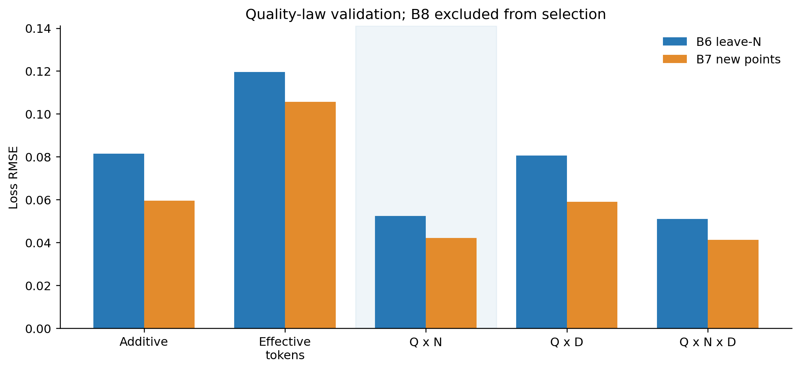

### 4.3 预算配置与边界剖面

在指数质量成本、$Q_0=0.6$、$L_{\mathrm{ctx}}=4096$ 下，三个预算档位的单情景配置如下。$N,D$ 单位均为十亿。

| 预算 FLOPs | 证据边界 | $N$ | $D$ | $Q_B$ | 条件 Loss | 预算使用率 |
|---:|---|---:|---:|---:|---:|---:|
| $10^{19}$ | E0/E1/E2 | 0.311 | 3.956 | 0.724 | 3.1804 | 100% |
| $10^{22}$ | E0/E1/E2 | 5.433 | 245.59 | 1 | 2.1547 | 100% |
| $10^{24}$ | E0：观测域 | 11.966 | 299.89 | 1 | 2.0934 | 2.56% |
| $10^{24}$ | E1：三倍上界 | 35.897 | 899.68 | 1 | 1.9794 | 22.35% |
| $10^{24}$ | E2：自由外推 | 39.562 | 3657.0 | 1 | 1.9160 | 100% |

高预算下，E0/E1 的规模与数据上界均被激活。三倍上界是敏感性设定；将上界扩为五倍、十倍时，条件 Loss 分别约为 1.938 和 1.916。按相同中心参数定位，指数质量成本的起投与饱和预算为 $3.7024\times10^{18}$、$1.3770\times10^{20}$ FLOPs；幂成本为 $1.2912\times10^{19}$、$7.2150\times10^{19}$；对数渐进成本在 $2.0036\times10^{18}$ 处出现边界切换。训练项与注意力项相等时，题设参数给出 $L_{\mathrm{ctx}}^{\mathrm{crit}}=30{,}000$ Token。

在共同可行域内，$10^{24}$ FLOPs、三倍上界的 minimax 政策对共同 free oracle 的留出平均后悔为 0.053511；同上限内各情景共享边界角点。$10^{19}$ 与 $10^{22}$ 档位的共同可行名义政策和 minimax 政策在留出后悔上接近，显示本组情景下风险准则的选择影响较小。数值求解的自由解 KKT 相对误差处于 $10^{-8}$ 量级；高预算配置的主要变动来自外推边界。

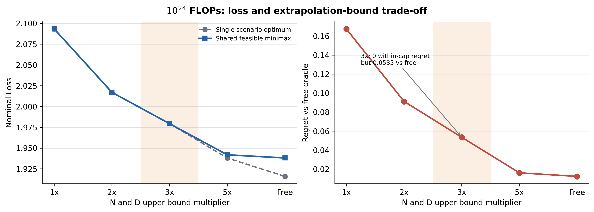

### 4.4 开放模型能力与条件情景

严格开放权重口径得到 45 个独立模型。C8 逐任务汇总与六基准等权指数的 Spearman 相关为 0.9527，支持该指数作为本题的汇总表征。C6 单调有界桥接在家族分组验证中的 RMSE 为 11.864 分；其映射用于情景连接时保留这一误差尺度。

严格季度前沿的样本数依次为 22、16、5、2，对应 $p_{95}$ 为 33.02、38.12、32.38、30.22 分。预设季度解释门槛为 $n\geq5$，故最近一季只列描述值。32 个基础发布的家族/组织分组检验中，仅算力历史模型 RMSE 为 7.052，算力加时间模型为 7.103；历史预测对照据此采用前者。算力加时间结构模型的分解结果可作为模型内反事实量，不作为观测前沿的贡献份额。

以 2025-01-31 为冻结原点，三种算力增长率与三种时间项形成每个期限九条情景。12 个月情景中位数包络为 $[33.47,50.81]$ 分，24 个月为 $[36.88,71.13]$ 分。该区间是情景集合的取值范围；对应期限的直接能力回测仍待同口径数据。由于 12 个月目标日 2026-01-31 已在本稿日期之前，本文保留原点仅用于复核既有情景，不将其表述为当前日期之后的预测。

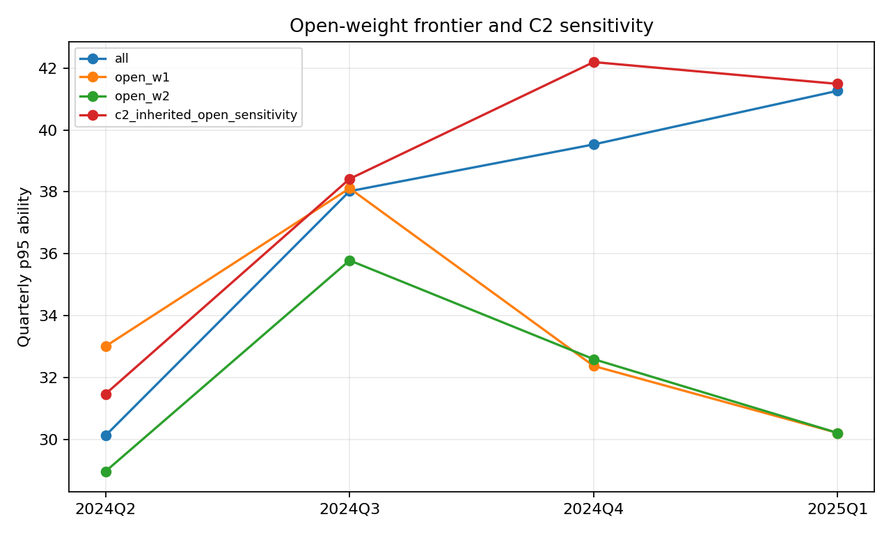

## 5 质量信号规则与样本核验

本节保存质量代理构造的逐项规则、领域统计和冲突阈值核查。相关表格来自问题一已有数据审计；它们用于复核代理定义，不充当人工质量标签。

### 数据审计和预处理

A1、A2、A3 分别有 **51,230、17,523、203,752** 条。A1 涵盖七个质量域，A2/A3 扩展 arxiv/github。A1 与 A2 的重合 ID 有 **1,419** 个，与 A3 的重合 ID 有 **10,000** 个；分源评分时保留全量，跨文件汇总时必须去重。A4–A15 的 12 个 CSV 均无缺失单元或重复 `index`；配比行和与 1 的最大偏差约 0.004，属于舍入误差，入模前逐行归一。详见 [data_audit.csv](outputs/tables/data_audit.csv)。

质量文件以 `.jsonl.xz` 流式逐行读取。`ad_en`、`fluency_en` 的二分类 logits 用正向类 softmax 概率压缩；ModernBERT 的 0–5 级 logits 用 softmax 期望除以 5；`fineweb_edu` 取单元素；`qurater` 的四维按官方顺序等权平均。这些列表含义来自[数据集官方说明](https://huggingface.co/datasets/opendatalab/SlimPajama-Meta-rater/blob/main/README.md)。各字段采用 A1 固定参考分位点缩放，A2/A3 沿用同一标尺。长尾计数字段先作带符号的 `log1p`，极值按 A1 1%/99% 截尾；长度等“适中最好”字段用 1%/20%/80%/99% 梯形效用。缺失值以 A1 参考中位数补齐并记录。所有最终 $z_k$ 均在 $[0,1]$，**越高代表该字段定义下越好**。启发式方向见 [assumptions.md](assumptions.md)。

### 22 项规则表

| 字段 | 类型 | 压缩 | 原始方向/效用 | 统一缩放 | 缺失数 |
|---|---|---|---|---|---|
| fineweb_edu | list | 单元素取值 | 越高越好 | A1固定1%-99%截尾MinMax | 0 |
| fluency_en | list | 两类 logits 中正向类概率 | 越高越好 | A1固定1%-99%截尾MinMax | 0 |
| modernbert_cleanliness | list | 六级 logits 的 softmax 期望/5 | 越高越好 | A1固定1%-99%截尾MinMax | 0 |
| modernbert_readability | list | 六级 logits 的 softmax 期望/5 | 越高越好 | A1固定1%-99%截尾MinMax | 0 |
| modernbert_reasoning | list | 六级 logits 的 softmax 期望/5 | 越高越好 | A1固定1%-99%截尾MinMax | 13 |
| modernbert_professionalism | list | 六级 logits 的 softmax 期望/5 | 越高越好 | A1固定1%-99%截尾MinMax | 6 |
| dsir_books | number | 原始标量 | 越高越好 | A1固定1%-99%截尾MinMax | 0 |
| dsir_wiki | number | 原始标量 | 越高越好 | A1固定1%-99%截尾MinMax | 0 |
| dsir_math | number | 原始标量 | 越高越好 | A1固定1%-99%截尾MinMax | 0 |
| qurater | list | 四个 QuRating 维度均值 | 越高越好 | A1固定1%-99%截尾MinMax | 0 |
| ad_en | list | 两类 logits 中正向类概率 | 越高越好 | A1固定1%-99%截尾MinMax | 0 |
| rps_doc_word_count | number | 原始标量 | 适中最好；经验梯形效用 | A1固定分位点梯形效用 | 0 |
| rps_doc_num_sentences | number | 原始标量 | 适中最好；经验梯形效用 | A1固定分位点梯形效用 | 0 |
| rps_doc_unigram_entropy | number | 原始标量 | 越高越好 | A1固定1%-99%截尾MinMax | 0 |
| rps_doc_frac_unique_words | number | 原始标量 | 越高越好 | A1固定1%-99%截尾MinMax | 0 |
| rps_doc_frac_no_alph_words | number | 原始标量 | 越低越好 | A1固定1%-99%截尾MinMax | 0 |
| rps_doc_frac_chars_top_2gram | number | 原始标量 | 越低越好 | A1固定1%-99%截尾MinMax | 0 |
| rps_doc_frac_chars_top_3gram | number | 原始标量 | 越低越好 | A1固定1%-99%截尾MinMax | 0 |
| rps_lines_uppercase_letter_fraction | number | 原始标量 | 适中最好；经验梯形效用 | A1固定分位点梯形效用 | 0 |
| rps_lines_ending_with_terminal_punctution_mark | number | 原始标量 | 越高越好 | A1固定1%-99%截尾MinMax | 0 |
| rps_lines_numerical_chars_fraction | number | 原始标量 | 适中最好；经验梯形效用 | A1固定分位点梯形效用 | 0 |
| rps_doc_mean_word_length | number | 原始标量 | 适中最好；经验梯形效用 | A1固定分位点梯形效用 | 0 |

### 数据质量评价模型

令 $z_{jk}$ 表示第 $j$ 个样本经固定标尺处理后的指标。先把高度相关的 `dsir_books`、`dsir_wiki`、`dsir_math` 合成一个子项；该三者的 Spearman 相关可达约 **0.999**，相关矩阵条件数约 **936.4** 的单指标 VIF 量级。教育、可读性、洁净度、文本结构四组的组内子项等权，组间等权：

$$Q_j=\frac14\sum_{g=1}^4 S_{jg},\quad S_{j,educational}=\frac15\left(z_{fineweb}+z_{reasoning}+z_{professionalism}+z_{qurater}+\frac{z_{dsir\_books}+z_{dsir\_wiki}+z_{dsir\_math}}{3}\right).$$

其余组的 $S_{jg}$ 为组内指标均值。与此比较的增强候选为 [CRITIC 原始方法](https://doi.org/10.1016/0305-0548(94)00059-H) 的离散度/相关性权重，以及四组得分去掉最高、最低后的鲁棒聚合。PCA 仅作结构分析，不把主成分自动解释为“质量”。A1 中第一、二主成分解释方差分别为 **31.5%**、**18.7%**；需要多于一个轴才可描述主要差异。相关矩阵、层次聚类和 VIF 进一步证明直接逐字段等权会重复计数。

| 方法 | A1 域排名与基线 Spearman | 样本分数平均绝对差 |
|---|---|---|
| Q_baseline | 1.000 | 0.0000 |
| Q_critic | 0.929 | 0.0279 |
| Q_robust | 0.964 | 0.0323 |
| Q_penalty | 1.000 | 0.0368 |
| Q_hard | 0.964 | 0.0097 |

CRITIC 与鲁棒方案提供有价值的敏感性对照，但在缺乏独立人工真值的条件下，没有足够依据说明更复杂权重更“正确”。主分析保留透明的 **四组等权 $Q$**。四组权重的 Dirichlet 扰动排名见 [quality_weight_sensitivity.csv](outputs/tables/quality_weight_sensitivity.csv)：arxiv 在 500 次扰动中位于前三的频率为 **1.000**，github 为 **0.000**。这说明指定权重邻域内的排序稳定，不构成外部质量真值验证。

### 领域级 $Q$ 与不确定性

领域级主统计量取样本 $Q$ 的均值，并同时输出中位数、10% 截尾均值和 Winsorized 均值。95% 区间由每个域**按实际样本量重抽样 200 次**的非参数 bootstrap 给出，属于给定评分规则后的抽样区间，不涵盖指标定义误差。A1 的均值与中位数域排名 Spearman 为 **1.000**。

| A1 域 | 样本数 | 平均 Q | 95% bootstrap CI | 排名 |
|---|---|---|---|---|
| arxiv | 1419 | 0.7647 | [0.7627, 0.7669] | 1 |
| commoncrawl | 9640 | 0.7092 | [0.7078, 0.7106] | 2 |
| stackexchange | 10000 | 0.6959 | [0.6945, 0.6974] | 3 |
| c4 | 10000 | 0.6894 | [0.6877, 0.6911] | 4 |
| wikipedia | 10000 | 0.6477 | [0.6462, 0.6495] | 5 |
| book | 171 | 0.6201 | [0.6082, 0.6310] | 6 |
| github | 10000 | 0.5750 | [0.5736, 0.5766] | 7 |

A2/A3 使用同一标尺；为避免把 A1 子样本重复当成独立证据，下表的扩展均值只用 **不在 A1 中的 ID**：

| 域 | A1 n | 扩展中非重合 n | A1 Q | 非重合 Q | 差值 |
|---|---|---|---|---|---|
| arxiv | 1419 | 16104 | 0.7647 | 0.7616 | -0.0031 |
| github | 10000 | 193752 | 0.5750 | 0.5741 | -0.0009 |

**解释边界：** 例如 arxiv 的 $Q$ 较高，github 较低，是当前文本质量定义和统一阈值下的结果；代码语料和学术文本所需质量维度不同，不能把该排名等同于“训练价值”的绝对排序。

### 质量冲突的定义、实证和消解

离散冲突定义为：一维正向特征高于 A1 的 75% 分位，同时另一正向特征低于 25% 分位。事先指定三类：高 FineWeb 教育性与低无广告概率，高流畅度与低 ModernBERT 洁净度，高教育组得分与低可读性组得分。连续强度定义为 $I_j=\max_g S_{jg}-\min_g S_{jg}$；两者在不同层面反映冲突。

| A1 域 | n | 任一冲突率 % | 平均连续强度 |
|---|---|---|---|
| arxiv | 1419 | 5.07 | 0.2574 |
| book | 171 | 8.19 | 0.5384 |
| c4 | 10000 | 7.79 | 0.4669 |
| commoncrawl | 9640 | 11.65 | 0.3724 |
| github | 10000 | 11.87 | 0.3676 |
| stackexchange | 10000 | 5.40 | 0.2653 |
| wikipedia | 10000 | 2.94 | 0.3831 |

A1 全体任一冲突率为 **7.83%**。阈值改为 20%/80%、25%/75%、30%/70% 时分别为 **3.93%, 7.83%, 13.62%**，因此“有无冲突”会随阈值改变，不能给出脱离定义的唯一冲突率。A2 的 arxiv 冲突率为 **5.72%**，A3 的 github 为 **11.15%**；与 A1 同域模式相近。完整类型占比见 [conflict_summary.csv](outputs/tables/conflict_summary.csv)。

比较两种消解：$Q_j^{pen}=[Q_j-0.1I_j]_{[0,1]}$；若无广告概率低于 A1 第 10 分位，则 $Q_j^{hard}=0.85Q_j$，否则为 $Q_j$。强度惩罚使 A1 平均 $Q$ 降低 **0.0368**，域排名与原模型的 Spearman 为 **1.000**。由于缺少独立人工标注，不能证明惩罚后的质量分优于原分，故**主 $Q$ 保持未惩罚版本**，将冲突标记和强度单列供数据筛选。`manual_review_candidates.csv` 提供高低分与冲突样本的文本摘要供团队盲评；目前的浏览式检查不能替代正式人工验证。

### 质量代理的补充图

以下图像分别展示领域质量区间、扩展样本去重后的分布核查、冲突率和指标相关结构。图中的质量分仍是固定规则下的代理量。

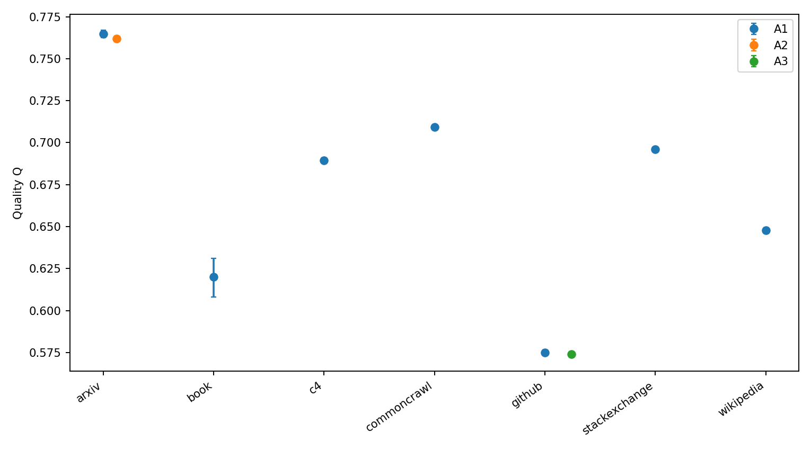

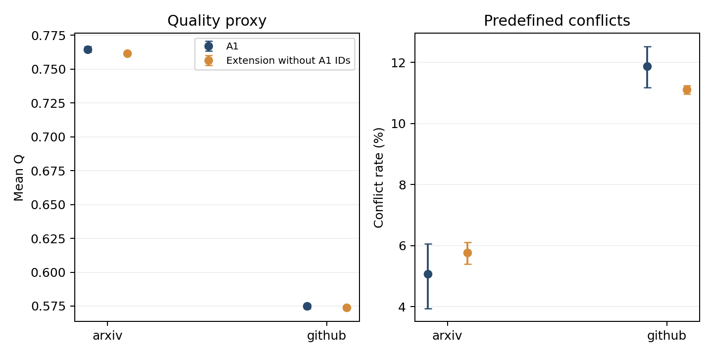

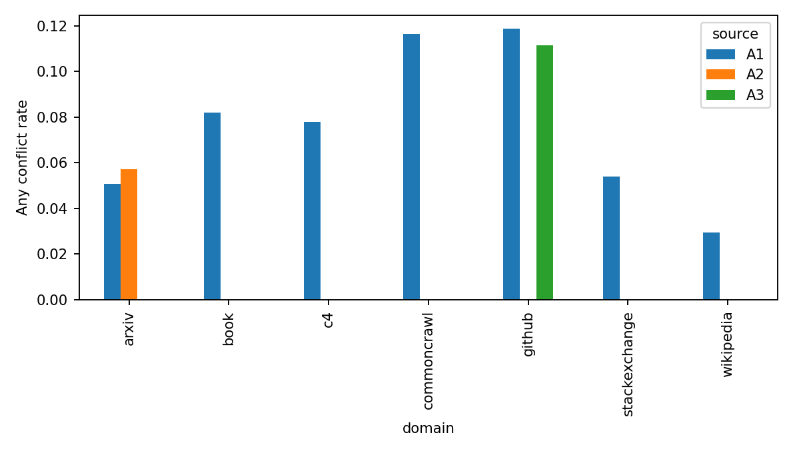

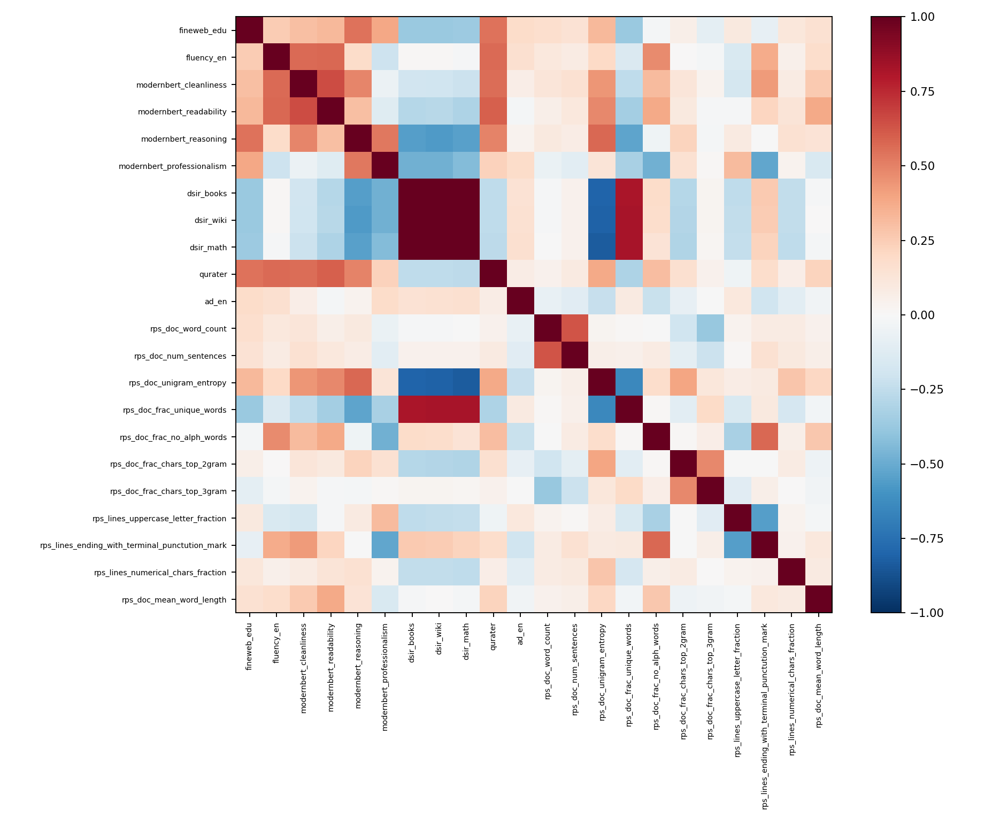

## 6 配比回归的模型选择与尺度检验

本节使用选定链的 ALR 多任务 ElasticNet 结果。外部规模评价均为既定测试集的回顾性比较。

### 模型与统一验证协议

对 17 域配比 (p_1,\ldots,p_{17})，令 (r\) 为 `pile_cc`，零替换 (\epsilon=0.000249500998003992)。ALR 坐标为

\[
x_i=\log\frac{p_i+\epsilon}{p_r+\epsilon},\quad i\ne r.
\]

二阶特征 \(\phi(x)\) 包含 16 个一次项、16 个平方项及 120 个两两交互项。选中候选将每个特征按训练折标准化，再拟合 13 响应的 MultiTask ElasticNet：

\[
\min_{B,b}\;\frac{1}{2n}\lVert Y-\mathbf 1b^\top-\Phi B\rVert_F^2
+\alpha\rho\lVert B\rVert_{2,1}
+\frac{\alpha(1-\rho)}{2}\lVert B\rVert_F^2,
\quad \alpha=0.01,\;\rho=0.7.
\]

此处 \(\lVert B\rVert_{2,1}\) 使一项二阶特征在 13 个输出上联合收缩，不意味着交互具有因果意义。全训练共有 136/152 个特征激活。

同一外层 `KFold(5, shuffle=True, random_state=20260924)`；每折训练内用 3 折选择候选超参。V2 外折规格取冻结的该折训练内结果；ElasticNet 和 PLS 的 ALR 参考域也取相应外折训练内选择，避免全训练参考域泄漏。最终模型在全部 A4/A5 上按 2×5 折重复 CV 选择后重拟合。所有标准化、样条结点和零替换用训练折信息计算。A6/A7、60M、1B 标签没有用于超参选择或拟合。

### 配比模型的统一比较

主指标为 A6/A7 1M 的 13 响应 pooled RMSE；训练内嵌套 OOF、60M/1B RMSE、MAE、排序、局部效应与重抽样为次指标。`problem1_model_tournament.csv` 保存全部字段。

| 模型 | 嵌套 OOF | A6/A7 1M | 60M | 1B | 判定 |
|---|---:|---:|---:|---:|---|
| 冻结 V2 二阶 ALR Ridge | 0.334010 | 0.270179 | 1.595903 | 2.702111 | 冻结比较基线 |
| 二阶 ALR MultiTask ElasticNet | **0.318377** | **0.254346** | 1.592424 | **2.688705** | 通过已登记的总体门槛 |
| 二阶 ILR Ridge | 0.351029 | 0.282204 | 1.594570 | 2.656762 | 1M 主指标 RMSE 升高 |
| 二阶 ALR PLS | 0.542107 | 0.480686 | 1.628226 | 3.156230 | RMSE 较高 |
| CLR 加性样条 Ridge | **0.252219** | **0.208173** | **1.561406** | 2.735706 | 1M 专用候选；1B 总体 RMSE 升高 |

ElasticNet 对 V2 的配对配方行 bootstrap：嵌套 OOF 的 RMSE 改善 **+0.015632 [0.012255, 0.019270]**；1M **+0.015834 [0.010465, 0.021037]**；60M **+0.003479 [−0.001769, 0.008716]**；1B **+0.013406 [0.007823, 0.018795]**。五个外折的 OOF RMSE 全部改善。1M 的 12/13 域 RMSE 改善，13 域平均 Spearman 从 0.945224 到 0.949352；1B 的配方平均 Loss 排序 Spearman 从 0.566667 到 0.657738，配对增益区间 [+0.040871, +0.158657]。

**1B 的逐域权衡不可忽略。** 13 个验证输出中，有 8 个 RMSE 改善，5 个 RMSE 升高；其中以下 4 个 RMSE 升高的回顾性配对区间不跨零：

| 验证域 | V2 RMSE | ElasticNet RMSE | 相对恶化 |
|---|---:|---:|---:|
| `arxiv` | 2.164819 | 2.188393 | +1.09% |
| `freelaw` | 2.647592 | 2.666397 | +0.71% |
| `pubmed_central` | 2.361867 | 2.382771 | +0.89% |
| `github` | 3.278836 | 3.319268 | +1.23% |

原先登记的替换门槛约束**总体** 60M/1B 非劣和排名、1M 主指标、嵌套 OOF、1pp 方向；ElasticNet 全部通过。因此其为已登记规则下的跨问胜出候选。若最终论文或应用把“任何验证域均不得损害”设为更强 Condition B，则该候选不能宣称全维优越，也应继续保留 V2 作为保守接口。不能事后把此逐域发现藏入 pooled 指标。

### 局部置换、Q 敏感性及证据边界

在训练配比均值处固定从 `pile_cc` 转移 1 个百分点到另一域，共 16 个局部方向。ElasticNet 的方向与 V2 在 15/16 个方向一致；唯一不一致是 `pubmed_abstracts` 的极小效应，V2 约 −0.000029，新模型约 +0.000164。对固定规格做 40 次训练行 bootstrap，仅 9/16 方向达到 ≥90% 同号率。这些量是局部预测关联，不能当作真实再训练收益。

Q 的四组等权代理没有人工评分真值。现有 140 条盲评模板仍是空白；`manual_validation_results.csv` 为 0 行。使用 A1 的 51,230 条样本、7 个来源域做无监督敏感性：PCA 一因子得分的域均值排序与原 Q Spearman 为 0.25，熵权为 0.9286，组等权秩聚合为 0.8929；单因子 FA 未收敛，不能作为可靠得分。这些相关仅衡量定义变化造成的排名变化，不是质量有效性检验。因此继续保留四组等权 Q，不估计或宣称新权重更优。

ElasticNet 在 60M 和 1B 的绝对 Loss 平均偏差仍为 **+1.502982** 与 **+2.612864**。它没有学习规模响应；P2/P3 若采用其配比差分，必须继续将 \(\lambda_p\) 和尺度转移作为情景。10B/70B 的估算标签差值均约 −0.005 RMSE，且不是实测，不能推翻或支持跨规模胜出。新的独立配方与多规模训练实验仍是最终确认的关键证据。

### 配比模型补充图

配对改善图与逐域图对应主文的总体指标和域级权衡。局部置换图只表示既有配方支持域内的预测关联。

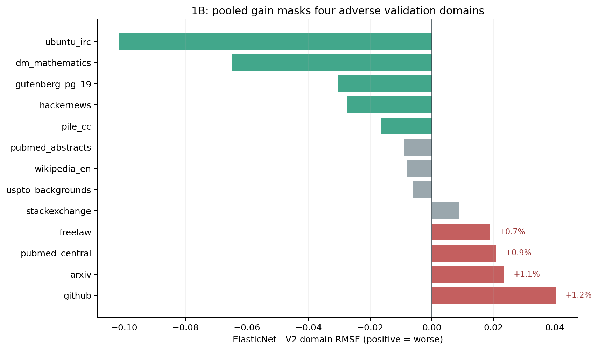

## 7 标度数据审计与来源检验

本节记录 B 组数据结构和公式推导。较早技术记录中的问题一旧配比模型描述仅作研发背景；正文的配比接口以选定链为准。

### 问题二数据说明

编号来自 `数据说明2.pdf`；行数、范围和字段由 `problem2/outputs/tables/data_audit_b.csv` 与原始文件核对。B3 是目录中 8 个轨迹文件，合计 4,000 行。B11/B12 是辅助元数据，不是新增 Loss 实验。

| 编号 | 文件（均在 `real_attachments/B_scaling_laws/`） | 性质与行数 | 关键字段、范围 | 本项目用途 |
|---|---|---:|---|---|
| B1 | `pythia_training_log_existing.csv` | 真实 Pythia 轨迹，1,176 | `run_id,N_params_B,D_tokens_B,val_loss`；8 个参数规模；$N=0.070542$–$11.965825$、$D=0.134$–$299.893$、Loss $2.0933$–$4.7388$ | 唯一经典 N–D 主拟合；按模型规模分组检验 |
| B2 | `cerebras_training_log.csv` | 半合成 Cerebras 轨迹，1,029 | $N=0.111$–13，$D=14$–2,050，Loss $2.8354$–$6.4979$ | 族外 raw 偏移和校准研究 |
| B3 | `training_trajectories/pythia_*_trajectory.csv` | 8×500 插值点 | `N_params_B,D_tokens_B,val_loss,step,interpolated` | 同族曲线插值核查，非独立真实验证 |
| B4 | `scaling_baseline.csv` | 跨模型族汇总，57 | `family,N_params_B,D_tokens_B,val_loss,is_converged`；$N=0.07$–72 | 跨族 raw 比较；Loss 口径未证实一致 |
| B5 | `published_scaling_data.csv` | 文献尺度汇总，44 | `family,N_params_B,D_tokens_B,val_loss,source,is_converged`；$N=0.125$–540 | 文献尺度 raw 比较；Loss 口径未证实一致 |
| B6 | `supplementary_NQ_experiment.csv` | 半合成 N–D–Q，360 | `N_params_B,D_tokens_B,Q_score,val_loss`；$Q=0.1$–1 | Q 候选的唯一拟合集 |
| B7 | `supplementary_NQ_experiment_expanded.csv` | 半合成扩展，450 | 同 B6；含 B6 全部 360 个键 | 去重后的 90 个新点作开发验证 |
| B8 | `supplementary_NQ_experiment_large.csv` | 半合成大网格，1,704 | 另有 `data_type`；$N=0.07$–700，$D=5$–2,000，$Q=0.05$–1，Loss 下界 0.5 | 对 B7 去重后 1,480 点作机制诊断；不得用于 Q 参数拟合 |
| B9 | `supplementary_large_models.csv` | 大模型元数据，132 | `model_name,N_params_B,D_tokens_B,FLOPs,...`；$N=100$–10,000 | 与 B10 按名字、$N,D$ 关联；非 Loss 标签 |
| B10 | `supplementary_large_baseline.csv` | **估算** Loss，128 | `family,N_params_B,D_tokens_B,val_loss`；$N=100$–10,000 | 100B+ 诊断性外推；不是实测验证 |
| B11 | `open_model_family_metadata.csv` | 模型来源/文件元数据，18 | `family,model_repo,...,error` | 辅助来源清点；未入主模型 |
| B12 | `pythia_checkpoint_index.csv` | Pythia 检查点索引，1,386 | `model_repo,model_size,step,branch,commit` | 辅助核对检查点；未作为拟合标签 |

B1 的 1,176 行属于同一 Pythia family 的多个时间检查点，不是 1,176 次相互独立训练。B2 的“Cerebras”名称不改变其附件中的半合成性质。B6–B8 是按真实规律校准的补充机制表，能检验本题公式在该机制下能否重现数据，不能推出真实世界质量改善的因果效应。B9 比 B10 多 4 行，实际外推代码通过一对一关联保留 128 个 B10 对应条目。

### 数据审计和预处理

项目不存在单独的 `data_audit_b.py`：审计实现于 `problem2/run_problem2.py:audit`。它遍历 B 文件，记录行数、列名、单元格缺失、整行重复、同 $(N,D)$ 的重复、同 `run_id,steps` 检查点重复、来源类别以及 $N,D,L,Q$ 范围，输出 `data_audit_b.csv`。B2 有 3,087 个缺失单元格，核心 $N,D,\text{val_loss}$ 仍可用于验证；B1 的核心字段无缺失、无整行重复。B6 的同 $N,D$ 重复 315 次是设计上的多质量档，不是应删除的脏数据。

`quality_dataset_overlap.csv` 显示 B6/B7 同键 360 点，B7/B8 同键 224 点，B6/B8 同键 160 点。V1/V2 均用 $(N,D,Q)$ 键从 B7 中剔除 B6 旧点，从 B8 中剔除 B7 旧点，得到 B7_new=90、B8_new=1,480。注意 B6/B8 的 160 个同键点虽然没有被当作新的验证样本，却被 V2 特意做**同点冲突诊断**。V2 的 `run_v2.py:diagnostics` 还输出残差、单调性、B1 小数精度与参数 profile。单位直接使用原始列中的 B，不另做 log 参数化；幂项在 V1 的 `classic` 中通过 `exp(-a*log(N))` 计算以保持数值稳定。

### 第一阶段：经典 N–D Scaling Law

### 模型、估计与代码

经典式 $L_{ND}=E+AN^{-\alpha}+BD^{-\beta}$ 与 Chinchilla 一类加性幂律模型一致，允许分别识别参数与 token 的边际衰减。V1 `run_problem2.py:fit_classic` 对 B1 做 SciPy `least_squares`，直接估计正参数，界为 $E\in[0,4]$、$A,B\in[10^{-5},100]$、$\alpha,\beta\in[0.005,2]$；四组初值择残差平方和最小者。它**不是**“对全部参数取对数再优化”。V2 `models.py:fit_nd` 用同样有界残差拟合候选，并保存 `nd_fit_comparison.csv`。V1 `classical_scaling_params.csv` 的多初值最大差均约 $10^{-11}$，说明同一 B1 目标上的数值收敛稳定。

### 实际参数与含义

`problem2/outputs/tables/classical_scaling_params.csv` 与 V2 `nd_fit_comparison.csv` 一致：

$$E=1.689797563,\quad A=0.353980321,\quad\alpha=0.339976582,\quad B=1.240305584,\quad\beta=0.279878129.$$

$$\boxed{L_{ND}=1.689797563+0.353980321N^{-0.339976582}+1.240305584D^{-0.279878129}.}$$

$N$ 增加一倍时，参数损失项乘 $2^{-0.339977}\approx0.790$；$D$ 增加一倍时，数据损失项乘 $2^{-0.279878}\approx0.824$。这说的是**对应损失分量**而非总 Loss 同比例下降；总 Loss 中还有 $E$ 和其余项。系数的物理尺度依赖 B 单位和同一评测 Loss 口径。

### 为什么不用随机划分验证

B1 是同一 run 多检查点轨迹，随机拆行会让训练集直接看到验证点前后的同轨迹点，误差过于乐观。V1 `run_problem2.py:classical` 按 8 个 `N_params_B` 留一整组，逐次在其余 7 组拟合，并与训练均值 M0 比较，结果存于 `classical_scaling_cv.csv`。V2 `run_v2.py:nd_experiments` 对全部 N–D 候选重复留 N 分组；还取最小若干 $N$ 训练预测更大 $N$，以及每一规模的早期 $D$ 训练预测后期 $D$，详见 `nd_group_cv.csv`、`nd_scale_extrapolation.csv`。B1 classic 分组汇总 RMSE **0.00015118**，小到大 $N$ 截断汇总 RMSE **0.00014298**。留模型能防止直接检查点泄漏，仍只检验 Pythia 同族规律，不代表全新模型族的泛化误差。

### 外部验证

下表来自 `problem2/outputs/tables/external_validation_metrics.csv`，bias 统一定义为预测减观测。B2/B4/B5 在 V2 多候选研究中已被查看，应称“开发性跨源比较”，不再称全新封存测试。

| 数据 | n | RMSE | MAE | Bias | Spearman | 解释 |
|---|---:|---:|---:|---:|---:|---|
| B2 raw | 1,029 | 1.243085 | 1.178442 | −1.178442 | 0.788102 | 半合成族外轨迹，绝对水平显著偏低估 |
| B3 插值 | 4,000 | 0.003821 | 0.002893 | −0.001968 | 0.999990 | 同族插值，形状核查，不独立 |
| B4 raw | 57 | 0.292667 | 0.227263 | −0.221009 | 0.982982 | 跨族排序较好，绝对口径仍偏 |
| B5 raw | 44 | 0.197595 | 0.170722 | −0.020570 | 0.958808 | 文献尺度排序较好，评测口径未统一 |

B2 逐 run 见 `b2_by_model_metrics.csv`，V2 `diagnostics/b2_raw_residuals.csv` 与 `source_residual_trends.csv` 显示观测减预测同 $\log D$ 强相关，相关系数约 **−0.977**，故不只是固定截距。B4/B5 的 Spearman 高说明排序趋势仍可用；RMSE 和 bias 不应被排名指标遮蔽。V1 报告中的 B4/B5 **全量数据上事后截距校准**只是描述性数值，不能充当独立验证。

### 第一版 Q 模型

V1 `run_problem2.py:fit_quality` 固定 B1 的 5 个 N–D 参数，在 B6 单独估计 $G,\kappa$；`quality` 函数比较 additive、指数有效 token、幂有效 token 的两阶段/联合方式，按 B6 BIC 和复杂度选中 additive/two_stage。`generalized_scaling.py:predict_ndq` 实现

$$L_A=L_{ND}+G_A(1-Q_B)^{\kappa_A}+\lambda_p\Delta_p(\mathbf p),\quad G_A=0.362175024,\ \kappa_A=0.990735089.$$

$Q_B$ 升高使 $1-Q_B$ 下降、惩罚缩小；$Q_B=1$ 时退化为经典律。B6 RMSE **0.076068**、BIC **−1843.037**；B7_new RMSE **0.059515**；B8_new RMSE **1.392571**，明确未达到预设条件。V1 参数与序列化模型在 `quality_scaling_params.csv`、`outputs/models/final_generalized_scaling.joblib`。它是后续比较的 Model A，不再是当前最终推荐 Q 结构。

### Q 候选模型比较

V2 真正的实现位于 `problem2_v2/models.py:predict_q,fit_q`；5 个 N–D 参数固定为 B1 拟合，所有 Q 候选**只在 B6**用有界非线性最小二乘拟合。下式的 $L_{ND}$ 均为第 6 节经典项。

| 代码名 | 实际公式 | 新增参数 |
|---|---|---:|
| `additive` | $L_{ND}+G(1-Q)^\kappa$ | 2 |
| `effective_power` | $E+AN^{-\alpha}+B(DQ^\gamma)^{-\beta}$ | 1 |
| `effective_exp` | $E+AN^{-\alpha}+B[De^{\gamma(Q-1)}]^{-\beta}$ | 1 |
| `saturating` | $L_{ND}+G\{e^{-tQ}-e^{-t}\}/(1-e^{-t})$；$t\to0$ 时取 $G(1-Q)$ | 2 |
| `quality_data`（Q×D） | $L_{ND}+G(1-Q)^\kappa(D/100)^{-\eta_D}$ | 3 |
| `quality_model`（Q×N） | $L_{ND}+G(1-Q)^\kappa N^{-\eta_N}$ | 3 |

有效 token 模型让较低 Q 缩小有效 $D$；Q×D/Q×N 则让质量惩罚幅度随数据量或规模变化。结果出自 `quality_model_scorecard.csv`，B7/B8 均为前述去重新点；BIC 是**B6 质量拟合**的指标，不能与 B1 的 BIC 相加。

| 模型 | 参数数 | B6 RMSE | B6 留 $N$ RMSE | B7_new RMSE | B8_new RMSE | BIC |
|---|---:|---:|---:|---:|---:|---:|
| additive | 2 | 0.076068 | 0.081440 | 0.059515 | 1.392571 | −1843.04 |
| effective_power | 1 | 0.116973 | 0.119565 | 0.105570 | 1.402068 | −1539.10 |
| effective_exp | 1 | 0.102931 | 0.106377 | 0.079602 | 1.384888 | −1631.17 |
| saturating | 2 | 0.076070 | 0.081405 | 0.059521 | 1.392598 | −1843.02 |
| quality_data | 3 | 0.075085 | 0.080596 | 0.058900 | 1.393510 | −1846.52 |
| **quality_model** | **3** | **0.051804** | **0.052346** | **0.042127** | **1.341755** | **−2113.75** |

`quality_fit_comparison.csv` 给每种参数和条件数；饱和模型的 $t\approx3.5\times10^{-10}$、Jacobian 条件数为无穷，事实上退化为加性直线，不能声称发现明确饱和。Q×D 的 $\eta_D=0.041233$，改善较小。

### 为什么最终从 Additive 优化为 Q×N

V2 预设选择逻辑在 `run_v2.py:report`：候选相对 additive 的 B7_new RMSE 至少改善 5%，B8 误差不变差，B6 BIC 至少下降 6；B8 只作为冲突排查，不能凭其较低误差选型。Q×N 达到门槛，参数来自 `quality_fit_comparison.csv`：

$$G_C=0.3568073634,\quad\kappa_C=0.9915434612,\quad\eta_N=0.1620729235.$$

它让 B6 留 $N$ RMSE 从 **0.081440→0.052346**，B7_new 从 **0.059515→0.042127**（改善约 29.2%），BIC 从 **−1843.04→−2113.75**，B8_new 仅从 **1.392571→1.341755**，仍极差。200 次按 B6 的 $N$ 组重采样得到 $\eta_N$ 的 95% 分位区间 **[0.148572,0.200805]**，`quality_model_intervals.csv` 可查。这支持“在 B6 半合成机制下，质量惩罚与模型规模关联”，不能写成真实训练中质量收益的因果律。

### B8 为什么仍然未达到预设条件

V2 `diagnostics/b6_b8_exact_overlap_conflicts.csv` 有 **160 个完全相同的 $(N,D,Q)$**，但 Loss 不同，B8 减 B6 的均值为 **−1.15361**；$Q=1$ 时约 −0.0125，$Q=0.1$ 时约 −2.1583，差异并非固定源截距。`quality_monotonicity.csv` 显示在可比较的同 $N,D$ 组内，“$Q$ 越高 Loss 越低”的比例：B6 为 100%，B7 全网格为 100%，B8_new 为 **0%**。B8 反向并有 0.5 的 Loss 下界。V1 对 B8_new 的观测减预测残差均值约 **−1.1517**，`b8_residual_trends.csv` 给残差与 Q 的相关 $r=0.9744$，与 $\log N$ 的相关仅 $r=-0.0126$。这同时表明**模型在 B8 上拟合差**，以及**B6 与 B8 的数据机制/质量语义本身冲突**。任何保持“更高 Q 一定更低 Loss”的单一单调律都不能同时无误解释两者；不能偷偷用 B8 标签重拟合后把它说成独立成功验证。

### N–D 模型第二轮优化

V2 `models.py:predict_nd,fit_nd` 与 `run_v2.py:nd_experiments` 测试 classic、交互项 $H N^{-\alpha}D^{-\beta}$、compute-ratio $E+K(6ND)^{-c}(N/D)^{ct}$、平滑 broken-N $E+AN^{-\alpha}[1+(N/N_c)^2]^{-\delta/2}+BD^{-\beta}$，以及经典律的 Huber、soft-L1、relative、log 残差目标。所有 N–D 参数只用 B1 拟合。

| 候选 | 参数数 | B1 留组 RMSE | 小到大 $N$ RMSE | BIC | B2/B4/B5 raw RMSE |
|---|---:|---:|---:|---:|---|
| classic | 5 | 0.00015118 | 0.00014298 | −20729.31 | 1.24308 / 0.29267 / 0.19760 |
| interaction | 6 | 0.00015232 | 0.00014560 | −20722.62 | 1.24308 / 0.29267 / 0.19760 |
| compute_ratio | 4 | 0.097604 | 0.124717 | −5993.22 | 1.31283 / 0.31712 / 0.18174 |
| broken_N | 7 | 0.00015174 | 0.00012952 | −20720.85 | 1.24308 / 0.29267 / 0.19757 |
| classic_huber | 5 | 0.00015118 | 0.00014298 | −20729.31 | 1.24308 / 0.29267 / 0.19760 |
| classic_soft_l1 | 5 | 0.00015118 | 0.00014298 | −20729.31 | 1.24308 / 0.29267 / 0.19760 |
| classic_relative | 5 | 0.00014935 | 0.00012837 | −20721.05 | 1.24307 / 0.29266 / 0.19760 |
| classic_log | 5 | 0.00015012 | 0.00013370 | −20728.02 | 1.24308 / 0.29266 / 0.19760 |

Broken-N 的 B1 小到大外推有微小改善，但 BIC 较差、跨源几乎没改进，拟合 $\delta=-0.000711$ 接近零，Jacobian 条件数约 $3.12\times10^{10}$，阈值 $N_c$ 弱识别；`broken_threshold_profile.csv` 固定多个阈值时 $\delta$ 仍近零。因此保留 classic 主干。relative/log 改变了训练目标，虽有局部 RMSE 变化，也未稳定解决来源偏移。$C\approx6ND$ 在 compute-ratio 中只是重参数化约束，没有提供新观测。

### 来源偏移与 Source Calibration

B1→B2 的 raw 全量 bias 为 **−1.178442**，N–D 结构换成复杂候选后几乎不变。V2 `run_v2.py:nd_experiments` 把 B2 按每个 `run_id` 的早期 $D$、B4/B5 按 `family` 排序取约 20% 作**目标来源有标签校准集**，其余约 80% 为 holdout；`source_calibration_holdout.csv` 记录 raw、截距、仿射、$\log D$ 修正。截距可解释来源特定的有效 $E$，仿射形式是

$$L_s^{cal}(N,D)=a_s+c_sL_{ND}(N,D),$$

其中 $a_s$ 调整损失起点、$c_s$ 调整该来源的 Loss 尺度。Model B 将仿射形式**预先固定**，不对 Q 或 p 项做同样缩放，因为 B2/B4/B5 没有联合测量可识别它们。

| 来源 | 校准/holdout 行数 | 同一 holdout raw RMSE | 截距 RMSE | 仿射 RMSE | $\log D$ RMSE |
|---|---:|---:|---:|---:|---:|
| B2 | 203 / 826 | 1.033103 | 0.788919 | 0.695515 | 0.367362 |
| B4 | 12 / 45 | 0.248204 | 0.221161 | 0.091646 | 0.161231 |
| B5 | 9 / 35 | 0.188934 | 0.218046 | 0.161882 | 0.189887 |

B2 的 $\log D$ 修正局部更好，但不在 B4/B5 同时占优；其系数也需要该源标签。校准集内部 LOO 自适应选形式在 B5 误选截距，使 holdout **0.218045**，劣于 raw，因此最终 Model B 不是自适应形式选择。Model B 的 B2 仿射参数 $a=-0.240309,c=1.861322$，B4 $a=-0.815261,c=1.484678$，B5 $a=-0.716658,c=1.343569$，见 `model_B_source_calibrated.joblib`。全量 raw 的 B2 RMSE 1.243085 与后 80% raw 的 1.033103 **样本不同，不能直接相减当成校准收益**。有目标来源 20% 标签之后的改善不等于零样本泛化成功；多种校准方案已在同一数据上比较，结果属于描述性条件 holdout。

## 8 质量项比较与模型接口

本节以最终复赛表为依据，说明 $N$–$D$ 与 $Q_B$ 子模型的选择、来源标签校准和配比接口。

### N-D 建模与估计

比较 `classic: E+A N^-alpha+B D^-beta`、`interaction: classic+H N^-alpha D^-beta` 和 `broken-N`。仅 B1 的 1176 行用于最小二乘参数估计；按完整 N 组逐一留出，且将较小 N 或早期 D 作为训练集单独测试外推。所有模型对 B2/B4/B5 均不重新拟合，评价是原始零样本预测。

| model | B1_training_rmse | B1_group_cv_rmse | B2_raw_rmse | B4_raw_rmse | B5_raw_rmse | B1_bic | jacobian_condition |
| --- | --- | --- | --- | --- | --- | --- | --- |
| classic | 0.00014650 | 0.00015118 | 1.24308 | 0.29267 | 0.19760 | -20729.31 | 1.14e+03 |
| interaction | 0.00014647 | 0.00015232 | 1.24308 | 0.29267 | 0.19760 | -20722.62 | 1.56e+03 |
| broken_N | 0.00014614 | 0.00015512 | 1.24308 | 0.29267 | 0.19757 | -20720.85 | 3.12e+10 |

交互与 broken-N 的训练误差略低，但 B1 留 N RMSE 从 0.00015118 增至 0.00015232、0.00015512。broken-N 条件数 3.12e+10，在半数较小 N 训练的高 N 测试上明显失稳。故保留 classic；B2/B4/B5 原始 RMSE 1.2431/0.2927/0.1976，外部来源偏移是主要误差，不可用 B1 近乎零的训练误差掩盖。

### Q 建模与复赛

固定重拟合的 classic N-D 参数，在 B6 360 行上分别拟合加性 Q、`D_eff=D Q^gamma`、Q×N、Q×D 与低秩 Q×N×D。B6 按 N 留组；B7 相对 B6 去重后的 90 个输入点评价。B8 的标签没有参与任何正常方向 Q 候选拟合和选择。

| model | B6_training_rmse | B6_leave_N_rmse | B7_new_rmse | B6_bic | jacobian_condition |
| --- | --- | --- | --- | --- | --- |
| additive | 0.07607 | 0.08144 | 0.05952 | -1843.04 | 8.82e+01 |
| effective_tokens | 0.11697 | 0.11957 | 0.10557 | -1539.10 | 1.00e+00 |
| Q_by_N | 0.05180 | 0.05235 | 0.04213 | -2113.75 | 9.99e+01 |
| Q_by_D | 0.07508 | 0.08060 | 0.05890 | -1846.52 | 8.84e+01 |
| Q_by_ND | 0.05036 | 0.05106 | 0.04117 | -2128.20 | 9.99e+01 |

Q×N×D 在 B6 留 N 和 B7 新点分别比 Q×N 改善 2.46% 和 2.28%，但均低于预注册 5% 门槛。按 B7 的 N 组配对自举，RMSE 改善 95% 区间 [-0.00111,0.00262] 覆盖 0。新增 D 指数在 B6 组自举区间 [0.0259,0.0546]，表明可作机制敏感性；组外收益不够稳健，主模型继续采用 Q×N。

### 最终公式与参数

本轮从原始 B1/B6 重新估计的模型为：

$$
L=1.6897975629+0.3539803207N^{-0.3399765819}+1.2403055836D^{-0.2798781285}+0.3568073584(1-Q_B)^{0.9915433891}N^{-0.1620729110}+\lambda_p\Delta_p
$$

N、D 都按十亿计。`Q_B=1` 时 Q 项为零，回到 N-D 律。`Q_B` 的训练机制限于 B6/B7；`Delta_p` 由最终问题一模型预测相对相同参考配方的中心化 Loss 差。预测代码 `predict_final.py` 从 `selection.json` 读取参数，对 N、D、Q 做输入范围检查。

### B2/B4/B5 来源应用与零样本区分

`source_conditional_holdout.csv` 使用每条 B2 轨迹或 B4/B5 家族早期 20% 已知 Loss 拟合来源截距、仿射或 `log D` 残差修正，再评估后期 80%。此协议消耗目标来源标签，不能放入前述零样本分数中，也不能自动把来源修正乘到 Q/p 项。多种形式在本轮均已查看，以下最优形式只是描述性，不宣称全新封存验证：B2=source_logD_20pct, RMSE 0.3674, B4=source_affine_20pct, RMSE 0.0916, B5=source_affine_20pct, RMSE 0.1619。

| source | protocol | calibration_rows | holdout_rows | rmse |
| --- | --- | --- | --- | --- |
| B2 | raw | 203 | 826 | 1.03310 |
| B2 | source_intercept_20pct | 203 | 826 | 0.78892 |
| B2 | source_affine_20pct | 203 | 826 | 0.69552 |
| B2 | source_logD_20pct | 203 | 826 | 0.36736 |
| B4 | raw | 12 | 45 | 0.24820 |
| B4 | source_intercept_20pct | 12 | 45 | 0.22116 |
| B4 | source_affine_20pct | 12 | 45 | 0.09165 |
| B4 | source_logD_20pct | 12 | 45 | 0.16123 |
| B5 | raw | 9 | 35 | 0.18893 |
| B5 | source_intercept_20pct | 9 | 35 | 0.21805 |
| B5 | source_affine_20pct | 9 | 35 | 0.16188 |
| B5 | source_logD_20pct | 9 | 35 | 0.18989 |

完全不使用 B5 标签估计时，从 B2+B4 平均来源偏移迁移到 B5 的 RMSE 为 1.0696，而原始 classic 为 0.1976。来源修正不能作为通用无标签规律。

### B8 机制冲突

B6 与 B8 有 160 个相同 `(N,D,Q_B)` 输入，B8−B6 Loss 平均 -1.15361。在各 `(N,D)` 网格中，Q 增加而 Loss 降低的比例：B6=100%，B7=100%，B8 新点=0%。同点不同标签及相反斜率证明不能把 B8 作为同一确定性质量律的验证通过。B8 包含 `calibrated` 与 `extrapolated` 类型；这些不是独立现实大模型实验。

### 配方桥、质量量表与下游

最终接口采用 `L(N,D,Q_B,p)=L_NDQ+lambda_p Delta_p(p)`。当前 `lambda_p=1` 是定义参考情景，不是根据 B 数据估出的跨规模参数。`lambda_p_scenarios.csv` 的幂衰减、带底值和上下界仅探索敏感性，所有 `identified=false`。B 数据不含联合 `(N,D,Q,p)` 多规模 Loss 标签，所以不能从问题一的单尺度配方响应或其他论文推断 `lambda_p(N)`。尽管 [Ye 等，ICLR 2025](https://proceedings.iclr.cc/paper_files/paper/2025/hash/cc84bfabe6389d8883fc2071c848f62a-Abstract-Conference.html) 研究了数据混合规律，其数据不能代替本题独立锚点。

问题一质量指数 `Q_A` 与 B6/B7 的 `Q_B` 不同，缺乏同一训练样本的成对测量与共同 Loss 锚点。故无法识别 `Q_A→Q_B` 映射，问题三若使用 Q_B 必须明示情景或另取标注。若问题一的最终配方模型发生变化，应重算 `Delta_p`，并顺序重跑问题三与问题四受影响的结果。

### 标度与质量模型补充图

图 8-1 对照来源间的 $N$–$D$ 原始预测差；图 8-2 展示选定质量项随参数规模的条件响应；图 8-3 展示同输入机制诊断。相关数值以附录中的表格为准。

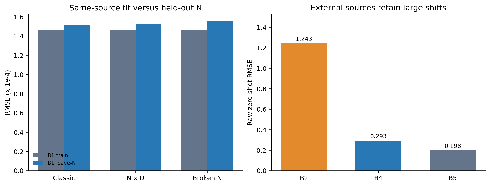

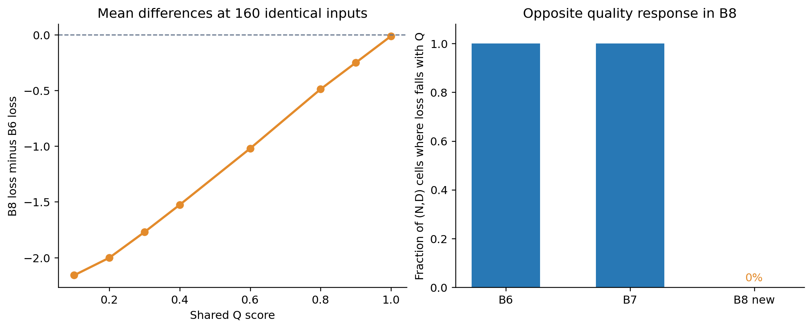

## 9 预算优化的结构点与数值核查

本节列出成本假设、外推边界、共同可行策略与数值检查；主文的条件方案与此处表格使用相同参数和单位。

### 精确结构点

对 $Q^*>Q_0+10^{-4}$ 与 $Q^*\ge1-10^{-4}$ 的首次预算，先扫描括区间，再在 log10 预算上二分到容差 $2\times10^{-6}$ dex。端点 cusp 用全局候选和边界搜索保护。若在扫描区间外才触发，明确报告 below_scan/above_scan，不伪造数值。精度是给定 ε 与模型的数值精度，不是统计置信区间。

| 成本模型 | 事件 | FLOPs | 状态 |
|---|---|---:|---|
| exponential | start | 3.7024e+18 | crossing |
| exponential | saturation | 1.377e+20 | crossing |
| power | start | 1.2912e+19 | crossing |
| power | saturation | 7.215e+19 | crossing |
| logarithmic | start | 2.0036e+18 | crossing |
| logarithmic | saturation | 2.0036e+18 | crossing |

| 成本模型 | C7 上下文 | 事件 | FLOPs |
|---|---:|---|---:|
| exponential | 2048 | start | 3.9021e+18 |
| exponential | 2048 | saturation | 1.4428e+20 |
| exponential | 4096 | start | 3.7024e+18 |
| exponential | 4096 | saturation | 1.377e+20 |
| exponential | 32768 | start | 2.205e+18 |
| exponential | 32768 | saturation | 8.6692e+19 |
| power | 2048 | start | 1.3606e+19 |
| power | 2048 | saturation | 7.5467e+19 |
| power | 4096 | start | 1.2912e+19 |
| power | 4096 | saturation | 7.215e+19 |
| power | 32768 | start | 7.7042e+18 |
| power | 32768 | saturation | 4.6206e+19 |
| logarithmic | 2048 | start | 2.1026e+18 |
| logarithmic | 2048 | saturation | 2.1026e+18 |
| logarithmic | 4096 | start | 2.0036e+18 |
| logarithmic | 4096 | saturation | 2.0036e+18 |
| logarithmic | 32768 | start | 1.2433e+18 |
| logarithmic | 32768 | saturation | 1.2433e+18 |

另外对 log N、log D、Q、质量预算份额做 0/1/2 折点的连续分段线性拟合，以 BIC 选择并计入折点位置参数。结果见 `structural_break_analysis.csv`。分段折点描述轨迹斜率，不应与 Q 活跃约束转移混为同一物理临界点。

### 联合参数传播

问题二的 200 组 B6 聚类 bootstrap 原样用于审计。由于未保存 B1 的联合 bootstrap，V2 对 B1 的 8 个 N 簇重采样并拟合五个经典参数；对 B6 的 9 个 N 簇采用问题二相同随机种子重放抽样，再在对应 B1 参数下拟合 G、κ、η。这样保留 B6 三参数内部依赖，并传播 B1 参数到质量拟合的条件影响。B1/B6 属不同来源，其跨源协方差未识别；这些分位数是**参数 bootstrap 条件下**的优化分布，不是完整现实置信区间。

| FLOPs | 变量 | 5% | 25% | 中位 | 75% | 95% |
|---:|---|---:|---:|---:|---:|---:|
| 1e+19 | N_B | 0.30792 | 0.30975 | 0.31157 | 0.31484 | 0.32912 |
| 1e+19 | D_B | 3.6573 | 3.8925 | 3.9511 | 3.9806 | 4.0154 |
| 1e+19 | Q_B | 0.72033 | 0.72264 | 0.7247 | 0.72797 | 0.74132 |
| 1e+19 | loss | 3.1754 | 3.1787 | 3.181 | 3.1834 | 3.1893 |
| 1e+20 | N_B | 0.93294 | 0.94509 | 0.95556 | 0.96642 | 1.0025 |
| 1e+20 | D_B | 9.5195 | 10.417 | 10.695 | 10.951 | 11.264 |
| 1e+20 | Q_B | 0.94354 | 0.95332 | 0.96161 | 0.97043 | 1 |
| 1e+20 | loss | 2.7008 | 2.7019 | 2.7026 | 2.7032 | 2.7036 |
| 1e+22 | N_B | 5.4306 | 5.432 | 5.4332 | 5.4341 | 5.4352 |
| 1e+22 | D_B | 245.51 | 245.55 | 245.59 | 245.64 | 245.69 |
| 1e+22 | Q_B | 1 | 1 | 1 | 1 | 1 |
| 1e+22 | loss | 2.1547 | 2.1547 | 2.1547 | 2.1547 | 2.1547 |
| 1e+24 | N_B | 39.516 | 39.544 | 39.563 | 39.575 | 39.591 |
| 1e+24 | D_B | 3654.3 | 3655.8 | 3656.9 | 3658.6 | 3661.2 |
| 1e+24 | Q_B | 1 | 1 | 1 | 1 | 1 |
| 1e+24 | loss | 1.916 | 1.916 | 1.916 | 1.916 | 1.9161 |

| FLOPs | P(Q=1) | P(Q=Q0) | P(N>B1max) | P(D>B1max) | P(两维>3×B1max) |
|---:|---:|---:|---:|---:|---:|
| 1e+19 | 0.0% | 0.0% | 0.0% | 0.0% | 0.0% |
| 1e+20 | 10.5% | 0.0% | 0.0% | 0.0% | 0.0% |
| 1e+22 | 100.0% | 0.0% | 0.0% | 0.0% | 0.0% |
| 1e+24 | 100.0% | 0.0% | 100.0% | 100.0% | 100.0% |

跨成本、Q0、上下文、联合参数的平衡情景集合是敏感性集合，不赋予自然发生概率：

| FLOPs | N 中位 [5%,95%] | D 中位 [5%,95%] | Q 中位 [5%,95%] | Q=1 情景比率 |
|---:|---:|---:|---:|---:|
| 1e+19 | 0.27958 [0.18348,0.44276] | 3.3101 [1.7801,6.2466] | 0.8 [0.6,1] | 33.0% |
| 1e+22 | 5.2944 [3.7776,5.7062] | 244.44 [180.55,294.02] | 1 [1,1] | 100.0% |
| 1e+24 | 39.564 [29.641,40.838] | 3680.4 [2627.7,3866.9] | 1 [1,1] | 100.0% |

### KKT、消元与高预算解析

自由解的预算使用率误差最大 2.22e-16。100 个随机点对 $D=C/[(6+ηL)10^{18}N+10^9(g(Q)-g(Q0))_+]$ 与 Brent 数值根比较，最大相对误差 3.26e-16。自由解及联合 bootstrap 内点/边界 KKT 中位相对误差 6.16e-08，最大 4.24e-06；Q 端点采用单侧互补条件。若极端 bootstrap 样本 KKT 异常，应查看 `kkt_diagnostics.csv`，不可掩盖。

当 $Q=1$ 且质量成本份额趋小，令 $K=C/[(6+ηL)10^{18}]$，有 $D=K/N$。一阶条件给 $N^*=[(αA)/(βB)K^β]^{1/(α+β)}$，故 $e_N=β/(α+β)=0.451522$、$e_D=α/(α+β)=0.548478$。D/N 的理论预算指数为 0.096956>0，解释高预算 D/N 上升。在 10^24 数值局部弹性为 N=0.444625、D=0.561340；质量成本仍非零，所以仅渐近靠近理论，详见 `high_budget_elasticity.csv`。

### 外推三级与稳健决策

E0 把 N,D 限于 B1 观测范围；E1 限于 B1 上界 3 倍（明确是敏感性边界）；E2 是自由 Scaling Law。硬约束下 D 在每个 N,Q 取预算允许与 D 上界的较小值，避免 V1 对封顶问题使用惩罚近似。软 log 越界平方罚项另做 ω=.01 至 1 的诊断，不作为主模型。

| FLOPs | 层级 | N_B | D_B | Q_B | Loss | 已用预算 |
|---:|---|---:|---:|---:|---:|---:|
| 1e+19 | E0_empirical | 0.31138 | 3.9555 | 0.72412 | 3.1804 | 100.0% |
| 1e+19 | E1_moderate_3x | 0.31138 | 3.9555 | 0.72412 | 3.1804 | 100.0% |
| 1e+19 | E2_free_scaling | 0.31138 | 3.9555 | 0.72412 | 3.1804 | 100.0% |
| 1e+22 | E0_empirical | 5.4332 | 245.59 | 1 | 2.1547 | 100.0% |
| 1e+22 | E1_moderate_3x | 5.4332 | 245.59 | 1 | 2.1547 | 100.0% |
| 1e+22 | E2_free_scaling | 5.4332 | 245.59 | 1 | 2.1547 | 100.0% |
| 1e+24 | E0_empirical | 11.966 | 299.89 | 1 | 2.0934 | 2.6% |
| 1e+24 | E1_moderate_3x | 35.897 | 899.68 | 1 | 1.9794 | 22.4% |
| 1e+24 | E2_free_scaling | 39.562 | 3657 | 1 | 1.916 | 100.0% |

3× 上限并非实测可信域；将两维上限同时放宽至 B1 最大值的 1/2/3/5/10 倍，另与自由解比较。10^24 FLOPs 的剖面如下（完整结果在 `cap_sensitivity_profile.csv`）：

| 上限倍数 | N_B | D_B | Loss | 已用预算 |
|---:|---:|---:|---:|---:|
| 1 | 11.966 | 299.89 | 2.0934 | 2.6% |
| 2 | 23.932 | 599.79 | 2.0171 | 10.0% |
| 3 | 35.897 | 899.68 | 1.9794 | 22.4% |
| 5 | 59.829 | 1499.5 | 1.9381 | 61.7% |
| 10 | 48.361 | 2998.9 | 1.9164 | 100.0% |
| free | 39.562 | 3657 | 1.916 | 100.0% |

3× 到 5× 的 Loss 仍明显变化，所以 E1 只是一种明确的条件情景，不是唯一可推荐规模。10^22 FLOPs 下这些上限均未起作用。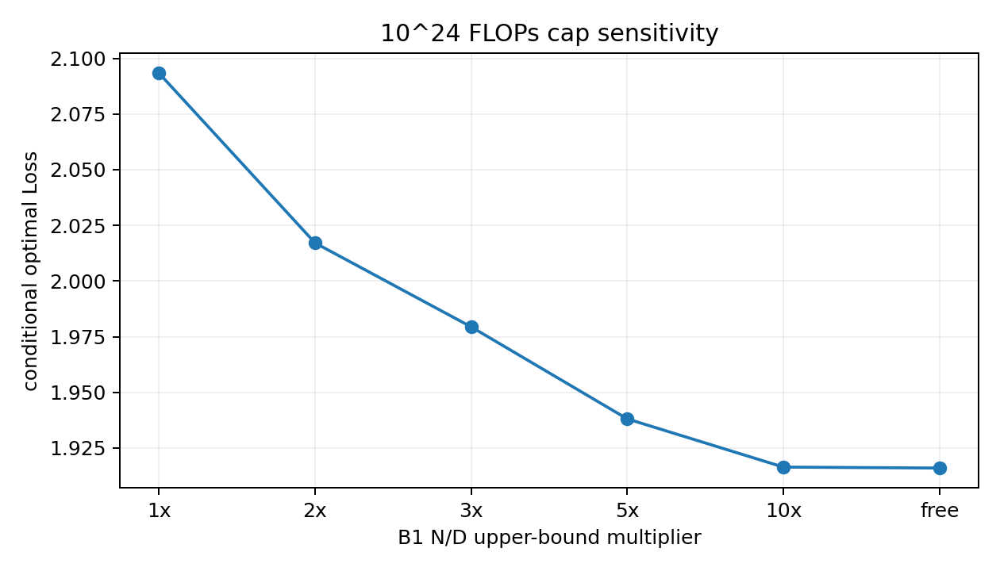

稳健决策采用 E1 3× B1 上界。代表场景为 3 个真实联合 bootstrap 向量 × 三种成本 × 两个 Q0 × 两个 C7 长度，共 36 个场景。固定配置要求对全部场景可行，故共同 Q≥.8；D 由各场景允许值的最小值决定。每场景后悔值为其 Loss 与同场景 E1 最优 Loss 的差，目标最小化最大后悔值。λp 对固定 p 策略的 N-D-Q 决策可分，因此其不确定性在配比结论中单列，不虚构为 N-D-Q 风险。对 nominal 和 empirical 配置另外报告共同可行域修复后的公平比较。

| FLOPs | 配置 | N_B | D_B | Q_B | nominal Loss | 最大场景后悔 |
|---:|---|---:|---:|---:|---:|---:|
| 1e+19 | robust_minimax | 0.30994 | 1.6315 | 0.81871 | 3.3778 | 0.33408 |
| 1e+19 | nominal_moderate_repaired | 0.31138 | 1.6377 | 0.8 | 3.3839 | 0.34026 |
| 1e+19 | empirical_repaired | 0.31138 | 1.6377 | 0.8 | 3.3839 | 0.34026 |
| 1e+19 | nominal_moderate_raw | 0.31138 | 3.9555 | 0.72412 | 3.1804 | infeasible policy |
| 1e+22 | robust_minimax | 4.1129 | 176.6 | 1 | 2.2002 | 0.056129 |
| 1e+22 | nominal_moderate_repaired | 5.4332 | 136.62 | 1 | 2.2021 | 0.058086 |
| 1e+22 | empirical_repaired | 5.4332 | 136.62 | 1 | 2.2021 | 0.058086 |
| 1e+22 | nominal_moderate_raw | 5.4332 | 245.59 | 1 | 2.1547 | infeasible policy |
| 1e+24 | robust_minimax | 35.897 | 899.68 | 1 | 1.9794 | 0 |
| 1e+24 | nominal_moderate_repaired | 35.897 | 899.68 | 1 | 1.9794 | 0 |
| 1e+24 | empirical_repaired | 11.966 | 299.89 | 1 | 2.0934 | 0.11398 |
| 1e+24 | nominal_moderate_raw | 35.897 | 899.68 | 1 | 1.9794 | infeasible policy |

这是一套明确的稳健决策规则，不等于数据证明 3× 边界合理。若未修复的 nominal 配置在其他成本/上下文情景不可行，其 raw regret 不计算。

### 当前 Champion 与复赛规则

冻结 Champion 为 P3 V2 的 **3× B1 上界内 minimax regret**。本轮对同一 Model C 和成本公式重算 1×、2×、3×、5×、free 五个上限，及名义共同可行最优、minimax、平衡均值 regret、CVaR90 regret、最差情景 Loss 五个规则。训练为 3 个完整联合 bootstrap 参数向量乘 12 个结构情景；留出为不同的 12 个参数向量乘同样结构情景。留出参数来自同一 B1/B6 原始数据重采样，不属于独立外部验证。情景平均只描述平衡设计，不代表现实期望。

每个情景 $s$ 的后悔值为 $R_s(x)=L_s(x)-\min_{y\in\mathcal F_s}L_s(y)$。域内 regret 用该上限的 oracle，跨上限比较统一使用 free oracle。本轮预先规定，替代 Champion 需共同可行、留出改善至少 0.005 Loss 且 5%、配对参数簇 bootstrap 正改善比例超过 90%，并且不增加实际 N/D 外推。复赛审计 `decision_audit.csv` 中没有候选同时通过。

### E0/E1/E2 证据等级

下表是**指数质量成本、$Q_0=0.6$、4096 上下文**的单情景最优；E0 限在 B1 实测 N/D 范围，E1 上界扩大 3 倍，E2 自由外推。E1 是敏感性边界，不是实测可信区间。

| 预算 FLOPs | 等级 | N (B) | D (B) | Q | Loss | 预算使用 |
| --- | --- | --- | --- | --- | --- | --- |
| 10^19 | E0：实测域 | 0.31138 | 3.9555 | 0.72412 | 3.1804 | 100.00% |
| 10^19 | E1：3× 边界 | 0.31138 | 3.9555 | 0.72412 | 3.1804 | 100.00% |
| 10^19 | E2：自由外推 | 0.31138 | 3.9555 | 0.72412 | 3.1804 | 100.00% |
| 10^22 | E0：实测域 | 5.4332 | 245.59 | 1 | 2.1547 | 100.00% |
| 10^22 | E1：3× 边界 | 5.4332 | 245.59 | 1 | 2.1547 | 100.00% |
| 10^22 | E2：自由外推 | 5.4332 | 245.59 | 1 | 2.1547 | 100.00% |
| 10^24 | E0：实测域 | 11.966 | 299.89 | 1 | 2.0934 | 2.56% |
| 10^24 | E1：3× 边界 | 35.897 | 899.68 | 1 | 1.9794 | 22.35% |
| 10^24 | E2：自由外推 | 39.562 | 3657 | 1 | 1.916 | 100.00% |

10^19 与 10^22 的三层基本重合；10^24 时 E0/E1 都碰到 N、D 硬上限且闲置大量预算，E2 使用全部预算但 D 达约 3657B，超出 B1 观测上限约 12.2 倍。故“Loss 更低”不能直接视为更可信的生产方案。

### 高预算上限与共同可行决策

下表使用 10^24 FLOPs、**同一留出情景和同一 free oracle**。`共同名义 Loss`是 minimax 政策在中心模型上的 Loss；`单情景 Loss`是独立指数/4096/$Q_0=0.6$ 的 raw nominal 最优，后者在 5×/free 下只有一半结构情景可行，不能当共同政策比较。

| 上限 | 共同 N (B) | 共同 D (B) | 共同名义 Loss | 单情景 Loss | 自由均值 regret | 自由最大 regret | 最坏成本率 |
| --- | --- | --- | --- | --- | --- | --- | --- |
| 1x | 11.966 | 299.89 | 2.0934 | 2.0934 | 0.16749 | 0.17998 | 4.7% |
| 2x | 23.932 | 599.79 | 2.0171 | 2.0171 | 0.091208 | 0.10367 | 18.3% |
| 3x | 35.897 | 899.68 | 1.9794 | 1.9794 | 0.053511 | 0.06597 | 41.0% |
| 5x | 52.727 | 1499.5 | 1.9419 | 1.9381 | 0.016051 | 0.02851 | 100.0% |
| free | 30.02 | 2618.8 | 1.9382 | 1.916 | 0.012312 | 0.024769 | 100.0% |

在 3× 内，36 个训练情景的解共享同一个角点，使域内 regret 为 0；留出情景也如此。但相同 3× 政策对 free oracle 的留出均值 regret 是 0.05351102。5× 与 free 降低此条件后悔值，却分别把 D 推到 B1 上限的 5 倍与约 8.732 倍。没有独立数据支持这样的外推上限，故报告 Pareto 剖面，不给唯一高预算规模。3× minimax 仅保留为清楚标注条件的展示政策。

### 公平名义对照与风险目标

原 V2 把单情景名义解截入共同可行域后直接比较。截入后没有重新优化 N/Q，10^19 下修复名义方案的留出平均 regret 约 0.172389。本轮直接在共同可行域重优化名义目标，得到更公平的对照：

| 预算 FLOPs | 规则 | 留出平均域内 regret | CVaR90 regret | 最大 regret |
| --- | --- | --- | --- | --- |
| 10^19 | Minimax regret | 0.166278679 | 0.3223818835 | 0.3358900219 |
| 10^19 | Nominal, shared feasible | 0.1662788303 | 0.3223819626 | 0.3358901743 |
| 10^19 | Balanced mean regret | 0.1662802523 | 0.3223829703 | 0.3358916025 |
| 10^19 | CVaR90 regret | 0.1662802975 | 0.3223830056 | 0.3358916478 |
| 10^19 | Worst-case loss | 0.166278679 | 0.3223818835 | 0.3358900219 |
| 10^22 | Minimax regret | 0.02704512885 | 0.0552343727 | 0.05613047497 |
| 10^22 | Nominal, shared feasible | 0.02704512505 | 0.05523436855 | 0.0561304727 |
| 10^22 | Balanced mean regret | 0.02704512609 | 0.05523436976 | 0.05613047303 |
| 10^22 | CVaR90 regret | 0.02704512581 | 0.05523436944 | 0.05613047288 |
| 10^22 | Worst-case loss | 0.02704512521 | 0.05523436876 | 0.05613047266 |

10^19 下公平名义方案与 minimax 的平均 regret 仅差约 1.5×10^-7；10^22 下差约 3.8×10^-9。mean、CVaR90、最差 Loss 规则也只出现极小数值差异。此证据不支持换用更复杂风险准则，也不支持宣称 minimax 对公平名义优化具有实质性能优势。保留 minimax 是既有可解释条件政策的延续；简化为共同可行名义方案亦几乎等价。

### 成本、预算与 KKT

下表对 3× minimax 政策核算。前三项和中心使用率对应指数成本、$Q_0=0.6$、4096 上下文；最坏使用率对应 12 种结构情景中的最大成本。因此共同可行并不意味着每个情景都花满预算。

| 预算 FLOPs | 中心训练 | 中心质量 | 中心注意力 | 中心总使用 | 最坏结构总使用 |
| --- | --- | --- | --- | --- | --- |
| 10^19 | 30.34% | 16.21% | 4.14% | 50.69% | 100.00% |
| 10^22 | 43.58% | 6.48% | 5.95% | 56.01% | 100.00% |
| 10^24 | 19.38% | 0.33% | 2.65% | 22.35% | 40.99% |

10^24 的 3× 政策在中心情景只用约 22.35% 预算，在最坏结构情景也只用约 40.99%。闲置由 N/D 外推上限驱动，不能通过在上限外继续增大 N/D 来伪装为已验证收益。free 单情景名义解的 KKT 残差如下；Q=1 时采用单侧互补条件：

| 预算 FLOPs | free 名义 KKT 相对误差 | Q 互补 |
| --- | --- | --- |
| 10^19 | 7.34e-08 | 通过 |
| 10^22 | 1.72e-08 | 通过 |
| 10^24 | 3.46e-08 | 通过 |

minimax/CVaR 目标和硬上限交界可不光滑；其八个局部可行方向最大改善量为 1.596e-13，这是数值局部检查，不是完整 KKT 证书。全部 75 个政策对 12 种结构情景的可行率为 100%；成本独立重算误差最大 4e-12。

### 质量投资结构点与配比接口

在固定 $Q_0=0.6$、4096 上下文时，质量投资起点定义为 $Q^*>Q_0+10^{-4}$，饱和点为 $Q^*\ge1-10^{-4}$。扫描后在 $\log_{10} C$ 上二分。阈值是给定模型的数值结果，不是统计置信区间：

| 质量成本 | 起投 FLOPs | 饱和 FLOPs |
| --- | --- | --- |
| exponential | 3.70242e+18 | 1.377e+20 |
| power | 1.29122e+19 | 7.21496e+19 |
| logarithmic | 2.00357e+18 | 2.00357e+18 |

对数成本的起投与饱和同点，表示当前模型下的离散跳跃，不应绘成连续过渡。不同质量成本情景的阈值差异也说明，不宜给不附条件的统一起投预算。

配比项在固定 $\lambda_p>0$ 且可加可分时不改变 N-D-Q 最优。冻结 P1/P2 桥接下，观测配比候选预测 $\Delta_p=-0.497303$、在训练支持域内；宽松 simplex 候选预测 $\Delta_p=-0.893035$，却属外推。跨尺度 $\lambda_p(N)$ 未被独立识别，因此不能把 1M 配比收益直接外推到高预算，也不能在此复赛中用配比项“抵消”规模决策风险。若最终 P1 或 P2 桥接改变，需重算本问及 P4 下游。

### 资源配置补充图

图 9-1 展示观测域、扩展边界及自由外推配置的条件差异；图 9-2 展示质量成本下的转折预算；图 9-3 对比共同可行域的风险准则；图 9-4 展示预算成本构成。

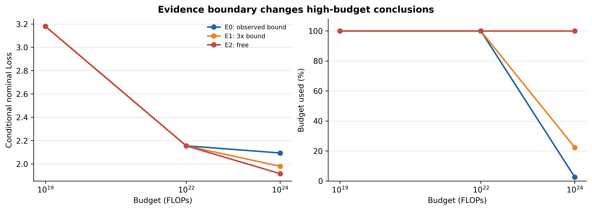

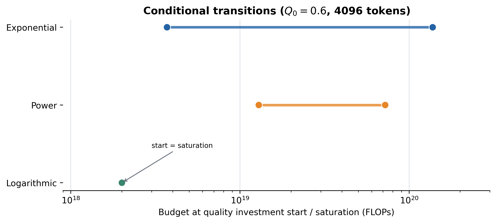

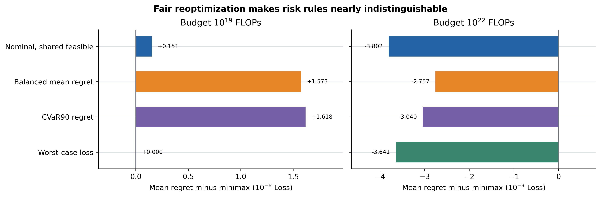

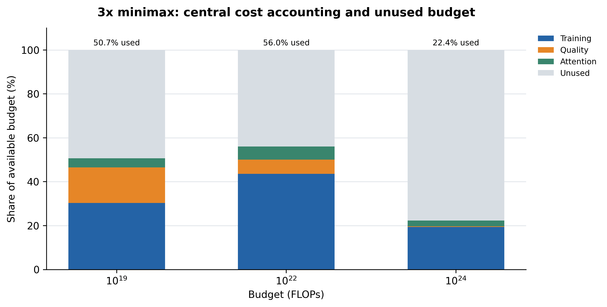

## 10 能力指数、桥接与前沿口径

本节展开模型匹配、逐任务汇总、能力桥接与季度前沿定义。预测数值以选定链和主文的冻结原点为准。

### 开源、模型类型和时间口径

主口径 Open-W1：C4 `Open model weights?=Yes` 且经过严格发布方核对、六基准完整。得到 45 个独立模型，pretrained 32、chat/finetuned 10、其他 3。Open-W2 另要求存在可明确归为 permissive 或 research-only 的许可证标签，共 27 个模型；法律许可仍须逐条核验。主时间为 Submission Date。开放主样本截止日/预测原点为 **2025-01-31**，12/24 月目标日为 **2026-01-31 / 2027-01-31**。严格匹配记录的提交日期减发布日期中位数为 49 天；日期差值分布见 `open_source_filter_audit.csv`。C4 未来模型绝不进入历史。

### C8 逐任务聚合

扫描 1958 个 JSON、1863 个目录，成功解析 1860 个模型，3 个目录不可用，4 个损坏文件记录于 `c8_parse_failures.csv`。逐任务使用 40 个叶任务、74344 个模型-任务分数；固定每类可比 metric，逐任务 percentile 后均值/第25百分位，覆盖至少半数任务及三个任务族才合格。与 C1 六维均值 Pearson=0.952、Spearman=0.953；弱项指标 Pearson=0.918。汇总有较高代表性，个别模型仍有排序偏差。六任务族前沿从首至末季度变化（百分点）：math +26.8, mmlu +4.2, ifeval +3.5, gpqa +2.0, musr +1.0, bbh +0.0。这些来自不断变化的提交模型集合，不是同一模型的纵向改进。

### 综合能力指标

主指标 `S=(IFEval+BBH+MATH Lvl 5+GPQA+MUSR+MMLU-PRO)/6`，0–100 分。六项均完整，无均值填补。稳健 z 分与 PCA 第一成分是敏感性，主分与 PCA 得分相关 0.983。预测使用 logit(S/100) 保证边界。

### Loss–Benchmark 桥接

C6 高可比 7 行、中可比 68 行。比较线性、logistic、isotonic；按模型族 GroupKFold，主桥接用高权重1、中权重0.35的有界单调 logistic，组外 RMSE=11.86 分。权重是敏感性设定，非经验真值。在 Loss=2.0 处，weighted/high-only/all-unweighted 的 logistic 映射分别为 20.38/5.92/21.72 分。C5、各可比性层和六个单项模型均见桥接表；high-only 仅一个主要系列，无法可靠外推。桥接误差较大，机理预测不能解释为精确分数。

### 历史能力前沿

开放权重六维完整模型的季度 p95：2024Q2=33.02(n=22), 2024Q3=38.12(n=16), 2024Q4=32.38(n=5), 2025Q1=30.22(n=2)。同时给出 all/W2、pretrained/chat 的 p90、p95、Top3、Top1，见 `quarterly_frontier.csv`。最后一季只有 2 个严格匹配模型，前沿受样本选择影响很大。C2 继承匹配的宽口径敏感性共 420 个模型，首末季 p95 从 31.48 到 41.49；方向与严格口径相反，但其实体对应不能逐项确认。

`frontier_definition_sensitivity.csv` 将单季最低样本数预设为 5/10，并列 1–3 季完整滚动窗口及相同 W1 截止日期的 C2 宽口径。严格单季 n≥5 只比较至 2024Q4，相对首季变化 -0.63 分；n≥10 只比较至 2024Q3，变化 +5.10 分；三季窗口 2024Q4→2025Q1 为 +2.21 分。统一截止日期的 C2 单季首末为 +8.92 分。这些比较的起止窗口并不相同，只用于判断方向是否依赖定义；末季严格 n<5，**不据此解释当季前沿涨跌**。

### 规模变量与技术变量

主模型在 32 个独立基础发布上拟合 `logit(S/100)=beta0+betaC(log10 C-23)+betaT t`，betaC=0.696、betaT=0.270。C4 参数 N、训练数据 D、reported compute 均已读取；N+D+time 替代模型仅使用 D 完整子样本，见比较表。三个主候选的跨组织/家族验证误差：time_only 11.10, compute_only 7.05, structural 7.10, nd_time 6.35。结构模型没有优于 compute-only，时间项的识别弱。

### pretrained vs chat

开放权重主样本 pretrained 32、chat/finetuned 10；同一模型在 C1 存在类型冲突时，按同日较高能力提交去重，分类本身存在不确定性。有 reported compute 的 chat 模型过少，不能可靠分开估计 chat 的规模/技术贡献。两类能力前沿已分别列出和绘图。

### 算力前沿及增长变化

C4 对所有公开权重 Language 模型筛选 Confident/Likely、reported FLOP、发布日期在原点以前，2025Q1 为不完整季度而排除。2021–2024 的单斜率年对数增长 1.301（约 3.67 倍/年）；2023–2024 近期斜率 1.982（约 7.26 倍/年）。piecewise BIC=-4.22，单斜率 BIC=-7.12，未形成可靠的已放缓证据；近期 p90 波动较大。

### Benchmark 饱和与逐任务差异

六维榜单没有模型达到任一项90分，当前样本无直接 ceiling；任务族 IFEval 高于其他部分任务，未来有界 logit 仍必要。C8 的 math 子任务族前沿增长最明显，但季度模型构成变化可能造成选择偏差。

### 数学模型与计算链的进一步说明

### A. 逐任务能力

同一叶任务只使用预先固定的评价指标：BBH、GPQA、MUSR 为 `acc_norm,none`，MATH 为 `exact_match,none`，IFEval 为 `inst_level_strict_acc,none`，MMLU-Pro 为 `acc,none`。先在相同 task/metric 内计算百分位 r_ij，再令 `DetailedAbility_i=mean_j r_ij`、`WeakAbility_i=Q25_j r_ij`。父任务与子任务不重复计数；至少50%任务覆盖与三个任务族。百分位是样本相对指标，不能与榜单0–100原始分直接减法比较。用同模型的相关性和名次差检查它是否支持六维主指标。

### B. 桥接模型

模型族分组折中，同一系列绝不同时出现在训练与测试。线性桥接为 `S=a+bL, b<=0`；有界桥接为 `S=100 sigmoid(a+bL), b<0`；isotonic 为单调非增的经验阶梯函数，在训练Loss范围外为常数。主报告选择有界桥接以保证预测量纲与0–100边界，并以分组CV报告其泛化误差。High-only样本集中于少数系列，不能把其拟合优度看成跨模型族性能。C5只作对照，不增补C6主表。

### C. 规模与剩余时间趋势

主回归在验证过的独立发布上为 `Y_i=beta0+betaC(log10(C_i)-23)+betaT*t_i+error_i`，`Y_i=logit(S_i/100)`，t 以2024-01-01起算年数。训练算力来自C4 reported FLOP；C4的N、D用于参数冲突检查、proxy和 `Y~log10(N)+log10(D)+t` 替代模型。独立发布去重避免一次模型多次提交扩大样本量。用组织分组CV检查拟合。由于时间与算力同时变化，betaT还包含未观测数据质量、后训练、评测适配与样本选择；它不是特定算法的因果效应。

### D. 对称反事实分解

以历史首季度观测p95能力为 `S00`，把算力从首季p90切到末季p90、把时间从首季切到末季，构造 `S10`、`S01`、`S11`。算力贡献为 `[(S10-S00)+(S11-S01)]/2`；剩余时间贡献为 `[(S01-S00)+(S11-S10)]/2`。两者精确加到 `S11-S00`。组织聚类bootstrap重拟合回归，再逐次分解。模型隐含变化与实际 p95 变化方向相反的诊断被保留；这比只报告模型内百分比更重要。等效算力倍数为 `10^(betaT*Δt/betaC)`，仅在 betaC>0 时解释。

### E. 未来情景

C4开放语言模型季度p90算力序列作为外生资源路径；排除不完整季度。其2023–24对数年斜率记为g。未来第h年资源为 `C_h=C_0*exp(g*h*scale_factor)`，scale_factor 为1、0.5、0.25。技术残差 `betaT*h*tech_factor`，tech_factor 为1、0.5、0。能力预测在最后观测p95的 logit 上累加两项再反变换。组织bootstrap的系数分布加历史残差形成条件区间；不同情景形成包络，与条件区间概念不同。因为历史开源能力前沿只有四季，12/24个月滚动原点没有可用折，表中的长期数值不可视作已校准预测。

### F. 问题一至三的机制链

读取问题二 V2 的 Model C 参数与问题三 V2 的求解函数，在给定C下得到E0、E1、E2的N、D、Q和 Loss。问题一的P1观测支持域配比通过问题三V2已审计的 `delta_p` 传入；主对照采用P0参考配比，P1仅作lambda=0.25敏感性。再将Loss输入C6桥接。E1的3倍N/D上限在所有未来算力情景中都被触及，所以E1出现平坦的机理预测；这揭示的是机制约束与外推范围，而非前沿必定停滞。C6分组CV误差带和强外推标记与机制结果一同输出。

### 规模/技术贡献分解

以首末季度 p95 为锚，对固定算力和固定时间两条路径作对称 Shapley。模型隐含总变化 6.84 分，其中算力 2.15 分（31.5%）、剩余时间项 4.69 分（68.5%）；组织 cluster bootstrap 95% 区间分别 [1.09,2.96] 和 [-5.93,43.44]。**实际观测 p95 变化 -2.80 分，与模型隐含方向不一致，因此不能把上述百分比当作稳健主结论或因果份额。** 历史不满12个月，最近12/24个月贡献无法计算。技术等效算力由 `10^(betaT Δt/betaC)` 求出，仅作为敏感性。

### 算力增长放缓情景

情景 S1/S2/S3 将近期对数增长率乘 1/0.5/0.25；技术 T1/T2/T3 将剩余时间斜率乘 1/0.5/0。倍率是假设而非概率。以 C4 最后完整季度的 p90 FLOP 为起点；情景包络不是统计置信区间。

### 未来12/24月预测

下表是 T1 下的探索性有界前沿；区间是参数 bootstrap 加样本残差的条件区间，未涵盖未来数据源与制度变化。能力锚取严格 W1 末季，仅 2 个模型，`frontier_forecast_12m_24m.csv` 已逐行标记该样本仍有提升空间状态。没有12/24个月直接观测回测，不得用作可信的点预测。

| 月数 | 算力情景 | 点估计 | 条件80%区间 | 条件95%区间 |
|---:|---|---:|---|---|
| 12 | continuation | 50.81 | [34.30, 76.50] | [25.87, 91.61] |
| 12 | moderate_slowdown | 43.37 | [27.75, 70.10] | [20.89, 88.73] |
| 12 | strong_slowdown | 39.73 | [24.12, 68.73] | [17.84, 87.26] |
| 24 | continuation | 71.13 | [46.64, 95.27] | [33.53, 99.65] |
| 24 | moderate_slowdown | 57.51 | [32.05, 92.13] | [22.14, 99.15] |
| 24 | strong_slowdown | 50.09 | [25.00, 90.65] | [16.67, 99.09] |

### 前三问机制预测

问题一采用 P1 观测支持域配比作敏感性；问题二读取 V2 Model C 参数；问题三 V2 在 E0/E1/E2 约束下把未来算力转为 N/D/Q 与 Loss；C6 logistic 桥接转为分数。主对照使用 P0 基准配比、E1 3× 边界。E1 在这些算力情景达到 N/D 上限，故其能力预测近乎不随算力变化，属于资源边界假设的结果。P1、E2 及超出 C6 Loss 范围均已标记。

### 两类预测对照

中度放缓 12/24 月：数据驱动 43.37/57.51，机制 20.94/20.94，差 22.43/36.58 分。机理表另给桥接 CV RMSE 推出的误差带，此带没有覆盖率保证。主要不一致来自小样本时间趋势外推、C6 Loss 定义/后训练差异及 E1 N/D 上限；不人为校准相等。

### 不确定性与回测

组外桥接 RMSE 11.86 分。可用季度数据只有 4 季，直接时间模型 3 个月滚动回测 2 折，RMSE=7.96 分。另以每个预测原点当季观测 p95 不变为**朴素短期持平基线**，在相同原点与目标季度比较：

| 原点→目标 | 提前月数 | 目标季 n | 直接时间趋势绝对误差 | 持平基线绝对误差 |
|---|---:|---:|---:|---:|
| 2024Q3→2024Q4 | 3 | 5 | 11.11 | 5.73 |
| 2024Q4→2025Q1 | 3 | 2 | 1.85 | 2.16 |
| 2024Q3→2025Q1 | 6 | 2 | 18.80 | 7.89 |

3 个月的 2 个目标上，直接趋势 MAE=6.48 分，持平 MAE=3.95 分；但全部 3 个回测对里，要求目标季 n≥5 后仅剩 1 个，无法据此升级长期模型。持平基线只作为短期预测的风险参照，**不替换 12/24 个月数据驱动或机制路径**。12个月 0 折、24个月 0 折；长期区间不是经历史覆盖率校准的预测区间。bootstrap 组织重采样、算力与技术情景、桥接分层、问题三外推分别列出，不能将混合范围叫作95%置信区间。逐行对照见 `short_term_baseline_comparison.csv`。

### 历史前沿

采用严格开放权重样本每季度能力 p95。四个季度样本数分别为 22、16、5、2；2025Q1 未达到预先设置的 n≥5 解释门槛。因此仅发布前沿的描述数值，不能断言最近季度涨跌。宽松继承匹配的 C2 样本给出相反方向，只作敏感性。

### 规模与时间

在同 32 个发布、13 个组织的分组交叉验证中，仅算力模型 RMSE=7.052，算力加时间结构模型 RMSE=7.103。因此历史预测对照用仅算力模型。结构模型可按固定假设生成算力/时间 Shapley 分解，但其隐含前沿变化 6.84 分，与观测变化 -2.80 分方向相反；历史贡献份额不作为实证结论。

### Loss 到能力的桥接

采用高可比权重 1、中可比权重 0.35 的单调有界 logistic 桥接。C6 的 75 条记录来自 23 个家族，其中高可比仅 7 条且同属一个家族。家族隔离五折 RMSE=11.864 分。isotonic 的 RMSE=11.451，但增益的家族重抽样区间跨零，且端点平台不稳定；保留较简单 logistic。桥接输入须标注 Loss 来源及可比性。

### 决策与短期参照

问题三给出 E0/E1/E2 条件策略，默认展示 E1 的 3× 限制，但不能称其为已证明的唯一高预算最优。三个月短期目标只有两个，其中一个目标季度 n=2。持平基线 MAE=3.947，直接时间趋势 MAE=6.477；这支持把持平作为风险参照，不能据此升级长期预测器。

### 12/24 个月情景

原点为 2025-01-31，目标日期为 2026-01-31 和 2027-01-31。每个期限为三种算力增长 × 三种技术时间项设定，共九条。12 个月情景中位数范围 [33.47, 50.81]；24 个月为 [36.88, 71.13]。这是**情景包络**，不是经 12/24 个月回测校准的预测区间。各行条件 bootstrap 区间及锚点 n=2 的警示见 `../winner_chain/problem4/outputs/tables/frontier_forecast_12m_24m.csv`。以当前日期理解，2026-01-31 已是历史日期；本次严格使用冻结的 2025-01-31 数据截点，不把后见资料混入回测。

### 能力前沿与桥接补充图

图 10-1 呈现逐任务汇总与六基准主指标的对应；图 10-2 展示 C6 可比性分层；图 10-3 展示季度算力前沿；图 10-4 展示冻结原点下的九情景范围。情景图用于展示假设变化，不代表已校准的未来覆盖概率。

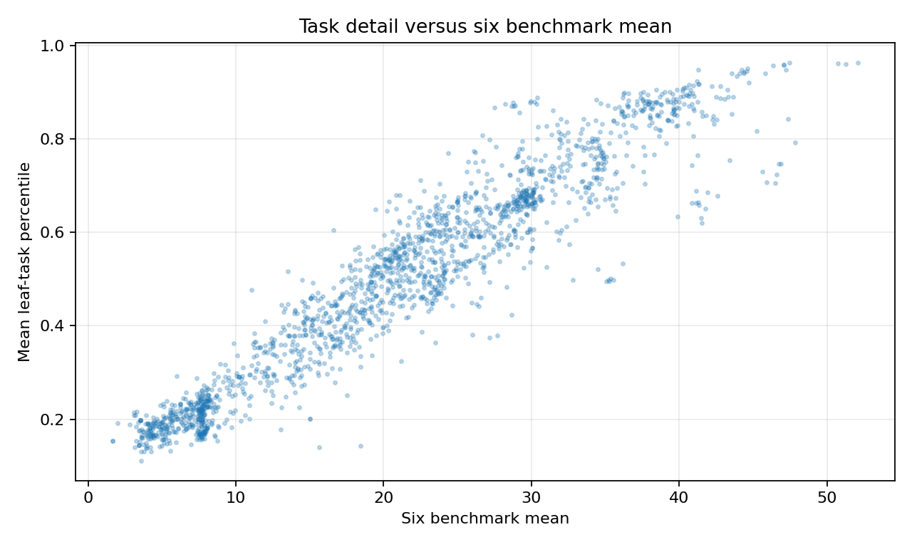

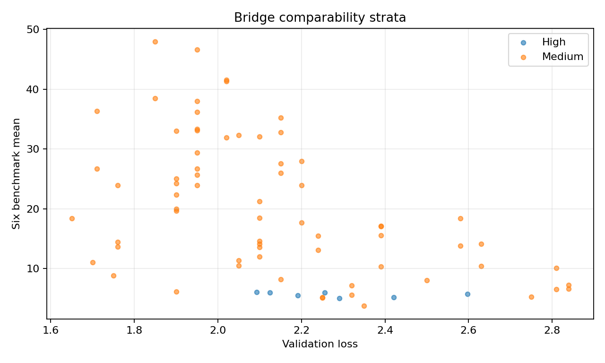

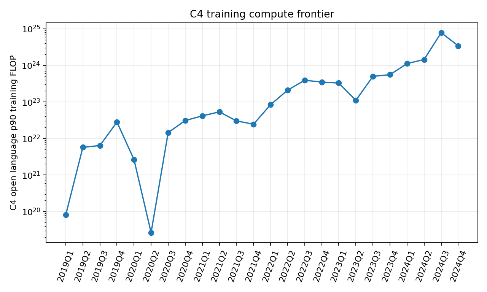

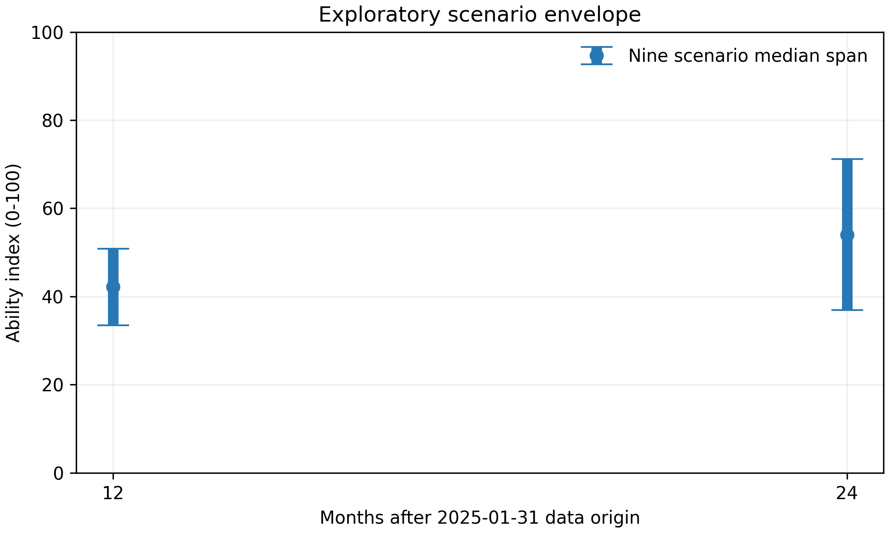

## 11 讨论与结论

本文建立了从质量代理、配比响应和条件标度律到预算决策与能力情景的可追溯链条。配比模型在既定 1M 集上取得 5.86% 的 pooled RMSE 降幅；质量与规模交互在 B6 留参数组上取得约 35.7% 的 RMSE 降幅。预算模型进一步表明，高预算条件配置对 $N,D$ 上界和质量成本形式敏感，因而应同时报告观测域、扩展边界与自由外推的剖面。开放模型分析提供统一的六基准能力口径，并将桥接误差与情景范围并列呈现。

当前结论聚焦于附件给定的质量量尺、配方支持域和严格开放权重样本。未来可通过人工质量盲评、同一模型族内的配比与质量受控训练，以及更长时间跨度的同口径能力记录，进一步校准跨数据源连接和能力情景。

## 参考文献

[1] Aitchison J. The statistical analysis of compositional data. *Journal of the Royal Statistical Society: Series B*, 1982, 44(2): 139–160. DOI: 10.1111/j.2517-6161.1982.tb01195.x.

[2] Li J, et al. DataComp-LM: In search of the next generation of training sets for language models. *NeurIPS Datasets and Benchmarks*, 2024.

[3] Liu Q, et al. RegMix: Data mixture as regression for language model pre-training. *ICLR*, 2025.

[4] Hoffmann J, et al. An empirical analysis of compute-optimal large language model training. *NeurIPS*, 2022.

[5] Biderman S, et al. Pythia: A suite for analyzing large language models across training and scaling. *ICML*, 2023.

[6] Ye J, et al. Data Mixing Laws: Optimizing data mixtures by predicting language modeling performance. *ICLR*, 2025.

[7] Gadre S Y, et al. Language models scale reliably with over-training and on downstream tasks. *ICLR*, 2025.

[8] Ho A, et al. Algorithmic progress in language models. *NeurIPS*, 2024.

## 附录 A 结果来源与复现

质量与配比源文件：`problem1/quality_pipeline.py`、`rebuild/problem1/paper_key_numbers.csv`、`rebuild/problem1/metrics_by_scale.csv`。标度律源文件：`rebuild/problem2/paper_key_numbers.csv`、`rebuild/problem2/model_card.md`。预算优化源文件：`rebuild/problem3/paper_tables/`、`rebuild/problem3/problem3_decision_tournament.csv`。能力源文件：`rebuild/final_review/outputs/tables/problem4_quarterly_frontier.csv`、`rebuild/final_review/outputs/tables/problem4_scenario_envelope.csv`、`rebuild/final_review/verification/problem4_model_card.md`。四问上下游选定链见 `rebuild/final_review/verification/selected_lineage.json`。

## 附录 B 项目文件与结果索引

问题一选定规格与逐域比较见 `rebuild/problem1/`；问题二参数、组外误差和来源诊断见 `rebuild/problem2/`；问题三政策表、KKT 和质量转折见 `rebuild/problem3/`；问题四季度前沿与情景包络见 `rebuild/problem4/` 和 `rebuild/final_review/outputs/`。选定链上下游关系记录在 `rebuild/final_review/verification/selected_lineage.json`。正式提交的支撑附件应只保留参赛队复核后的必要程序与结果，具体清单以最终提交的支撑附件为准。

## 附录 C 早期基线与候选路径

本附录记录模型开发阶段的基线、候选及跨规模诊断，以说明正文最终选型的来由。涉及原始 V1/V2 的表格保持其历史实验口径；正式跨问预测使用正文与选定链的规格。

### 17 域领域配比模型

设 $p_i\ge0$、$\sum_{i=1}^{17}p_i=1$，观测响应为 13 个验证域 Loss $L_{k}$。无截距约束的 17 比例与截距线性相关，因此简单基线删去一列，主模型用 additive log-ratio：

$$x_i=\log\frac{p_i+\epsilon}{p_{17}+\epsilon},\quad i=1,\ldots,16,\qquad \widehat{L}_k=b_{0k}+\sum_{i=1}^{16}b_{ik}\operatorname{standardize}(x_i).$$

其中参考域为 `uspto_backgrounds`，零替换 $\epsilon=0.000499$（训练集最小正配比的一半），Ridge 惩罚系数由 A4/A5 五折 CV 确定为 **1**。比较均值、删参考域原始比例 Ridge、ALR Ridge、二阶多项式 Ridge 与 ExtraTrees。模型的输入只有配比，输出同时预测 13 个验证域 Loss，模型比较按 13 维总体 RMSE，亦报告每域平均 $R^2$ 和 Spearman。

| 模型 | 1M MAE | 1M RMSE | 1M MAPE | 13 域平均 R² | 13 域平均 Spearman |
|---|---|---|---|---|---|
| alr_ridge | 0.253 | 0.341 | 5.3% | 0.790 | 0.907 |
| extra_trees | 0.336 | 0.403 | 6.7% | 0.588 | 0.798 |
| quadratic_ridge | 0.352 | 0.500 | 7.5% | 0.665 | 0.835 |
| raw_ridge | 0.386 | 0.523 | 8.4% | 0.619 | 0.830 |
| dummy | 0.619 | 0.780 | 13.6% | -0.012 | — |

ALR Ridge 在训练集内部 CV 的 RMSE 为 **0.394**，并在 A6/A7 上取得最低 RMSE。二阶交互模型的测试 RMSE 更高，故交互系数仅作探索。A8–A11 未用于训练或调参。

### 质量映射是否改善配比预测

A16 只有 **6 个** `direct/near_direct` 域可较可靠地连到质量域。对其定义已映射部分的质量加权均值和已映射配比总量，与 ALR 特征并列加入 Ridge，保持其余 11 域为未知。实验结果如下：

| 模型 | 训练 CV RMSE | 1M RMSE | 60M RMSE | 1B RMSE |
|---|---|---|---|---|
| ALR+mapped_Q | 0.3902 | 0.3374 | 1.6070 | 2.9847 |
| ALR_only | 0.3937 | 0.3415 | 1.6093 | 2.9820 |

加入映射质量后 1M RMSE 略降，但 1B 略升；更关键的是域级 $Q_d$ 对所有配方固定，新增特征是 $\mathbf p$ 的确定性函数，**不能从这份实验独立识别质量的作用**。因此问题一的主配比模型仍为 $L=f(\mathbf p)$；$Q$ 保留为问题二的跨来源融合输入，不将 11 个未知域伪装成实测质量。

### 外部检验与外推稳健性

以下所有行使用在 1M 训练数据选出的同一个模型，未用大尺度检验标签做截距校准：

| 数据集 | 标签性质 | RMSE | 平均偏差：预测−真实 | 域内 Spearman 均值 |
|---|---|---|---|---|
| test_1m | observed | 0.341 | 0.054 | 0.907 |
| test_60m | observed | 1.609 | 1.513 | 0.903 |
| test_1B | observed | 2.982 | 2.911 | 0.888 |
| est_10b | estimated_extrapolation | 3.605 | 3.552 | 0.695 |
| est_70b | estimated_extrapolation | 3.993 | 3.934 | 0.628 |

以训练集 ALR 特征的最近邻距离衡量配比空间支持，用训练集留一最近邻距离的 95% 分位作阈值：

| 数据集 | 超出训练局部支持 | 与训练配比完全相同 | 外推轴 |
|---|---|---|---|
| test_1m | 5.86% | 0.00% | mixture-space |
| test_60m | 5.86% | 0.00% | parameter-scale |
| test_1B | 0.00% | 0.00% | parameter-scale |
| est_10b | 0.00% | 100.00% | parameter-scale; labels estimated |
| est_70b | 0.00% | 100.00% | parameter-scale; labels estimated |

60M、1B 的绝对预测均系统性偏高，说明模型未包含参数规模的整体 Loss 漂移；但域内排序相关仍较高。10B/70B 的配比与训练配比完全重合，故是**参数规模方向的外推，而非新配比空间的外推**；其 Loss 是题目附件中已有模型的**外推估算**，不是新的实测验证。其误差和相关仅说明与该估算表的一致程度，不构成 10B/70B 真实泛化证据。任何跨尺度论文表述必须区分数值预测与配比排序。

### 领域置换效应及交互

单纯形上“增加某域”必须同时“减少另一域”。在训练配比均值附近，以 `pile_cc` 为参考域，将其比例减少 1 个百分点并增给另一域，计算 13 个验证域平均 Loss 的预测差。以下区间来自 A4/A5 的 300 次配方级 bootstrap，属于该模型和该局部点下的参数不确定性；零值伪计数和领域定义误差未包含其中。

| 增加域（减少 pile_cc） | 预测平均 Loss 差 | 95% bootstrap CI | 方向稳定频率 |
|---|---|---|---|
| ubuntu_irc | -0.0155 | [-0.0197, -0.0110] | 1.000 |
| dm_mathematics | -0.0108 | [-0.0136, -0.0075] | 1.000 |
| stackexchange | -0.0019 | [-0.0028, -0.0008] | 1.000 |
| wikipedia_en | -0.0003 | [-0.0017, 0.0010] | 0.657 |
| europarl | 0.0089 | [0.0013, 0.0152] | 0.993 |
| nih_exporter | 0.0255 | [0.0136, 0.0373] | 1.000 |
| philpapers | 0.0273 | [0.0130, 0.0425] | 1.000 |
| enron_emails | 0.1204 | [0.0976, 0.1472] | 1.000 |

负数表示预测 Loss 降低。`ubuntu_irc`、`dm_mathematics` 等局部替换在本数据与模型下表现较稳；`enron_emails` 的大幅正值来自其训练占比通常很低、ALR 近零区斜率很大，**不宜简单解释为该域绝对有害**。完整 $17\times16$ 置换矩阵见 [domain_effects.csv](outputs/tables/domain_effects.csv)，13 个验证域的分别响应见 [domain_effects_by_validation_domain.csv](outputs/tables/domain_effects_by_validation_domain.csv)。

二阶 Ridge 给出了 120 个候选交互系数，但五折 CV 与 1M 独立检验均劣于主模型；未完成多重比较校正后的独立复现。因此当前**没有稳定证据宣称某个域对存在互补或冗余**，仅将候选列入 [interaction_effects.csv](outputs/tables/interaction_effects.csv) 供下一步研究。

### 稳健性与跨问接口

稳健性证据包括：A1 参考尺度下 A2/A3 的非重合样本对照；CRITIC/鲁棒评分、组权重扰动、均值/中位数与 200 次全样本量 bootstrap；冲突阈值和惩罚系数敏感性；五折训练 CV 与 1M/60M/1B 外部检验；A12–A15 仅作外推估算对照。脚本、表格和图均可一键复现。

该历史基线的适用范围以 1M 配方和既定测试集为主；A12–A15 为估算标签。

问题二可接收：`domain_quality_scores.csv` 中的七域 $Q_d$ 与区间；A16 的映射可信度；`quality_weights.csv` 与指标统一规则；ALR 配比模型与 A6–A11 的误差；以及“直接跨尺度绝对 Loss 失效”的实证约束。

### 领域配比 $\mathbf p$ 如何加入问题二

定义问题一模型给出的 13 验证领域平均预测 Loss 为 $\bar L_p(\mathbf p)$，再中心化：

$$\Delta_p(\mathbf p)=\bar L_p(\mathbf p)-\bar L_p(\mathbf p_0),\qquad\mathbf p_0=(1/17,\ldots,1/17).$$

最终附加 $\lambda_p\Delta_p$。中心化使参考配比的修正为零，避免把问题一的绝对预测截距误搬到 B1 的 Loss 标尺；局部两配比的差分也不依赖参考常数。$\lambda_p$ 是跨数据来源/规模的幅度桥接系数，当前 B 数据没有共同的 $(N,D,Q,\mathbf p)$ 实验来估它；代码中取 **1** 为基准情景，并做 0.5、0.75、1、1.25、1.5 敏感性，见 `bridge_assumptions.json` 和 `sensitivity_summary.csv`。V2 的 `p_scale_scenarios.csv` 另给常数、$N^{-0.1}$、$N^{0.1}$ 三种未识别情景，不能把它们当拟合结果。乘法桥接只在 `model_candidates.md` 提为候选/情景，项目没有证明比加性桥接更好。

### $\mathbf p$ 的跨规模分析

V2 `run_v2.py:p_scale_evidence` **读取问题一 V1 已保存的 `test_predictions.csv` 中 `alr_ridge` 逐配方预测**，对同尺度预测/实际去均值后回归幅度，500 次配方 bootstrap 得 `p_scale_transfer_from_problem1.csv`：

| 尺度 | 配方数 | centered slope | 95% 区间 | Spearman |
|---|---:|---:|---:|---:|
| 1M | 256 | 0.90018 | [0.70634,1.08762] | 0.4920 |
| 60M | 256 | 0.65834 | [0.49004,0.83056] | 0.4633 |
| 1B | 64 | 0.28515 | [0.19536,0.38779] | 0.6622 |

这些是**问题一旧版 ALR 模型**的探索性幅度，尺度间配方支持域也不同。问题一最终 V2 没有保存同样的跨尺度逐配方预测，故不能由此给 Model C 拟合精确的 $\lambda_p(N)$ 或衰减指数。

### 最终广义 Scaling Law：Model C

`problem2_v2/outputs/models/recommended_model.joblib` 的 `ND_model=classic`、`Q_model=quality_model`，预测实现在 `problem2_v2/models.py:predict_recommended`，与 `predict_nd,predict_q` 一致：

$$\boxed{L_C(N,D,Q_B,\mathbf p)=1.689797563+0.353980321N^{-0.339976582}+1.240305584D^{-0.279878129}+0.356807363(1-Q_B)^{0.991543461}N^{-0.162072924}+\lambda_p\Delta_p(\mathbf p).}$$

第一项 $E$ 是经典拟合底座；第二项是参数仍有提升空间损失；第三项是 token 仍有提升空间损失；第四项是低质量惩罚，$N$ 越大其绝对幅度按本半合成拟合越小；第五项是相对均匀参考配比的预测修正。$Q_B=1,\mathbf p=\mathbf p_0$ 时退化为经典式。$\lambda_p=1$ 是默认**情景假设**而非拟合参数。公式预测的是不同来源信息拼接后的情景 Loss，不表示五项均被同一联合实验识别。

### Model A / Model B / Model C

| 版本 | 定义 | 用途和边界 | 文件 |
|---|---|---|---|
| Model A | V1 classic + $0.362175(1-Q_B)^{0.990735}+\lambda_p\Delta_p$ | 原始完整基线；Q 对 N 独立 | `problem2/outputs/models/final_generalized_scaling.joblib` |
| Model B | V2 classic N–D 的来源仿射校准，情景时另附 Model C 的 Q/p | **有该来源约 20% Loss 标签**时的条件预测；未验证 Q/p 跨源幅度 | `problem2_v2/outputs/models/model_B_source_calibrated.joblib` |
| **Model C** | classic + Q×N + 中心化 p | 当前论文主模型；B1/B6 参数加可分离桥接 | `problem2_v2/outputs/models/recommended_model.joblib` |

Model B 更重视已见目标来源的应用预测，Model C 更适于陈述透明的 N–D–Q–p 结构。B 的校准不会自动改善 C 在未知来源的零样本表现。V1 的旧报告、旧接口、旧导数表均仍真实存在，但**没有被 V2 重新生成**。

### 边际效用：从 Model C 推导

固定 $D,Q,\mathbf p$ 时，$Q×N$ 项也随 $N$ 改变，因此

$$\frac{\partial L_C}{\partial N}=-\alpha A N^{-\alpha-1}-\eta_NG(1-Q)^{\kappa}N^{-\eta_N-1},$$
$$\frac{\partial L_C}{\partial D}=-\beta B D^{-\beta-1},\qquad\frac{\partial L_C}{\partial Q}=-\kappa G(1-Q)^{\kappa-1}N^{-\eta_N}\quad(0<Q<1).$$

上述负号说明增加 $N,D,Q_B$ 在此模型内预测降低 Loss；“改善率”可记为 $-\partial L/\partial x>0$。$Q\to1$ 的导数需看单侧极限；$\kappa\approx0.992<1$ 时理论导数靠近 1 有弱奇异性，有限的 $Q+0.1$ 差分更易解释。$\Delta_p$ 当前实现不显式依赖 $N,D,Q$；若未来估计出 $\lambda_p(N)$，$N$ 导数还需增加 $\lambda_p'(N)\Delta_p$，本项目尚未做到。**V1 `generalized_scaling.py:derivatives` 只适用于旧加性模型，其 $\partial L/\partial N$ 少了 Q×N 交互项；V2 未保存 Model C 的导数 CSV。**

### 弹性

Loss 弹性定义 $\epsilon_x^{(L)}=(x/L)(\partial L/\partial x)$；可约损失 $R=L-E$ 的弹性定义 $\epsilon_x^{(R)}=(x/R)(\partial L/\partial x)$。例如 $\epsilon_N=-0.03$ 表示局部 $N$ 增长 1% 时对应 Loss 约下降 0.03%，它是局部近似，不等于翻倍时的有限差分。代入上一节 Model C 导数即可计算新弹性。`problem2/outputs/tables/elasticities.csv` **现有数值仅属 V1 Model A**：$N=7,D=300,Q_B=0.6,\mathbf p=\mathbf p_0$ 时，$\epsilon_N^{(L)}=-0.0274$、$\epsilon_D^{(L)}=-0.0310$、$\epsilon_Q^{(L)}=-0.0957$；可约损失分别约 −0.1071、−0.1213、−0.3743。V2 未输出对应 Model C 场景表，不能把这些旧数值标注为 Model C 已运行结果。与成本相结合的边际投入比较留给问题三。

### $Q_B$ 提升 0.1 等价于多少参数

固定 $D,\mathbf p$，先计算质量改善后的目标 $L_C(N,D,Q+0.1,\mathbf p)$，再求 $N_{eq}$ 满足 $L_C(N_{eq},D,Q,\mathbf p)=L_C(N,D,Q+0.1,\mathbf p)$，定义倍数 $r_N=N_{eq}/N$。V2 `models.py:equivalent_N` 在 $[N,10^{12}]$ 上用 `brentq` 精确求根，若上界仍达不到目标则返回无穷；它不是用导数随意近似。令 $H(N)=AN^{-\alpha}+G(1-Q)^\kappa N^{-\eta_N}$，则求解

$$H(N_{eq})=AN^{-\alpha}+G(1-Q-0.1)^\kappa N^{-\eta_N}.$$

$E,BD^{-\beta},\lambda_p\Delta_p$ 在两侧相消，所以在该模型结构下倍数与固定的 $D,\mathbf p$ 无关。`quality_equivalence_by_model.csv` 给 $D=20,300,2000$ 三个情景；下表为 $D=300,Q_B:0.6\to0.7$，**70B/120B 远超 B1 最大 11.97B，只能当结构敏感性**。

| 初始 $N$ | V1 加性等价 $N_{eq}$ | V1 倍数 | V2 Q×N 等价 $N_{eq}$ | V2 倍数 |
|---:|---:|---:|---:|---:|
| 0.1B | 0.1151B | 1.1514× | 0.1197B | 1.1967× |
| 1B | 1.3739B | 1.3739× | 1.2951B | 1.2951× |
| 7B | 13.4130B | 1.9161× | 9.9002B | 1.4143× |
| 70B | 373.2607B | 5.3323× | 112.9627B | 1.6138× |
| 120B | 1047.0793B | 8.7257× | 200.5827B | 1.6715× |

V1 的 Q 损失改善幅度与 N 无关，但 $AN^{-\alpha}$ 在大 N 已很小，想靠参数继续降低相同的绝对 Loss，必须把 N 增加很多，故出现 5×/8×。V2 的 $N^{-\eta_N}$ 让质量项也随规模下降，所需额外参数缩小至约 1.4–1.7×。这不是“实际加质量一定相当于 1.4× 参数”；换 Q 模型或 $Q_A\to Q_B$ 情景倍数会变化。`QA_QB_equivalence_sensitivity.csv` 的三个映射仅示范这种敏感性。

### 领域替代关系

由于 $\sum_i p_i=1$，不能只提高一个领域；应做 $p_i'=p_i+0.01,p_j'=p_j-0.01$，其余不变，并保证 $p_j\ge0$。V1 `run_problem2.py:problem1_bridge` 生成的 `mixture_effect_summary.csv` 是主要结果，见第 3.3 节的五个实例。对同一 $\lambda_p$，广义模型中的损失变化是 $\lambda_p$ 乘该差分。`pile_cc→ubuntu_irc` 的 −0.015464 有 bootstrap 区间 [−0.019659,−0.011023]；`pile_cc→dm_mathematics` 的 −0.010771 有 [−0.013631,−0.007453]；`pile_cc→stackexchange` 的 −0.001851 有 [−0.002752,−0.000754]。这些只在已有配比支持域附近解释，不能延伸为任意大幅重配方的结论。

### 领域互补

`problem1/outputs/tables/interaction_effects.csv` 有问题一的交互项探索，但当前没有同时通过 bootstrap、多个模型规格、样本支持和外部多重比较检验的稳定互补对。**当前没有足够证据确认稳定领域互补关系。**二阶 ALR 的交互系数也受单纯形约束和变量变换影响，不能看到一个正/负系数就断言两个领域在真实训练中互补。

### 100B+ 外推

V1 `run_problem2.py:analyses` 把 B10 估算 Loss 与 B9 元数据按名字、$N,D$ 一对一连接，在 $Q_B=1,\mathbf p=\mathbf p_0$ 参考情景计算 classic 预测，输出 `large_model_extrapolation.csv`、`large_model_metrics_by_band.csv`、`large_scale_extrapolation.png`。128 个估算标签上的 RMSE **0.001093828**、MAE **0.000614049**、bias **+0.000614049**、Spearman 约 **0.999994**，分段 RMSE 为 100–300B 的 0.000676、300B–1T 的 0.001217、>1T 的 0.001923。该数值较低可能因为估算表与经典幂律共用生成规律；B10 不是真实大模型训练 Loss，因此**不能称为真实 100B+ 验证**。V2 没有另用 B10 选型；Model C 在 $Q_B=1,\mathbf p=\mathbf p_0$ 与 classic 完全相同，所以这个参考情景的表可沿用作诊断，但并未检验 Q×N 或 p 在 100B+ 的效果。

### Bootstrap 与不确定性

V1 `run_problem2.py:bootstrap` 以 B1 的 8 个模型规模为簇做 **200 次**有放回重采样，每次重估 N–D，再在同一 B6 表上重估 V1 Q；`bootstrap_parameters.csv`、`parameter_intervals.csv`、`bootstrap_equivalence.csv` 保存结果。它没有按 B6 新抽样 Q 簇，因此 V1 的 $G,\kappa$ 极窄区间不能解释为完整的质量实验不确定性。V2 `run_v2.py:q_experiments` 另以 B6 的 N 规模簇做 **200 次**重采样，固定 B1 参数，输出 `quality_model_cluster_bootstrap.csv` 和 `quality_model_intervals.csv`：$G$ 95% 区间 [0.348694,0.368501]，$\kappa$ [0.950084,1.036087]，$\eta_N$ [0.148572,0.200805]。两套 bootstrap 是**分阶段**的，当前项目尚未生成 Model C 全参数联合传播区间。B1 残差相关、来源口径偏差、B8 机制冲突、$\lambda_p$ 和 $Q_A\to Q_B$ 未识别均不包含在这些区间里。

### 模型选择过程

| 阶段 | 模型/动作 | 为什么试 | 实际结果 | 保留？ |
|---|---|---|---|---|
| B1 基线 | classic | 赛题指定、参数少 | 同族拟合极好 | 是，N–D 主干 |
| V1 Q | additive | 质量越高惩罚越小、$Q=1$ 退化 | B6/B7 好，B8 未达到预设条件 | 基线 A |
| 跨源诊断 | B2/B4/B5 raw | 检查泛化 | B2 大偏移 | 保留未达到预设条件证据 |
| V2 N–D | interaction/compute-ratio/broken/稳健目标 | 检查复杂结构能否解决问题 | 无稳定跨源改善；broken 弱识别 | 不入主模型 |
| V2 Q | 六种候选 | 检查有效 token/饱和/与规模交互 | Q×N 的 B6/B7/BIC 最优 | 主模型 C |
| V2 校准 | 截距/仿射/$\log D$ | 处理来源损失口径 | 有目标标签时仿射三源改善 | 条件预测 B |
| A/B 融合 | 中心化 $\Delta_p$ | 避免绝对 Loss 标尺混用 | $\lambda_p$ 未识别 | 作为情景桥接 |
| 规模替代 | 精确 $N_{eq}$ | 回答题目 | 7B 约 1.414×；70B+ 高度外推 | 附条件报告 |

### 参考文献和它们如何影响本项目

`problem2_v2/literature_review.md` 列出论文和官方代码。Hoffmann 等的 Chinchilla 工作支持以 $E+A/N^\alpha+B/D^\beta$ 作强基线，并把 $C\approx6ND$ 用作算力约束灵感；本项目没有从其数据移植参数。Caballero 等的 Broken Neural Scaling Laws 启发平滑 broken-N 候选；本项目试了低自由度版本，但第 14 节证据不支持采用。Ye 等 Data Mixing Laws 启发配比与规模可能耦合；由于附件 B 不含 17 域配比联合实验，本项目最终只用中心化加性桥接，未确认乘法/规模变化律。Chang 等质量有效 token 工作启发 `effective_power/exp`；Goyal 等提示质量作用可能依赖资源量，因而测试 Q×D；最终这些候选均未胜过 Q×N。Biderman 等 Pythia 文献帮助解释同族检查点高度相关。文献提出某机制与本项目数据实际证明该机制是两回事。

## 附录 D 情景结构与可复核计算

本附录展开配比跨尺度传递、外推层级、历史能力分解和条件预测的开发记录。主文的数值结论以选定链表格为准；开发记录中的阶段性候选仅用于方法比较。

### 配比效应和跨尺度可信度

问题二保存的最终 P1 V2 在 1M/60M/1B 的中心化斜率分别为 0.822/0.609/0.182，用的是已查看过的测试标签，仅为回顾性证据，不是 λp(N) 的估计。1B 配方均值排序在 V2 下弱于 V1；旧 V1 斜率另存 `p_scale_v1_evidence_audit.csv`。本问以 1M ($N_B=.001$) 为情景归一化点，比较常数 1、幂次衰减 ρ=.1/.2、以及 ρ=.15 且地板 .25。固定 λ 枚举 0、.25、.5、.75、1、1.25、1.5。模型可分意味着 λ>0 时 p 候选排序不变，N-D-Q 不变，收益按 λ 伸缩；λ=0 时所有 p 并列。

| 策略 | λ=1 的 ΔLoss | 变换空间支持等级 | kNN5 | Mahalanobis | PCA 残差 |
|---|---:|---|---:|---:|---:|
| P0_reference | 0 | in-support | 2.1628 | 2.095 | 0.4821 |
| P1_observed_support | -0.50224 | in-support | 2.0865 | 3.5722 | 1.2429 |
| P2_continuous_support | -0.56865 | in-support | 2.1326 | 4.2217 | 1.0701 |
| P3_loose_simplex | -1.1951 | extrapolative | 3.2774 | 21.688 | 2.0077 |

支持度采用与问题一一致的 ALR 变换，训练空间标准化后计算 5 近邻距离、保留 95% 方差的 PCA 坐标收缩协方差 Mahalanobis 距离和 PCA 重构残差。各指标阈值来自 512 条训练样本 95/99 分位数；in-support/near-support/extrapolative 是经验诊断，不是外部验证。P2 连续候选仅在最优观测配比的 12 个邻近训练配比凸组合内搜索，并须通过全部 95% 支持检验。P1 实际观测配比仍为论文主候选；Loose 只作数学诊断。

### 证据等级与结论

三种质量成本是同等级题设情景：中高预算 Q 饱和是跨情景共识；低预算质量投资高度依赖成本假设。联合参数 bootstrap 区间很窄，主要反映 B1 在固定经典公式下近乎确定性的轨迹，**不能**解释为现实模型参数或跨数据源误差也同样小。它不覆盖成本函数、Q0、C7 元数据与 B8 外部来源失配。跨场景共识区间才用于展示这些结构性假设的变化。

长上下文使同样 N-D 的成本增加，主情景下反而让相对便宜的 Q 更早值得投资：指数成本的起投点从 2048 tokens 的约 3.90×10^18 降到 32768 tokens 的约 2.21×10^18；这是给定成本结构与 Model C 的替代效应，不是通用规律。对数成本的起投与饱和同点，表示最优 Q 出现离散跳跃，不能把它解释为渐进质量投资阶段。

10^24 下 E1 的 N 与 D 同时碰到 3× 上界，全部 36 个场景在此角点共享同一个最优解，所以 minimax regret=0；这是一种**边界驱动的退化结果**，不是高预算风险已被消除。软罚解在 ω=.01–1 下仍达到 N≈60–75B、D≈1.9–2.4T，与 E1 的 N≈35.9B、D≈0.90T 相距明显，软罚并未独立支持 3× 推荐。E1 缓和强外推，却不能升级为实证解；预算仍有大量未使用。

论文主文应采用 V2 的跨情景共识与 E0/E1/E2 三层对照；单一 λp=1 收益、精确结构点及 E2 高预算 Loss 只作为条件情景结果。

### 复现与文件映射

从仓库根目录运行 `python problem3_v2/run_v2.py`。`methods.py` 只读引入 V1 的数学成本与预测函数，新增精确活动集、硬封顶求解和 KKT 诊断。`mixture_evidence.py` 重算配比训练支持和 λ 情景。`run_v2.py` 负责联合 bootstrap、E0/E1/E2、minimax regret、图表与报告。全部 V2 文件保存在 `problem3_v2/outputs`；V1 的 SHA-256 前后清单写入 `v1_integrity.json`。

所有以 3×、ρ、floor、场景等标记的数值都是敏感性假设。`joint_bootstrap_parameters.csv` 可审计每个模型八参数及其原 B6 replicate；`joint_bootstrap_optima.csv` 逐次保存四档优化结果。`robust_scenario_optima.csv` 保存后悔值的逐场景基准，保证 minimax regret 可独立复算。

### 模型适用范围

优点：真实解析逐任务 JSON，C2 进行反核对，C4 仅接受高置信直接匹配，所有路径可复现，情景和条件区间分开。限制：榜单直接历史仅九个月；严格实体匹配率约1%；季度末开放样本只有2个；C6 高可比仅7行；Loss 尺度未跨模型族校准；Q/p 跨尺度未识别；未来12/24个月无法回测。残差时间趋势包含选择、工程和评测适配，不能称严格因果效应。

### 结论

能稳健写入论文的是数据口径、逐任务验证、桥接误差、算力长期增长及无法验证长期预测的限制。2.15/4.69 分贡献与未来点预测只能列为明确标注的小样本敏感性情景，不能作为确定性的历史份额或未来承诺。

### 对 38 个交付问题的逐项回答

1. 六项 Benchmark 0–100 等权平均；预测用 logit 尺度。
2. C8 成功 1860 个模型目录；3 个目录未达到预设条件、4 个损坏 JSON 已记录。
3. Pearson 0.952，Spearman 0.953。
4. Open-W1=C4 明确开放权重+原发布方严格匹配+六项完整；W2再要求明确许可标签。
5. 45 个独立模型。
6. pretrained 32；chat/finetuned 10；其他 3。
7. Submission Date；Release Date 作匹配与敏感性。
8. 严格直接匹配 46/4576=1.01%；C2 候选 447/4576=9.77%，含继承关联。
9. C4 年度 compute 倍率：长期 3.67×，2023–24 近期 7.26×。
10. 未发现稳健放缓：piecewise BIC -4.22，单斜率 BIC -7.12。
11. 严格主样本首末季度 p95 数值差 -2.80 分；末季 n=2<5，不能判定趋势方向。
12. 结构模型隐含算力贡献 2.15 分，仅探索性。
13. 结构模型隐含剩余时间贡献 4.69 分，仅探索性。
14. 模型内比例 31.5%/68.5%，但模型与观测方向冲突，不可作稳健份额。
15. 最近12/24月无法估计；可观测近两季的模型项为算力 -13.63、时间 2.92 分。
16. 不同：chat/finetuned 有10个严格开放模型、reported compute 更少，无法单独识别贡献。
17. C6 可比性加权、单调有界 logistic。
18. GroupKFold 的 C6 主桥接 RMSE 11.86 分。
19. 不一致：Loss=2.0 的 weighted/high-only/all-unweighted 映射 20.38/5.92/21.72 分。
20. 六维与逐任务相关高，但弱项相关 0.918，个别排名偏差见 `c8_vs_leaderboard.csv`。
21. 2025-01-31
22. 2026-01-31
23. 2027-01-31
24. 延续算力：12月 50.81、24月 71.13 分。
25. 中度放缓：12月 43.37、24月 57.51 分。
26. 强放缓：12月 39.73、24月 50.09 分。
27. 各情景50/80/95%条件区间详见 `frontier_forecast_12m_24m.csv`；未经12/24月覆盖率校准。
28. 12/24月无有效滚动回测；3月有 2 折，原趋势 RMSE 7.96 分。持平短期基线见 `short_term_baseline_comparison.csv`，合格目标 n≥5 仅 1 个。
29. P1/P2-V2/P3-V2 在中度放缓、E1/P0 下12/24月均 20.94 分，受资源上限钳制。
30. 中度放缓 12/24 月数据驱动减机理：22.43/36.58 分。
31. C6 Loss 尺度与后训练能力不完全可比，且 E1 达 N/D 上限；数据趋势超出九个月观测。
32. 本窗口的剩余时间项约等效 1.96× compute；不稳定，仅敏感性。
33. 榜单六项均无人达90分；未观测到明显 ceiling，logit 用于防止未来越界。
34. C8 p95 增量最大任务族为 math（+26.8 个百分点）；样本构成会变化。
35. 可作主结论：数据来源审计、C8逐任务代表性、桥接误差、C4长期算力趋势、不可回测的限制。
36. 规模/技术百分比、C2继承匹配前沿、12/24月分数、P1配比收益和E2均只能作敏感性。
37. 直接榜单九个月且严格匹配稀疏；最后季度仅2个开放模型，长期预测无回测。
38. 验证中未通过的是12月/24月直接回测与分解方向一致性；具体数量见 verification_results.json。

## 附录 E 成本场景与配置算法的补充审计

以下记录对应问题三早期基线及其后续外推检查。表格用于展示成本结构和算法实现过程；正文的条件解与证据分级仍以选定链为准。

### 算力成本与单位

N_raw=10^9 N_B，D_raw=10^9 D_B。$$C_{train}=6\times10^{18}N_BD_B,\quad C_Q=10^9D_B[g(Q_B)-g(Q_0)]_+,\quad C_{attn}=2\times10^{14}N_BD_BL_{ctx}.$$

指数、幂、对数三种 g 分别为 $10^7e^{6Q}$、$5\times10^9Q^4$、$2\times10^9\ln(1+10Q)$。三者均完整求解；指数函数仅作为叙述主情景，因为其递增边际成本给出内点 Q，便于展示起投和饱和两类机制，并无实证证据证明它比另外两者更真实。主情景 Q0=0.6、C7 中位上下文 4096；Q0=0.2/0.8 及另两成本为敏感性情景。B6 没有唯一可识别的 Q0。

$$C_{attn}/C_{train}=\eta L_{ctx}/6,\quad L_{ctx}^{crit}=6/(2\times10^{-4})=30000.$$

C7 共 45 行，缺失 0；中位 4096，最小 2048、最大 131072。实际值 2048,4096,8192,32768,131072；低于 30000 的 33 行，高于的 12 行；临界点两侧最近值 8192 与 32768。131072 是单个长尾值，不作为主情景。短/中/长选 2048/4096/32768。

### 优化与数值方法

在 $C_{total}\le C$、$Q_0\le Q_B\le1$、p 为 simplex 下最小化 Model C。第一阶段固定 p=p_ref；将 D 用绑定预算解析消元，优化 log N_B 与有界 Q_B。三档主预算均运行 differential evolution、SLSQP 多初值及 Q 边界一维搜索。密集轨迹为 10^18 至 10^25 的 71 个对数点。p 单独求解，因为成本与 N-D-Q 主损失对 p 可分。

### 三档预算主结果

| FLOPs | N_B | D_B | Q_B | Loss | 训练 | 质量 | attention |
|---:|---:|---:|---:|---:|---:|---:|---:|
| 1e+19 | 0.3114 | 3.956 | 0.7241 | 3.18 | 73.9% | 16.0% | 10.1% |
| 1e+22 | 5.433 | 245.6 | 1 | 2.155 | 80.1% | 9.0% | 10.9% |
| 1e+24 | 39.56 | 3657 | 1 | 1.916 | 86.8% | 1.3% | 11.9% |

图见 `outputs/figures/resource_allocation_low_medium_high.png`。占比是成本除预算，不是 token 数量占比。

### 三种质量成本

| g | FLOPs | N_B | D_B | Q_B | Loss |
|---|---:|---:|---:|---:|---:|
| exponential | 1e+19 | 0.3114 | 3.956 | 0.7241 | 3.18 |
| exponential | 1e+22 | 5.433 | 245.6 | 1 | 2.155 |
| exponential | 1e+24 | 39.56 | 3657 | 1 | 1.916 |
| power | 1e+19 | 0.271 | 5.412 | 0.6 | 3.193 |
| power | 1e+22 | 5.528 | 237.8 | 1 | 2.156 |
| power | 1e+24 | 39.67 | 3638 | 1 | 1.916 |
| logarithmic | 1e+19 | 0.3214 | 3.23 | 1 | 3.104 |
| logarithmic | 1e+22 | 5.018 | 284.7 | 1 | 2.149 |
| logarithmic | 1e+24 | 39.1 | 3738 | 1 | 1.916 |

三函数是题定的成本情景，不是数据拟合。其差异只能解释为成本假设敏感性。

### 上下文敏感性与结构性转移

短、中、长上下文均逐预算重新优化，完整结果见 `context_sensitivity.csv`。上下文超 30000 后，attention 成本超过基础训练成本。结构性转移定义为 Q 下界退出、Q 上界到达，或相邻 log 预算步的份额 L1 变化超过 0.05/0.10。它们是可复现的离散网格判据，不是物理相变。

| 判据 | 首次触发 FLOPs |
|---|---:|
| Q_start | 3.981e+18 |
| Q_saturation | 1.585e+20 |
| share_jump_tau_0.05 | 5.012e+18 |
| share_jump_tau_0.10 | not observed |

N、D 的预算弹性与 D/N 见 `optimal_nd_ratio.csv`。若主情景没有 Q 起投点或饱和点，按未观察到报告，不能人为指定。Model C 中 Q 罚项随 N 增加而减弱，因此 Q 不必单调随预算上升。

### 配比优化与 KKT

P0 使用均匀参考配比；P1 在 512 条问题一实际训练配比中选择预测最优者，这是严格训练支持域方案；Loose 用 softmax 连续优化，仅作数学外推诊断。

| 策略 | 相对 Loss 改变 | 超出局部支持 | 最大单域占比 |
|---|---:|---|---:|
| P0_reference | 0 | False | 0.05882 |
| P1_observed_support | -0.5022 | False | 0.363 |
| P1_loose_simplex | -1.195 | False | 0.4442 |

p 不消耗额外 FLOPs，因而同一 λ_p>0 下，N-D-Q 最优值不随 λ_p 改变；绝对 Loss 改变量与 λ_p 成比例。`lambda_p_sensitivity.csv` 枚举 0.5、0.75、1、1.25、1.5。内点 KKT 要求三项 $-\partial L/\partial x \,/\, \partial C/\partial x$ 相等；Q 在上下界时改用不等式。逐预算数值见 `marginal_loss_reduction_per_flop.csv`。

### 不确定性、外推与推荐

90 个情景抽取 Q0、C7 上下文、成本函数，并按问题二边际 bootstrap 区间近似抽取 G、κ、η_N。边际独立抽样不保留参数相关性，不是严格联合置信区间。结果见 `optimization_uncertainty.csv`。外推档位按 B1 区间的三倍外侧标为 strong；主理论方案强外推预算：1e+24。`empirical_range_allocations.csv` 提供 N、D 限在 B1 内的稳健对照；预算可能不绑定，表示数据支持范围内没有理由强行用完大预算。数学最优是无限制 Scaling Law 解；稳健推荐应优先引用实证范围方案，并明确其模型配比与 Q0 仍有假设。

### 成本和外推补充图

图 E1 展示上下文长度对质量投入预算的影响；图 E2 显示共同参数重抽样的配置分布；图 E3 刻画配比候选与训练支持域的关系。这些图均对应给定成本和抽样规则。

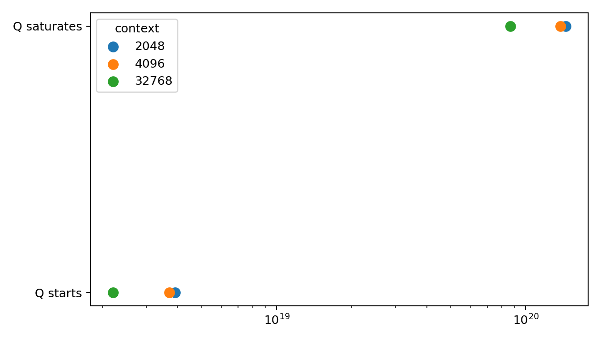

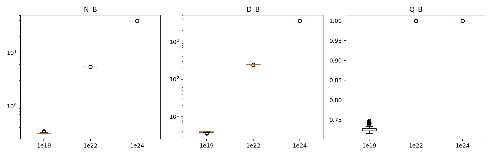

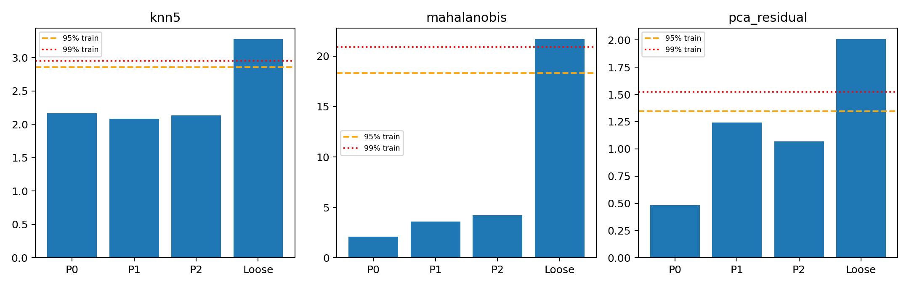

## 附录 F 相关文献与本题模型的对应

本文引用文献的作用是说明模型结构和验证设计的来源，数值结论仍由附件 A、B、C 和本项目运行结果给出。不同研究使用的训练语料、模型架构与评测指标不尽相同，因此文献中的系数不直接进入本题的回归或优化。

| 研究 | 与本文对应的问题 | 本文实际采用的要点 |
|---|---|---|
| Aitchison[1] | 17 域比例满足总和为一 | 用 ALR 坐标描述相对配比，并检查参考域与零替换的影响 |
| DataComp-LM[2] | 文本信号与训练效用之间的验证 | 固定质量代理规则，保留人工盲评和受控训练的后续校准接口 |
| RegMix[3] | 小规模配方对候选配比的筛选 | 以 1M 配方训练预测器，单独报告跨规模评价 |
| Hoffmann 等[4] | 参数与 Token 的预算分配 | 使用低维经典标度律作为可解释基线 |
| Pythia[5] | 同模型族检查点的规律分析 | 按完整参数规模组留出，区分同族与跨来源误差 |
| Data Mixing Laws[6] | 配比响应与规模响应的连接 | 保留 $\lambda_p$ 情景参数，并要求共同观测锚点 |
| Gadre 等[7] | 预训练损失与任务能力的连接 | 为 C6 拟合单调有界桥接，评价按家族隔离 |
| Ho 等[8] | 算力与时间项的历史分解 | 将时间项解释为模型内对照量，并核对观测前沿方向 |

在配方评价中，A4/A5 的 512 个样本足以训练低维代理并进行嵌套交叉验证，但它们均处于 1M 训练尺度。选定模型在 1M 和 1B 的 pooled 误差均低于冻结 Ridge，跨尺度绝对偏移则提示需要单独处理规模校准。因而论文使用 $f_A(\mathbf p)-f_A(\mathbf p_0)$ 作为跨问接口，而非迁移原始绝对 Loss。这一处理与组成数据坐标及配方代理的研究动机相容，具体有效范围仍由本项目的既定测试表限定。

在质量项评价中，B6/B7 的半合成生成机制使候选结构可以在相同口径下比较。$Q_B\times N$ 的留组改善说明加入规模依赖有助于拟合该机制；B8 的同输入异标签对照则界定了跨机制统一函数的适用条件。文献中的数据筛选收益、有效 Token 定义与本题 $Q_B$ 的测量方式不同，因此论文未把这些外部数值用作模型参数。

在能力分析中，六项完整基准的主指标与 C8 逐任务汇总具有较高秩相关，支持用统一分数进行本题前沿描述。C6 的家族分组误差和严格开放口径的季度样本数同时决定了桥接与时间结论的解释范围。长期情景采用冻结原点，分别改变算力增长和时间项；这一设计能够展示模型假设的影响，却不为各情景赋予主观概率。

## 附录 G 图表和计算产物核对

本稿的图表分别连接到质量评分、配比模型、条件标度律、预算优化和能力前沿的已保存产物。图 5-1–C4 对应 A 组质量分和冲突定义；图 6-1–D3 对应配比模型的配对误差与逐域权衡；图 8-1–F3 对应 B 组来源比较；图 9-1–9-4 对应 E0/E1/E2、质量成本与共同可行决策；图 10-1–H4 对应能力测量、桥接、算力和情景。每张图在正文或附录附近标明适用数据层，避免将估算标签与观测标签并列解释为相同证据。

图 G1 展示质量与规模项的条件关系，图 G2 展示标度律拟合的范围，图 G3 展示严格口径能力前沿，图 G4 展示情景与观测的区分。图中的方法和参数均来自本项目既有脚本与选定链。

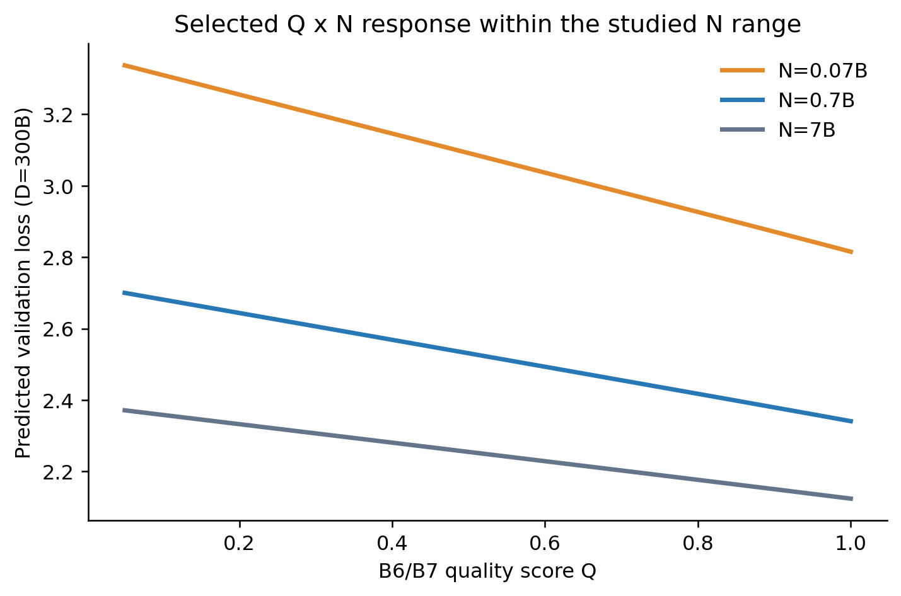

图 G5–N12 为模型检查的补充视图：质量组内部一致性、配方跨规模误差、半合成质量来源、外推层级、共同后悔、逐任务前沿和基准饱和。它们分别服务于代理构造、泛化趋势、决策敏感性和能力定义的核查。

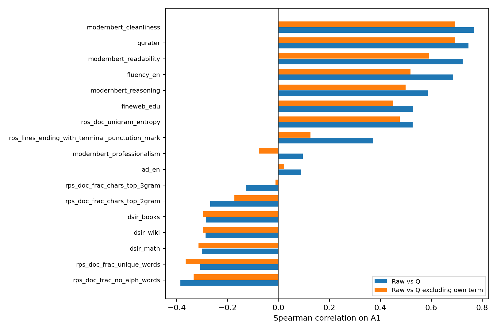

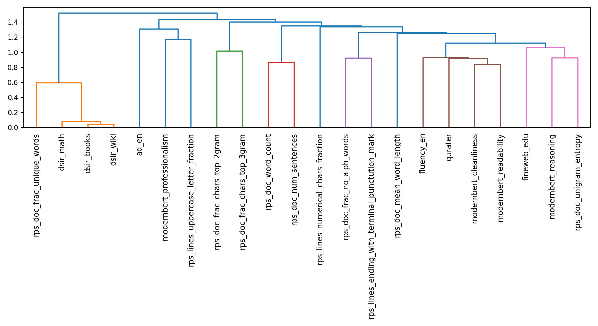

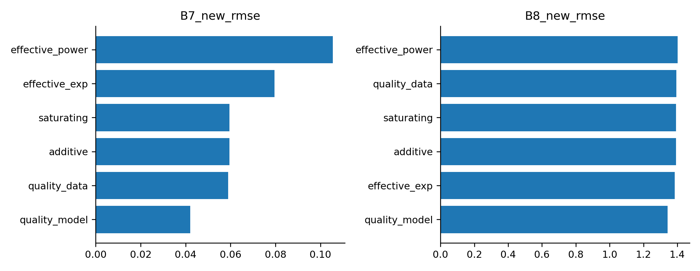

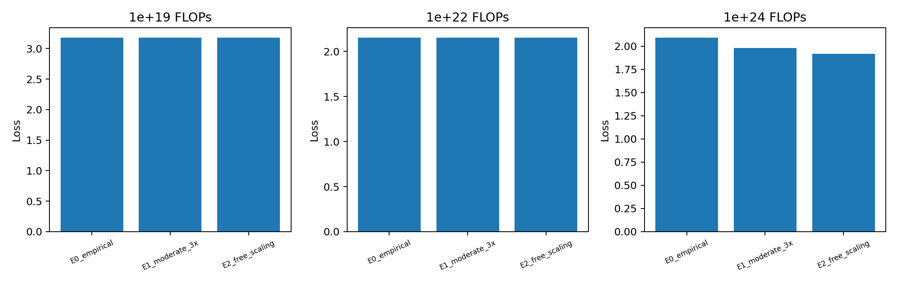

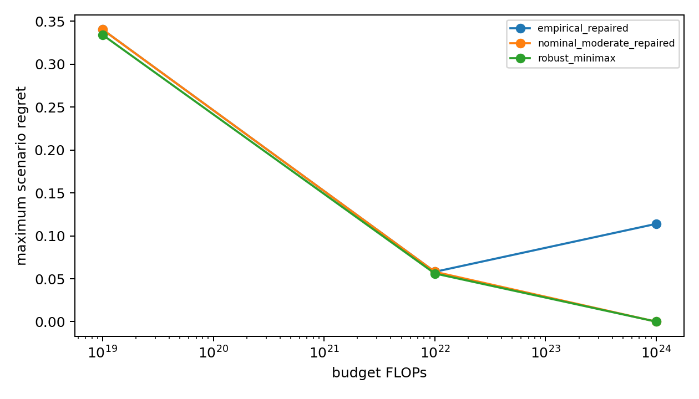

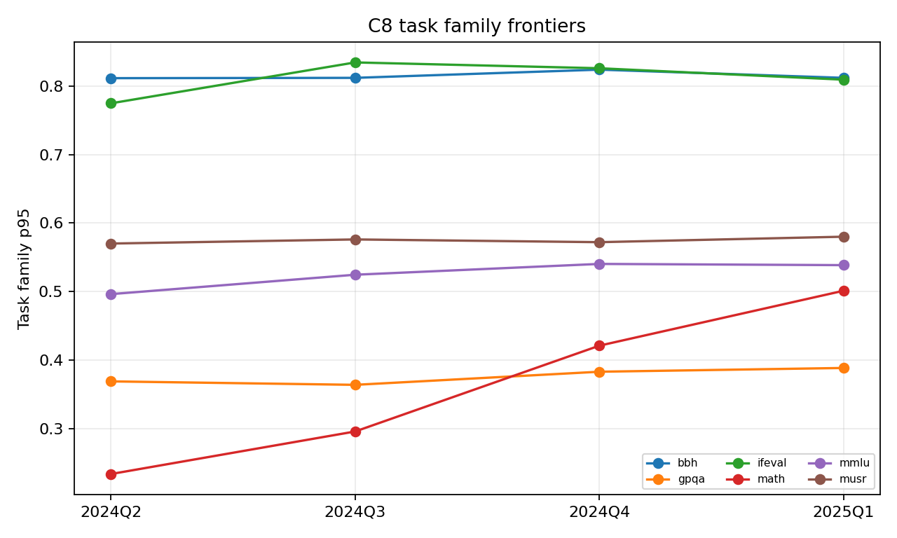

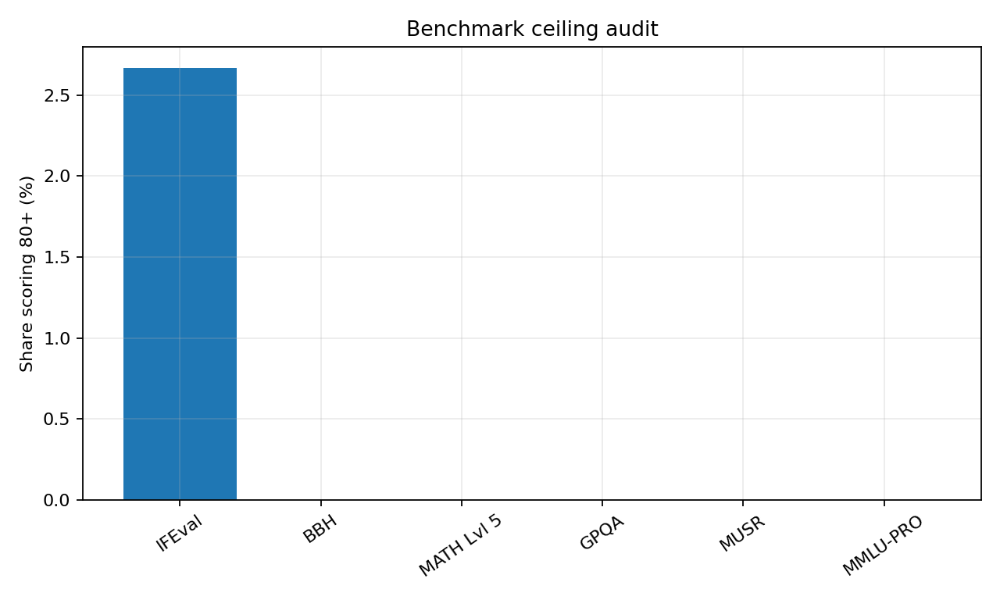

图 G13–N15 补充展示来源校准对照、质量等价参数敏感性和开放模型类型分层；它们只对应各自图注所列的数据口径。

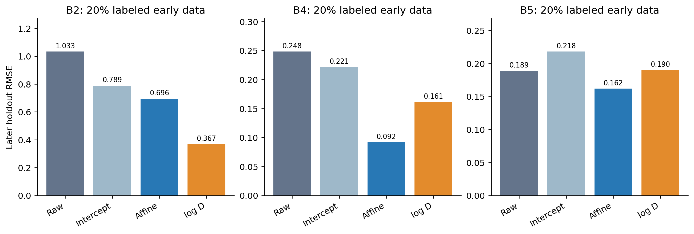

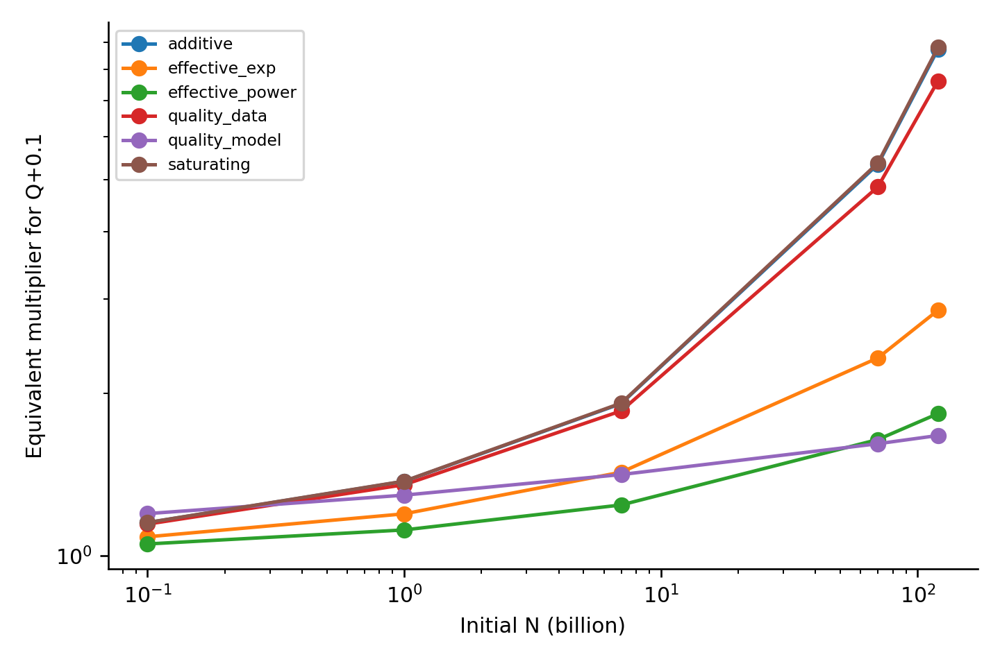

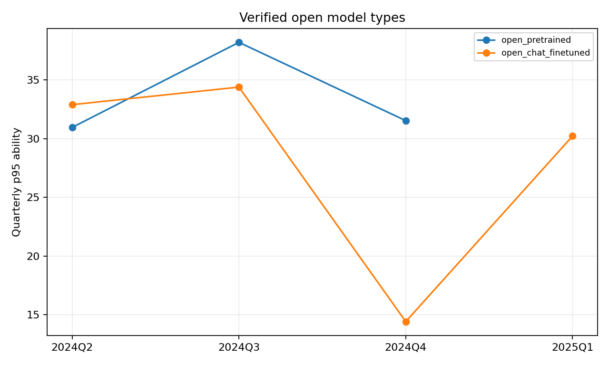

正式提交时，参赛队应以附件中的 CSV/JSON 和代码重新生成最终图表，并检查每张图的横纵轴、单位、样本数与图注。模型系数的精度、情景预算与前沿日期均需与最终 PDF 对应；如使用更新数据，应重新运行相应上游和下游模块，再重新冻结论文中的数字。

## 附录 H 数据切分与评价指标的统一说明

为了保证各表中的 RMSE、排序相关和能力分数具有明确分母，本附录把四问的样本单位与训练、评价角色集中列出。A 组的文本记录、配方记录和模型规模检验是不同层次的样本；B1 的连续检查点来自同一模型族，因而分组验证以完整参数规模为单位；C 组的榜单条目、独立模型和季度前沿也不应混为同一个样本数。

| 模块 | 原始或评价单位 | 训练/评价安排 | 主报告指标 |
|---|---|---|---|
| 质量代理 | A1 51,230、A2 17,523、A3 203,752 条信号 | A1 固定分位映射，A2/A3 去重扩展核查 | 领域均分、冲突率、条件区间 |
| 配比回归 | A4/A5 512 个 1M 配方，每个有 13 个验证域 | 五折嵌套训练内选择；A6/A7 1M、60M、1B 既定比较 | pooled RMSE、MAE、逐域 RMSE、Spearman |
| 规模律 | B1 1,176 行，含 8 个参数规模 | 留完整 N 组；B2/B4/B5 保持原始来源口径 | 组外 RMSE、跨源原始 RMSE |
| 质量项 | B6 360 行；B7 去重后 90 个新输入 | B6 留 N 组；B7 新点评价；B8 机制对照 | 条件 RMSE、组级重抽样差 |
| 预算配置 | 三档 FLOPs、三种质量成本、多种支持域上界 | 对每个情景重新优化，统一 free oracle 比较 | 条件 Loss、预算使用、后悔值 |
| 能力前沿 | C1 4,576 条榜单；严格 W1 45 个独立模型 | 六基准完整记录、实体直接匹配、季度 p95 | 前沿分数、季度样本数 |
| 桥接 | C6 75 条记录、23 个家族 | 家族隔离五折 | 能力 RMSE（分） |

pooled RMSE 对所有配方与验证域误差汇总后开方，因此能够反映总体预测尺度；逐域 RMSE 则先按域分别汇总，用于检查误差异质性。配方级 bootstrap 按配方行重抽样，保留同一配方的 13 个输出之间的相关结构。表中的条件 95% 区间描述给定数据和重抽样单位下的估计变动，不覆盖数据来源差异或未来模型训练中的变化。训练内嵌套交叉验证的外折预测用于模型选择评价，既定跨规模配方集保持原有标签，仅作为回顾性结果。

B1 参数组留出与 B6 参数组留出虽然都记作组外误差，样本来源不同。B1 的同族轨迹在 8 个参数规模之间共享训练设计；B6 是半合成质量机制。B2/B4/B5 的原始 RMSE 检查统一公式跨来源的绝对损失口径；有目标标签的来源校准另列协议，不与零样本评价合并。B8 的同输入异标签结构用于检验统一函数的适用范围，不参与 B6 质量参数的主选型。

在问题三，单情景最优和共同可行政策的约束集合不同。正文的 E0/E1/E2 表使用指数成本、$Q_0=0.6$、4096 Token 上下文，显示同一预算下外推边界的作用；稳健政策在所有选定结构情景下满足预算。跨上界的后悔值共用自由 oracle，使 1×、2×、3×、5× 和 free 剖面可比较。质量起投和饱和阈值是固定成本函数与中心参数下的数值切换点，不是统计区间。

在问题四，C1 的全部榜单记录首先按来源实体去重、开放权重状态与六基准完整性筛选，随后形成严格 W1 的 45 个模型。季度 $p_{95}$ 的样本数依次为 22、16、5、2，最后一季只作为描述值。C8 的逐任务汇总是与主六基准相关的内部核查；C6 的 75 条记录用于 Loss–能力桥接，不能把其家族分组误差等同于能力前沿时间预测误差。12/24 个月情景的原点固定于 2025-01-31，输出的中位数范围是九种设定的包络。

## 附录 I 符号、单位与公式核对

| 符号 | 定义 | 单位或约束 |
|---|---|---|
| $N$ | 模型参数量 | 十亿参数；成本式中还原为参数个数 |
| $D$ | 训练 Token 数 | 十亿 Token；成本式中还原为 Token 个数 |
| $Q_A$ | A 组四类文本信号等权代理 | $[0,1]$，固定规则的相对指标 |
| $Q_B$ | B6/B7 质量控制列 | $[0,1]$，与 $Q_A$ 量尺未直接校准 |
| $\mathbf p$ | 17 域训练配比 | 单纯形，$p_i\ge0$ 且 $\sum_i p_i=1$ |
| $L$ | 验证集交叉熵损失 | 附件损失口径，数值越低越好 |
| $S$ | 六基准等权能力指数 | 0–100 分，数值越高越好 |
| $C$ | 总算力预算 | FLOPs |
| $L_{\mathrm{ctx}}$ | 外生上下文长度 | Token |
| $g(Q_B)$ | 每 Token 的质量处理成本函数 | 题设的指数、幂或对数情景 |
| $\lambda_p$ | 配比效应跨规模幅度 | 未由联合受控数据估计；参考情景取 1 |

公式中的 $N,D$ 在标度律里使用十亿单位，成本式中训练项为 $6\times10^{18}ND$。上下文成本为 $2\times10^{14}NDL_{\mathrm{ctx}}$，与训练项同量级时 $L_{\mathrm{ctx}}=30{,}000$。质量处理项为 $10^9D[g(Q_B)-g(Q_0)]_+$；当 $Q_B\leq Q_0$ 时该增量取零。

## 附录 J AI 工具使用说明（待参赛队据实定稿）

本稿由 AI 助手依据项目已有数据、代码、审阅记录和参考文献草拟。参赛队应核对模型推导、参数、表格、图注、文献与最终措辞，并按竞赛规则补充实际工具名称、型号、使用环节及人工复核信息。[待补充]
