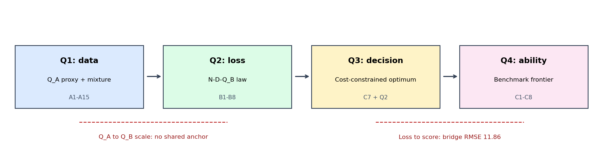
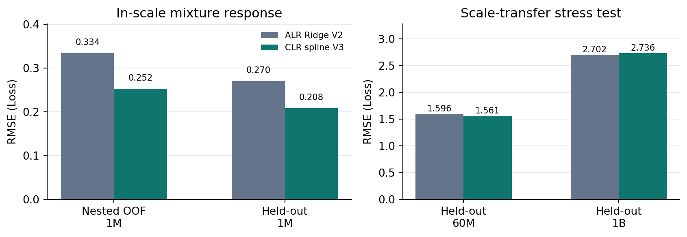
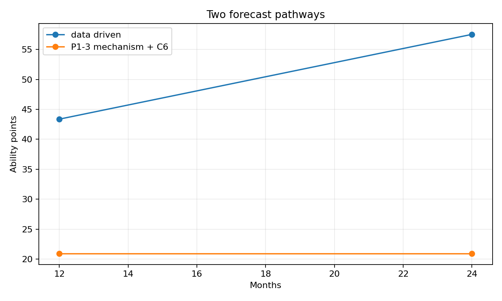
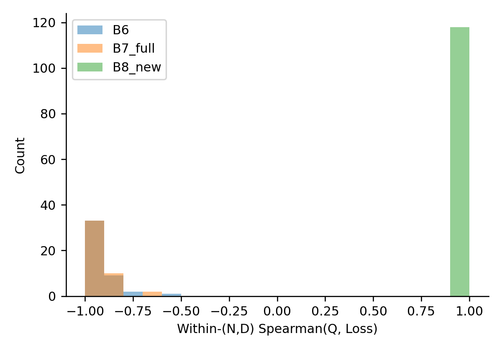

# 算力约束下大语言模型训练资源的分层配置与能力前沿分析

> 2026 年中国研究生数学建模竞赛 F 题论文工作稿。本文中的数值均来自本项目附件及已保存的实验输出；队员须逐项核对原始数据、公式、图表和 AI 使用说明后再形成参赛稿。队伍编号与官方封面模板待填。

## 摘要

大语言模型训练同时受参数规模、Token 量、数据质量和领域配比约束。本文将四问连成“数据评价—损失规律—预算决策—能力检验”的链条，同时区分同源拟合、跨源验证与情景外推。首先，按方向统一 22 项文本信号，构造四组等权质量代理，并在 A1–A3 全量 272,505 条信号记录上检查扩展集与冲突；在 17 域单纯形上比较对数比回归与加性样条。样条在 512 个 1M 配方的五折嵌套验证中将 RMSE 从 0.3340 降至 0.2522，既定 1M 检验由 0.2702 降至 0.2082，但 1B 检验从 2.7021 升至 2.7357，因此跨问仍采用原对数比模型。其次，在 B1 经典参数–数据标度律上加入由 B6 半合成数据估计的质量与规模交互项；B6 留参数组验证 RMSE 从加性质量项的 0.0814 降至 0.0523，但 B2 原始跨源 RMSE 为 1.243，说明同源精度不能代表迁移能力。再将标度律放入训练、质量处理、长上下文三项成本的约束优化，在 10¹⁹、10²²、10²⁴ FLOPs 下对照经验域、三倍边界与自由外推。高预算下预测损失分别为 2.093、1.979、1.916；差别主要来自外推边界。最后，在严格开放权重口径的 45 个模型上，六项 Benchmark 综合分与逐任务汇总相关系数为 0.952；Loss–Benchmark 组外桥接 RMSE 为 11.86 分。模型隐含历史能力变化方向与直接季度前沿相反，且 12/24 个月没有同期限回测，因此长期前沿只报告条件情景。本文给出可执行的资源配置算法及各结论的适用范围，避免将半合成关系或未验证外推误作现实规律。

**关键词：** 数据质量代理；组成数据；标度律；算力约束优化；情景预测；可识别性

## 1 问题重述与总体框架

题目要求先评价语料质量及领域配比，再把质量和配比纳入标度律，随后求算力约束下的配置，最后用开放模型的历史能力与未来前沿检验。四问的测量对象不同：A1–A3 的文本质量信号构成 $Q_A$；B6–B8 给出的质量列记为 $Q_B$；A4–A15 的配比实验观测验证 Loss；C1、C4、C8 的能力以 Benchmark 得分表示。$Q_A$ 与 $Q_B$ 没有共同实测锚点，Loss 与 Benchmark 也需要带误差的桥接。本文因此使用如下分层接口：

1. 用 A 组建立 $Q_A$ 和领域配比响应 $f_A(\mathbf p)$；质量代理分数用于数据描述，未被硬当作 B 组的质量量尺。
2. 用 B1 拟合 $L_{ND}(N,D)$，用 B6 估计条件质量项，得到 $L_B(N,D,Q_B,\mathbf p)$。配比差分只以未识别的幅度系数 $\lambda_p$ 进入情景。
3. 用题设成本模型在给定预算与外生上下文长度下优化 $N,D,Q_B$；$\mathbf p$ 采用固定的观测支持策略，单独做差分敏感性。
4. 用 C 组检验能力口径和 Loss 桥接，并把预算结果映射为能力情景；同时建立不依赖前三问的历史时间模型作对照。

{ width=95% }

表 1 是本文各数据层的证据界线。半合成和估算标签虽然可用于模型诊断，不等于新的真实训练实验。

| 数据层 | 使用方式 | 可支持的结论 | 主要限制 |
|---|---|---|---|
| A1–A3 质量信号 | 全量评分、冲突与去重扩展对照 | 固定规则下的相对质量代理 | 无人工评分，不能证实训练效用 |
| A4–A15 配比与 Loss | 训练、既定规模检验、外推压力测试 | 1M 配比预测及既定测试误差 | 测试集曾用于开发比较；跨规模绝对偏差大 |
| B1、B2/B4/B5 | 同族标度拟合及跨族检验 | B1 规律、跨源失配 | 绝对 Loss 口径不统一 |
| B6–B8 | 半合成质量交互、来源诊断 | 附件机制内的条件关联 | B8 同输入冲突，不能识别通用质量规律 |
| C1–C8 | 开放模型、算力、逐任务与桥接 | 样本定义下的能力历史和情景 | 严格样本短且稀疏，长期无同期限回测 |

## 2 数据处理与基本假设

**单位和约束。** 标度律中 $N$ 以十亿参数（B）为单位，$D$ 以十亿 Token（B）为单位；真实训练 FLOPs 中还原为 $10^{18}N_BD_B$。$Q_A,Q_B\in[0,1]$，配比 $p_i\ge0$ 且 $\sum_{i=1}^{17}p_i=1$。验证 Loss 越低越好，能力分数越高越好。

**依赖关系。** 质量信号、配方实验、标度律实验和历史模型统计并非同一批受控训练。把四者连成闭环需要额外假设，不能靠代数连接消除实验差异。本文只对具备共同观测的模块估计参数；其余连接采用显式情景，并比较预测与历史是否相容。

**评价协议。** 配比模型用训练集内嵌套交叉验证选型，在既定不同规模数据上报告绝对 RMSE 和排序；质量项以参数组留出、B7 新点及 B8 来源检验；优化求解检查约束、KKT 与边界敏感性；能力桥接按模型家族分组交叉验证，趋势以时间顺序评估。已反复查看过的 A6–A15 与 B2/B4/B5 均称“回顾性检验”，不称全新盲测。

## 3 问题一：质量评价、冲突与配比响应

### 3.1 质量代理的定义

对第 $j$ 个文本的 22 项信号，先按指标语义确定“越高越好”“越低越好”或“适中最好”的效用方向，再用固定在 A1 上的分位点与长尾变换映射到 $[0,1]$。将信号分为教育价值、可读性、洁净度与结构四组。组内取均值、组间等权：

$$Q_{A,j}=\frac14\sum_{g=1}^{4}\left(\frac{1}{|I_g|}\sum_{k\in I_g}u_k(x_{jk})\right),\qquad Q_{A,d}=\operatorname{mean}_{j\in d}Q_{A,j}.$$

教育组中高度相关的三项 DSIR 先归并为一个子维度，再与其余教育信号汇总。该定义让四个概念组而非各原始列等权，避免某组因列数多而支配总分；组成数据的对数比处理参考 [1]，质量代理需要受控训练检验的动机参考 [2]。主质量分不加冲突惩罚；惩罚系数缺乏人工真值或受控 Loss 识别。A1 有 51,230 条，A2 17,523 条，A3 203,752 条，全部进入评分。A1 中 arxiv 均分 0.7647、github 0.5750；剔除重合 ID 后 A2 新 arxiv 0.7616、A3 新 github 0.5741，显示这两个领域在固定规则下的均值量级接近。质量效度仍待人工盲评：已准备 140 条分层文本，当前真实人工评分数为零。

### 3.2 冲突定义与稳健性

对同一文本，若四组评分至少一组位于 A1 的上四分位，同时至少一组位于下四分位，则记为组间冲突。A1 冲突率为 7.83%；把阈值改为 80/20 和 70/30 分位，比例变为 3.93% 与 13.62%。这一变动说明冲突率依赖阈值，故以冲突标记提供复核名单，而不把惩罚分作为客观质量真值。A2/A3 去重扩展后的 arxiv/github 冲突率分别为 5.77%/11.12%，与 A1 的 5.07%/11.87% 方向大致相近。DSIR 三项与独特词比例在全体样本上同其他质量维度呈负相关，且分域方向不同；本文保留预设方向，报告该张力，不按总体相关性事后翻转。

为避免扩展集与抽样集重合造成虚假的“独立一致”，在对照时剔除 A1 与 A2 重合的 1,419 个 arxiv ID，以及 A1 与 A3 重合的 10,000 个 github ID。固定评分规则下，两领域均分及冲突率的样本级 bootstrap 区间见表 2。arxiv 的均分差约 0.0031，github 约 0.0009；“量级接近”只是一项分布复核，不代表精确相等。四组权重扰动 500 次时，arxiv 位于七域前三的频率 1.000，github 为 0.000；这说明局部权重范围内的域排序稳定，不能代替外部标注。

| 来源与领域 | 独立对照样本数 | $Q_A$ 均值 [95% 条件区间] | 冲突率 [95% 条件区间] |
|---|---:|---:|---:|
| A1 arxiv | 1,419 | 0.7647 [0.7627, 0.7669] | 5.07% [3.95%, 6.06%] |
| A2 新 arxiv | 16,104 | 0.7616 [0.7610, 0.7623] | 5.77% [5.40%, 6.11%] |
| A1 github | 10,000 | 0.5750 [0.5732, 0.5766] | 11.87% [11.19%, 12.53%] |
| A3 新 github | 193,752 | 0.5741 [0.5737, 0.5744] | 11.12% [10.98%, 11.24%] |

### 3.3 单纯形上的配比模型与取舍

17 域配比是组成数据，直接把原始比例当彼此独立变量会忽略闭合约束。跨问正式接口保留二阶 ALR–Ridge 模型，以固定参照域的对数比和二阶项预测 13 域 Loss，并将配比效应中心化为 $\Delta_p(\mathbf p)=f_A(\mathbf p)-f_A(\mathbf p_0)$。受控配比代理建模可参考 [3] 的研究思路，但本文的跨规模验证仍以自身附件为准。另对 512 个 1M 训练配方试验中心化对数比加性样条：

$$\widehat L_j(\mathbf p)=\beta_{0j}+\sum_{i=1}^{17}\sum_k\beta_{jik}B_k\!\left(\operatorname{clr}_i(\mathbf p+\epsilon)\right),$$

其中零配比替换常数、结点数与 Ridge 强度只在训练内层选择。表 3 展示相同协议下的选择依据。

| 测试层 | ALR 二阶 V2 RMSE | CLR 样条 V3 RMSE | 判断 |
|---|---:|---:|---|
| A4/A5，512 配方五折嵌套 OOF | 0.3340 | **0.2522** | 5/5 外折改善 |
| 1M，256 配方 | 0.2702 | **0.2082** | 可作该尺度条件模型 |
| 60M，256 配方 | 1.5959 | **1.5614** | 有改善但绝对偏差仍大 |
| 1B，64 配方 | **2.7021** | 2.7357 | 样条退步 |

1M 上 V2 减 V3 的配方级重抽样 RMSE 差为 $0.0620$，条件 95% 区间 $[0.0447,0.0789]$；1B 差为 $-0.0336$，区间 $[-0.0613,-0.0073]$。因此 V3 用于 1M 配比筛选；V2 留作跨问差分接口。配比模型是实验响应预测，不能把任一领域系数解释为独立因果收益，也不能用 1M 的绝对 Loss 预测十亿参数模型。

绝对误差与配比排序需要分开看：V3 在 1M/60M 的配方平均 Loss 的 Spearman 分别由 V2 的 0.715/0.682 提升至 0.929/0.893；但 60M/1B 的预测减观测 bias 仍为 +1.471/+2.658。1B 配方相对训练集的最近邻比例距离中位数 0.217，高于 1M/60M 的 0.177，提示支持域差异，但不足以单独解释迁移失败。10B/70B 的 Loss 属估算标签，本文不将其作为真实规模验证。

{ width=90% }

## 4 问题二：质量交互的条件标度律

### 4.1 由经典式到广义式

先以 B1 拟合经典律 $L_{ND}=E+AN^{-\alpha}+BD^{-\beta}$，计算最优标度背景见 [4]，B1 的同源检查点特性见 [5]。再按 B6 的质量变化估计质量与参数规模交互，并把配比差分以情景系数接入；将配比与规模关联建模的动机见 [6]：

$$L(N,D,Q_B,\mathbf p)=1.689798+0.353980N^{-0.339977}+1.240306D^{-0.279878}+0.356807(1-Q_B)^{0.991543}N^{-0.162073}+\lambda_p\Delta_p(\mathbf p).$$

当 $Q_B=1$ 且 $\mathbf p=\mathbf p_0$ 时，质量项与配比差分同时为零，整式才严格退化为经典形式。$\lambda_p$ 未由 A/B 共同受控实验识别；本文不把 $\lambda_p=1$ 当估计结果。$Q_A$ 到 $Q_B$ 也无共同锚点，故问题三主求解固定参考配比，并把质量变量解释为 B 组给定量尺。

### 4.2 模型检验与不可识别性

经典式 B1 留参数组 RMSE 为 0.000151，却在 B2 原始来源上达到 1.2431。前者反映 B1 近乎确定性的同族轨迹，不可推出跨族泛化。质量项与 $N$ 交互相较简单加性质量项，在 B6 留参数组上从 0.08144 降至 0.05235，B7 新点从 0.05952 降至 0.04213。B6/B7 均为半合成补充，故该收益只支持附件机制内的预测。B8 存在 160 个完全相同的 $(N,D,Q_B)$ 输入对应不同 Loss，且质量方向与 B6 相反；任何不区分来源的确定函数都无法同时完全拟合二者。若成对标签等权，该冲突点的最优理论 RMSE 下界为 0.69768。

表 4 把相同公式在不同证据层上的误差并列，避免用 B1 的极小同源残差掩盖外部失配。B4/B5 是来源核对；B8 的误差作为机制冲突诊断，不参与 B6 质量项选型。

| 验证对象 | 固定主模型或比较 | RMSE | 可作何种解释 |
|---|---|---:|---|
| B1 留参数组 | 经典 $N$–$D$ | 0.000151 | 同一训练来源的规模轨迹 |
| B2 原始跨源 | 经典 $N$–$D$ | 1.2431 | 无校准外部来源失配 |
| B4/B5 原始跨源 | 经典 $N$–$D$ | 0.2927/0.1976 | 不同来源损失口径差 |
| B6 留参数组 | 加性质量 / $Q\times N$ | 0.08144/0.05235 | 半合成机制内选型 |
| B7 精确新点 | 加性质量 / $Q\times N$ | 0.05952/0.04213 | 同机制新点检验 |
| B8 精确新点 | $Q\times N$ 零样本 | 1.3418 | 不同半合成来源冲突 |

额外试验的 $Q\times N\times D$ 项使 B6 留组 RMSE 进一步变为 0.05106，B7 新点为 0.04117，但 B8 零样本略退，B7 上重抽样改善区间跨零，因此未替换主式。若目标来源提供 B8 的少量标签，可另拟合来源残差校正；在 200 个校准标签与独立的 1280 条同来源测试记录上，RMSE 从同标签预算截距校正的 0.7517 降至 0.1336。该实验验证的是有监督的 B8 标签适配，绝非零样本质量律，也不输入问题三。

### 4.3 边际效用与质量—规模替代

在固定 $D,\mathbf p$ 下记质量项系数 $G=0.356807$、幂指数 $\kappa=0.991543,\eta=0.162073$。则

$$-\frac{\partial L}{\partial Q_B}=G\kappa(1-Q_B)^{\kappa-1}N^{-\eta},\quad -\frac{\partial L}{\partial N}=\alpha A N^{-\alpha-1}+\eta G(1-Q_B)^\kappa N^{-\eta-1}.$$

小变化时，质量提高 $\delta Q$ 与参数增加 $\delta N$ 对 Loss 等效的条件为 $(-\partial L/\partial Q_B)\delta Q\approx(-\partial L/\partial N)\delta N$；大变化则需解完整非线性等式并保持同一 $D$ 与同一数据来源。这个替代率是给定 B6 模型的局部量，不能跨 $Q_A,Q_B$ 量尺直接应用。

## 5 问题三：预算配置与结构性转移

### 5.1 成本、约束与求解

在 $N,D$ 以十亿单位表示时，总成本为

$$C_{\mathrm{tot}}=6\cdot10^{18}ND+10^9D[g(Q_B)-g(Q_0)]_++2\cdot10^{14}NDL_{ctx}\le C.$$

$g$ 按题设采用指数 $10^7e^{6Q}$、幂函数 $5\times10^9Q^4$ 与对数渐进 $2\times10^9\ln(1+10Q)$ 三类成本；主表选指数成本、$Q_0=0.6$ 和 $L_{ctx}=4096$。$L_{ctx}$ 由 C7 可行上下文窗口外生给定。训练与注意力开销相当的解析阈值为 $L_{ctx}^{crit}=6/\eta=30{,}000$ tokens，C7 的 2048、4096 与 32768 等值跨越该阈值。对固定 $N,Q_B$，成本对 $D$ 线性，因此可直接消去 $D$，在允许范围内取成本约束给出的最大值，再用有界数值优化求 $N,Q_B$。求解后检查预算残差、端点互补条件与随机点解析消元。现有计算中自由解预算残差最大约 $2.22\times10^{-16}$，KKT 相对残差中位约 $6.16\times10^{-8}$。

$$D^*(N,Q_B;C)=\frac{C}{(6+\eta L_{ctx})10^{18}N+10^9[g(Q_B)-g(Q_0)]_+},\qquad \eta=2\times10^{-4},$$

再按 $D$ 的经验支持上界截断。该消元只在固定 $N,Q_B$、预算可用且 Loss 对 $D$ 单调下降时成立。

### 5.2 三档预算与外推层级

为避免把超出训练支持域的数学最优当作现实建议，设 E0 将 $N,D$ 限在 B1 实测范围；E1 把两者上界放宽到 B1 上界的三倍；E2 仅保留成本约束。E1 是用于剖面的敏感性边界，三倍并无独立实证认证。表 5 给出指数质量成本、固定上下文的代表结果；每组 $N,D$ 单位均为十亿。

| 预算 FLOPs | 层级 | $N$ | $D$ | $Q_B$ | 预测 Loss | 预算使用率 |
|---:|---|---:|---:|---:|---:|---:|
| $10^{19}$ | E0/E1/E2 | 0.311 | 3.956 | 0.724 | 3.180 | 100% |
| $10^{22}$ | E0/E1/E2 | 5.433 | 245.59 | 1 | 2.155 | 100% |
| $10^{24}$ | E0 | 11.966 | 299.89 | 1 | 2.093 | 2.6% |
| $10^{24}$ | E1 | 35.897 | 899.68 | 1 | 1.979 | 22.4% |
| $10^{24}$ | E2 | 39.562 | 3657.0 | 1 | 1.916 | 100% |

将“结构性转移”定义为最优解的活跃约束集或边际投入方向发生变化，例如 $Q_B$ 从基线变为内点、达到上界，或 $N/D$ 撞上经验域边界。指数成本情景下，质量起投约在 $3.70\times10^{18}$ FLOPs，质量饱和约在 $1.38\times10^{20}$ FLOPs；其他成本与上下文情景会改变阈值，尤其低预算。高预算 E0/E1 不用尽预算，是经验域上界造成的结果。将 E1 上界从三倍放宽为五倍、十倍时，$10^{24}$ 的 Loss 从 1.979 变为 1.938、1.916；这比同一固定边界内优化器的数值误差重要得多。

为区分数值事件与统计不确定性，用固定主参数和 $Q_0=0.6,L_{ctx}=4096$ 的三种成本重复定位质量起投与饱和，得到表 6。对数渐进成本下两阈值相同，表示当前目标函数的边界跳跃，而非一个逐渐投入质量的阶段。阈值可被数值算法精确定位，却仍随成本函数假设大幅改变。

| 质量成本 $g$ | 起投预算 FLOPs | 饱和预算 FLOPs | 转移形态 |
|---|---:|---:|---|
| 指数 | $3.7024\times10^{18}$ | $1.3770\times10^{20}$ | 内点投资后饱和 |
| 幂函数 | $1.2912\times10^{19}$ | $7.2150\times10^{19}$ | 内点区间较窄 |
| 对数渐进 | $2.0036\times10^{18}$ | $2.0036\times10^{18}$ | 直接跳至上界 |

{ width=80% }

### 5.3 稳健策略

对三种质量成本、两档 $Q_0$、两种 C7 上下文长度及联合参数重抽样，共构造 36 个训练情景。在每个预算下让固定配置对所有情景可行，并最小化最大后悔值 $\max_s[L(x;s)-L(x_s^*;s)]$。与修复到共同可行域的名义策略相比，$10^{19}$ 的最大后悔从 0.3403 降至 0.3341，$10^{22}$ 从 0.0581 降至 0.0561；收益有限。$10^{24}$ 在 E1 上界角点全部情景共享同一解，零后悔是人为边界的退化现象。新增均值与 CVaR 风险目标在留出情景几乎没有可辨识收益，因此未增加主模型复杂度。

高预算、质量已饱和且质量处理成本相对较小时，自由解还有一个可核查的渐近式。设 $K=C/[(6+\eta L_{ctx})10^{18}]$，则 $D\approx K/N$；只保留经典律中 $N,D$ 的边际变化，一阶条件给出

$$N^*=\left(\frac{\alpha A}{\beta B}K^\beta\right)^{1/(\alpha+\beta)},\qquad e_N=\frac{\beta}{\alpha+\beta}=0.4515,\quad e_D=\frac{\alpha}{\alpha+\beta}=0.5485.$$

因此该条件模型的高预算边际投入略偏向扩大 Token。$10^{24}$ 自由解的局部数值弹性约为 $e_N=0.4446,e_D=0.5613$，与渐近式接近；E0/E1 的双上界激活后不适用此自由解推导。这些弹性均条件于 B1 的标度系数与成本代理。

## 6 问题四：历史前沿、桥接与条件预测

### 6.1 可复核的开放模型口径

主口径 Open-W1 要求 C4 明确开放权重、模型与发布方直接匹配、C1 六个 Benchmark 完整。得到 45 个独立模型，其中 pretrained 32、chat/finetuned 10、其他 3；时间以 Submission Date 为主。综合能力 $S$ 为 IFEval、BBH、MATH Lvl 5、GPQA、MUSR、MMLU-PRO 六项 0–100 分的等权均值。另从 C8 逐任务结果解析 1860 个模型目录、40 个叶任务、74,344 个模型–任务分数。逐任务汇总与六项榜单均值 Pearson 相关为 0.952，弱项指标相关为 0.918，说明主指标具备代表性但会掩盖短板。

### 6.2 Loss–能力桥接及历史分解

对 C6 按可比性分层，以高可比权重 1、中可比 0.35 拟合有界单调 logistic 桥接，按模型族分组验证 RMSE 为 11.86 分。统一训练条件下 Loss 与任务表现的联系可参考 [7]；这里 C6 跨族混合口径不能沿用该文系数。高可比仅 7 条，且主要来自一个系列；在 Loss=2.0 时，高可比单独与主桥接的映射分别为 5.92 与 20.38 分，表明量尺不稳。桥接分数不能报告到小数点后两位作为现实能力精度。

历史规模–时间结构模型在 32 个独立基础发布上，以 $\operatorname{logit}(S/100)$ 对 $\log_{10}C$ 与时间拟合：

$$\operatorname{logit}(S_i/100)=\beta_0+\beta_C(\log_{10}C_i-23)+\beta_Tt_i+\varepsilon_i.$$

其中 $t$ 从 2024-01-01 起按年计。跨组织/家族验证 RMSE 7.10，略差于仅算力模型的 7.05，因此时间残差的独立预测价值不足。按首季为锚的两因素对称分解，模型内算力项 $\phi_C=2.15$ 分、时间项 $\phi_T=4.69$ 分、合计 $6.84$ 分。严格开放口径季度 p95 为 2024Q2 33.02（$n=22$）、Q3 38.12（$n=16$）、Q4 32.38（$n=5$）、2025Q1 30.22（$n=2$）。首末直接变化为 $-2.80$ 分，与模型隐含方向相反。故 $\phi_C/(\phi_C+\phi_T)=31.5\%$ 与 $68.5\%$ 只作为模型内反事实比值，不能当现实贡献占比；时间残差也不能称因果技术进步。

严格口径的末季样本仅两模型，前沿方向对最低季度样本数和实体匹配方式敏感（表 7）。各行比较的终点或开源口径不同，不能把它们当作同一时期的增速互相排名；其用途是说明“能力已稳定上升”的说法缺少同口径支撑。C3 只用于历史来源和年度统计核查，未作为主回归的额外训练样本。

| 前沿定义与时间窗口 | 首末 p95 差（分） | 证据限制 |
|---|---:|---|
| Open-W1 单季，要求 $n\ge5$，2024Q2→Q4 | -0.63 | 排除末季 $n=2$ |
| Open-W1 单季，要求 $n\ge10$，2024Q2→Q3 | +5.10 | 只覆盖两季 |
| Open-W1 三季滚动，2024Q4→2025Q1 | +2.21 | 窗口高度重叠 |
| C2 继承匹配宽口径，同截止日首末季 | +8.92 | 模型实体对应较弱 |

### 6.3 增长放缓情景与前沿对照

长期算法进步的分解方法可参考 [8]，但本文的严格样本仅覆盖四个季度，无法复制该文的识别条件。

C4 历史算力的 2021–2024 单斜率约为每年 3.67 倍，2023–2024 近期估计约 7.26 倍；现有样本未证实已经放缓。于是将近期对数增长率乘 1、0.5、0.25，并将剩余时间项分为延续、减半、停滞，而非声称这三种情景有已知概率。原有分析以严格附件的 2025-01-31 为预测原点，其 12/24 个月目标为 2026-01-31 与 2027-01-31。C4 虽有 2025-03-13 之后的开放模型算力元数据，C1/C8 的同六项能力记录却没有相应更新，因此不能把能力预测原点挪到 2026 年。由于直接能力观测只有四个季度，12/24 个月同期限滚动回测为零；2025Q1 锚点还只有两模型。2026-01-31 已早于当前竞赛日期，表中“12 个月”仍是历史原点情景，不能作为当下未来一年预测。

在“算力增长减半、时间项延续”条件下，数据趋势路径的 12/24 个月分数为 43.37/57.51，条件 95% 区间为 [20.89,88.73]/[22.14,99.15]；前三问机制路径在 E1 三倍上界下均为 20.94。差距分别为 22.43/36.58 分。两条路径不一致，是对跨来源桥接与上界假设的压力测试，不做事后调平。短期 3 个月的两个回测点，持平基线 MAE 3.95，时间趋势 MAE 6.48；要求目标季度至少五个严格模型时只剩一个点。这些诊断不足以校准 12/24 个月预测区间。

表 8 将算力增长率的三种设定在相同时间项延续条件下并列。区间仅反映当前参数重抽样与样本残差，未覆盖数据口径变化、未来制度变化或 $Q_A/Q_B$ 桥接失配，不能称为现实未来能力的 95% 覆盖区间。预测值保留两位小数只为核对代码输出，其有效精度远低于两位。

| 从 2025-01-31 起 | 算力对数增速倍率 | 数据趋势分数 | 条件 95% 区间 |
|---|---:|---:|---|
| 12 个月 | 1 | 50.81 | [25.87, 91.61] |
| 12 个月 | 0.5 | 43.37 | [20.89, 88.73] |
| 12 个月 | 0.25 | 39.73 | [17.84, 87.26] |
| 24 个月 | 1 | 71.13 | [33.53, 99.65] |
| 24 个月 | 0.5 | 57.51 | [22.14, 99.15] |
| 24 个月 | 0.25 | 50.09 | [16.67, 99.09] |

利用 C4 后续公布的算力元数据，可单独检查外生算力路径。在 2025-01-31 固定原点，只使用此前完整季度的 15 个合格 p90 值拟合，从 2024Q4 锚点外推到 2026Q1。目标季实际 p90 为 $6.632\times10^{24}$ FLOPs，但仅有 3 个合格模型。最后季度持平、2021 年起长期趋势、2023 年起近期趋势的绝对对数误差分别为 0.658、0.968、1.820。近期趋势在这一个点明显高估；因目标数低于五且 C4 是事后快照，该检验只作算力子模型诊断，不据此更换长期能力模型，也不称其为 12 个月能力回测。逐模型目标和切分记录见附录 A。

{ width=80% }

## 7 四问衔接、实用建议与局限

本研究可给出**条件决策**：在已观测 1M 配比任务使用 V3 进行候选筛选；当训练规模改变，回到 V2 差分并安排新规模验证。在 B1/B6 代表的实验机制内，质量与规模有可计算替代，但跨来源需要损失口径与质量量尺校准。预算优化宜同时报告 E0、E1、E2 和成本函数变化，不把高预算自由解当作唯一配置。开放模型前沿只在严格样本定义下展示历史与情景，不从稀疏季度推断稳定技术份额。

当前最需要的新实测不是再加一个自由参数，而是三类锚点：（1）至少两名评审者对预设质量文本的独立盲评，以及固定 $N,D$ 下质量筛选的训练 Loss；（2）同一模型族下跨 $Q_A/Q_B$、配比与训练规模的受控小实验，用以估计量尺和 $\lambda_p$；（3）更多开放模型的直接来源匹配、统一 Loss/Benchmark 记录与足够长的时间回测。缺少这些锚点时，本项目的最优配置和长期预测必须保留条件性。

## 参考文献

1. Aitchison J. The statistical analysis of compositional data. *Journal of the Royal Statistical Society: Series B*, 1982, 44(2): 139–160. DOI: 10.1111/j.2517-6161.1982.tb01195.x.
2. Li J, et al. DataComp-LM: In search of the next generation of training sets for language models. *NeurIPS Datasets and Benchmarks*, 2024.
3. Liu Q, et al. RegMix: Data mixture as regression for language model pre-training. *ICLR*, 2025.
4. Hoffmann J, et al. An empirical analysis of compute-optimal large language model training. *NeurIPS*, 2022.
5. Biderman S, et al. Pythia: A suite for analyzing large language models across training and scaling. *ICML*, 2023.
6. Ye J, et al. Data Mixing Laws: Optimizing data mixtures by predicting language modeling performance. *ICLR*, 2025.
7. Gadre S Y, et al. Language models scale reliably with over-training and on downstream tasks. *ICLR*, 2025.
8. Ho A, et al. Algorithmic progress in language models. *NeurIPS*, 2024.

## 附录 A 复现与输出定位

问题一的训练、验证与数据质量规则见 `problem1/problem1_v3.py`、`problem1/quality_pipeline.py`、`problem1/quality_proxy_validation.md`；问题二主公式、B8 来源适配见 `problem2_v2/run_v2.py`、`problem2_v2/source_quality_calibration.py`；问题三约束、KKT、边界剖面见 `problem3_v2/run_v2.py`、`problem3_v2/outputs/tables/cap_sensitivity_profile.csv`；问题四逐任务、桥接、前沿见 `problem4/run_problem4.py` 与 `problem4/outputs/tables/`；C4 固定原点算力诊断见 `paper_work/compute_asof_20250131.py`、`paper_work/compute_asof_20250131_results.csv` 与 `paper_work/compute_asof_20250131_target_models.csv`。各模块仍保留拒绝候选和逐行预测，以供复核。

{ width=60% }

## 附录 B AI 工具使用说明（待队伍核实后定稿）

本项目使用 AI 助手协助检索与整理文献、审阅代码、生成候选实验脚本、汇总既有运行结果、编辑本文工作稿。模型结构、关键假设、参数估计、图表、原始输出及引用均需参赛队员理解并复核；最终贡献范围、工具名称、使用时间、人工复核责任人须由队伍按竞赛官方要求如实填写。本文工作稿不应直接作为未经核验的提交版本。
