# 2026 研究生数学建模 F 题：问题一完整建模报告

> 自动生成于本地附件，数值均来自 `problem1/outputs/tables/`。本报告给出可复现的建模结果与明确的局限性；没有独立人工标注真值，也没有新训练大语言模型。方法与假设应由参赛团队复核后再写入正式参赛论文。

## 摘要

对 A1–A3 的 **272,505 条**质量信号记录使用全部 22 个字段，建立统一标尺下的四组等权质量指数；对 A4/A5 的 512 组 17 域配比建立组合数据回归，并在 A6–A11 检验。A1 的 arxiv、github 样本分别全部与扩展集重叠，故分源对照和独立记录对照分开计算。主质量模型在 A1 七域上的 $Q$ 范围为 **0.5750–0.7647**。四组指标的离散冲突率为 **7.83%**（25%/75% 阈值）。配比主模型由 A4/A5 五折交叉验证选出，为加性对数比 Ridge；A6/A7 的 1M 实测检验 RMSE 为 **0.341**，优于均值基线的 **0.780**。向更大参数规模直接搬用时绝对 Loss 偏移明显，因此大尺度结果主要支持相对排序分析。

## 1. 问题分析与资料依据

本问的困难有三层：其一，22 个质量信号的量纲、方向和列表含义不同；其二，质量信号的七个来源域与 RegMix 的 17 个训练域只部分重合；其三，17 域比例在单纯形上，而输出是 13 个验证域 Loss，且不同规模的绝对 Loss 有系统漂移。设计遵循“透明基线 → 增强方法 → 训练集内部选型 → 外部检验”的顺序。配比回归的总体思想参照 [RegMix 正式会议论文](https://openreview.net/pdf?id=5BjQOUXq7i)，组合数据的对数比处理参照 [Aitchison (1982)](https://rss.onlinelibrary.wiley.com/doi/abs/10.1111/j.2517-6161.1982.tb01195.x)。题目参考文献将 RegMix 标为 ICML 2024，正式版本显示为 **ICLR 2025**，论文引用应核对版本。

## 2. 数据审计和预处理

A1、A2、A3 分别有 **51,230、17,523、203,752** 条。A1 涵盖七个质量域，A2/A3 扩展 arxiv/github。A1 与 A2 的重合 ID 有 **1,419** 个，与 A3 的重合 ID 有 **10,000** 个；分源评分时保留全量，跨文件汇总时必须去重。A4–A15 的 12 个 CSV 均无缺失单元或重复 `index`；配比行和与 1 的最大偏差约 0.004，属于舍入误差，入模前逐行归一。详见 [data_audit.csv](outputs/tables/data_audit.csv)。

质量文件以 `.jsonl.xz` 流式逐行读取。`ad_en`、`fluency_en` 的二分类 logits 用正向类 softmax 概率压缩；ModernBERT 的 0–5 级 logits 用 softmax 期望除以 5；`fineweb_edu` 取单元素；`qurater` 的四维按官方顺序等权平均。这些列表含义来自[数据集官方说明](https://huggingface.co/datasets/opendatalab/SlimPajama-Meta-rater/blob/main/README.md)。各字段采用 A1 固定参考分位点缩放，A2/A3 沿用同一标尺。长尾计数字段先作带符号的 `log1p`，极值按 A1 1%/99% 截尾；长度等“适中最好”字段用 1%/20%/80%/99% 梯形效用。缺失值以 A1 参考中位数补齐并记录。所有最终 $z_k$ 均在 $[0,1]$，**越高代表该字段定义下越好**。启发式方向见 [assumptions.md](assumptions.md)。

### 22 项规则表

| 字段 | 类型 | 压缩 | 原始方向/效用 | 统一缩放 | 缺失数 |
|---|---|---|---|---|---|
| fineweb_edu | list | 单元素取值 | 越高越好 | A1固定1%-99%截尾MinMax | 0 |
| fluency_en | list | 两类 logits 中正向类概率 | 越高越好 | A1固定1%-99%截尾MinMax | 0 |
| modernbert_cleanliness | list | 六级 logits 的 softmax 期望/5 | 越高越好 | A1固定1%-99%截尾MinMax | 0 |
| modernbert_readability | list | 六级 logits 的 softmax 期望/5 | 越高越好 | A1固定1%-99%截尾MinMax | 0 |
| modernbert_reasoning | list | 六级 logits 的 softmax 期望/5 | 越高越好 | A1固定1%-99%截尾MinMax | 13 |
| modernbert_professionalism | list | 六级 logits 的 softmax 期望/5 | 越高越好 | A1固定1%-99%截尾MinMax | 6 |
| dsir_books | number | 原始标量 | 越高越好 | A1固定1%-99%截尾MinMax | 0 |
| dsir_wiki | number | 原始标量 | 越高越好 | A1固定1%-99%截尾MinMax | 0 |
| dsir_math | number | 原始标量 | 越高越好 | A1固定1%-99%截尾MinMax | 0 |
| qurater | list | 四个 QuRating 维度均值 | 越高越好 | A1固定1%-99%截尾MinMax | 0 |
| ad_en | list | 两类 logits 中正向类概率 | 越高越好 | A1固定1%-99%截尾MinMax | 0 |
| rps_doc_word_count | number | 原始标量 | 适中最好；经验梯形效用 | A1固定分位点梯形效用 | 0 |
| rps_doc_num_sentences | number | 原始标量 | 适中最好；经验梯形效用 | A1固定分位点梯形效用 | 0 |
| rps_doc_unigram_entropy | number | 原始标量 | 越高越好 | A1固定1%-99%截尾MinMax | 0 |
| rps_doc_frac_unique_words | number | 原始标量 | 越高越好 | A1固定1%-99%截尾MinMax | 0 |
| rps_doc_frac_no_alph_words | number | 原始标量 | 越低越好 | A1固定1%-99%截尾MinMax | 0 |
| rps_doc_frac_chars_top_2gram | number | 原始标量 | 越低越好 | A1固定1%-99%截尾MinMax | 0 |
| rps_doc_frac_chars_top_3gram | number | 原始标量 | 越低越好 | A1固定1%-99%截尾MinMax | 0 |
| rps_lines_uppercase_letter_fraction | number | 原始标量 | 适中最好；经验梯形效用 | A1固定分位点梯形效用 | 0 |
| rps_lines_ending_with_terminal_punctution_mark | number | 原始标量 | 越高越好 | A1固定1%-99%截尾MinMax | 0 |
| rps_lines_numerical_chars_fraction | number | 原始标量 | 适中最好；经验梯形效用 | A1固定分位点梯形效用 | 0 |
| rps_doc_mean_word_length | number | 原始标量 | 适中最好；经验梯形效用 | A1固定分位点梯形效用 | 0 |

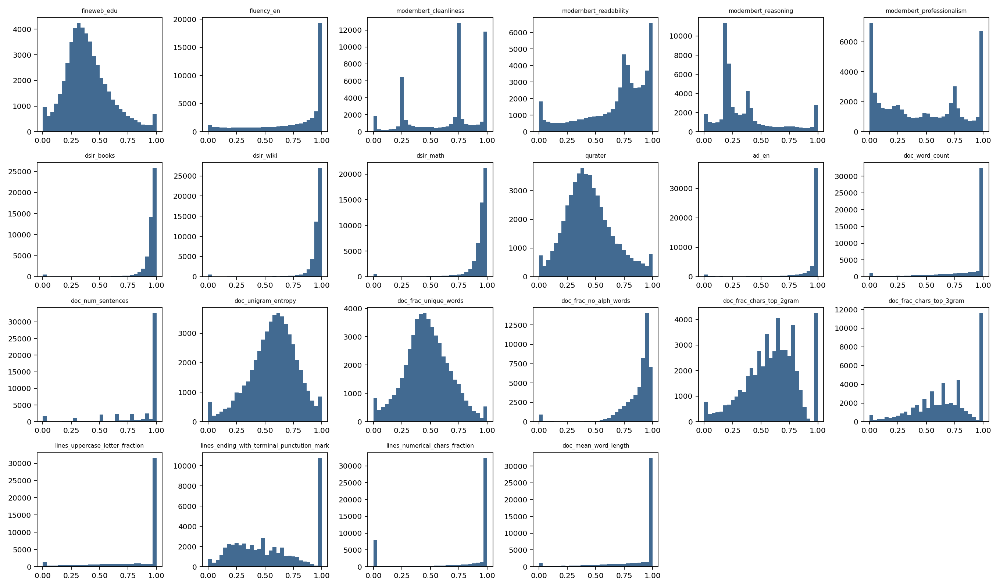

## 3. 数据质量评价模型

令 $z_{jk}$ 表示第 $j$ 个样本经固定标尺处理后的指标。先把高度相关的 `dsir_books`、`dsir_wiki`、`dsir_math` 合成一个子项；该三者的 Spearman 相关可达约 **0.999**，相关矩阵条件数约 **936.4** 的单指标 VIF 量级。教育、可读性、洁净度、文本结构四组的组内子项等权，组间等权：

$$Q_j=\frac14\sum_{g=1}^4 S_{jg},\quad S_{j,educational}=\frac15\left(z_{fineweb}+z_{reasoning}+z_{professionalism}+z_{qurater}+\frac{z_{dsir\_books}+z_{dsir\_wiki}+z_{dsir\_math}}{3}\right).$$

其余组的 $S_{jg}$ 为组内指标均值。与此比较的增强候选为 [CRITIC 原始方法](https://doi.org/10.1016/0305-0548(94)00059-H) 的离散度/相关性权重，以及四组得分去掉最高、最低后的鲁棒聚合。PCA 仅作结构分析，不把主成分自动解释为“质量”。A1 中第一、二主成分解释方差分别为 **31.5%**、**18.7%**；需要多于一个轴才可描述主要差异。相关矩阵、层次聚类和 VIF 进一步证明直接逐字段等权会重复计数。

| 方法 | A1 域排名与基线 Spearman | 样本分数平均绝对差 |
|---|---|---|
| Q_baseline | 1.000 | 0.0000 |
| Q_critic | 0.929 | 0.0279 |
| Q_robust | 0.964 | 0.0323 |
| Q_penalty | 1.000 | 0.0368 |
| Q_hard | 0.964 | 0.0097 |

CRITIC 与鲁棒方案提供有价值的敏感性对照，但在缺乏独立人工真值的条件下，没有足够依据说明更复杂权重更“正确”。主分析保留透明的 **四组等权 $Q$**。四组权重的 Dirichlet 扰动排名见 [quality_weight_sensitivity.csv](outputs/tables/quality_weight_sensitivity.csv)：arxiv 在 500 次扰动中位于前三的频率为 **1.000**，github 为 **0.000**。这说明指定权重邻域内的排序稳定，不构成外部质量真值验证。

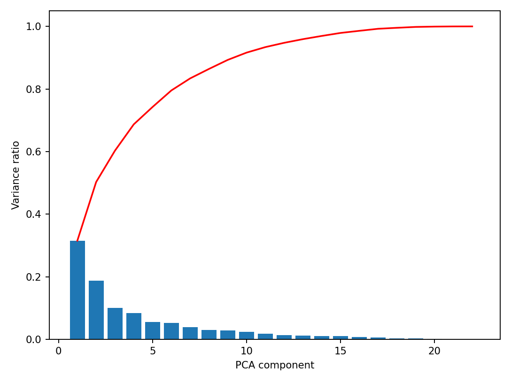

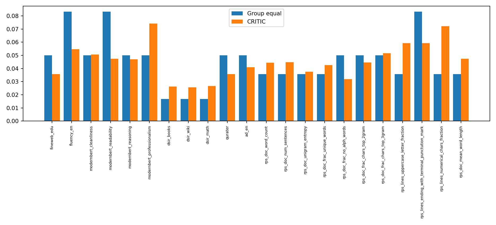

### 领域级 $Q$ 与不确定性

领域级主统计量取样本 $Q$ 的均值，并同时输出中位数、10% 截尾均值和 Winsorized 均值。95% 区间由每个域**按实际样本量重抽样 200 次**的非参数 bootstrap 给出，属于给定评分规则后的抽样区间，不涵盖指标定义误差。A1 的均值与中位数域排名 Spearman 为 **1.000**。

| A1 域 | 样本数 | 平均 Q | 95% bootstrap CI | 排名 |
|---|---|---|---|---|
| arxiv | 1419 | 0.7647 | [0.7627, 0.7669] | 1 |
| commoncrawl | 9640 | 0.7092 | [0.7078, 0.7106] | 2 |
| stackexchange | 10000 | 0.6959 | [0.6945, 0.6974] | 3 |
| c4 | 10000 | 0.6894 | [0.6877, 0.6911] | 4 |
| wikipedia | 10000 | 0.6477 | [0.6462, 0.6495] | 5 |
| book | 171 | 0.6201 | [0.6082, 0.6310] | 6 |
| github | 10000 | 0.5750 | [0.5736, 0.5766] | 7 |

A2/A3 使用同一标尺；为避免把 A1 子样本重复当成独立证据，下表的扩展均值只用 **不在 A1 中的 ID**：

| 域 | A1 n | 扩展中非重合 n | A1 Q | 非重合 Q | 差值 |
|---|---|---|---|---|---|
| arxiv | 1419 | 16104 | 0.7647 | 0.7616 | -0.0031 |
| github | 10000 | 193752 | 0.5750 | 0.5741 | -0.0009 |

**解释边界：** 例如 arxiv 的 $Q$ 较高，github 较低，是当前文本质量定义和统一阈值下的结果；代码语料和学术文本所需质量维度不同，不能把该排名等同于“训练价值”的绝对排序。

## 4. 质量冲突的定义、实证和消解

离散冲突定义为：一维正向特征高于 A1 的 75% 分位，同时另一正向特征低于 25% 分位。事先指定三类：高 FineWeb 教育性与低无广告概率，高流畅度与低 ModernBERT 洁净度，高教育组得分与低可读性组得分。连续强度定义为 $I_j=\max_g S_{jg}-\min_g S_{jg}$；两者在不同层面反映冲突。

| A1 域 | n | 任一冲突率 % | 平均连续强度 |
|---|---|---|---|
| arxiv | 1419 | 5.07 | 0.2574 |
| book | 171 | 8.19 | 0.5384 |
| c4 | 10000 | 7.79 | 0.4669 |
| commoncrawl | 9640 | 11.65 | 0.3724 |
| github | 10000 | 11.87 | 0.3676 |
| stackexchange | 10000 | 5.40 | 0.2653 |
| wikipedia | 10000 | 2.94 | 0.3831 |

A1 全体任一冲突率为 **7.83%**。阈值改为 20%/80%、25%/75%、30%/70% 时分别为 **3.93%, 7.83%, 13.62%**，因此“有无冲突”会随阈值改变，不能给出脱离定义的唯一冲突率。A2 的 arxiv 冲突率为 **5.72%**，A3 的 github 为 **11.15%**；与 A1 同域模式相近。完整类型占比见 [conflict_summary.csv](outputs/tables/conflict_summary.csv)。

比较两种消解：$Q_j^{pen}=[Q_j-0.1I_j]_{[0,1]}$；若无广告概率低于 A1 第 10 分位，则 $Q_j^{hard}=0.85Q_j$，否则为 $Q_j$。强度惩罚使 A1 平均 $Q$ 降低 **0.0368**，域排名与原模型的 Spearman 为 **1.000**。由于缺少独立人工标注，不能证明惩罚后的质量分优于原分，故**主 $Q$ 保持未惩罚版本**，将冲突标记和强度单列供数据筛选。`manual_review_candidates.csv` 提供高低分与冲突样本的文本摘要供团队盲评；目前的浏览式检查不能替代正式人工验证。

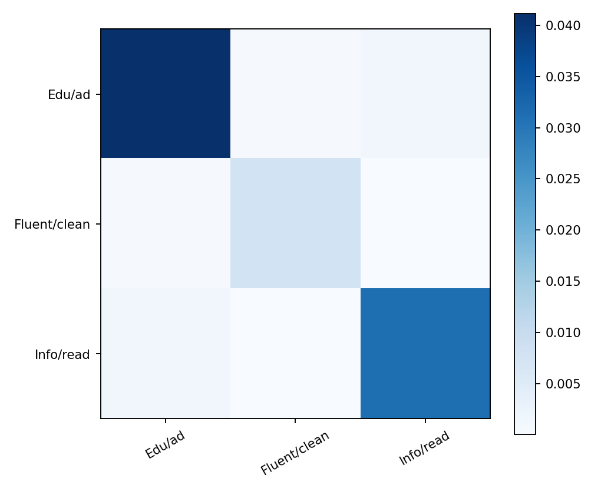

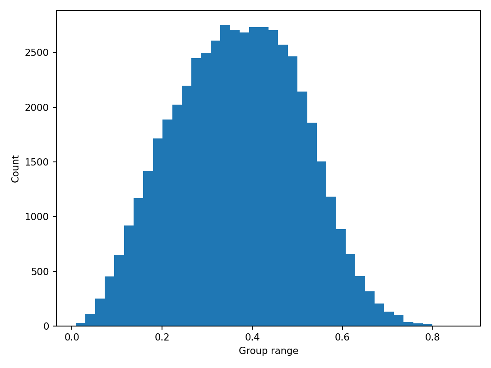

## 5. 17 域领域配比模型

设 $p_i\ge0$、$\sum_{i=1}^{17}p_i=1$，观测响应为 13 个验证域 Loss $L_{k}$。无截距约束的 17 比例与截距线性相关，因此简单基线删去一列，主模型用 additive log-ratio：

$$x_i=\log\frac{p_i+\epsilon}{p_{17}+\epsilon},\quad i=1,\ldots,16,\qquad \widehat{L}_k=b_{0k}+\sum_{i=1}^{16}b_{ik}\operatorname{standardize}(x_i).$$

其中参考域为 `uspto_backgrounds`，零替换 $\epsilon=0.000499$（训练集最小正配比的一半），Ridge 惩罚系数由 A4/A5 五折 CV 确定为 **1**。比较均值、删参考域原始比例 Ridge、ALR Ridge、二阶多项式 Ridge 与 ExtraTrees。模型的输入只有配比，输出同时预测 13 个验证域 Loss，模型比较按 13 维总体 RMSE，亦报告每域平均 $R^2$ 和 Spearman。

| 模型 | 1M MAE | 1M RMSE | 1M MAPE | 13 域平均 R² | 13 域平均 Spearman |
|---|---|---|---|---|---|
| alr_ridge | 0.253 | 0.341 | 5.3% | 0.790 | 0.907 |
| extra_trees | 0.336 | 0.403 | 6.7% | 0.588 | 0.798 |
| quadratic_ridge | 0.352 | 0.500 | 7.5% | 0.665 | 0.835 |
| raw_ridge | 0.386 | 0.523 | 8.4% | 0.619 | 0.830 |
| dummy | 0.619 | 0.780 | 13.6% | -0.012 | — |

ALR Ridge 在训练集内部 CV 的 RMSE 为 **0.394**，并在 A6/A7 上取得最低 RMSE。二阶交互模型的测试 RMSE 更高，故交互系数仅作探索。A8–A11 未用于训练或调参。

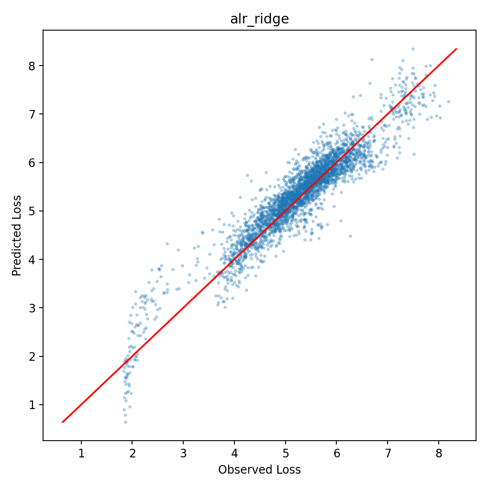
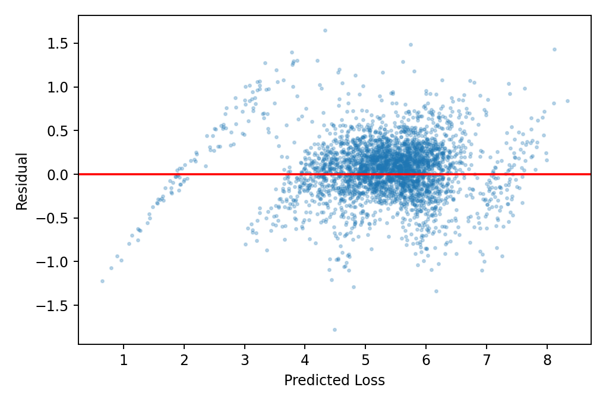
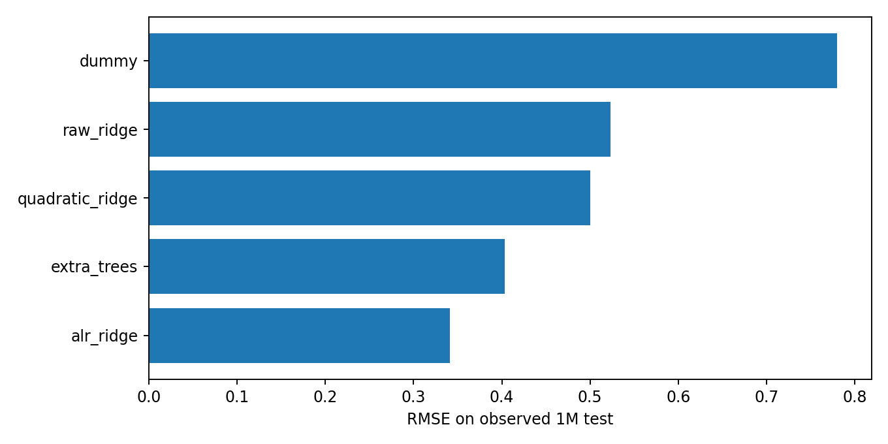

### 质量映射是否改善配比预测

A16 只有 **6 个** `direct/near_direct` 域可较可靠地连到质量域。对其定义已映射部分的质量加权均值和已映射配比总量，与 ALR 特征并列加入 Ridge，保持其余 11 域为未知。实验结果如下：

| 模型 | 训练 CV RMSE | 1M RMSE | 60M RMSE | 1B RMSE |
|---|---|---|---|---|
| ALR+mapped_Q | 0.3902 | 0.3374 | 1.6070 | 2.9847 |
| ALR_only | 0.3937 | 0.3415 | 1.6093 | 2.9820 |

加入映射质量后 1M RMSE 略降，但 1B 略升；更关键的是域级 $Q_d$ 对所有配方固定，新增特征是 $\mathbf p$ 的确定性函数，**不能从这份实验独立识别质量的作用**。因此问题一的主配比模型仍为 $L=f(\mathbf p)$；$Q$ 保留为问题二的跨来源融合输入，不将 11 个未知域伪装成实测质量。

## 6. 外部检验与外推稳健性

以下所有行使用在 1M 训练数据选出的同一个模型，未用大尺度检验标签做截距校准：

| 数据集 | 标签性质 | RMSE | 平均偏差：预测−真实 | 域内 Spearman 均值 |
|---|---|---|---|---|
| test_1m | observed | 0.341 | 0.054 | 0.907 |
| test_60m | observed | 1.609 | 1.513 | 0.903 |
| test_1B | observed | 2.982 | 2.911 | 0.888 |
| est_10b | estimated_extrapolation | 3.605 | 3.552 | 0.695 |
| est_70b | estimated_extrapolation | 3.993 | 3.934 | 0.628 |

以训练集 ALR 特征的最近邻距离衡量配比空间支持，用训练集留一最近邻距离的 95% 分位作阈值：

| 数据集 | 超出训练局部支持 | 与训练配比完全相同 | 外推轴 |
|---|---|---|---|
| test_1m | 5.86% | 0.00% | mixture-space |
| test_60m | 5.86% | 0.00% | parameter-scale |
| test_1B | 0.00% | 0.00% | parameter-scale |
| est_10b | 0.00% | 100.00% | parameter-scale; labels estimated |
| est_70b | 0.00% | 100.00% | parameter-scale; labels estimated |

60M、1B 的绝对预测均系统性偏高，说明模型未包含参数规模的整体 Loss 漂移；但域内排序相关仍较高。10B/70B 的配比与训练配比完全重合，故是**参数规模方向的外推，而非新配比空间的外推**；其 Loss 是题目附件中已有模型的**外推估算**，不是新的实测验证。其误差和相关仅说明与该估算表的一致程度，不构成 10B/70B 真实泛化证据。任何跨尺度论文表述必须区分数值预测与配比排序。

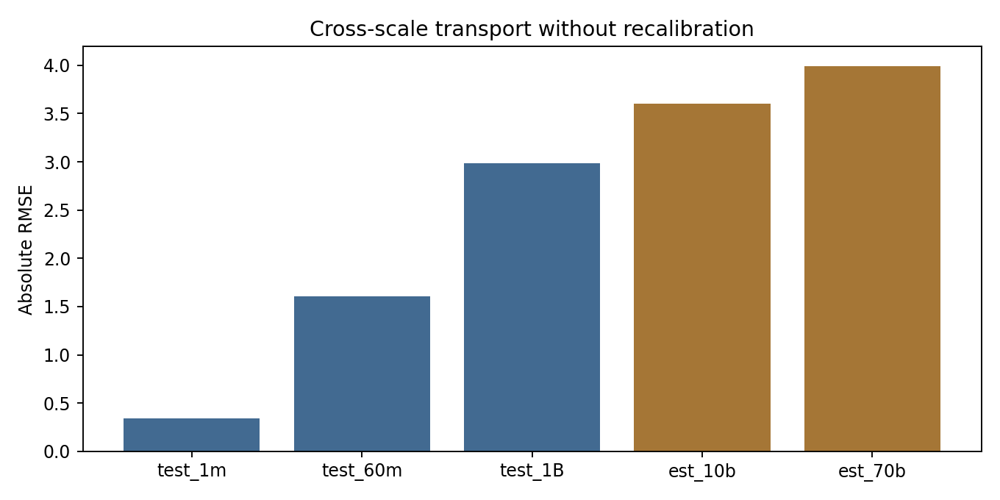

## 7. 领域置换效应及交互

单纯形上“增加某域”必须同时“减少另一域”。在训练配比均值附近，以 `pile_cc` 为参考域，将其比例减少 1 个百分点并增给另一域，计算 13 个验证域平均 Loss 的预测差。以下区间来自 A4/A5 的 300 次配方级 bootstrap，属于该模型和该局部点下的参数不确定性；零值伪计数和领域定义误差未包含其中。

| 增加域（减少 pile_cc） | 预测平均 Loss 差 | 95% bootstrap CI | 方向稳定频率 |
|---|---|---|---|
| ubuntu_irc | -0.0155 | [-0.0197, -0.0110] | 1.000 |
| dm_mathematics | -0.0108 | [-0.0136, -0.0075] | 1.000 |
| stackexchange | -0.0019 | [-0.0028, -0.0008] | 1.000 |
| wikipedia_en | -0.0003 | [-0.0017, 0.0010] | 0.657 |
| europarl | 0.0089 | [0.0013, 0.0152] | 0.993 |
| nih_exporter | 0.0255 | [0.0136, 0.0373] | 1.000 |
| philpapers | 0.0273 | [0.0130, 0.0425] | 1.000 |
| enron_emails | 0.1204 | [0.0976, 0.1472] | 1.000 |

负数表示预测 Loss 降低。`ubuntu_irc`、`dm_mathematics` 等局部替换在本数据与模型下表现较稳；`enron_emails` 的大幅正值来自其训练占比通常很低、ALR 近零区斜率很大，**不宜简单解释为该域绝对有害**。完整 $17\times16$ 置换矩阵见 [domain_effects.csv](outputs/tables/domain_effects.csv)，13 个验证域的分别响应见 [domain_effects_by_validation_domain.csv](outputs/tables/domain_effects_by_validation_domain.csv)。

二阶 Ridge 给出了 120 个候选交互系数，但五折 CV 与 1M 独立检验均劣于主模型；未完成多重比较校正后的独立复现。因此当前**没有稳定证据宣称某个域对存在互补或冗余**，仅将候选列入 [interaction_effects.csv](outputs/tables/interaction_effects.csv) 供下一步研究。

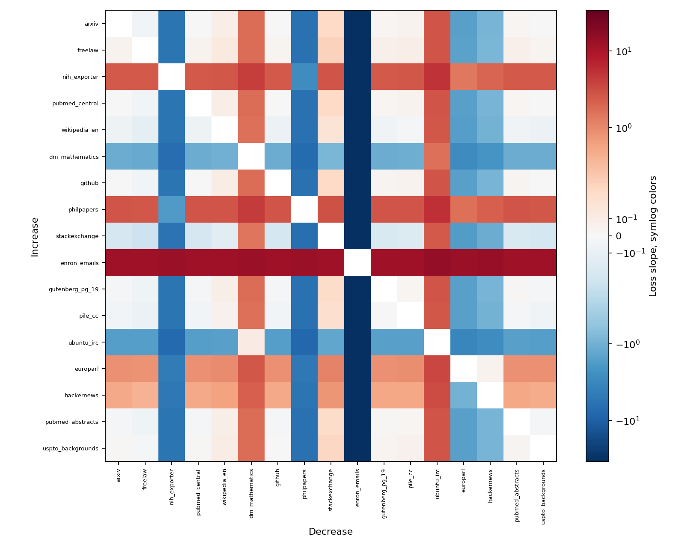
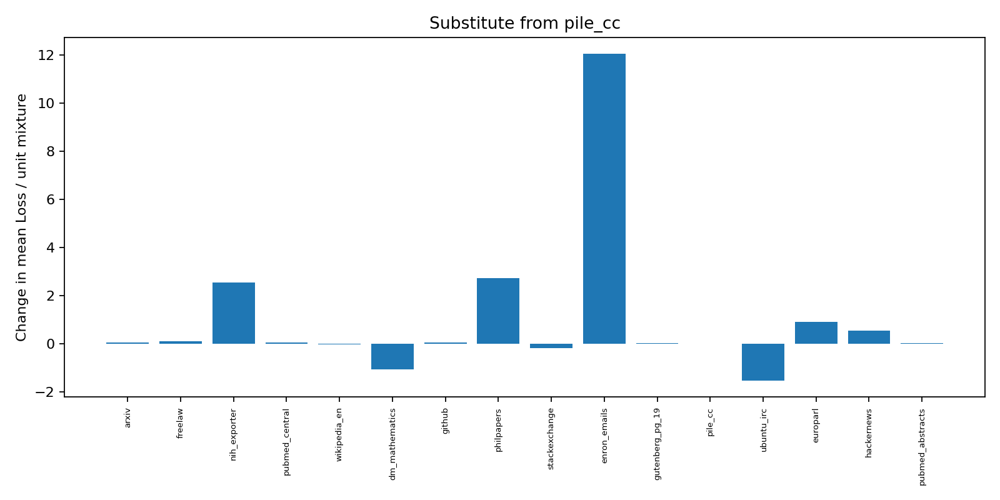
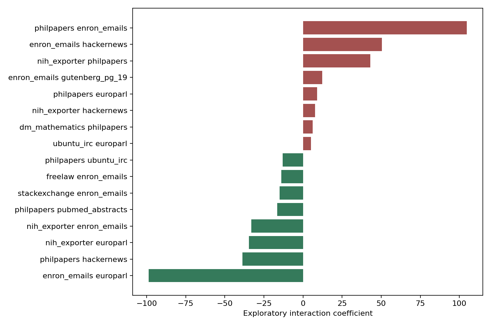

## 8. 稳健性、优缺点与向问题二传递的结果

稳健性证据包括：A1 参考尺度下 A2/A3 的非重合样本对照；CRITIC/鲁棒评分、组权重扰动、均值/中位数与 200 次全样本量 bootstrap；冲突阈值和惩罚系数敏感性；五折训练 CV 与 1M/60M/1B 外部检验；A12–A15 仅作外推估算对照。脚本、表格和图均可一键复现。

局限性主要有五点。第一，$Q$ 是解释性的综合指数，缺少独立人工标注或重新训练模型的损失改善验证。第二，启发式方向可能不适合全部领域，A1 的 `book` 仅 171 条。第三，七域到 17 域只部分可映射。第四，ALR 零替换和近零域的边际效应敏感，领域作用不是因果效应。第五，配比模型只用 1M 数据训练，大规模绝对 Loss 需要与问题二的规模模型联合校准。A12–A15 并非观测数据。

问题二可接收：`domain_quality_scores.csv` 中的七域 $Q_d$ 与区间；A16 的映射可信度；`quality_weights.csv` 与指标统一规则；ALR 配比模型与 A6–A11 的误差；以及“直接跨尺度绝对 Loss 失效”的实证约束。

## 9. 正式参考文献与数据来源

1. Liu, Q., Zheng, X., Muennighoff, N., et al. **RegMix: Data Mixture as Regression for Language Model Pre-training**. ICLR, 2025. [会议论文](https://openreview.net/pdf?id=5BjQOUXq7i)。
2. Aitchison, J. **The Statistical Analysis of Compositional Data**. *Journal of the Royal Statistical Society: Series B*, 44, 139–160, 1982. [DOI: 10.1111/j.2517-6161.1982.tb01195.x](https://doi.org/10.1111/j.2517-6161.1982.tb01195.x)。
3. Diakoulaki, D., Mavrotas, G., Papayannakis, L. **Determining objective weights in multiple criteria problems: The CRITIC method**. *Computers & Operations Research*, 22(7), 763–770, 1995. [DOI: 10.1016/0305-0548(94)00059-H](https://doi.org/10.1016/0305-0548(94)00059-H)。
4. Zhuang, X., Peng, J., Ma, R., et al. **Meta-rater: A Multi-dimensional Data Selection Method for Pre-training Language Models**. arXiv:2504.14194, 2025. [论文](https://arxiv.org/abs/2504.14194)；[数据集字段说明](https://huggingface.co/datasets/opendatalab/SlimPajama-Meta-rater/blob/main/README.md)。
5. Biderman, S., Schoelkopf, H., Anthony, Q. G., et al. **Pythia: A Suite for Analyzing Large Language Models Across Training and Scaling**. ICML/PMLR 202, 2397–2430, 2023. [正式论文](https://proceedings.mlr.press/v202/biderman23a.html)。
6. Hoffmann, J., Borgeaud, S., Mensch, A., et al. **Training Compute-Optimal Large Language Models**. NeurIPS 35, 2022. [会议论文](https://proceedings.neurips.cc/paper_files/paper/2022/file/c1e2faff6f588870935f114ebe04a3e5-Paper-Conference.pdf)。该文为全赛题标度律背景，本问未用其参数直接拟合。

## AI 使用披露草案

本阶段使用 Codex 辅助阅读题目与公开来源、编写和调试本地分析代码、整理图表与报告。所有结论由随附脚本从附件数据计算；指标语义判断、模型解释与参赛论文定稿仍须参赛团队独立复核。竞赛正式提交时需按主办方规则披露实际使用环节。
