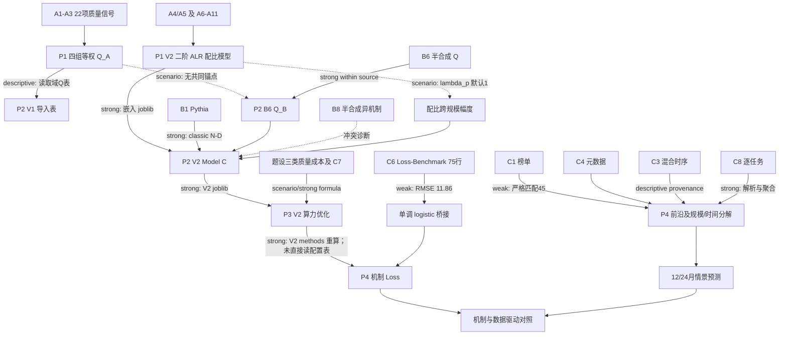

# 四问依赖与风险图

图例：**strong** = 代码直接读取且量纲/版本明确；**weak** = 有实际读取但缺联合识别或校准；**scenario** = 参数由假设设定；**descriptive** = 只用于审计或报告，不参与下游数值求解。

## 每条主要箭头的代码事实

1. **P1 → P2 的配比箭头 strong。** `problem2/run_problem2.py::problem1_bridge` 读取 `mixture_v2.joblib`，P2 V2 再从 V1 artifact 嵌入同一个模型。此次独立加载比对，`pcols` 和 Ridge 系数与 P1 V2 文件逐项相等。
2. **P1 (Q_A) → P2 (Q_B) 只有 descriptive/scenario。** P2 V1 把 `domain_quality_scores.csv` 复制到 `problem1_quality_proxy_import.csv` 用于说明；P2 V2 Model C 的 `Q` 项由 B6 半合成 `Q_score` 拟合。`QA_QB_scenarios.csv` 三条映射均 `empirical_anchor=False`，没有可估的数值变换。
3. **P2 V2 → P3 V2 strong。** `problem3_v2/run_v2.py::load` 直接加载 `recommended_model.joblib` 并断言 `classic/quality_model`；V1 P3 的 `load_inputs.py` 同样读取 V2 artifact。`problem2_to_problem3_v2.json` 虽放在 P2 目录，实际由 `problem3/load_inputs.py` 生成。
4. **P3 V2 → P4 为方法 strong、结果表局部读取。** `problem4/mechanism.py` 导入 `problem3_v2/methods.py` 的 `solve/capped_solve`，读取 P3 V2 的 `mixture_support_diagnostics.csv`，再按未来算力重算最优 (N,D,Q)。没有读取 `extrapolation_levels.csv` 或 `robust_optimization.csv` 作为决策输入；这符合未来预算变化的重算逻辑，但需要参数/场景一致性检查。
5. **Loss → Benchmark weak。** P4 用 C6 拟合并按模型家族 CV；主 logistic 组外 RMSE 11.864。机制预测在 E1 上限钳制后 12/24 月相同，桥接误差足以主导分数解释。
6. **历史规模/技术并非严格因果箭头。** C1/C4 严格匹配 45，回归样本 32；C3 年度来源统计只作 provenance；C8 逐任务聚合已实现。残余时间系数混合技术、样本选择、评测适配。

## 全局风险排序

| 风险 | 上游触发 | 传播到 | 当前防线 |
|---|---|---|---|
| G1 | (Q_A→Q_B) 无锚点 | P2 质量解释、P3 质量投资、P4 机制预测 | 明示两尺度和情景；不可称四问质量量尺已贯通 |
| G2 | `lambda_p(N)` 未识别 | P2 配比项、P3 配比收益、P4 P1 情景 | `lambda_p=0..1.5` 与规模衰减情景 |
| G3 | B1/B6 与跨族 Loss 口径不一 | P2 外推、P3 高预算、P4 Loss 桥接 | B2/B4/B5 raw 失败、E0/E1/E2 |
| G4 | P4 严格实体匹配 1.01% 且末季 n=2 | 历史贡献与预测基线 | W1/W2/C2 口径敏感性；仍不能识别长期趋势 |
| G5 | C6 混合 Loss 与 Benchmark 的桥接误差 | P4 机制分数 | 家族组外 CV 和高/中可比分层 |
| G6 | 旧 V1 JSON 与 V2 路径并存 | 任意下游重新运行 | 当前直接加载路径正确；缺强制 artifact hash 检验 |

最应防止的叙述跳跃是把强数学求解误认为强现实证据：P3 优化器能精确求出 *给定 Model C 和成本假设* 的最优点，却不能替 P1/P2 未识别的质量与配比幅度提供实验证明。
