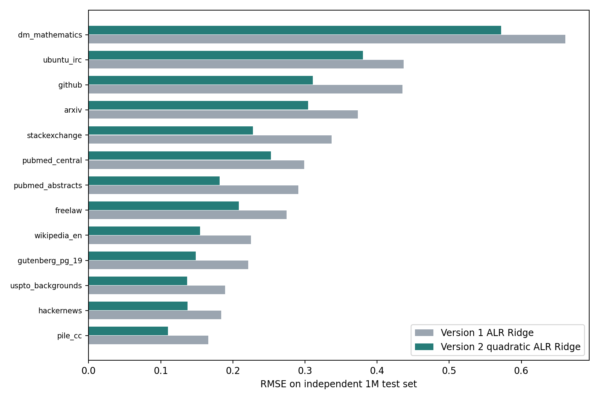

# 问题一第一版与第二版对比

## 比较原则

第一版保持原样作为基线。第二版只用 A4/A5 的 512 组 1M 训练配方进行数值选型；A6–A11 的真实 Loss 未进入第二版的拟合或超参数搜索。它们已在第一版中被查看，因此这里是复用既定测试集的同口径比较，不能称为全新盲测。A12–A15 是估算标签，单列展示。两版的质量分 Q 使用同一套规则；没有人工真值，因此不声称 Q 的准确度提升。

## 训练集内部选型

| 方法 | 2×5 折交叉验证 RMSE |
|---|---:|
| 第一版 ALR Ridge，固定参考域与 ε | 0.3937 |
| 第二版二阶 ALR Ridge，训练集选出的参考域与 ε | 0.3293 |

第二版共比较 172 个候选，按训练集重复交叉验证总体均方误差选出。二阶项允许领域对数比之间的非线性关系；Ridge 惩罚控制复杂度。候选较多会使最优 CV 数值偏乐观，因此另做外层五折、内层三折的嵌套交叉验证，外层每一折都重新选型。

| 嵌套交叉验证 | 第一版 | 第二版 | 第二版降幅 |
|---|---:|---:|---:|
| A4/A5 外层折拼接 RMSE | 0.3951 | 0.3340 | 15.5% |

第二版在 5/5 个外层折中 RMSE 更低；五折内层均选出二阶 ALR Ridge。该结果评估了完整选型流程，且完全不读取 A6–A15。

## 既定测试集上的同口径比较

| 数据集 | 标签性质 | 第一版 RMSE | 第二版 RMSE | 变化 | 第一版域内 Spearman | 第二版域内 Spearman |
|---|---|---:|---:|---:|---:|---:|
| test_1m | 实测 | 0.341 | 0.270 | -20.9% | 0.907 | 0.945 |
| test_60m | 实测 | 1.609 | 1.596 | -0.8% | 0.903 | 0.941 |
| test_1B | 实测 | 2.982 | 2.702 | -9.4% | 0.888 | 0.877 |
| est_10b | 估算 | 3.605 | 3.621 | +0.4% | 0.695 | 0.633 |
| est_70b | 估算 | 3.993 | 4.009 | +0.4% | 0.628 | 0.554 |

主要目标 1M 测试 RMSE 下降 **20.9%**，由 0.3415 降至 0.2702；MAE 从 0.253 降至 0.189。以 256 个测试配方为重抽样单位，第一版减第二版 RMSE 的 95% bootstrap 区间为 **[0.055, 0.088]**。这是给定测试配方分布与已拟合模型的抽样区间，不包含重新选型的不确定性，也不消除测试集重复使用带来的偏乐观风险。

1M 的 **13/13** 个验证领域 RMSE 下降。最大剩余误差在 `dm_mathematics`，第二版 RMSE 为 0.572。

## 13 个验证领域的 1M RMSE

| 验证领域 | 第一版 | 第二版 | 降幅 |
|---|---:|---:|---:|
| arxiv | 0.373 | 0.305 | 18.4% |
| dm_mathematics | 0.661 | 0.572 | 13.4% |
| freelaw | 0.274 | 0.208 | 24.0% |
| github | 0.435 | 0.311 | 28.6% |
| gutenberg_pg_19 | 0.221 | 0.149 | 32.9% |
| hackernews | 0.184 | 0.137 | 25.5% |
| pile_cc | 0.166 | 0.110 | 33.7% |
| pubmed_abstracts | 0.291 | 0.182 | 37.5% |
| pubmed_central | 0.299 | 0.253 | 15.4% |
| stackexchange | 0.337 | 0.228 | 32.4% |
| ubuntu_irc | 0.437 | 0.380 | 12.9% |
| uspto_backgrounds | 0.189 | 0.137 | 27.6% |
| wikipedia_en | 0.225 | 0.155 | 31.4% |

## 最终配比模型的跨规模幅度诊断

下表按每个配方的 13 域平均 Loss 计算。斜率与区间用全部既定测试配方作描述，不是无标签跨规模验证；1M/60M 使用同一批测试配方。

| 实测规模 | V1 中心化斜率 | V2 中心化斜率及行 bootstrap 95% 区间 | V1/V2 配方均值 Spearman | V2 均值 bias |
|---|---:|---:|---:|---:|
| test_1m | 0.900 | 0.822 [0.730, 0.926] | 0.492/0.715 | +0.046 |
| test_60m | 0.658 | 0.609 [0.525, 0.707] | 0.463/0.682 | +1.506 |
| test_1B | 0.285 | 0.182 [0.125, 0.241] | 0.662/0.567 | +2.619 |

## 未解决的误差

60M、1B 的绝对 Loss 依旧存在规模偏差，不能据此说跨规模预测已解决。1B 的配方均值排序与中心化形状在 V2 下也弱于 V1；10B/70B 相对估算标签的 RMSE 和 Spearman 均退步。这些估算标签不代表真实大模型实验，也未被用于模型选择。

完整数值见 `outputs/tables/v2_vs_v1_metrics.csv`、`v2_vs_v1_per_domain.csv`、`v2_vs_v1_bootstrap.csv`。
