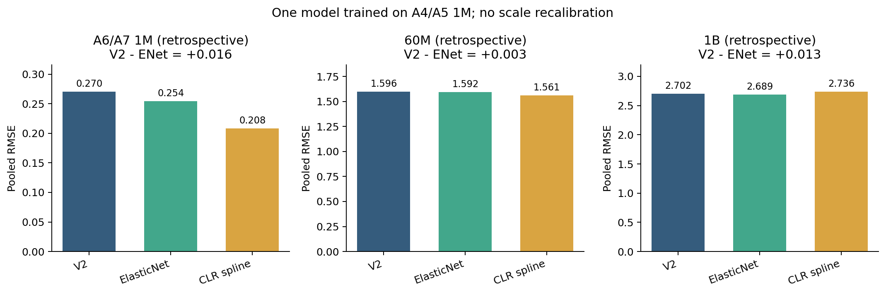
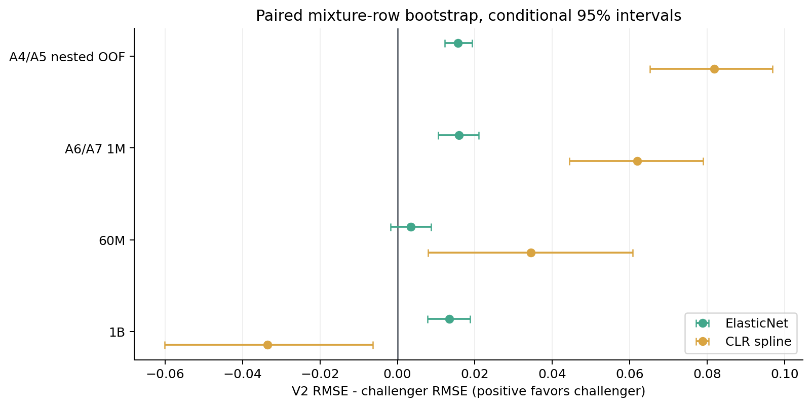

# 问题一论文关键数字（脚本生成）

生成源：`metrics_by_scale.csv`、`paired_bootstrap_gain.csv`、`problem1_model_tournament.csv`、`per_domain_paired_bootstrap.csv`、`q_sensitivity_audit.csv`。
所有 A6/A7、60M、1B 结果均为**回顾性**；10B/70B 是估算标签。RMSE 差为 V2 减 ElasticNet，正数表示 ElasticNet 更低。

| 数据 | n | V2 RMSE | ElasticNet RMSE | 差值 [配对 95% CI] |
|---|---:|---:|---:|---:|
| train_nested_oof | 512 | 0.3340 | 0.3184 | +0.0156 [+0.0123, +0.0193] |
| test_1m | 256 | 0.2702 | 0.2543 | +0.0158 [+0.0105, +0.0210] |
| test_60m | 256 | 1.5959 | 1.5924 | +0.0035 [-0.0018, +0.0087] |
| test_1B | 64 | 2.7021 | 2.6887 | +0.0134 [+0.0078, +0.0188] |
| est_10b | 63 | 3.6212 | 3.6261 | -0.0049 [-0.0129, +0.0032] |
| est_70b | 63 | 4.0090 | 4.0139 | -0.0049 [-0.0132, +0.0031] |

最终规格：ALR 二阶特征 + MultiTask ElasticNet，`alpha=0.01`、`l1_ratio=0.7`、参考域 `pile_cc`、`epsilon=0.000249500998`；激活特征 136/152。
修正外折参考域后的嵌套 OOF：V2 0.334010，ElasticNet 0.318377；五折均改善。
1pp 局部效应与 V2 符号一致 15/16；但 Bootstrap 中达到 ≥90% 同号率的目标域只有 9/16。

## 1B 逐域损害（事后描述，不用于调整门槛）

| 验证域 | 新减旧 RMSE | 相对变化 | V2 减新模型 95% CI |
|---|---:|---:|---:|
| arxiv | +0.0236 | +1.09% | [-0.0389, -0.0084] |
| freelaw | +0.0188 | +0.71% | [-0.0286, -0.0091] |
| pubmed_central | +0.0209 | +0.89% | [-0.0317, -0.0102] |
| github | +0.0404 | +1.23% | [-0.0568, -0.0250] |

四个验证域各占 pooled RMSE 的 1/13 个输出维度；1B 总体 RMSE 与配方平均排序改善，并不表示各域均改善。

## Q 证据边界

人工盲评有效标签 0 行；Q 四组等权保留。无监督 PCA 的 7 域均值排序与原 Q Spearman 0.25；熵权为 0.93。FA 未数值收敛。上述值只度量敏感性，不能选出质量真值模型。

